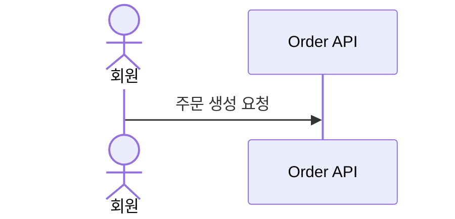

# 설계 문서 관리 규칙

## 작성 위치

- 기능 설계 문서, API 설계 문서, 도메인 설계 문서 등 실제 설계 산출물은 `.docs/design/` 하위에 작성한다.
- `.claude/skills/` 에는 설계 산출물을 직접 작성하지 않고, 설계 작성 방식과 참조 규칙만 둔다.

## 제출 파일 구조

- 요구사항 명세는 `.docs/design/01-requirements.md` 에 작성한다.
- 시퀀스 다이어그램 문서는 `.docs/design/02-sequence-diagrams.md` 에 작성한다.
- 클래스 다이어그램 문서는 `.docs/design/03-class-diagram.md` 에 작성한다.
- ERD 문서는 `.docs/design/04-erd.md` 에 작성한다.
- 클래스 다이어그램과 ERD 의 PlantUML 원본 파일은 `.docs/design/diagrams/*.puml` 로 관리한다.

## UML 작성 도구

- 시퀀스 다이어그램은 Mermaid `sequenceDiagram` 으로 작성한다.
- 클래스 다이어그램과 ERD 는 PlantUML 로 작성한다.
- 렌더링 이미지가 필요한 경우 `.docs/design/assets/` 하위에 `svg` 또는 `png` 로 저장하고 Markdown 에서 참조한다.

## 파일명 규칙

- Markdown 설계 문서는 정렬 순서를 위해 `01-`, `02-`, `03-`, `04-` 접두어를 사용한다.
- 다이어그램 원본 파일은 소문자 kebab-case 로 작성한다.
- 파일명은 다이어그램의 유스케이스나 목적이 드러나게 작성한다.
  - 예: `domain-class-diagram.puml`
  - 예: `commerce-erd.puml`

## Markdown 내 다이어그램 참조

- Mermaid 시퀀스 다이어그램은 `.docs/design/02-sequence-diagrams.md` 에 fenced code block 으로 직접 삽입한다.
- PlantUML 다이어그램은 원본 `.puml` 링크를 포함한다.
- 렌더링 이미지가 있으면 원본 링크 아래에 이미지를 삽입한다.

예:

````markdown
## 주문 생성 시퀀스


````

```markdown
## ERD

원본: [commerce-erd.puml](./diagrams/commerce-erd.puml)


```
