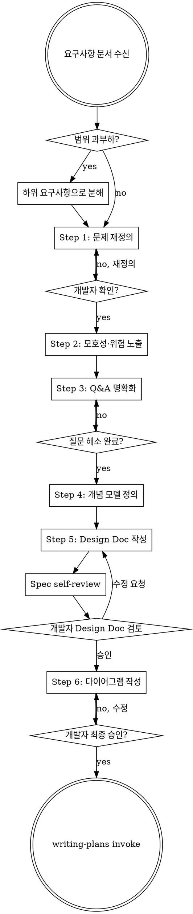

# Requirements Analysis

<HARD-GATE>
Step 6(다이어그램)이 완료되고 개발자의 승인이 있기 전까지
절대로 코드를 작성하거나 구현을 시작하지 않는다.
요구사항이 단순해 보여도 예외는 없다.
</HARD-GATE>

## Anti-Pattern: "이 요구사항은 명확하니까 바로 구현해도 된다"

작성된 요구사항을 그대로 믿는 것이 가장 흔한 실수다.
명확해 보이는 요구사항일수록 숨겨진 가정과 결정되지 않은 정책이 많다.
분석 과정이 짧아질 수는 있지만, 생략할 수는 없다.

## Checklist

시작 시 반드시 TodoWrite로 아래 항목을 Task로 생성하고, 완료 즉시 체크한다:

1. **요구사항 문서 파악 & 범위 검토** — 너무 크면 분해 먼저
2. **Step 1: 문제 재정의** — 사용자/비즈니스/시스템 관점 분리
3. **Step 2: 모호성·위험 노출** — 추측 없이, 결정되지 않은 것 명시
4. **Step 3: Q&A 명확화** — 한 번에 하나, 모든 질문 해소까지
5. **Step 4: 개념 모델 정의** — Actors, 핵심 도메인, 외부 시스템
6. **Step 5: Design Doc 작성** — 파일 저장 + Spec self-review
7. **개발자 Design Doc 검토** — 승인 전까지 대기
8. **Step 6: 다이어그램 작성** — 이유 → Mermaid → 해석
9. **개발자 최종 승인** — writing-plans로 전환

## Process Flow

**Terminal state는 writing-plans invoke다.** 최종 승인 후 다른 스킬을 호출하지 않는다.

---

## Q&A 원칙 (전 단계 공통 적용)

개발자와 질문/대답이 필요한 모든 단계에서 반드시 따른다:

- **한 번에 하나의 질문만 한다.** 답변을 받은 후 다음 질문으로 넘어간다.
- **선택지가 있으면 다지선다형으로 제시한다.** 옵션과 영향도를 함께 제시한다.
- **정답처럼 말하지 않는다.** 결정은 개발자가 한다.
- **중요한 것부터 먼저 묻는다.** 질문에 우선순위를 부여한다.

> 형식 예시:
> - 선택지 A: 하나의 트랜잭션으로 처리 → 구현 단순, 확장성 낮음
> - 선택지 B: 단계별 분리 → 구조 복잡, 확장/보상 처리 유리

---

## 범위 검토 (Step 0)

요구사항을 받으면 먼저 범위를 판단한다.
독립적인 여러 도메인이 섞여 있다면 먼저 분해한다.

분해 기준:
- 독립적으로 배포/테스트 가능한가?
- 각 부분이 서로 다른 팀/시스템에 속하는가?
- 한 번에 분석하기엔 너무 많은 결정이 필요한가?

분해 시: 어떤 순서로 진행할지 개발자와 합의하고, 첫 번째 부분부터 시작한다.

---

## Step 1. 문제 재정의

작성된 요구사항 뒤에 숨은 진짜 문제를 찾아낸다.
"왜 이것을 만드는가"에 집중하고, 다음 세 관점을 분리해서 정리한다:

- **사용자 관점**: 사용자가 겪는 불편, 원하는 경험
- **비즈니스 관점**: 이 기능이 풀려는 비즈니스 문제
- **시스템 관점**: 기술적으로 해결해야 할 핵심 과제

> 예시: "주문 실패 시 결제를 취소한다"
> → "결제 성공/실패와 주문 상태가 어긋나지 않도록 일관성을 유지하려는 문제"

정리 후 개발자에게 확인을 받는다. 방향이 맞으면 Step 2로 넘어간다.

---

## Step 2. 모호성·위험 노출

애매하거나 부족하거나 부적절한 요구사항을 절대로 추측하거나 알아서 결정하지 않는다.
결정되지 않은 부분을 명시적으로 나열하고, 현재 설계가 가질 수 있는 위험을 숨기지 않는다.

노출해야 할 위험 유형:
- 트랜잭션 비대화
- 도메인 간 결합도 증가
- 정책 변경 시 영향 범위 확대

다음 유형의 질문을 반드시 포함한다:
- **정책 질문**: 기준 시점, 성공/실패 조건, 예외 처리 규칙
- **경계 질문**: 어디까지가 한 책임인가, 어디서 분리되는가
- **확장 질문**: 나중에 바뀔 가능성이 있는가, 오버엔지니어링의 가능성이 있는가

---

## Step 3. Q&A 명확화

Step 2에서 드러난 모호성과 위험을 바탕으로 개발자에게 질문한다.
Q&A 원칙을 엄격히 따른다. 모든 질문이 해소될 때까지 반복한다.

---

## Step 4. 개념 모델 정의

합의된 내용을 바탕으로 설계 사고를 정렬한다.
이 단계는 구현이 아니라 방향 정렬이 목적이다.

- **Actors**: 사용자, 외부 시스템 등 이 시스템과 상호작용하는 주체
- **핵심 도메인**: 이 시스템이 직접 책임지는 도메인
- **보조/외부 시스템**: 핵심 도메인을 지원하거나 외부에서 연동되는 시스템

---

## Step 5. Design Doc 작성

개념 모델을 바탕으로 무엇을 만들지 명확하게 정리한다.
`docs/requirements/YYYY-MM-DD-<topic>.md` 파일로 저장하고 git commit한다.

포함 항목 (✱ 표시는 필수):
- ✱ 제품 개요
- ✱ 사용자 시나리오
- ✱ 유저 스토리
- ✱ 기능 요구사항
- 비기능 요구사항
- 화면 흐름
- 인수 조건
- 의존성
- 마일스톤

**Spec self-review:** 작성 후 다음 4가지를 점검하고 즉시 수정한다:

1. **Placeholder 스캔**: "TBD", "미정", 빈 섹션이 있는가?
2. **내부 일관성**: 섹션 간 모순이 있는가?
3. **범위 적절성**: 하나의 구현 계획으로 진행 가능한 크기인가?
4. **모호성**: 두 가지로 해석 가능한 요구사항이 있는가? 하나로 확정한다.

self-review 통과 후 개발자에게 검토를 요청한다:

> "Design Doc을 `<경로>`에 작성했습니다. 검토 후 수정이 필요하면 말씀해 주세요. 승인되면 다이어그램 작성으로 넘어가겠습니다."

---

## Step 6. 다이어그램 작성

Design Doc을 기반으로 설계 사고를 시각화한다.
모든 다이어그램은 **이유 → 다이어그램 → 해석** 순서로 제시한다.

**다이어그램을 그리기 전에 반드시 설명한다:**
- 왜 이 다이어그램이 필요한지
- 이 다이어그램으로 무엇을 검증하려는지

**다이어그램은 Mermaid 문법으로 작성한다.**

| 다이어그램 | 사용 목적 |
|---|---|
| **시퀀스 다이어그램** | 책임 분리, 호출 순서, 트랜잭션 경계 확인 |
| **클래스 다이어그램** | 도메인 책임, 의존 방향, 응집도 확인 |
| **ERD** | 영속성 구조, 관계의 주인, 정규화 여부 |

다이어그램 제시 후:
- 읽는 법을 짚어준다
- "이 구조에서 특히 봐야 할 포인트"를 2~3줄로 설명한다
- 설계 의도가 드러나도록 해석을 붙인다

개발자 승인 후 writing-plans를 invoke한다.

---

## 핵심 원칙

- **추측하지 않는다** — 모호한 것은 반드시 질문한다
- **위험을 숨기지 않는다** — 설계의 약점을 먼저 드러낸다
- **한 번에 하나** — 질문도, 단계도 한 번에 하나씩 진행한다
- **의도와 경계 우선** — 코드보다 책임과 경계를 먼저 정렬한다
- **단계별 승인** — 각 Step 후 개발자 확인 없이 다음으로 넘어가지 않는다

---

## 톤 & 스타일 가이드

- 강의처럼 설명하지 말고 **설계 리뷰 톤**을 유지한다
- 정답을 제시하기보다, 다른 선택지가 있다면 함께 제공한다
- 코드보다 **의도, 책임, 경계**를 더 중요하게 다룬다
- 구현 전에 생각해야 할 것을 끌어내는 데 집중한다