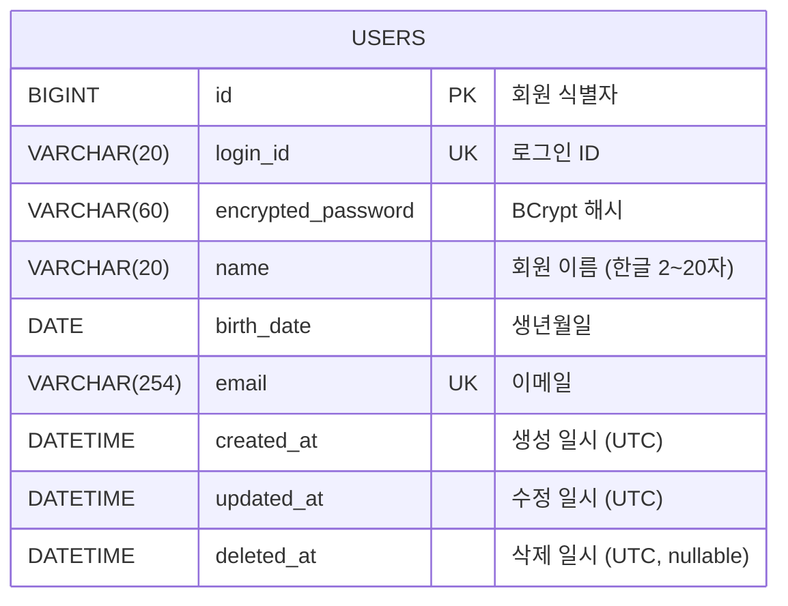

# ERD 가이드 (단계 7-b)

산출물: `docs/volume-N/ERD.md` — **volume 단위 공통 파일**. feature가 추가될 때마다 갱신.

## 작업 순서 (엄격)

1. **Read 먼저**: `docs/volume-N/ERD.md`를 Read 시도. 없으면 신규 생성으로 진행.
2. **요약 보고**: 기존 파일이 있으면 "현재 ERD에 N개 테이블이 있습니다." 형태로 사용자에게 보고.
3. **신규 도출**: 이번 feature의 단계 6 도메인 모델에서 신규 테이블/컬럼/관계만 추출.
4. **충돌 검사**: 같은 이름의 테이블·FK 대상 부재·같은 컬럼의 타입/제약 불일치·인덱스/유니크 충돌.
5. **Diff 제시**: 추가될 테이블·컬럼·변경 사항을 사용자에게 명시적으로 보여줌.
6. **승인 후 Write/Edit**: `erDiagram` 블록은 통합 재작성. `## 테이블 정의` 섹션에 신규 테이블 append.

## 파일 구조 (표준, 엄격)

```markdown
# volume-N ERD

본 문서는 volume-N 전체 기능에서 사용되는 RDB 스키마를 누적 관리한다.

## 공통 컨벤션

- 엔진: `InnoDB`
- 문자셋 / Collation: `utf8mb4` / `utf8mb4_unicode_ci`
- PK: `BIGINT AUTO_INCREMENT` (`BaseEntity`로부터 상속)
- 시간 컬럼: `DATETIME`. 모든 행은 **UTC wall-clock** 시각을 저장한다. Hibernate의 `spring.jpa.properties.hibernate.timezone.default_storage=NORMALIZE_UTC` + `hibernate.jdbc.time_zone=UTC` 설정에 의해 보장된다.
- Soft delete: 모든 테이블이 `BaseEntity`(`modules/jpa`)를 상속받아 `created_at`, `updated_at`, `deleted_at`(nullable) 세 컬럼을 공통 보유한다.

## 다이어그램

```mermaid
erDiagram
    USERS {
        BIGINT id PK "회원 식별자"
        VARCHAR(20) login_id UK "로그인 ID"
        ...
    }
```

## 테이블 정의

### `users` — 회원

회원가입(volume-1 / 회원가입)에서 추가.

```sql
CREATE TABLE users (
    id                 BIGINT       NOT NULL AUTO_INCREMENT COMMENT '회원 식별자',
    ...
) ENGINE=InnoDB
  DEFAULT CHARSET=utf8mb4
  COLLATE=utf8mb4_unicode_ci
  COMMENT='회원';
```

**비고**

- `user`는 예약어 충돌 가능성이 있어 복수형 `users`로 채택.
- ...
```

## MySQL DDL 규칙 (엄격)

### 엔진·문자셋
- `ENGINE = InnoDB`
- `DEFAULT CHARSET = utf8mb4`, `COLLATE = utf8mb4_unicode_ci`

### 키
- PK: `BIGINT AUTO_INCREMENT` — `BaseEntity`로부터 상속되므로 자동
- 비즈니스 키: `UNIQUE KEY uk_{table}_{columns}` 별도 제약
- FK: `BIGINT`, 컬럼명 `{대상테이블단수형}_id` (예: `product_id`, `user_id`)

### 컬럼 타입
- 문자열: `VARCHAR(N)`. N은 의미상 최대 길이.
- 정수: 일반 카운트는 `INT`, 식별자나 큰 수치는 `BIGINT`.
- 금액: 원화 단위는 `INT` / `BIGINT` (소수 없음). 다중 통화·소수 단위면 `DECIMAL(precision, scale)`. **`DOUBLE`/`FLOAT` 금지**.
- 날짜: `DATE` (시간 불필요) / `DATETIME` (시간 필요). **`TIMESTAMP` 쓰지 마라** — 본 프로젝트는 Hibernate `NORMALIZE_UTC` + `DATETIME` 조합으로 UTC 저장이 표준.
- 상태값: `VARCHAR(N)` + 컬럼 코멘트에 가능 값 나열. MySQL `ENUM` 타입 비권장 (변경 비용 큼).
- 불리언: `TINYINT(1)`.

### BaseEntity 상속 컬럼
모든 테이블에 다음 세 컬럼이 자동 포함되어야 한다 (`BaseEntity` 상속):

```sql
created_at  DATETIME  NOT NULL COMMENT '생성 일시 (UTC)',
updated_at  DATETIME  NOT NULL COMMENT '수정 일시 (UTC)',
deleted_at  DATETIME  NULL     COMMENT '삭제 일시 (UTC, soft delete. NULL이면 활성)',
```

### NOT NULL 기본
모든 컬럼 `NOT NULL` 기본. NULL 허용은 의미가 있을 때만 (예: `deleted_at`은 미삭제 의미로 NULL).

### 코멘트
- **모든 컬럼에 `COMMENT '...'` 한국어로**.
- 테이블에도 `COMMENT '...'`.
- 단계 2 용어 정의의 의미 컬럼을 그대로 가져오면 자연스럽다.

### 인덱스
- FK 컬럼은 인덱스 자동 생성되지 않음 — 명시적으로 `KEY idx_{table}_{columns}` 추가 (조회 패턴이 있을 때).
- 복합 인덱스는 카디널리티 높은 컬럼을 앞에.

### 명명 규칙
- 테이블: `snake_case`, **복수형** (`users`, `products`, `orders`)
- 컬럼: `snake_case`
- PK: `id`
- FK: `{대상테이블단수형}_id`
- 인덱스: `idx_{table}_{columns}`
- 유니크: `uk_{table}_{columns}`

### 예약어 회피
- MySQL 예약어 또는 함수와 충돌 가능한 단어는 복수형 또는 접미사로 회피.
- 알려진 예: `user` → `users`, `order` → `orders`, `group` → `groups`.

## erDiagram (Mermaid) 작성

### 컬럼 표기 (표준 형식)

`{타입} {컬럼명} [PK|FK|UK] "한국어 코멘트"`



타입은 대문자(`BIGINT`, `VARCHAR(20)`, `DATETIME`)로 통일.

### 관계


- `||--o{`: 1:N (필수–선택)
- `||--|{`: 1:N (필수–필수)
- `||--||`: 1:1
- `}o--o{`: N:N

관계 라벨은 영어 동사 (`contains`, `appears_in`, `writes`).

## 갱신 시 패턴

### 신규 테이블 추가 (충돌 없음)
1. `erDiagram`에 엔티티 추가
2. 관계선 추가
3. `## 테이블 정의` 섹션 맨 아래에 `### {새 테이블명} — (설명)` + DDL 블록 append + **비고** 단락

### 기존 테이블에 컬럼 추가
1. `erDiagram` 갱신
2. DDL 블록의 `CREATE TABLE` 갱신
3. (운영 DB 변경 시) `ALTER TABLE ...` 마이그레이션 SQL 별도 명시. 부트캠프 단계는 매번 schema 재생성이라 보통 생략 — 사용자 확인.

### 기존 컬럼의 타입/제약 변경
영향 범위가 크다. **사용자에게 변경 영향을 보고하고 승인을 받는다**.

## 흔한 결정 포인트

- **테이블명 복수형 vs 단수형** — 본 프로젝트는 **복수형** (`users`, `products`).
- **금액/수량 컬럼 타입** — 원화는 정수. 통화/소수는 `DECIMAL`. `DOUBLE`/`FLOAT` 금융 금지.
- **enum 성격 컬럼** — `VARCHAR` + 코멘트로 가능 값 나열.
- **soft delete** — `BaseEntity.deleted_at`이 자동 제공. hard delete를 별도로 쓸 일 거의 없음.
