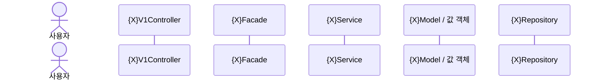
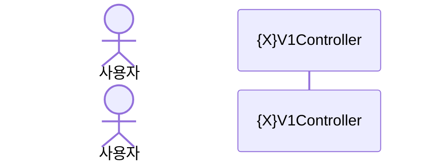

# {feature} 요구사항 명세

<!-- 사용법: 단계 2~6의 결과를 아래 섹션에 채워 넣는다. 단계별로 점진적으로 추가하며, 매번 전체를 다시 쓰지 마라. -->
<!-- 섹션 번호는 한글 번호로. 도메인 특화 보충 섹션이 들어가면 이후 번호가 시프트된다 (예: 회원가입의 `## 2. 비밀번호 보호 방식`). -->

## 1. 용어 정의

<!-- 단계 2 결과. 3-컬럼 표. 도메인 명사·값에 집중. "검증/해싱/요청/응답" 같은 일반 개념어 제외. -->

| 한글 | 영어 | 의미 |
|---|---|---|
| | | |

<!--
(옵션) 도메인 특화 결정 섹션 — 필요할 때만 추가. 헤더 번호는 한글로 자연스럽게.

예: 회원가입의 경우 다음 섹션이 들어간다.

## 2. 비밀번호 보호 방식

(BCrypt vs Argon2/PBKDF2 비교 및 채택 결론. 도메인 특수 결정사항은 본문 섹션으로.)
-->

## 3. 기능 요구사항

<!-- 단계 3 결과. 번호 컬럼 표. 디폴트 결정의 사유는 본문 행에 자연스럽게 통합한다 — 별도 표 분리 금지. -->

| 번호 | 요구사항 |
|---|---|
| 1 | |

## 4. 비기능 요구사항

<!-- 단계 3 결과. 5종 카테고리(성능/보안/가용성/관측성/호환성) 강제 점검. 카테고리는 사용하지 않는 행도 있을 수 있지만, 단계 3에서 점검은 반드시 수행. -->

| 번호 | 카테고리 | 요구사항 |
|---|---|---|
| 1 | 성능 | |
| 2 | 보안 | |
| 3 | 가용성 | |
| 4 | 관측성 | |
| 5 | 호환성 | |

## 5. 목표가 아닌 것

<!-- 단계 4 결과. 자유 서술 bullet + 사유 한 줄. "Out of Scope" 영문 표현 X. -->

본 라운드에서 다루지 않을 항목.

-

## 6. 시나리오

<!-- 단계 5 결과. Mermaid sequenceDiagram. 정상 1개 + 예외 케이스별 1개. -->
<!-- 폐기된 산출물: 예외 카테고리 점검 표, 응답 코드·에러 코드 정책 표. 만들지 마라. -->

### 6.1 정상 시나리오

### 6.2 (예외 시나리오 제목)

## 7. 도메인 모델링

<!-- 단계 6 결과. 4-컬럼 표. 산출 범위 = JPA Entity + 값 객체 + 도메인 포트/어댑터. Service/Facade/Repository/Controller/DTO 제외. -->

| 역할 (객체명) | 책임 | 속성 | 행위 |
|---|---|---|---|
| | | | |
