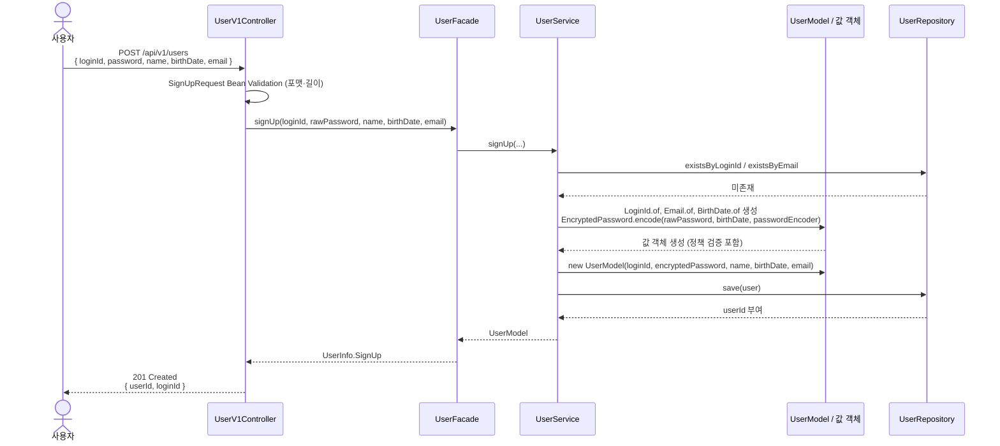
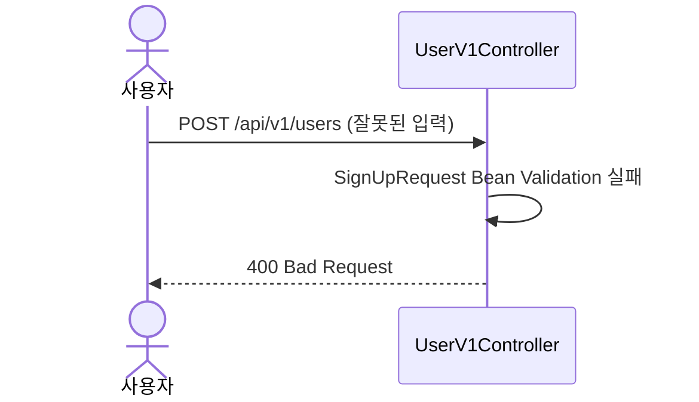
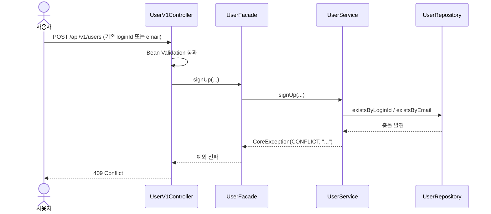

# 시나리오 다이어그램 가이드 (단계 5)

Mermaid `sequenceDiagram`만 사용한다. 본 프로젝트(`commerce-api`)의 레이어드 컨벤션에 따라 액터를 구성한다.

## 표준 액터

본 프로젝트의 레이어드 구조를 그대로 액터로 사용한다. **추상 액터(`Client`, `API`, `DB`)는 쓰지 않는다.**

| 액터 | 역할 |
|---|---|
| `사용자` | 호출자 (브라우저/모바일/외부 클라이언트) |
| `{X}V1Controller` | HTTP 인터페이스 레이어. 요청 수신, DTO 검증, 응답 생성. |
| `{X}Facade` | 애플리케이션 레이어. 유스케이스 오케스트레이션. |
| `{X}Service` | 도메인 서비스. 트랜잭션 경계, 도메인 로직 조율. |
| `{X}Model / 값 객체` (또는 `Domain`) | JPA Entity + 값 객체의 자기 검증·해싱 등 도메인 책임. |
| `{X}Repository` | 영속화 포트. DB 접근. |

외부 의존(캐시·결제 PG·메일 등)이 있을 때만 `Cache`, `External as {이름}` 추가.

## 정상 시나리오 예시 — 회원가입

## 예외 시나리오 예시

### 입력 검증 실패

값 객체 생성 단계에서 정책 위반이 발견되는 경우에도 동일하게 `CoreException(BAD_REQUEST, ...)`이 Controller까지 전파되어 `400`이 반환됨을 한 줄로 보충 설명.

### 충돌 (사전 SELECT 단계)

## 예외 카테고리 강제 점검

다음 7개 카테고리를 모두 훑되, **점검 결과를 별도 표로 산출하지 마라**. 적용 가능한 케이스에 대해서만 다이어그램을 그린다. 본 라운드 대상 외인 카테고리(예: 동시성·타임아웃)는 다이어그램을 생략하되 사용자와 합의는 거친다.

1. 입력 검증 실패 — 형식 오류, 필수 누락, 길이/범위 위반
2. 인증/인가 실패 — 로그인 미인증, 권한 부족, 토큰 만료
3. 리소스 부재 — 존재하지 않는 ID 조회, 이미 삭제된 리소스
4. 충돌 — 중복 등록, 동시 수정, 유니크 제약 위반
5. 외부 의존성 실패 — DB/캐시/외부 API 장애
6. 동시성 — 동시 요청 일관성 문제
7. 타임아웃 — 응답 지연

## 작성 원칙

### 1. 응답에 상태 코드와 짧은 사유를 같이 적는다
`201 Created { userId, loginId }`, `409 Conflict { code: LOGIN_ID_DUPLICATED }` 형태.

### 2. 자기 호출(self-call)로 내부 검증·연산을 명시한다
`Controller->>Controller: Bean Validation` 같은 self-call로 입력 검증 단계가 명확히 보이게 한다.

### 3. 한 다이어그램에 한 시나리오
정상 1개 + 예외 케이스별 1개. `alt`/`opt` 블록은 가독성 떨어지므로 별도 다이어그램으로 분리.

### 4. 짧은 제목·트리거 조건 1줄
다이어그램 위에 `### 6.2 입력 검증 실패` 형태로 짧은 제목만. 별도 메타 표 X.

## 폐기된 산출물

다음 보조 표는 **만들지 마라**:

- **예외 카테고리 점검 표** (`| # | 카테고리 | 본 라운드 적용 |` 형태) — 자연어 한 줄로 흡수.
- **응답 코드·에러 코드 정책 표** (`| 상황 | HTTP | code |` 형태) — 이는 단계 7-a API 명세의 에러 매트릭스로 통합되어야 한다. 시나리오 단계에서 별도 표를 만들면 중복·불일치 위험.

다이어그램과 단계 7-a의 에러 매트릭스가 직접 동기화되어야 한다.
