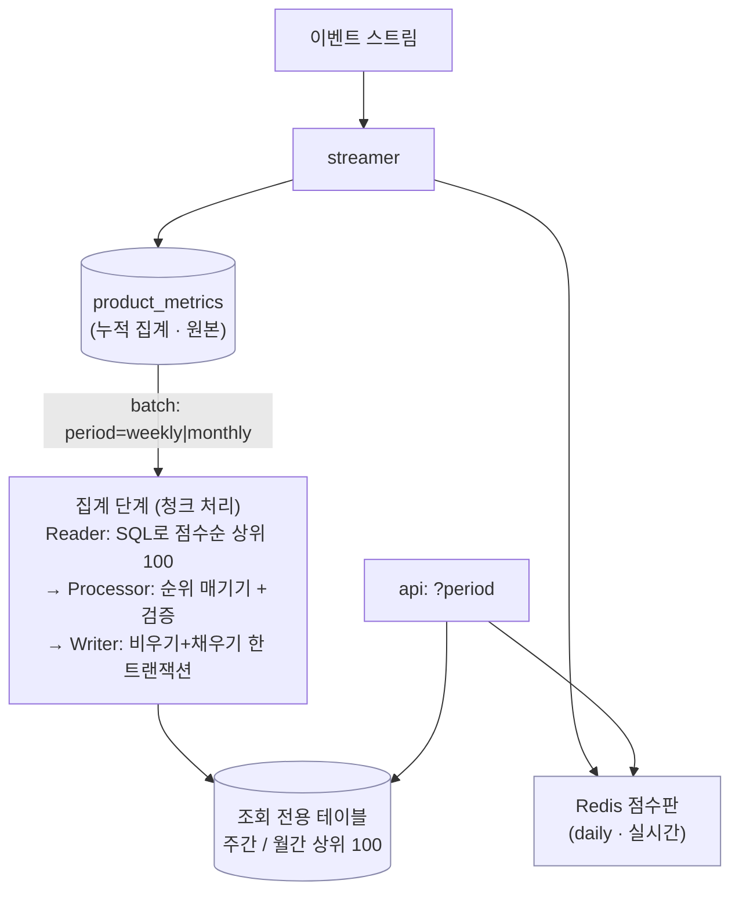

# [Design Doc] 순위표를 다시 만드는 동안, 조회가 깨지지 않게 (10주차 · K팀 · 이름)

## TL;DR

주간·월간 랭킹을 Spring Batch로 미리 계산해 조회 전용 테이블에 저장하고, 조회는 그 순위표를 순위대로 읽기만 한다. 핵심은 **순위표를 다시 만드는 동안 조회가 비었거나 반쯤 채워졌거나 앞뒤가 안 맞는 판을 보지 않게** 하는 것.

---

## Introduction & Goals

- **Context / Background**: 일간·시간 랭킹은 이벤트가 올 때마다 Redis 점수판을 조금씩 갱신하는 실시간 방식이다. 하지만 주간·월간은 매 조회마다 수십만 행을 그 자리에서 합산할 수 없다. 그래서 무거운 집계는 Spring Batch로 **미리·한 번에** 계산해 조회 전용 테이블에 저장해 두고, 조회는 그 순위표를 순위대로 가볍게 읽기만 한다. 진짜 원본은 `product_metrics`(MySQL)이고, 조회 전용 테이블은 그걸 조회에 맞게 **다시 만든 사본**이라 언제든 새로 만들면 된다. 그래서 이번 고민의 핵심은 정확도가 아니라 **"다시 만드는 동안 조회를 망가뜨리지 않고, 어긋난 값을 조용히 넘기지 않는 것"** 이다.
- **Goals**:
  1. 주간·월간 상위 100개를 미리 계산해, 조회 때 조인·집계 없이 순위대로 페이지만 읽는다.
  2. 배치가 여러 번 돌거나 중간에 죽어도, **조회가 비었거나 반쯤 채워졌거나 앞뒤가 안 맞는 판을 보지 않는다.**
  3. `?period=daily|weekly|monthly`로 조회 대상을 나누되, 기존 daily 조회는 그대로 동작한다.

---

## Detailed Design

### System Architecture

집계의 뼈대는 **데이터를 조금씩 끊어 처리하는 청크 방식**이다. Reader가 SQL로 점수를 계산해 점수 높은 순 100개만 이미 정렬된 채 흘려보내면, Processor는 흘러온 순서대로 1등, 2등… 순위만 매긴다. 정렬·상위 100개 자르기처럼 DB가 잘하는 일은 DB에 맡기고, 앱은 순위 매기기만 한다. 아래 세 결정은 이 뼈대 위에서 **"순위표를 다시 만드는 과정을 어떻게 안전하게 만드느냐"** 에 대한 것이다.

### Data Models

- **`product_metrics`** (원본): 상품당 누적 한 줄(product_id 고유) — 조회수·좋아요·판매수 카운트만 있다.
- **조회 전용 테이블** (주간 `mv_product_rank_weekly` / 월간 `mv_product_rank_monthly`): `product_id`, 순위, 점수를 비정규화해 저장한 상위 100. 순위 컬럼은 `rank`가 MySQL 8 예약어라 자바 필드는 `rank`, 컬럼은 `rank_no`로 매핑했다.

### API Design

- `GET /api/v1/rankings?period=daily|weekly|monthly` — daily는 Redis(실시간), weekly/monthly는 조회 전용 테이블에서 읽는다.
- daily는 순위를 조회 위치로 계산하지만, 조회 전용 테이블은 순위가 이미 저장돼 있어 그대로 써서 더 정확하다. `period` 미지정 시 기본 daily라 기존 조회와 호환된다.

### Constraints

- **점수 정책은 카운트 기준으로 다시 설계**: 실시간 정책은 주문 "금액"을 점수화하지만 `product_metrics`엔 카운트만 있어 그대로 못 쓴다. `점수 = 조회수·가중치 + 좋아요·가중치 + log10(1+판매수)·가중치`로 다시 세웠고, 가중치 설정(`ranking.weight`)은 그대로 재사용했다.

---

## Alternatives Considered — 매번 더 안전한 쪽을 골랐다

### 결정 1 — 순위표를 다시 만들 때, 비우기와 채우기를 어떻게 묶나

| 방법 | Pros | Cons |
|---|---|---|
| **선택: A. 한 트랜잭션에 비우기+채우기** | 실패하면 통째로 되돌려져 이전 판 유지. 조회가 빈/반쯤 찬 판을 볼 틈 없음 | 한 번에 끊는 크기 ≥ 상위 개수여야 원자성 보장 |
| B. 비우기 단계를 따로 | 단계가 깔끔히 나뉨 | 비우기가 먼저 확정돼, 채우기 실패 시 **다음 성공까지 계속 빔** |
| C. 새 테이블 통째 교체 | 조회를 아예 안 멈춤 | 테이블 두 벌·이름 바꾸기 필요 → 이 규모엔 과함 |

**선택 근거:** B의 진짜 위험은 "잠깐 빔"이 아니라 "실패하면 계속 빔"이다. A는 비우기와 채우기를 한 트랜잭션에 묶어, 도중에 죽으면 되돌려져 **이전 판이 그대로 살아남는다.** 게다가 비우기는 커밋 전까지 다른 조회에 안 보여 **빈 판을 볼 틈 자체가 사라진다.** 상위 100개 재적재는 워낙 짧아 C까지 갈 필요가 없다 — 데이터가 커져 다시 만드는 시간이 조회를 막을 만큼 길어지면 그때 C로 올리면 된다.

> 솔직한 대가: 원본이 비면 저장이 아예 호출되지 않아 비우기도 안 일어난다 → 새로 만들 게 없으면 마지막 정상 판을 유지한다 — 의도한 동작이다. (`RankMvItemWriter`)

### 결정 2 — 순위와 점수가 어긋나는 문제를 어떻게 막나

**순위는 SQL 정렬로, 점수는 코드(`RankingScorePolicy`)로 따로 계산**된다. 같은 점수식이 두 곳에 살아, 조금이라도 어긋나면 "1등인데 점수는 2등보다 낮은" 모순이 **아무 오류 없이** 저장된다.

| 방법 | Pros | Cons |
|---|---|---|
| **선택: A. 저장 직전 검증** | 끊어 처리하는 이점 유지 + 어긋나면 시끄럽게 실패 | 행마다 비교 한 번, 소수점 오차 대비 필요 |
| B. 주석만 | 공짜 | 돌아가는 중엔 못 잡음 → 조용한 오류 방치 |
| C. 앱에서 한 번에 계산 | 계산이 한 곳이라 어긋날 일 없음 | 전체를 앱으로 들고 정렬 → 끊어 처리 이점 상실 |

**선택 근거:** Processor가 흘러온 순서(점수 높은 순)를 점수로 다시 확인해, 순서가 뒤집히면 **틀어진 값을 저장하는 대신 배치를 실패**시킨다. 실패해도 결정 1 덕에 이전 판이 살아 있고, 결정 3의 오류 로그로 바로 알아챈다. 소수점 오차로 인한 헛경보는 아주 작은 허용치(`0.000001`)로 걸렀다. (`RankItemProcessor`)

### 결정 3 — 실패와 동시 실행을 어디까지 챙기나

- **실패 알림은 넣었다:** `JobListener`가 배치 실패를 감지하면, 완료 로그와 별개로 **오류 로그로 "이전 판 유지됨 + 원인"** 을 남긴다. 실패가 조용히 묻혀 낡거나 빈 판이 방치되고 조회가 그걸 정상처럼 반환하는 걸 막는다.
- **동시 실행 방지는 뺐다:** 이 배치는 스스로 도는 스케줄러가 없고 밖에서 한 번씩 실행되는 방식이라, 여러 실행을 막는 잠금을 걸 지점이 없다. 그건 실행을 관리하는 쪽(예: 쿠버네티스 "이미 돌면 새로 안 띄움") 몫이고, 결정 1 덕에 겹쳐 돌아도 테이블 잠금에 밀려 차례로 처리돼 결과는 멀쩡하다. 코드로 막을 문제가 아니라고 봤다.

---

## Cross-cutting Concerns

- **Consistency**: 강한 즉시 일관성 대신, 조회가 **항상 완결된 판만 보게** 만드는 데 집중했다(결정 1의 한 트랜잭션 재적재). 재적재는 몇 번을 돌려도 결과가 같은 전체 재적재라, 겹쳐 돌거나 중간에 죽어도 최종 상태가 일관된다.
- **Latency / Scalability**: 무거운 집계를 조회 경로 밖(배치)으로 빼, 조회는 상위 100개를 순위대로 읽기만 한다 → 상품 수가 늘어도 조회 비용은 거의 일정하다.
- **Observability**: 배치 실패를 완료 로그와 분리해 오류 로그로 부각한다. 다만 현재는 로그뿐이라, 실패율을 정량 추적할 메트릭·알람은 남은 과제다.

---

## 한계 — 일부러 뺀 것

`product_metrics`는 상품당 누적 한 줄(product_id 고유)이라 **날짜 구분이 없다.** 지금은 "현재 누적치를 다시 집계"라, 가중치가 같으면 주간·월간 순위가 똑같아진다. 실무로 가려면 날짜별 스냅샷 테이블(상품, 날짜, 카운트)이 먼저 있어야 하고, 배치는 그 날짜 범위만 골라 합산하게 된다. 이틀이면 다시 만들 사본에 이만한 구조는 과한 투자라고 보고 뺐다.
