# Loopers 이커머스 — 도메인 스팩

> 기획자·개발자·도메인 전문가가 같은 언어로 이야기하기 위한 기준이다.
> 코드가 아닌 **개념, 책임, 경계**를 다룬다.
>
> - `[공통]` 섹션: 세 역할 모두 읽는다
> - `[개발자]` 섹션: 개발자가 구현 시 참고한다
> - 미결 사항: 세 역할이 함께 결정해야 할 항목

---

## [공통] 서비스 개요

| 구분              | 내용                                                                  |
|-------------------|-----------------------------------------------------------------------|
| **주요 사용자**   | IT 직군 기술자 — 개발자, 엔지니어, DevOps, AI/ML 실무자 등            |
| **해결하는 문제** | 기술 스택에 맞는 도서를 찾기 어렵고, 구매 전 난이도 판단이 불명확하다 |
| **핵심 차별점**   | 기술 카테고리·난이도 기반 탐색, 관심 도서 통합 관리                   |
| **타겟 제외**     | 일반 교양서·소설·어린이 도서 등 IT 직군 외 도서                       |

> **용어 기준:** `01-requirements.md`가 소스 오브 트루스다. 도메인 언어는 `Brand` / `Product`를 사용한다.

---

## [공통] 유비쿼터스 언어

코드·문서·대화에서 아래 용어를 동일하게 사용한다. 같은 개념을 다른 이름으로 부르지 않는다.

| 한국어        | 영어 (코드명)  | 정의                                                                          |
|---------------|----------------|-------------------------------------------------------------------------------|
| 유저          | `User`         | 서비스에 가입 완료한 IT 직군 기술자                                           |
| 생년월일      | `Birth`        | 유저의 생년월일. 비밀번호 검증 정책(생년월일 포함 금지)에도 사용              |
| 이메일        | `Email`        | 유저 연락처. 향후 알림·마케팅 채널의 도달 주소                                |
| 관리자        | `Admin`        | 서비스 운영팀 구성원. Brand·Product 등록·수정·삭제, 전체 Order 조회 권한 보유 |
| 브랜드        | `Brand`        | IT 기술서를 등록하는 판매 주체 (O'Reilly, 한빛미디어 등)                      |
| 상품          | `Product`      | 브랜드가 판매하는 IT 기술 도서 한 권                                          |
| ISBN          | `ISBN`         | 도서 고유 식별 번호 (13자리 국제 표준)                                        |
| 저자          | `Author`       | 도서를 집필한 사람 (다중 저자 가능)                                           |
| 기술 카테고리 | `TechCategory` | 도서가 속하는 IT 기술 분야 (예: Backend, Frontend, DevOps, AI)                |
| 난이도        | `Level`        | 도서의 학습 난이도 (BEGINNER / INTERMEDIATE / ADVANCED)                       |
| 재고          | `Stock`        | 현재 판매 가능한 도서 수량                                                    |
| 좋아요        | `Like`         | 유저가 도서에 관심을 표시하는 행위                                            |
| 주문          | `Order`        | 구매 의사를 확정한 문서 (브랜드 무관 단일 건)                                 |
| 주문 상품     | `OrderItem`    | Order 안에 담긴 개별 상품 단위                                                |
| 스냅샷        | `Snapshot`     | 주문 시점의 상품명·가격을 변경 불가 형태로 저장한 값                          |
| 결제          | `Payment`      | 한 건의 Order에 대한 PG 거래 시도·결과 (Order 내부 엔티티, 1:1)               |
| 결제 수단     | `PaymentMethod`| 결제에 사용된 수단 (CARD · VIRTUAL_ACCOUNT · POINT 등)                        |
| 결제 상태     | `PaymentStatus`| PG 거래의 진행 상태 (PENDING · SUCCEEDED · FAILED)                            |
| PG 거래번호   | `PgTransactionId` | 외부 PG가 발급한 거래 식별자. PG 응답 수신 후 영속화                       |
| 결제 금액     | `PaidAmount`   | PG로 청구한 금액 (Order.totalAmount와 일치해야 함)                            |
| PG 게이트웨이 | `PaymentGateway`  | 외부 PG 시스템과의 통신을 추상화하는 포트 (헥사고날 어댑터 인터페이스)     |
| 쿠폰          | `Coupon`       | 할인 조건을 담은 발급 단위 `[확장]`                                           |
| 발급된 쿠폰   | `IssuedCoupon` | 특정 유저에게 귀속된 쿠폰 `[확장]`                                            |
| 쿠폰 코드     | `CouponCode`   | 수동 등록을 위한 문자열 식별자 `[확장]`                                       |
| 포인트        | `Point`        | 서비스 내 가상 화폐 `[확장]`                                                  |
| 유저 행동     | `UserActivity` | 좋아요·주문 등 유저가 남긴 이벤트 기록 `[확장]`                               |

---

## [공통] 바운디드 컨텍스트 맵

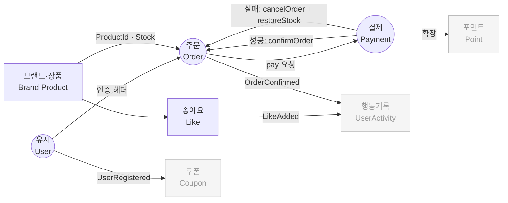

> 회색: 현재 구현 범위 외 (확장 포인트). **Payment는 MVP 범위에 포함된다** — Order 애그리거트 내부 엔티티로 통합 (안 B). 명명은 향후 별도 BC 분리(안 A) 전환을 고려해 `PaymentFacade`/`PaymentService`/`PaymentGateway`를 유지.

---

## [공통] 도메인 핵심 개념과 규칙

> 각 컨텍스트가 무엇을 담당하고, 어떤 규칙을 지켜야 하는지를 정의한다.
> Mermaid 다이어그램과 설계 리스크는 아래 **[개발자]** 섹션을 참고한다.

### 주문 (Order)

**담당:** 유저가 도서를 구매 확정하는 과정. 재고 확인부터 스냅샷 저장까지.

**핵심 개념:**
- 주문 1건에 여러 상품을 담을 수 있다 (브랜드 무관)
- 주문 확정 시점의 도서명·가격을 스냅샷으로 보존한다
- 이후 도서 정보가 바뀌어도 주문 내역은 변하지 않는다

**비즈니스 규칙:**

| #   | 규칙                                                        | Actor  |
|-----|-------------------------------------------------------------|--------|
| R1  | 주문 항목은 1개 이상이어야 한다                             | User   |
| R2  | 재고 부족 시 해당 상품을 포함한 주문 전체가 실패한다        | System |
| R3  | 주문 확정 시 재고를 차감한다                                | System |
| R4  | 주문 정보에 주문 시점의 상품명·가격 스냅샷을 저장한다       | System |
| R5  | 유저는 자신의 주문만 조회할 수 있다                         | User   |
| R6  | 주문 목록 조회는 날짜 범위(startAt ~ endAt) 필터를 지원한다 | User   |
| R7  | 전체 주문 목록·상세 조회는 관리자만 가능하다                | Admin  |
| R8  | 주문 항목당 수량은 1 이상이어야 한다                        | System |

**미결 사항 (공동 결정 필요):**
- 주문 취소 가능 시간 및 환불 정책 — 결제 컨텍스트 추가 시 함께 결정
- 관리자가 이미 확정된 주문을 강제 취소할 수 있는가

---

### 결제 (Payment)

**담당:** Order의 PG 거래 시도·결과를 영속화한다. 결제 성공 시 Order를 `CONFIRMED`로, 실패 시 `CANCELLED` + 재고 복구 보상 트랜잭션을 트리거한다.

**핵심 개념:**
- Payment는 Order 1건당 최대 1건 (1:1) — MVP는 단일 결제수단, 부분/분할 결제 없음
- Payment는 **Order 애그리거트 내부 엔티티**다 (안 B). DB 테이블은 별도로 분리하지만 도메인 라이프사이클은 Order가 소유
- PG 호출은 항상 `@Transactional` **외부**에서 수행한다 (외부 I/O가 DB connection을 점유하지 않도록)
- PG 응답 수신 후 별도의 짧은 트랜잭션으로 Payment 상태와 Order 상태를 함께 갱신
- Payment 상태는 `PENDING` → (`SUCCEEDED` | `FAILED`)로 단방향 전이만 허용

**비즈니스 규칙:**

| #   | 규칙                                                                                              | Actor  |
|-----|---------------------------------------------------------------------------------------------------|--------|
| R1  | 결제 요청 금액(`paidAmount`)은 Order의 `totalAmount`와 일치해야 한다                              | System |
| R2  | 결제 가능 상태는 Order가 `PENDING`일 때뿐이다                                                     | System |
| R3  | 결제는 본인 Order에 대해서만 가능하다 (`OrderModel.isOwnedBy(userId)` 통과 필요)                   | User   |
| R4  | PG 결제 성공 시 Order는 `CONFIRMED`로 전이하고 `OrderConfirmed` 이벤트를 발행한다                 | System |
| R5  | PG 결제 실패 시 Order는 `CANCELLED`로 전이하고 차감된 재고를 복구한다 (보상 트랜잭션)             | System |
| R6  | Payment 상태(`PENDING` → `SUCCEEDED`/`FAILED`)는 단방향 전이만 허용한다 (역전·재시도 시 새 행)    | System |
| R7  | Payment는 영구 보존한다 (회계·감사 목적). 소프트 삭제·하드 삭제 모두 금지                         | System |

**미결 사항 (공동 결정 필요):**
- PG 응답 타임아웃·네트워크 단절 시 처리 (현재는 성공/실패 이분법) — 운영 데이터 수집 후 결정
- 결제 멱등 키(`Idempotency-Key`) 도입 시점 — 클라이언트 재시도 시 중복 결제 방지

**확장 포인트 (현 범위 외):**
- 다중 결제수단(카드+포인트+쿠폰 분할) → Payment를 별도 BC로 분리(안 A) 전환
- 부분 환불·재결제 → Payment 라이프사이클 풍부화
- Saga 패턴 도입 — 분산 트랜잭션·보상 트랜잭션 표준화

---

### 유저 (User)

**담당:** 서비스 가입·인증. 주문과 좋아요의 주체.

**핵심 개념:**
- 유저는 로그인 ID와 비밀번호로 식별된다
- 인증은 매 요청 헤더로 처리한다 (별도 토큰·세션 없음)
- 유저는 가입 시 `LoginId`·비밀번호·`UserName`·`Birth`·`Email`을 모두 입력한다
- 유저 가입 완료가 쿠폰 자동 발급의 트리거가 된다 (확장)

**가입 입력 필드:**

| 필드          | 타입            | 검증 규칙                                                |
|---------------|-----------------|----------------------------------------------------------|
| `loginId`     | `LoginId`       | 1~50자, 서비스 내 유일                                   |
| `password`    | `HashedPassword`| 8자 이상, **생년월일 포함 금지**, 해시 저장(원문 미보관) |
| `name`        | `UserName`      | 1~50자                                                   |
| `birth`       | `Birth`         | `yyyy-MM-dd` 형식. 과거 일자만 허용                      |
| `email`       | `Email`         | RFC 5322 호환 정규식 검증                                |

**비즈니스 규칙:**

| #   | 규칙                                                                | Actor  |
|-----|---------------------------------------------------------------------|--------|
| R1  | `LoginId`는 서비스 전체에서 중복 불가                               | System |
| R2  | 비밀번호는 8자 이상이어야 한다                                      | System |
| R3  | 비밀번호는 유저의 생년월일(`yyyyMMdd` / `yyMMdd`)을 포함할 수 없다  | System |
| R4  | 유저는 타 유저의 정보에 직접 접근할 수 없다                         | User   |
| R5  | 비밀번호 변경 시 현재 비밀번호 일치 확인이 필요하다                 | User   |
| R6  | 이메일은 RFC 5322 정규식을 통과해야 한다                            | System |

**인증 정책 (API 전체 공통):**

| 구분   | 헤더                                      | 비고             |
|--------|-------------------------------------------|------------------|
| 유저   | `X-Loopers-LoginId` + `X-Loopers-LoginPw` | 매 요청마다 전달 |
| 어드민 | `X-Loopers-Ldap: loopers.admin`           | 고정값           |

---

### 브랜드·상품 (Brand·Product)

**담당:** IT 기술서의 등록·관리. 기술 카테고리와 난이도로 탐색 가능하게 한다.

**핵심 개념:**
- 브랜드가 상품을 등록한다. 상품은 반드시 하나의 브랜드에 속한다
- 상품은 기술 카테고리(`TechCategory`)와 난이도(`Level`)를 반드시 가진다
- 브랜드가 삭제되면 소속 상품도 함께 삭제된다
- 저자(`Author`)는 MVP에서 단일 문자열로 저장한다 (예: `"홍길동, 김철수"`). 다중 저자 별도 엔티티 분리는 확장 포인트
- 재고(`Stock`)가 0인 상품은 **품절** 상태다 — 탐색·상세 조회는 가능하나 주문은 불가

**TechCategory 분류:**

| 값         | 해당 영역                         |
|------------|-----------------------------------|
| `BACKEND`  | 서버·API·데이터베이스 개발        |
| `FRONTEND` | 웹·UI 개발                        |
| `DEVOPS`   | 인프라·CI/CD·쿠버네티스           |
| `AI_ML`    | 머신러닝·딥러닝·데이터 과학       |
| `DATABASE` | DB 설계·쿼리 최적화               |
| `SECURITY` | 보안·취약점·침해 대응             |
| `NETWORK`  | 네트워크·라우터·프로토콜          |
| `ETC`      | 위 분류에 해당하지 않는 IT 기술서 |

**Level 분류:**

| 값             | 대상 독자                                    |
|----------------|----------------------------------------------|
| `BEGINNER`     | 해당 기술을 처음 접하는 입문자               |
| `INTERMEDIATE` | 기초를 알고 실무 적용을 원하는 중급자        |
| `ADVANCED`     | 내부 동작 원리나 고급 패턴을 탐구하는 숙련자 |

**비즈니스 규칙:**

| #   | 규칙                                                                           | Actor  |
|-----|--------------------------------------------------------------------------------|--------|
| R1  | 브랜드·상품 등록·수정·삭제는 관리자만 가능하다                                 | Admin  |
| R2  | 브랜드 삭제 시 소속 상품도 모두 삭제된다                                       | System |
| R3  | 상품 등록 시 브랜드는 활성(ACTIVE) 상태여야 한다                               | System |
| R4  | 상품의 브랜드는 등록 후 수정할 수 없다                                         | System |
| R5  | ISBN은 서비스 내 유일해야 한다 (중복 등록 불가)                                | System |
| R6  | 상품 목록·상세 조회는 누구나 가능하다                                          | 모두   |
| R7  | 상품 목록 정렬: `latest`(필수), `price_asc`·`likes_desc`(선택)                 | 모두   |
| R8  | 대고객에게 재고 수량·삭제 상태·ISBN을 노출하지 않는다                          | System |
| R9  | 재고 0인 상품에 대한 주문은 R2(재고 부족)와 동일하게 주문 전체 실패로 처리한다 | System |

**미결 사항 (공동 결정 필요):**
- 브랜드 필터 UI를 보안·네트워크 카테고리 상품에만 노출할지, 전체 공개할지

**결정된 사항:**
- 브랜드·상품 삭제: **소프트 삭제** — `status=DELETED` + `deletedAt` 기록 후 주기적 하드 삭제. 연결된 Order가 없는 시점에 하드 삭제 처리. (A1 해소)

---

### 좋아요 (Like)

**담당:** 유저가 관심 도서를 표시하고, 나중에 다시 찾는 기능.

**핵심 개념:**
- 유저는 도서에 좋아요를 표시하거나 취소할 수 있다
- 같은 도서에 중복 좋아요는 불가하다
- 좋아요 수는 도서 인기도 지표로 정렬에 활용된다

**비즈니스 규칙:**

| #   | 규칙                                                                                                                              | Actor  |
|-----|-----------------------------------------------------------------------------------------------------------------------------------|--------|
| R1  | 같은 유저가 같은 상품에 중복 좋아요 불가                                                                                          | User   |
| R2  | 좋아요 등록 시 상품의 좋아요 수 +1                                                                                                | System |
| R3  | 좋아요 취소 시 상품의 좋아요 수 -1 (최솟값 0)                                                                                     | System |
| R4  | 좋아요 목록 조회는 본인 것만 가능                                                                                                 | User   |
| R5  | 중복 등록 시도(POST) → `200 OK` 반환, `likeCount` 증분 없음 (no-op). 자원 최종 상태(좋아요됨) 동일 — **완전 멱등**                | System |
| R6  | 미존재 취소 시도(DELETE) → `204 No Content` 반환, `likeCount` 감소 없음 (no-op). 자원 최종 상태(좋아요 없음) 동일 — **완전 멱등** | System |

> R5·R6의 근거: 좋아요는 상태 표현(Binary State Toggle)이므로 REST PUT 시맨틱을 따라 동일 요청 N회 = 1회 결과로 처리.  
> 모바일 재시도·네트워크 재전송 시나리오에 강건. Twitter/Instagram/GitHub Star 동일 패턴.

**미결 사항 (공동 결정 필요):**
- 좋아요에 메모 또는 태그 기능을 추가할지 (MVP 이후 검토 예정)

---

## [공통] 관리자 미결 사항

> 현재 구현 범위에서 어드민 API는 Brand·Product CRUD + Order 조회만 존재한다.

| #   | 미결 항목               | 현재 상태                                                                |
|-----|-------------------------|--------------------------------------------------------------------------|
| A1  | Brand·Product 삭제 방식 | ✅ **결정 완료** — 소프트 삭제(`DELETED` + `deletedAt`), 주기적 하드 삭제 |
| A2  | 관리자의 주문 취소 권한 | 조회 API만 존재 — CS 강제 취소 필요 시 별도 설계 필요                    |

---

## [공통] 주요 도메인 이벤트

> MVP 구현 범위에서 의미 있는 트리거 이벤트만 명시한다.

| 이벤트              | 발행 컨텍스트 | 발행 시점                              | 주요 구독자                                  |
|---------------------|---------------|----------------------------------------|----------------------------------------------|
| `UserRegistered`    | User          | 가입 완료                              | Coupon `[확장]` — 웰컴 쿠폰 자동 발급 트리거 |
| `LikeAdded`         | Like          | 좋아요 등록                            | Product (`likeCount +1`)                     |
| `LikeRemoved`       | Like          | 좋아요 취소                            | Product (`likeCount -1`)                     |
| `PaymentRequested`  | Order/Payment | 결제 요청 — PG 호출 전 Payment PENDING | (내부) PaymentService                        |
| `PaymentSucceeded`  | Order/Payment | PG 성공 응답 수신                      | Order (→ `CONFIRMED` 전이)                   |
| `PaymentFailed`     | Order/Payment | PG 실패 응답 수신                      | Order (→ `CANCELLED` + 재고 복구 트리거)     |
| `OrderConfirmed`    | Order         | 결제 성공 후 Order CONFIRMED 전이      | UserActivity `[확장]`, Point `[확장]`        |

> MVP는 `PaymentRequested`/`Succeeded`/`Failed` 이벤트를 **메서드 호출**로 직접 처리한다 (Order 애그리거트 내부). Payment를 별도 BC로 분리(안 A 전환)할 때 이 이벤트들이 그대로 도메인 이벤트로 격상된다.

---

## [확장 포인트] 쿠폰 / 포인트 / 행동 기록

> 현재 구현 범위 외. 경계와 트리거만 정의한다. (Payment는 MVP 범위로 이동)

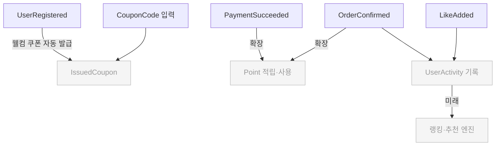

---

## [개발자] 기술 설계 상세

> 아래 섹션은 구현 시 참고하는 기술 세부사항이다.

### 주문 — 도메인 구조

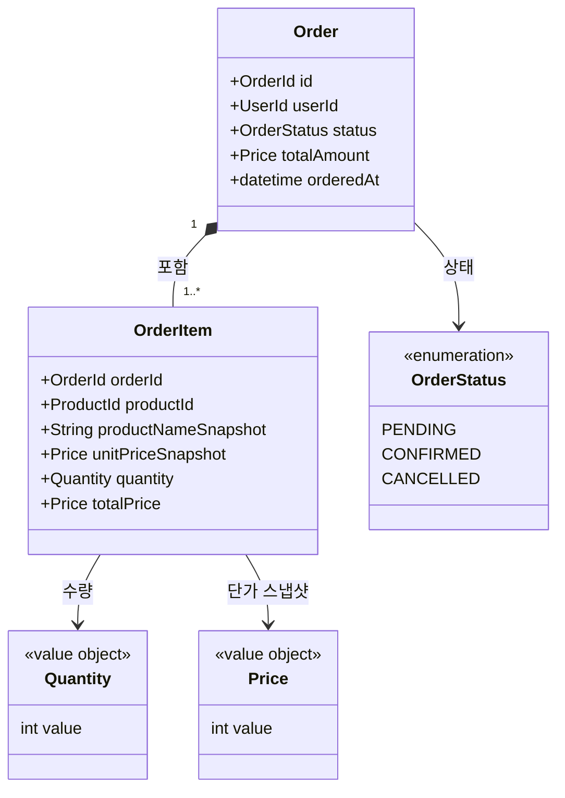

- `totalPrice`는 `unitPriceSnapshot × quantity`로 계산되는 파생 값이다.

### 주문 — 상태 생명주기

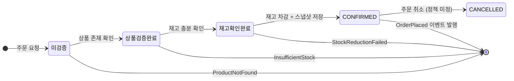

### 주문 — 설계 리스크

| 리스크              | 설명                                   | 선택지                                                                     |
|---------------------|----------------------------------------|----------------------------------------------------------------------------|
| 재고 동시성         | 동시 주문 시 재고 음수 가능            | A. 낙관적 락(version) · B. 비관적 락(SELECT FOR UPDATE) · C. Redis 분산 락 |
| 주문 취소 트리거    | CANCELLED 전이는 결제 실패에 의해 발생 | ✅ 결제 컨텍스트 통합 — 아래 Payment 섹션 참조                              |

---

### 결제 — 도메인 구조

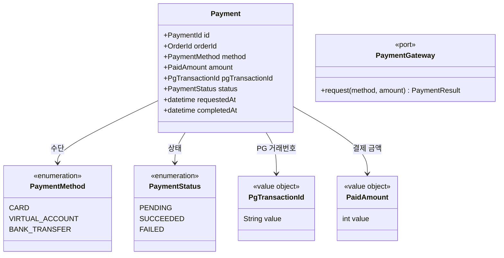

- `Payment`는 Order 1:1로 묶이는 내부 엔티티. `orderId`로 Order를 참조 (객체 직접 참조 아님)
- `PgTransactionId`: PG 응답 수신 시점에 세팅. PENDING 단계에서는 NULL
- `PaymentGateway`: 헥사고날 포트. infrastructure 어댑터(`TossPgAdapter` 등)가 구현. 도메인은 PG 종류를 모름

### 결제 — 상태 생명주기

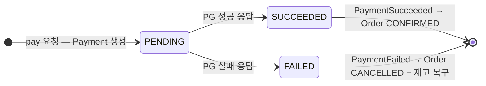

> **단방향 전이**: SUCCEEDED ↔ FAILED 사이 전이 불가. 재결제는 새 Payment 행을 생성한다 (확장 시).

### 결제 — 설계 리스크

| 리스크                | 설명                                                        | 선택지                                                              |
|-----------------------|-------------------------------------------------------------|---------------------------------------------------------------------|
| PG 호출 타임아웃      | PG 응답 지연 시 사용자가 재시도 → 중복 결제 가능            | A. Idempotency-Key 헤더 · B. PG 측 거래 조회 API 폴링                |
| 보상 트랜잭션 원자성  | 재고 복구·Order CANCELLED·Payment FAILED가 별 트랜잭션      | A. 단일 Service로 통합 · B. Saga 패턴 도입 (분산 환경)              |
| Order 애그리거트 비대 | Payment 흡수로 Order 책임이 커짐                            | 운영 안정화 후 안 A(Payment BC 분리)로 전환 — 명명 호환성 이미 확보 |

---

### 유저 — 도메인 구조

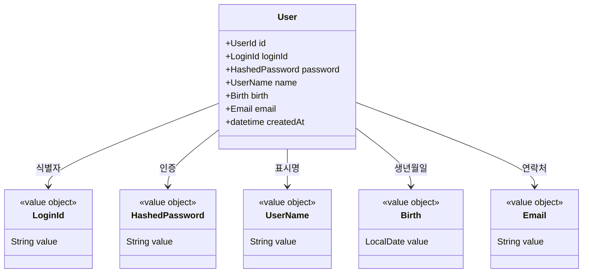

- `LoginId`: 1~50자, 서비스 내 유일
- `HashedPassword`: 8자 이상 입력 → 해시 저장 (원문 미보관). **`Birth.value`의 `yyyyMMdd`/`yyMMdd` 표현 포함 금지**
- `UserName`: 1~50자
- `Birth`: `LocalDate`, 과거 일자만 허용. R3 비밀번호 검증 정책의 입력값
- `Email`: RFC 5322 정규식 검증. 향후 알림 채널의 도달 주소

### 유저 — 상태 생명주기

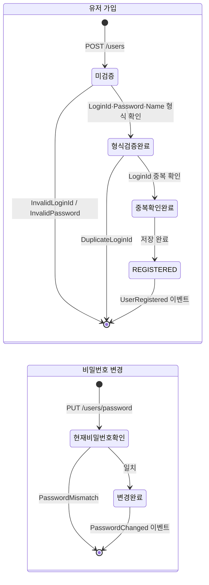

---

### 브랜드·상품 — 도메인 구조

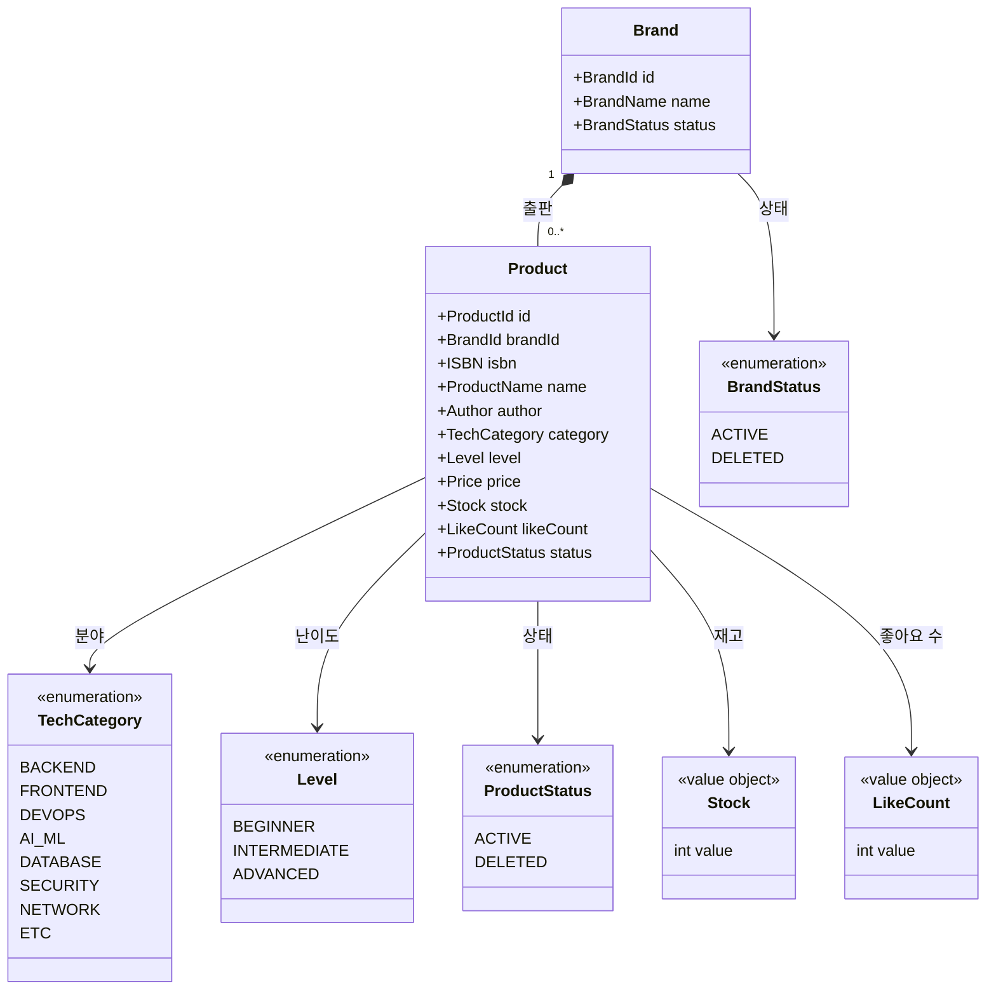

- `Stock`: 0 이상. 차감 책임은 Order 컨텍스트에 있다.
- `LikeCount`: 0 이상. 증감 책임은 Like 컨텍스트에 있다.

### 브랜드·상품 — 상태 생명주기

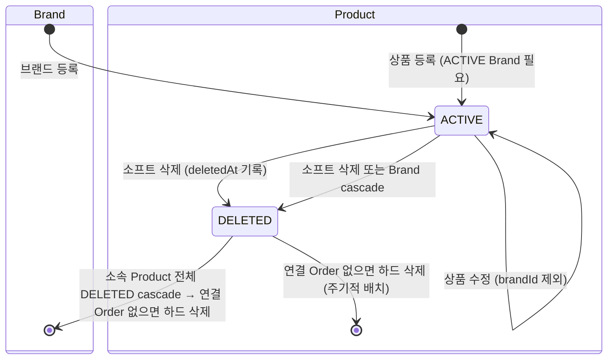

### 브랜드·상품 — 노출 정보 분리 (대고객 vs 어드민)

| 필드                                                | 대고객 | 어드민 |
|-----------------------------------------------------|--------|--------|
| id, name, author, category, level, price, likeCount | ✅      | ✅      |
| brandId, brandName                                  | ✅      | ✅      |
| isbn                                                | ❌      | ✅      |
| stock (정확한 수량)                                 | ❌      | ✅      |
| status (ACTIVE/DELETED)                             | ❌      | ✅      |

---

### 좋아요 — 도메인 구조

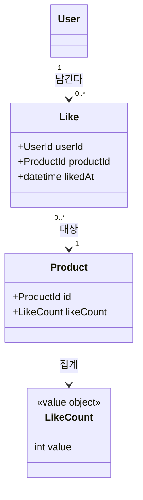

- `Like`의 식별자는 `(UserId, ProductId)` 복합키다 — DB 제약으로 R1(중복 불가)을 보장하며 동시 INSERT race condition의 최후 안전망 역할을 한다. 애플리케이션 레이어는 선제 `exists` 검사 후 R5/R6 완전 멱등 정책(중복 시 no-op, 동일 상태 응답)을 적용한다.

### 좋아요 — 상태 생명주기

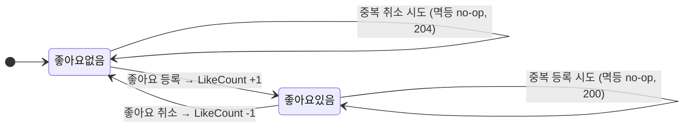

### 좋아요 — 설계 리스크

| 리스크                 | 설명                                                    | 결정                                                                                              |
|------------------------|---------------------------------------------------------|---------------------------------------------------------------------------------------------------|
| 상품 삭제 시 Like 처리 | Brand·Product 소프트 삭제 시 연결 Like 레코드 처리 방식 | 미결 — 구현 시 결정 필요                                                                          |
| likeCount 정합성       | 동시 등록 시 count 누락 가능                            | DB 원자적 증감(`UPDATE products SET like_count = like_count + 1`) 적용. 이벤트 기반은 확장 포인트 |

---

### 관리자 — 설계 리스크

| 리스크             | 설명                                                                                | 권고                                          |
|--------------------|-------------------------------------------------------------------------------------|-----------------------------------------------|
| 어드민 인증 강도   | `loopers.admin` 고정 헤더값 — 네트워크 스니핑에 취약                                | 운영 전 JWT·mTLS 교체 필수                    |
| 역할 단일화        | 어드민 권한 하나뿐, 세분화 불가                                                     | 운영팀 규모 커지기 전에 Role 테이블 설계 검토 |
| Brand 삭제 cascade | 소프트 삭제 채택 — `DELETED` + `deletedAt` 기록. 연결 Order 없으면 주기적 하드 삭제 | 삭제 배치 시 Order 참조 여부 먼저 확인        |

---

## [결정 보류] 설계 옵션 비교 자료

> 4개 에이전트(기획자/분석자/도메인 전문가/테크니컬 라이터) 크로스체크 결과 도출된 결정 보류 항목.  
> MVP 구현 시점에 두 안 중 선택, 또는 단계적 전환 검토.

---

### [보류 1] 재고 차감 시점 — 단일 차감 vs 2-Phase 예약/확정

도서 이커머스에서 재고 차감 시점은 **주문 생성 직후(즉시 차감)** 와 **결제 성공 후(예약 → 확정)** 두 패턴으로 갈린다.

#### 안 A: 단일 차감 (현재 채택)

**모델:** 주문 생성 시점에 즉시 `stock - quantity`. 결제 실패 시 `stock + quantity` 복구.

```
주문 요청 → [stock -= quantity] + PENDING 저장
              ↓
         결제 요청
        ↙          ↘
   결제 성공         결제 실패
   CONFIRMED       CANCELLED
                  [stock += quantity 복구]
```

| 항목                          | 평가                                            |
|-------------------------------|-------------------------------------------------|
| 모델 단순도                   | ⭐⭐⭐ 단순 (필드 1개: `stock`)                    |
| 정합성                        | ⭐⭐ 결제 실패 시 복구 트랜잭션 의존              |
| 동시성                        | ⭐⭐ 결제 진행 중 다른 주문이 같은 재고 점유 불가 |
| 결제 미수행 PENDING 잔존 위험 | ⭐ 무한 점유 위험 — 만료 배치 필요               |
| 구현 복잡도                   | ⭐⭐⭐ 낮음                                        |
| MVP 적합성                    | ⭐⭐⭐ 적합                                        |

**적합 시나리오:** MVP, 결제 성공률 높음, 동시 주문 적음

**문제점:**
- 결제 미수행 PENDING 주문이 영구히 재고 점유 → 만료(예: 30분) 자동 취소 배치 필수
- 결제 실패 시 보상 트랜잭션 실패하면 재고 음수 위험

---

#### 안 B: 2-Phase 예약/확정 (Two-Phase Stock Reservation)

**모델:** 주문 생성 시 재고 **예약(Reserve)** — 결제 성공 시 **확정(Confirm)** — 실패 시 **해제(Release)**.

```
Stock 모델:
  - totalStock        (총 재고)
  - reservedStock     (예약된 재고)
  - availableStock    (= totalStock - reservedStock, 노출용)

주문 요청 → [reservedStock += quantity] + PENDING 저장 (TTL 15분)
              ↓
         결제 요청
        ↙          ↘
   결제 성공         결제 실패/TTL 만료
   CONFIRMED       CANCELLED
   [totalStock     [reservedStock
    -= quantity,    -= quantity
    reservedStock   해제]
    -= quantity]
```

| 항목                          | 평가                                                      |
|-------------------------------|-----------------------------------------------------------|
| 모델 단순도                   | ⭐⭐ 필드 2개 (`totalStock`, `reservedStock`) + 이벤트 분리 |
| 정합성                        | ⭐⭐⭐ 예약-확정-해제 명확한 라이프사이클                    |
| 동시성                        | ⭐⭐⭐ 예약 단계와 확정 단계 분리로 낙관적 락 활용 가능      |
| 결제 미수행 PENDING 잔존 위험 | ⭐⭐⭐ TTL 자동 해제                                         |
| 구현 복잡도                   | ⭐⭐ 높음 (이벤트, TTL 배치, 상태 머신)                     |
| MVP 적합성                    | ⭐ MVP 과제로는 과한 설계                                  |

**적합 시나리오:** 알라딘/Yes24/교보문고 표준, 고동시성 서비스, 결제 성공률 낮음, 부분 환불 필요

**도메인 이벤트:** `StockReserved`, `StockConfirmed`, `StockReleased`

**문제점:**
- 모델 복잡도 ↑, TTL 만료 배치 운영 필요
- MVP 과제 범위(현 시점)에서는 과설계

---

#### 권고

| 시점           | 선택                                                          |
|----------------|---------------------------------------------------------------|
| MVP (현재)     | **안 A** — 단일 차감 + PENDING 30분 만료 배치                 |
| 운영 안정화 후 | **안 B** 단계적 전환 검토 — 결제 성공률·동시성 데이터 측정 후 |

---

### [결정 2] Payment 컨텍스트 — Order 내부 엔티티 채택 (MVP)

> **결정일:** 2026-05-22 · **결정자:** Backend Squad · **회수 조건:** 다중 결제수단·환불 시나리오 도입 시 안 A로 전환

**결정 사항:** MVP는 **안 B(Order 내부 엔티티)** 로 구현한다. 단, **명명은 안 A 호환**으로 유지한다 (`PaymentFacade`, `PaymentService`, `PaymentRepository`, `PaymentGateway`).

**근거:**
1. MVP는 단일 결제수단(카드 1종) + 부분 환불 없음 + PG 1개 → 안 A의 응집도·격리 이점이 과설계
2. Order ↔ Payment가 1:1이고 라이프사이클이 강결합 (결제 성공/실패가 곧 Order 상태 전이) → 단일 트랜잭션 안에 묶는 안 B가 자연스러움
3. 명명을 안 A 호환으로 두면 향후 별도 BC 분리 시 **클래스명·메서드 시그니처 변경 비용 = 0**, 패키지 이동·이벤트 발행만 추가하면 됨

**대안과 트레이드오프 (이하 두 안 비교는 참고 자료):**

결제는 외부 시스템(PG) 연동을 포함하므로 **바운디드 컨텍스트 경계**를 어디에 둘지가 핵심 결정 포인트.

#### 안 A: Payment 별도 바운디드 컨텍스트 (분리)

**모델:** Payment를 Order와 독립된 BC로 분리. Order는 `PaymentId`만 참조.

```
┌─────────────┐   OHS  ┌──────────────┐  ACL  ┌──────────┐
│ Order BC    │ ←────→ │ Payment BC   │ ←───→ │ 외부 PG  │
│ - Order     │        │ - Payment    │       └──────────┘
│ - OrderItem │ events │ - PaymentGW  │
│ - paymentId │        │ - PaymentStatus│
└─────────────┘        └──────────────┘

도메인 이벤트:
  Order → PaymentRequested → Payment BC
  Payment BC → PaymentCompleted/Failed → Order
```

| 항목              | 평가                                       |
|-------------------|--------------------------------------------|
| 컨텍스트 응집도   | ⭐⭐⭐ 결제 정책 변경이 Order에 누수 안 됨    |
| 외부 PG 결합 격리 | ⭐⭐⭐ ACL(Anti-Corruption Layer) 패턴        |
| 트랜잭션 경계     | ⭐⭐ 분산 트랜잭션 (Saga 또는 이벤트 기반)   |
| 환불·재결제 확장  | ⭐⭐⭐ Payment 독립 라이프사이클로 자연스러움 |
| 구현 복잡도       | ⭐ 높음 (이벤트, ACL, Saga)                 |
| MVP 적합성        | ⭐⭐ 단일 결제만 다루면 과설계               |

**적합 시나리오:** 다중 결제수단(카드+포인트+쿠폰), 환불·부분환불 빈번, PG 교체 가능성

**구현 요소:**
- `PaymentModel` 애그리게이트 루트
- `PaymentGateway` 포트(헥사고날) + PG 어댑터
- `PaymentCompleted` / `PaymentFailed` 도메인 이벤트
- Order는 이벤트 구독해 상태 전이

---

#### 안 B: Payment를 Order 내부 엔티티로 (통합)

**모델:** Payment를 Order 애그리게이트 내부 엔티티로 둠. Order가 Payment 라이프사이클 직접 관리.

```
Order (Aggregate Root)
├── OrderItem (Entity)
└── Payment (Entity)
    - paymentMethod
    - amount
    - pgTransactionId
    - status

OrderFacade.pay() 내부에서:
  1. Payment 생성
  2. PG 호출 (외부 I/O는 트랜잭션 외부)
  3. Payment 상태 업데이트 + Order 상태 전이 (단일 트랜잭션)
```

| 항목              | 평가                                     |
|-------------------|------------------------------------------|
| 컨텍스트 응집도   | ⭐⭐ Order에 결제 책임 흡수                |
| 외부 PG 결합 격리 | ⭐⭐ PaymentGateway 인터페이스로 격리 가능 |
| 트랜잭션 경계     | ⭐⭐⭐ 단일 트랜잭션 (외부 I/O 제외)        |
| 환불·재결제 확장  | ⭐ Order 책임 비대화                      |
| 구현 복잡도       | ⭐⭐⭐ 낮음 (이벤트 불필요)                 |
| MVP 적합성        | ⭐⭐⭐ MVP에 적합                           |

**적합 시나리오:** 단일 결제수단, 환불 거의 없음, MVP 단순화 우선

**문제점:**
- 결제 정책 변경(다중 결제·환불·쿠폰)이 Order 도메인 침투
- Order 애그리게이트가 비대해짐

---

#### 회수 시그널 (안 A 전환 트리거)

다음 중 **하나라도 발생**하면 안 A로 전환한다:

| # | 시그널                                                          | 측정 방법                                |
|---|-----------------------------------------------------------------|------------------------------------------|
| 1 | 결제수단 종류가 2개를 초과 (분할 결제 도입)                     | 비즈니스 의사결정                        |
| 2 | 부분 환불 정책 도입                                             | 비즈니스 의사결정                        |
| 3 | 월 결제 건수 ≥ 100만 건 또는 PG 응답 평균 ≥ 3s                  | APM 메트릭                               |
| 4 | PG 다중화 (Toss/이니시스/PayPal 동시 운영)                      | 인프라 의사결정                          |
| 5 | Payment 로직 변경이 Order 코드에 침투하는 PR이 분기당 3건 초과  | 코드 리뷰 정성 평가                      |

전환 시 작업: ① Payment 클래스를 별도 패키지·바운디드 컨텍스트로 이동 ② 메서드 호출을 도메인 이벤트(`PaymentSucceeded`/`Failed`)로 교체 ③ ACL 어댑터 신설. **클래스명·DB 스키마 변경은 없음** (이미 안 A 호환 설계).

#### 산출물 매핑

| 영역             | 위치                                                                                     |
|------------------|------------------------------------------------------------------------------------------|
| 도메인 구조      | 본 문서 §결제 — 도메인 구조 / 상태 생명주기                                              |
| 클래스 다이어그램 | `03-class-diagram.md` §6 Payment 컨텍스트                                                |
| ERD              | `04-erd.md` `payments` 테이블                                                            |
| 시퀀스 (개발자)  | `02-sequence-diagrams.md` §5 결제 요청                                                   |
| 시퀀스 (기획자)  | `02-sequence-diagrams-overview.md` §6 결제                                               |
