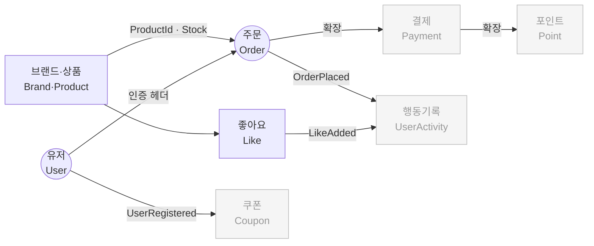
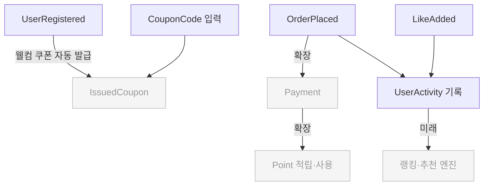
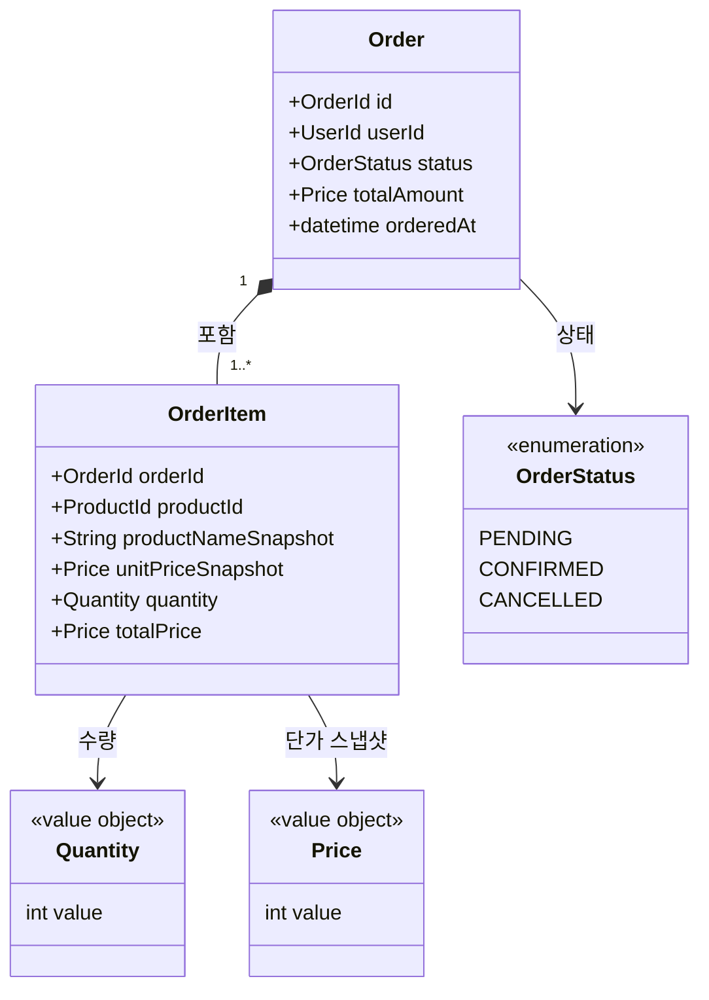
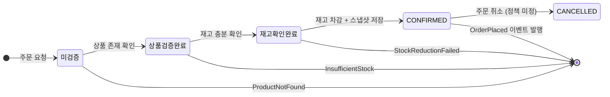
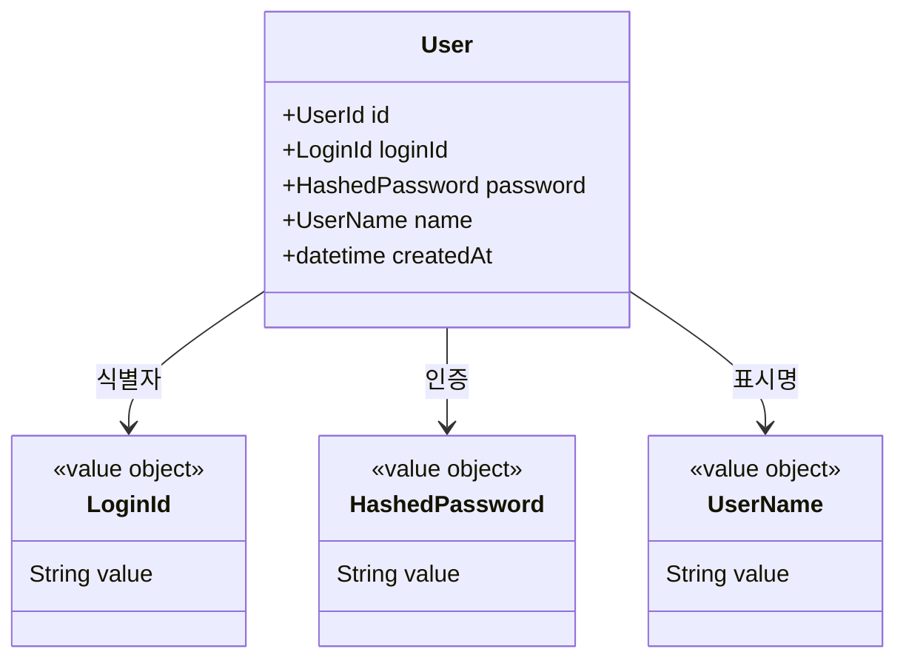
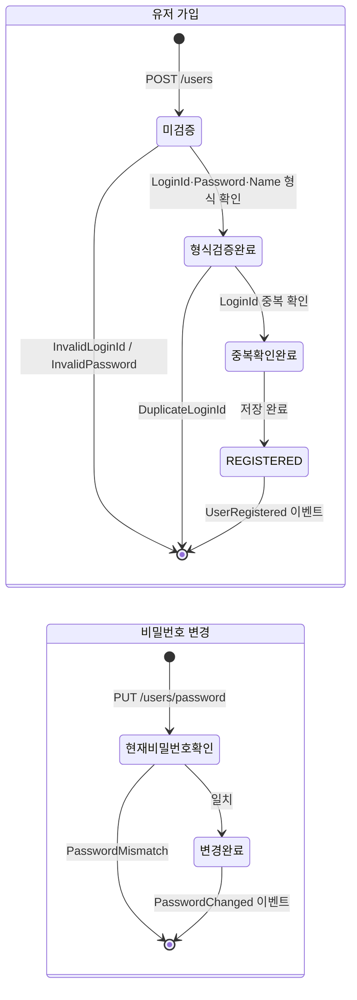
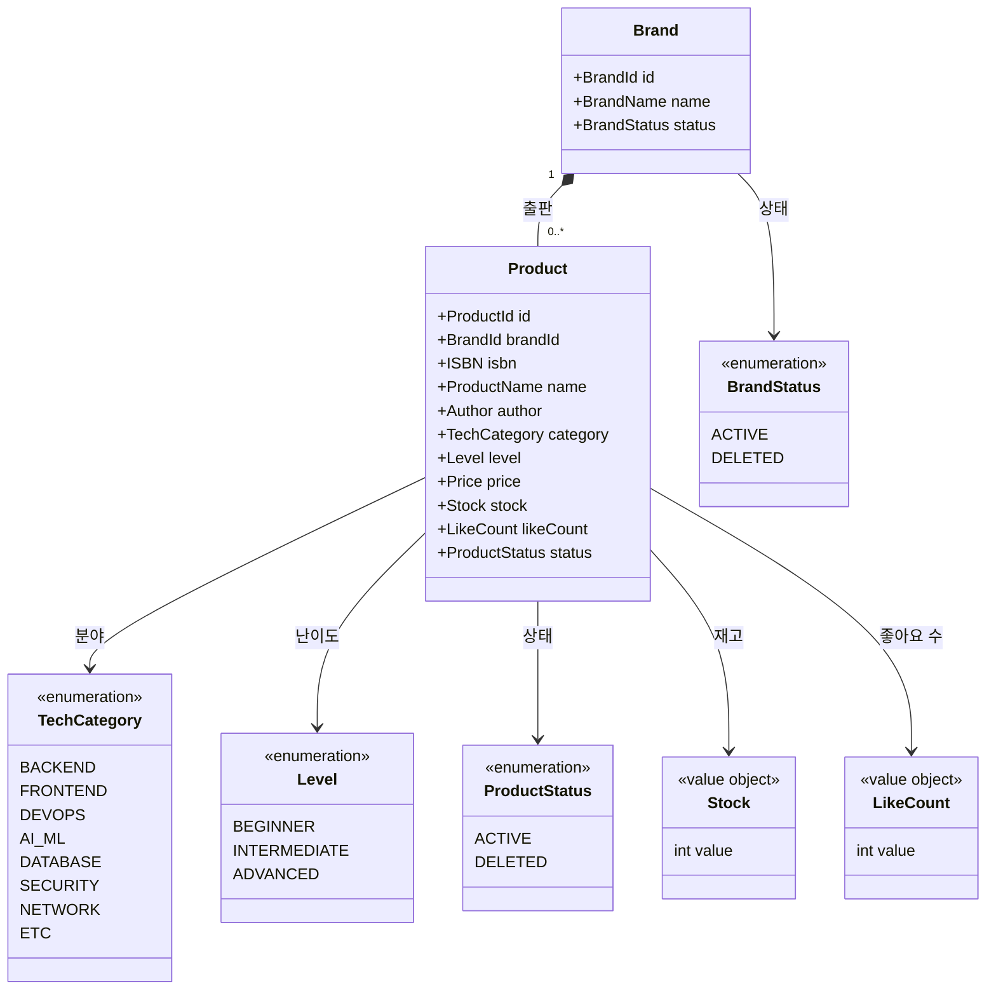
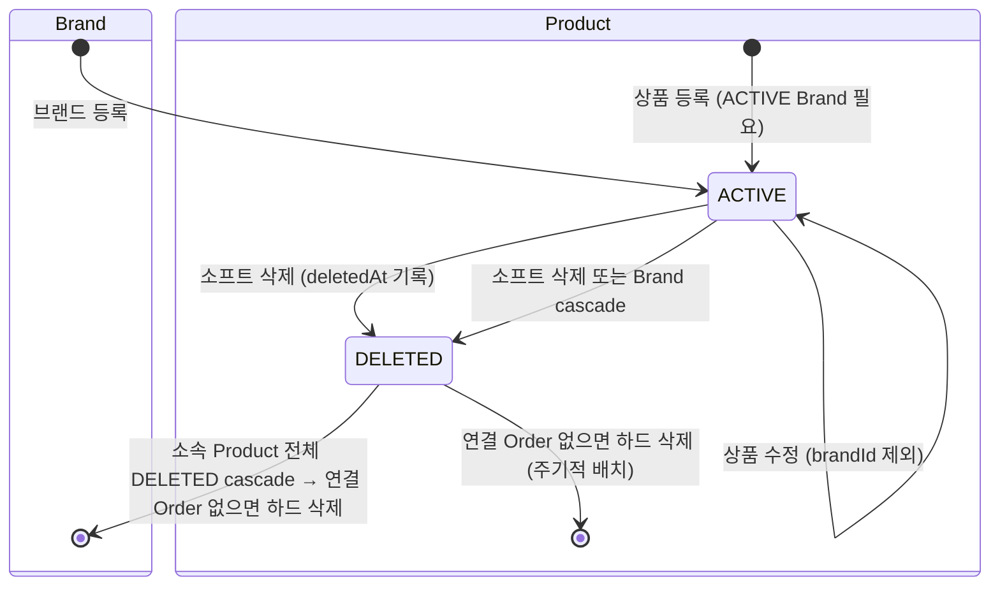
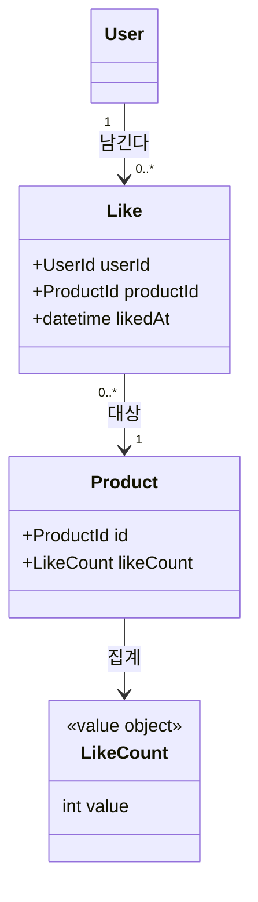
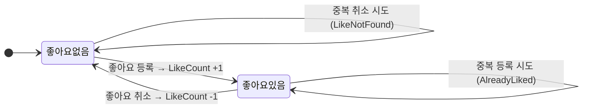

# Loopers 이커머스 — 도메인 스팩

> 기획자·개발자·도메인 전문가가 같은 언어로 이야기하기 위한 기준이다.
> 코드가 아닌 **개념, 책임, 경계**를 다룬다.
>
> - `[공통]` 섹션: 세 역할 모두 읽는다
> - `[개발자]` 섹션: 개발자가 구현 시 참고한다
> - 미결 사항: 세 역할이 함께 결정해야 할 항목

---

## [공통] 서비스 개요

| 구분 | 내용 |
|------|------|
| **주요 사용자** | IT 직군 기술자 — 개발자, 엔지니어, DevOps, AI/ML 실무자 등 |
| **해결하는 문제** | 기술 스택에 맞는 도서를 찾기 어렵고, 구매 전 난이도 판단이 불명확하다 |
| **핵심 차별점** | 기술 카테고리·난이도 기반 탐색, 관심 도서 통합 관리 |
| **타겟 제외** | 일반 교양서·소설·어린이 도서 등 IT 직군 외 도서 |

> **용어 기준:** `01-requirements.md`가 소스 오브 트루스다. 도메인 언어는 `Brand` / `Product`를 사용한다.

---

## [공통] 유비쿼터스 언어

코드·문서·대화에서 아래 용어를 동일하게 사용한다. 같은 개념을 다른 이름으로 부르지 않는다.

| 한국어 | 영어 (코드명) | 정의 |
|--------|-------------|------|
| 유저 | `User` | 서비스에 가입 완료한 IT 직군 기술자 |
| 관리자 | `Admin` | 서비스 운영팀 구성원. Brand·Product 등록·수정·삭제, 전체 Order 조회 권한 보유 |
| 브랜드 | `Brand` | IT 기술서를 등록하는 판매 주체 (O'Reilly, 한빛미디어 등) |
| 상품 | `Product` | 브랜드가 판매하는 IT 기술 도서 한 권 |
| ISBN | `ISBN` | 도서 고유 식별 번호 (13자리 국제 표준) |
| 저자 | `Author` | 도서를 집필한 사람 (다중 저자 가능) |
| 기술 카테고리 | `TechCategory` | 도서가 속하는 IT 기술 분야 (예: Backend, Frontend, DevOps, AI) |
| 난이도 | `Level` | 도서의 학습 난이도 (BEGINNER / INTERMEDIATE / ADVANCED) |
| 재고 | `Stock` | 현재 판매 가능한 도서 수량 |
| 좋아요 | `Like` | 유저가 도서에 관심을 표시하는 행위 |
| 주문 | `Order` | 구매 의사를 확정한 문서 (브랜드 무관 단일 건) |
| 주문 상품 | `OrderItem` | Order 안에 담긴 개별 상품 단위 |
| 스냅샷 | `Snapshot` | 주문 시점의 상품명·가격을 변경 불가 형태로 저장한 값 |
| 쿠폰 | `Coupon` | 할인 조건을 담은 발급 단위 `[확장]` |
| 발급된 쿠폰 | `IssuedCoupon` | 특정 유저에게 귀속된 쿠폰 `[확장]` |
| 쿠폰 코드 | `CouponCode` | 수동 등록을 위한 문자열 식별자 `[확장]` |
| 포인트 | `Point` | 서비스 내 가상 화폐 `[확장]` |
| 유저 행동 | `UserActivity` | 좋아요·주문 등 유저가 남긴 이벤트 기록 `[확장]` |

---

## [공통] 바운디드 컨텍스트 맵

> 회색: 현재 구현 범위 외 (확장 포인트)

---

## [공통] 도메인 핵심 개념과 규칙

> 각 컨텍스트가 무엇을 담당하고, 어떤 규칙을 지켜야 하는지를 정의한다.
> Mermaid 다이어그램과 설계 리스크는 아래 **[개발자]** 섹션을 참고한다.

### 주문 (Order)

**담당:** 유저가 도서를 구매 확정하는 과정. 재고 확인부터 스냅샷 저장까지.

**핵심 개념:**
- 주문 1건에 여러 상품을 담을 수 있다 (브랜드 무관)
- 주문 확정 시점의 도서명·가격을 스냅샷으로 보존한다
- 이후 도서 정보가 바뀌어도 주문 내역은 변하지 않는다

**비즈니스 규칙:**

| # | 규칙 | Actor |
|---|------|-------|
| R1 | 주문 항목은 1개 이상이어야 한다 | User |
| R2 | 재고 부족 시 해당 상품을 포함한 주문 전체가 실패한다 | System |
| R3 | 주문 확정 시 재고를 차감한다 | System |
| R4 | 주문 정보에 주문 시점의 상품명·가격 스냅샷을 저장한다 | System |
| R5 | 유저는 자신의 주문만 조회할 수 있다 | User |
| R6 | 주문 목록 조회는 날짜 범위(startAt ~ endAt) 필터를 지원한다 | User |
| R7 | 전체 주문 목록·상세 조회는 관리자만 가능하다 | Admin |
| R8 | 주문 항목당 수량은 1 이상이어야 한다 | System |

**미결 사항 (공동 결정 필요):**
- 주문 취소 가능 시간 및 환불 정책 — 결제 컨텍스트 추가 시 함께 결정
- 관리자가 이미 확정된 주문을 강제 취소할 수 있는가

---

### 유저 (User)

**담당:** 서비스 가입·인증. 주문과 좋아요의 주체.

**핵심 개념:**
- 유저는 로그인 ID와 비밀번호로 식별된다
- 인증은 매 요청 헤더로 처리한다 (별도 토큰·세션 없음)
- 유저 가입 완료가 쿠폰 자동 발급의 트리거가 된다 (확장)

**비즈니스 규칙:**

| # | 규칙 | Actor |
|---|------|-------|
| R1 | `LoginId`는 서비스 전체에서 중복 불가 | System |
| R2 | 비밀번호는 8자 이상이어야 한다 | System |
| R3 | 유저는 타 유저의 정보에 직접 접근할 수 없다 | User |
| R4 | 비밀번호 변경 시 현재 비밀번호 일치 확인이 필요하다 | User |

**인증 정책 (API 전체 공통):**

| 구분 | 헤더 | 비고 |
|------|------|------|
| 유저 | `X-Loopers-LoginId` + `X-Loopers-LoginPw` | 매 요청마다 전달 |
| 어드민 | `X-Loopers-Ldap: loopers.admin` | 고정값 |

---

### 브랜드·상품 (Brand·Product)

**담당:** IT 기술서의 등록·관리. 기술 카테고리와 난이도로 탐색 가능하게 한다.

**핵심 개념:**
- 브랜드가 상품을 등록한다. 상품은 반드시 하나의 브랜드에 속한다
- 상품은 기술 카테고리(`TechCategory`)와 난이도(`Level`)를 반드시 가진다
- 브랜드가 삭제되면 소속 상품도 함께 삭제된다
- 저자(`Author`)는 MVP에서 단일 문자열로 저장한다 (예: `"홍길동, 김철수"`). 다중 저자 별도 엔티티 분리는 확장 포인트
- 재고(`Stock`)가 0인 상품은 **품절** 상태다 — 탐색·상세 조회는 가능하나 주문은 불가

**TechCategory 분류:**

| 값 | 해당 영역 |
|----|---------|
| `BACKEND` | 서버·API·데이터베이스 개발 |
| `FRONTEND` | 웹·UI 개발 |
| `DEVOPS` | 인프라·CI/CD·쿠버네티스 |
| `AI_ML` | 머신러닝·딥러닝·데이터 과학 |
| `DATABASE` | DB 설계·쿼리 최적화 |
| `SECURITY` | 보안·취약점·침해 대응 |
| `NETWORK` | 네트워크·라우터·프로토콜 |
| `ETC` | 위 분류에 해당하지 않는 IT 기술서 |

**Level 분류:**

| 값 | 대상 독자 |
|----|---------|
| `BEGINNER` | 해당 기술을 처음 접하는 입문자 |
| `INTERMEDIATE` | 기초를 알고 실무 적용을 원하는 중급자 |
| `ADVANCED` | 내부 동작 원리나 고급 패턴을 탐구하는 숙련자 |

**비즈니스 규칙:**

| # | 규칙 | Actor |
|---|------|-------|
| R1 | 브랜드·상품 등록·수정·삭제는 관리자만 가능하다 | Admin |
| R2 | 브랜드 삭제 시 소속 상품도 모두 삭제된다 | System |
| R3 | 상품 등록 시 브랜드는 활성(ACTIVE) 상태여야 한다 | System |
| R4 | 상품의 브랜드는 등록 후 수정할 수 없다 | System |
| R5 | ISBN은 서비스 내 유일해야 한다 (중복 등록 불가) | System |
| R6 | 상품 목록·상세 조회는 누구나 가능하다 | 모두 |
| R7 | 상품 목록 정렬: `latest`(필수), `price_asc`·`likes_desc`(선택) | 모두 |
| R8 | 대고객에게 재고 수량·삭제 상태·ISBN을 노출하지 않는다 | System |
| R9 | 재고 0인 상품에 대한 주문은 R2(재고 부족)와 동일하게 주문 전체 실패로 처리한다 | System |

**미결 사항 (공동 결정 필요):**
- 브랜드 필터 UI를 보안·네트워크 카테고리 상품에만 노출할지, 전체 공개할지

**결정된 사항:**
- 브랜드·상품 삭제: **소프트 삭제** — `status=DELETED` + `deletedAt` 기록 후 주기적 하드 삭제. 연결된 Order가 없는 시점에 하드 삭제 처리. (A1 해소)

---

### 좋아요 (Like)

**담당:** 유저가 관심 도서를 표시하고, 나중에 다시 찾는 기능.

**핵심 개념:**
- 유저는 도서에 좋아요를 표시하거나 취소할 수 있다
- 같은 도서에 중복 좋아요는 불가하다
- 좋아요 수는 도서 인기도 지표로 정렬에 활용된다

**비즈니스 규칙:**

| # | 규칙 | Actor |
|---|------|-------|
| R1 | 같은 유저가 같은 상품에 중복 좋아요 불가 | User |
| R2 | 좋아요 등록 시 상품의 좋아요 수 +1 | System |
| R3 | 좋아요 취소 시 상품의 좋아요 수 -1 (최솟값 0) | System |
| R4 | 좋아요 목록 조회는 본인 것만 가능 | User |

**미결 사항 (공동 결정 필요):**
- 좋아요에 메모 또는 태그 기능을 추가할지 (MVP 이후 검토 예정)

---

## [공통] 관리자 미결 사항

> 현재 구현 범위에서 어드민 API는 Brand·Product CRUD + Order 조회만 존재한다.

| # | 미결 항목 | 현재 상태 |
|---|----------|----------|
| A1 | Brand·Product 삭제 방식 | ✅ **결정 완료** — 소프트 삭제(`DELETED` + `deletedAt`), 주기적 하드 삭제 |
| A2 | 관리자의 주문 취소 권한 | 조회 API만 존재 — CS 강제 취소 필요 시 별도 설계 필요 |

---

## [공통] 주요 도메인 이벤트

> MVP 구현 범위에서 의미 있는 트리거 이벤트만 명시한다.

| 이벤트 | 발행 컨텍스트 | 발행 시점 | 주요 구독자 |
|--------|------------|---------|-----------|
| `UserRegistered` | User | 가입 완료 | Coupon `[확장]` — 웰컴 쿠폰 자동 발급 트리거 |
| `LikeAdded` | Like | 좋아요 등록 | Product (`likeCount +1`) |
| `LikeRemoved` | Like | 좋아요 취소 | Product (`likeCount -1`) |
| `OrderConfirmed` | Order | 주문 확정 | UserActivity `[확장]` |

---

## [확장 포인트] 쿠폰 / 결제 / 포인트 / 행동 기록

> 현재 구현 범위 외. 경계와 트리거만 정의한다.

---

## [개발자] 기술 설계 상세

> 아래 섹션은 구현 시 참고하는 기술 세부사항이다.

### 주문 — 도메인 구조

- `totalPrice`는 `unitPriceSnapshot × quantity`로 계산되는 파생 값이다.

### 주문 — 상태 생명주기

### 주문 — 설계 리스크

| 리스크 | 설명 | 선택지 |
|--------|------|--------|
| 재고 동시성 | 동시 주문 시 재고 음수 가능 | A. 낙관적 락(version) · B. 비관적 락(SELECT FOR UPDATE) · C. Redis 분산 락 |
| 주문 취소 정책 미정 | CANCELLED 상태가 있으나 조건 없음 | 결제 컨텍스트 추가 시 함께 결정 |

---

### 유저 — 도메인 구조

- `LoginId`: 1~50자, 서비스 내 유일
- `HashedPassword`: 8자 이상 입력 → 해시 저장 (원문 미보관)
- `UserName`: 1~50자

### 유저 — 상태 생명주기

---

### 브랜드·상품 — 도메인 구조

- `Stock`: 0 이상. 차감 책임은 Order 컨텍스트에 있다.
- `LikeCount`: 0 이상. 증감 책임은 Like 컨텍스트에 있다.

### 브랜드·상품 — 상태 생명주기

### 브랜드·상품 — 노출 정보 분리 (대고객 vs 어드민)

| 필드 | 대고객 | 어드민 |
|------|--------|--------|
| id, name, author, category, level, price, likeCount | ✅ | ✅ |
| brandId, brandName | ✅ | ✅ |
| isbn | ❌ | ✅ |
| stock (정확한 수량) | ❌ | ✅ |
| status (ACTIVE/DELETED) | ❌ | ✅ |

---

### 좋아요 — 도메인 구조

- `Like`의 식별자는 `(UserId, ProductId)` 복합키다.

### 좋아요 — 상태 생명주기

### 좋아요 — 설계 리스크

| 리스크 | 설명 | 결정 |
|--------|------|------|
| 상품 삭제 시 Like 처리 | Brand·Product 소프트 삭제 시 연결 Like 레코드 처리 방식 | 미결 — 구현 시 결정 필요 |
| likeCount 정합성 | 동시 등록 시 count 누락 가능 | DB 원자적 증감(`UPDATE products SET like_count = like_count + 1`) 적용. 이벤트 기반은 확장 포인트 |

---

### 관리자 — 설계 리스크

| 리스크 | 설명 | 권고 |
|--------|------|------|
| 어드민 인증 강도 | `loopers.admin` 고정 헤더값 — 네트워크 스니핑에 취약 | 운영 전 JWT·mTLS 교체 필수 |
| 역할 단일화 | 어드민 권한 하나뿐, 세분화 불가 | 운영팀 규모 커지기 전에 Role 테이블 설계 검토 |
| Brand 삭제 cascade | 소프트 삭제 채택 — `DELETED` + `deletedAt` 기록. 연결 Order 없으면 주기적 하드 삭제 | 탈퇴·삭제 배치 시 Order 참조 여부 먼저 확인 |
