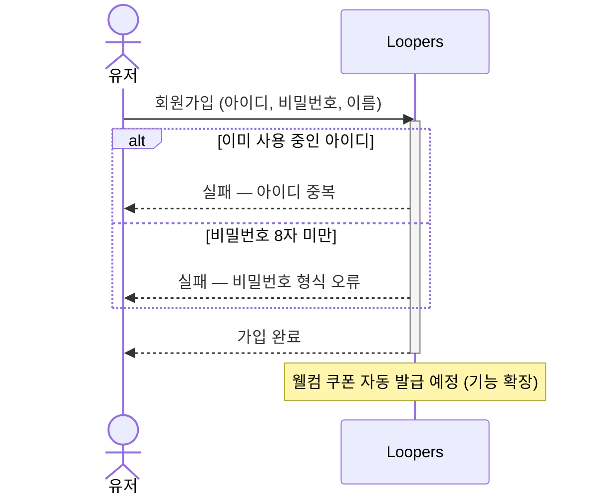
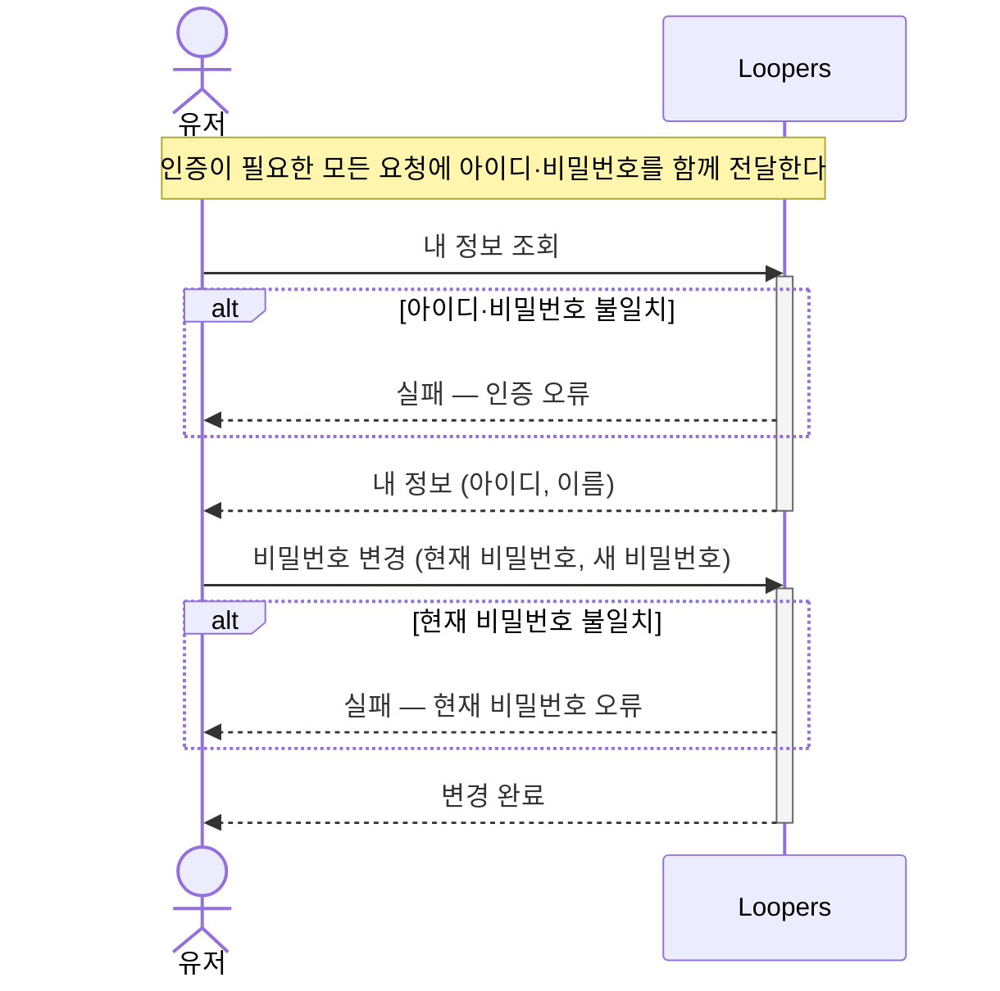
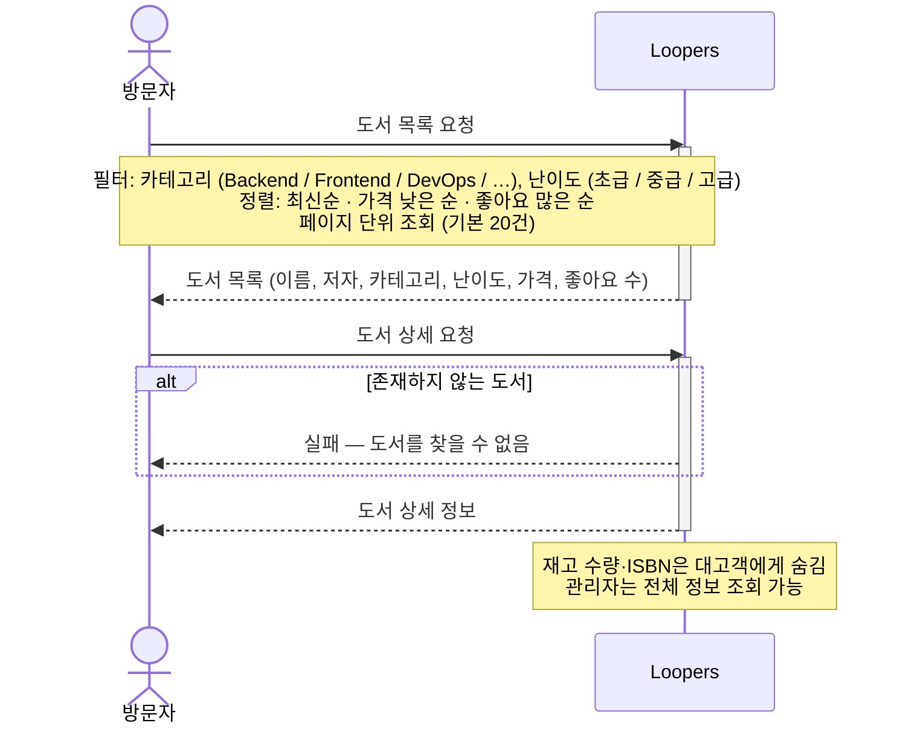
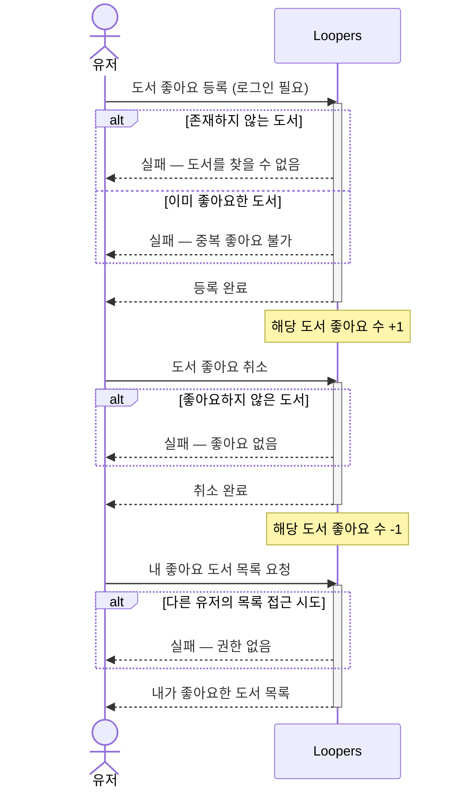
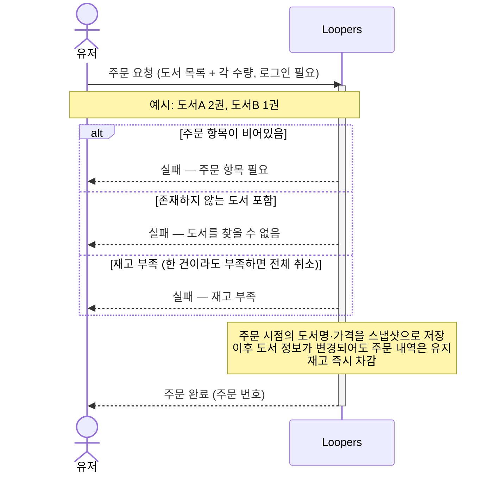
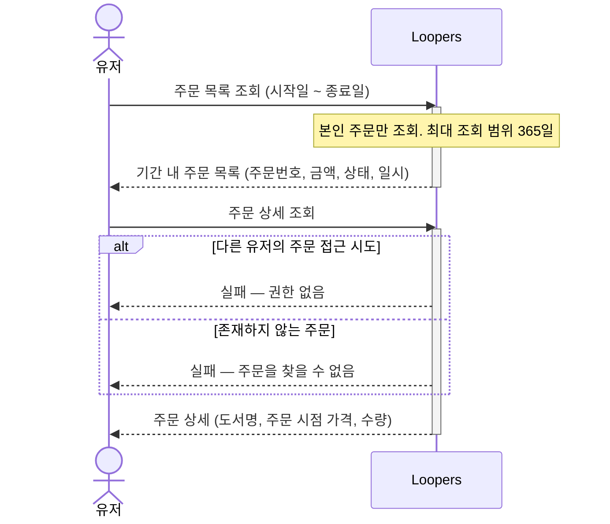
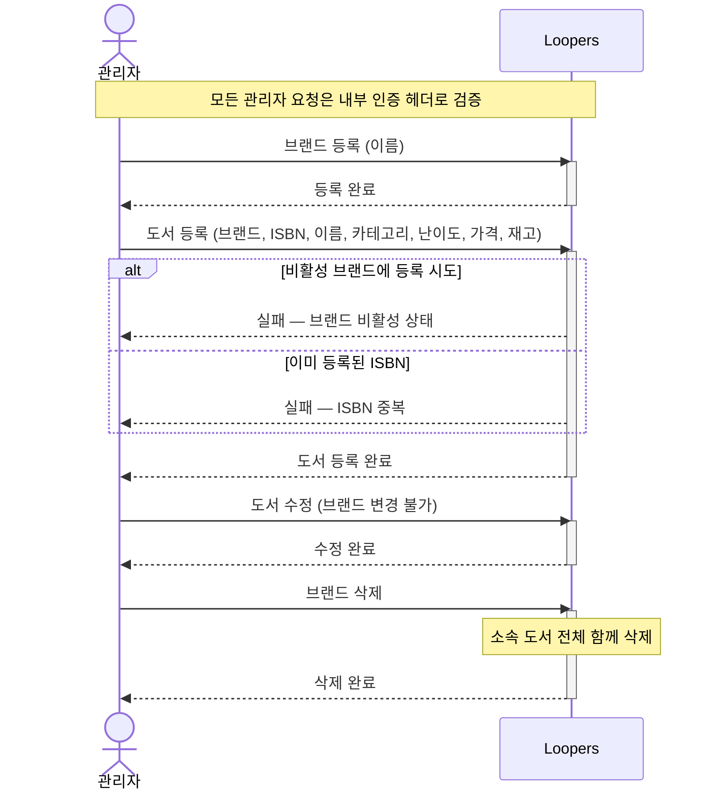
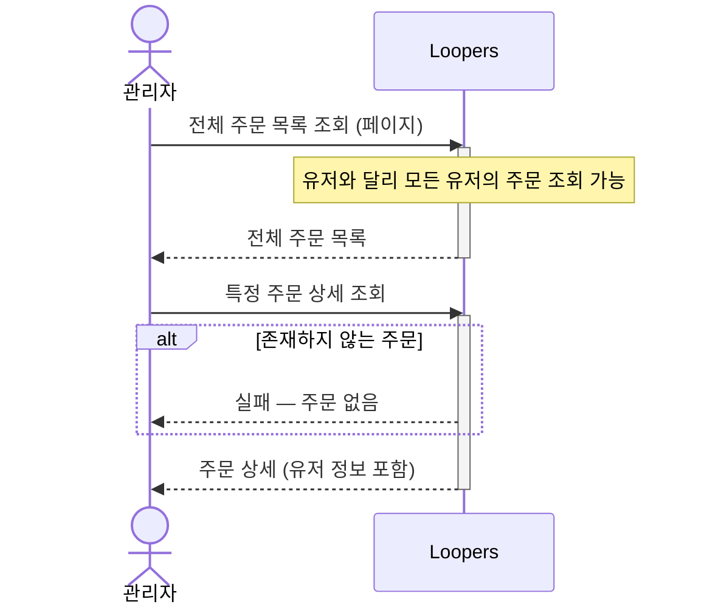

# Loopers 이커머스 — 서비스 흐름 개요

> **이 문서는 기획자·유관 부서·신규 팀원을 위한 개요 다이어그램이다.**  
> 기술 구현 상세(레이어·클래스·메서드)는 [`02-sequence-diagrams.md`](./02-sequence-diagrams.md)를 참고한다.
>
> 화살표(→) = 요청, 점선 화살표(-->) = 응답, `alt` = 분기 조건, 세로 막대 = 처리 중

---

## 전체 서비스 흐름

```
회원가입 → 도서 탐색 → 관심 도서 등록 → 주문
                        ↑
                   (관리자) 브랜드·도서 등록
```

---

## 1. 회원

### 1-1. 회원가입



---

### 1-2. 내 정보 조회 · 비밀번호 변경



---

## 2. 도서 탐색

### 2-1. 도서 목록 · 상세 조회



---

## 3. 관심 도서 (좋아요)

### 3-1. 좋아요 등록 · 취소 · 목록 조회



---

## 4. 주문

### 4-1. 주문 요청



---

### 4-2. 주문 조회



---

## 5. 관리자

### 5-1. 브랜드 · 도서 관리



---

### 5-2. 전체 주문 조회


