# Loopers 이커머스 — 시퀀스 다이어그램 (개발자용)

> **이 문서는 개발자를 위한 기술 구현 다이어그램이다.**  
> Controller → Facade → Service → Repository 레이어 상세를 포함한다.  
> 서비스 흐름 개요(기획자·비개발자용)는 [`02-sequence-diagrams-overview.md`](./02-sequence-diagrams-overview.md)를 참고한다.
>
> `00-domain-spec.md` · `01-requirements.md` 기반. 레이어 의존 방향은 `ArchitectureTest.java` 준수.

## 레이어 구조

```
interfaces          application         domain                  infrastructure
Controller    →     Facade        →     Service           ←     RepositoryImpl
                    (*Info 반환)         (*Model 반환)             (JPA 구현체)
                                        Repository (interface)
```

- Controller → Facade만 호출 (Service 직접 호출 금지)
- Facade → 단일 또는 복수 Service 조율
- Service → Repository 인터페이스만 의존

---

## API 전체 목록 (25개)

| #   | Method | URI                                  | 인증  | 단위           | 설명                           |
|-----|--------|--------------------------------------|-------|----------------|--------------------------------|
| 1   | POST   | `/api/v1/users`                      | X     | 로직           | 회원가입                       |
| 2   | GET    | `/api/v1/users/me`                   | O     | 로직           | 내 정보 조회                   |
| 3   | PUT    | `/api/v1/users/password`             | O     | 로직           | 비밀번호 변경                  |
| 4   | GET    | `/api/v1/brands/{brandId}`           | X     | 로직           | 브랜드 상세 조회               |
| 5   | GET    | `/api/v1/products`                   | X     | 로직           | 상품 목록 조회 (필터·정렬)     |
| 6   | GET    | `/api/v1/products/{productId}`       | X     | 로직           | 상품 상세 조회                 |
| 7   | GET    | `/api-admin/v1/brands`               | Admin | 로직           | 브랜드 목록 조회               |
| 8   | GET    | `/api-admin/v1/brands/{brandId}`     | Admin | 로직           | 브랜드 상세 조회               |
| 9   | POST   | `/api-admin/v1/brands`               | Admin | 로직           | 브랜드 등록                    |
| 10  | PUT    | `/api-admin/v1/brands/{brandId}`     | Admin | 로직           | 브랜드 수정                    |
| 11  | DELETE | `/api-admin/v1/brands/{brandId}`     | Admin | 로직           | 브랜드 삭제 (상품 cascade)     |
| 12  | GET    | `/api-admin/v1/products`             | Admin | 로직           | 상품 목록 조회                 |
| 13  | GET    | `/api-admin/v1/products/{productId}` | Admin | 로직           | 상품 상세 조회                 |
| 14  | POST   | `/api-admin/v1/products`             | Admin | 로직           | 상품 등록 (브랜드 유효성 포함) |
| 15  | PUT    | `/api-admin/v1/products/{productId}` | Admin | 로직           | 상품 수정 (brandId 수정 불가)  |
| 16  | DELETE | `/api-admin/v1/products/{productId}` | Admin | 로직           | 상품 삭제                      |
| 17  | POST   | `/api/v1/products/{productId}/likes` | O     | **어그리거트** | 좋아요 등록                    |
| 18  | DELETE | `/api/v1/products/{productId}/likes` | O     | **어그리거트** | 좋아요 취소                    |
| 19  | GET    | `/api/v1/users/{userId}/likes`       | O     | 로직           | 좋아요 상품 목록               |
| 20  | POST   | `/api/v1/orders`                     | O     | **어그리거트** | 주문 요청                      |
| 21  | GET    | `/api/v1/orders`                     | O     | 로직           | 주문 목록 조회                 |
| 22  | GET    | `/api/v1/orders/{orderId}`           | O     | 로직           | 주문 상세 조회                 |
| 23  | GET    | `/api-admin/v1/orders`               | Admin | 로직           | 전체 주문 목록                 |
| 24  | GET    | `/api-admin/v1/orders/{orderId}`     | Admin | 로직           | 주문 상세 조회                 |
| 25  | POST   | `/api/v1/orders/{orderId}/payments`  | O     | **어그리거트** | 결제 요청                      |

---

## 1. 유저

### 1-1. 회원가입 [로직 단위]

`POST /api/v1/users` — 인증 불필요

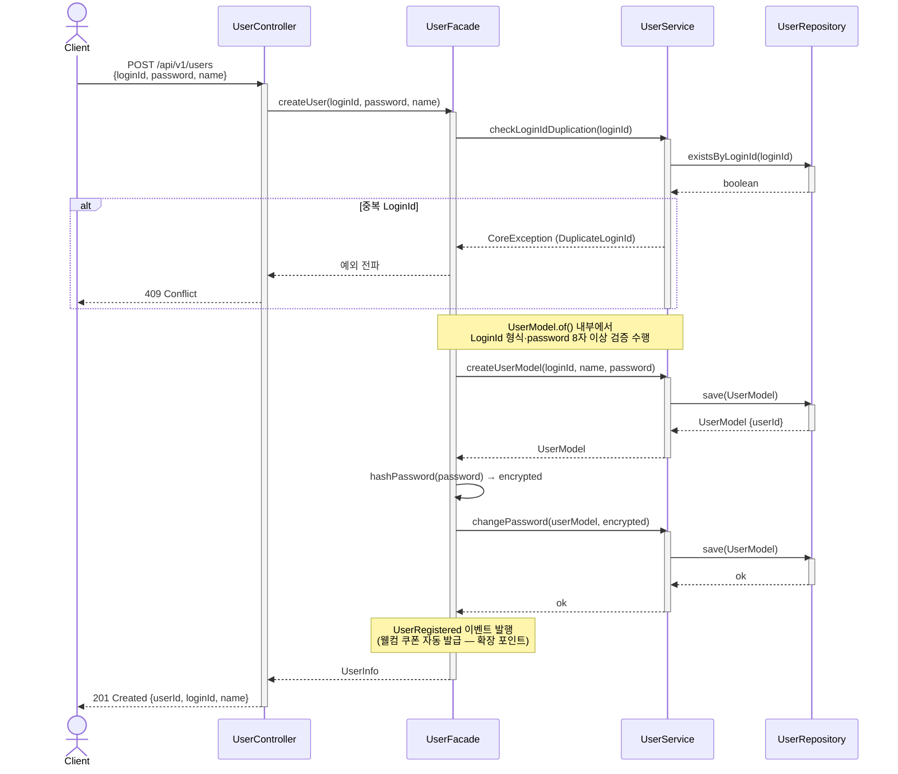
```mermaid
sequenceDiagram
    actor Client
    participant UC as UserController
    participant UF as UserFacade
    participant US as UserService
    participant UR as UserRepository

    Client->>UC: POST /api/v1/users<br/>{loginId, password, name}
    activate UC

    UC->>UF: createUser(loginId, password, name)
    activate UF

    UF->>US: checkLoginIdDuplication(loginId)
    activate US
    US->>UR: existsByLoginId(loginId)
    activate UR
    UR-->>US: boolean
    deactivate UR
    alt 중복 LoginId
        US-->>UF: CoreException (DuplicateLoginId)
        UF-->>UC: 예외 전파
        UC-->>Client: 409 Conflict
    end
    deactivate US

    Note over UF,US: UserModel.of() 내부에서<br/>LoginId 형식·password 8자 이상 검증 수행
    UF->>US: createUserModel(loginId, name, password)
    activate US
    US->>UR: save(UserModel)
    activate UR
    UR-->>US: UserModel {userId}
    deactivate UR
    US-->>UF: UserModel
    deactivate US

    UF->>UF: hashPassword(password) → encrypted

    UF->>US: changePassword(userModel, encrypted)
    activate US
    US->>UR: save(UserModel)
    activate UR
    UR-->>US: ok
    deactivate UR
    US-->>UF: ok
    deactivate US

    Note over UF: UserRegistered 이벤트 발행<br/>(웰컴 쿠폰 자동 발급 — 확장 포인트)

    UF-->>UC: UserInfo
    deactivate UF
    UC-->>Client: 201 Created {userId, loginId, name}
    deactivate UC
```

---

### 1-2. 내 정보 조회 [로직 단위]

`GET /api/v1/users/me` — 유저 인증 필요

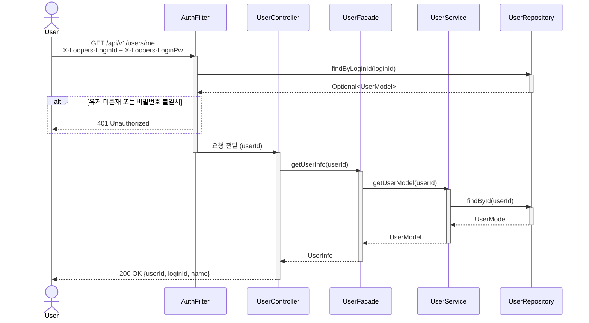
```mermaid
sequenceDiagram
    actor User
    participant AF as AuthFilter
    participant UC as UserController
    participant UF as UserFacade
    participant US as UserService
    participant UR as UserRepository

    User->>AF: GET /api/v1/users/me<br/>X-Loopers-LoginId + X-Loopers-LoginPw
    activate AF
    AF->>UR: findByLoginId(loginId)
    activate UR
    UR-->>AF: Optional<UserModel>
    deactivate UR
    alt 유저 미존재 또는 비밀번호 불일치
        AF-->>User: 401 Unauthorized
    end
    AF->>UC: 요청 전달 (userId)
    deactivate AF
    activate UC

    UC->>UF: getUserInfo(userId)
    activate UF
    UF->>US: getUserModel(userId)
    activate US
    US->>UR: findById(userId)
    activate UR
    UR-->>US: UserModel
    deactivate UR
    US-->>UF: UserModel
    deactivate US

    UF-->>UC: UserInfo
    deactivate UF
    UC-->>User: 200 OK {userId, loginId, name}
    deactivate UC
```

---

### 1-3. 비밀번호 변경 [로직 단위]

`PUT /api/v1/users/password` — 유저 인증 필요

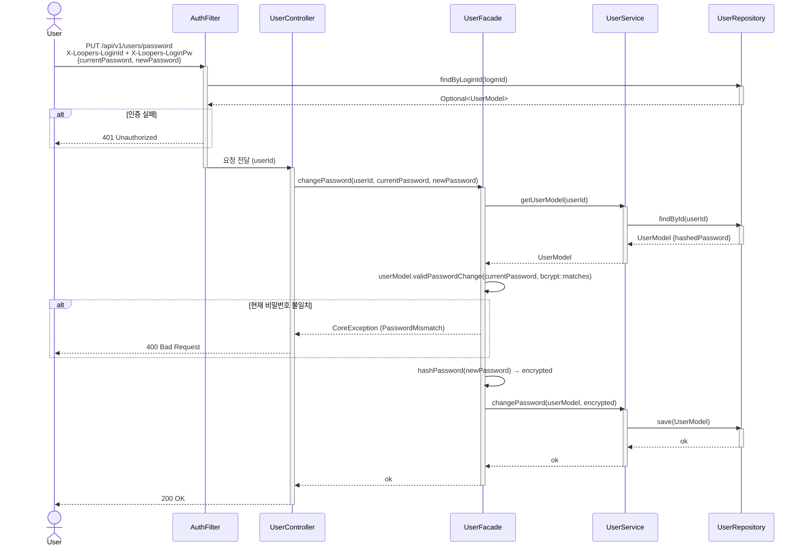
```mermaid
sequenceDiagram
    actor User
    participant AF as AuthFilter
    participant UC as UserController
    participant UF as UserFacade
    participant US as UserService
    participant UR as UserRepository

    User->>AF: PUT /api/v1/users/password<br/>X-Loopers-LoginId + X-Loopers-LoginPw<br/>{currentPassword, newPassword}
    activate AF
    AF->>UR: findByLoginId(loginId)
    activate UR
    UR-->>AF: Optional<UserModel>
    deactivate UR
    alt 인증 실패
        AF-->>User: 401 Unauthorized
    end
    AF->>UC: 요청 전달 (userId)
    deactivate AF
    activate UC

    UC->>UF: changePassword(userId, currentPassword, newPassword)
    activate UF
    UF->>US: getUserModel(userId)
    activate US
    US->>UR: findById(userId)
    activate UR
    UR-->>US: UserModel {hashedPassword}
    deactivate UR
    US-->>UF: UserModel
    deactivate US

    UF->>UF: userModel.validPasswordChange(currentPassword, bcrypt::matches)
    alt 현재 비밀번호 불일치
        UF-->>UC: CoreException (PasswordMismatch)
        UC-->>User: 400 Bad Request
    end

    UF->>UF: hashPassword(newPassword) → encrypted
    UF->>US: changePassword(userModel, encrypted)
    activate US
    US->>UR: save(UserModel)
    activate UR
    UR-->>US: ok
    deactivate UR
    US-->>UF: ok
    deactivate US

    UF-->>UC: ok
    deactivate UF
    UC-->>User: 200 OK
    deactivate UC
```

---

## 2. 브랜드·상품 — 대고객

### 2-1. 브랜드 상세 조회 [로직 단위]

`GET /api/v1/brands/{brandId}` — 인증 불필요

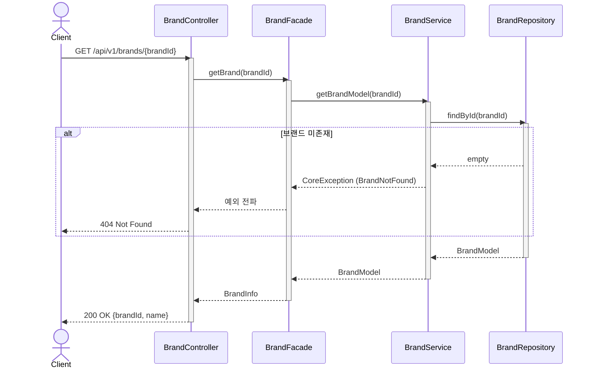
```mermaid
sequenceDiagram
    actor Client
    participant BC as BrandController
    participant BF as BrandFacade
    participant BS as BrandService
    participant BR as BrandRepository

    Client->>BC: GET /api/v1/brands/{brandId}
    activate BC

    BC->>BF: getBrand(brandId)
    activate BF
    BF->>BS: getBrandModel(brandId)
    activate BS
    BS->>BR: findById(brandId)
    activate BR
    alt 브랜드 미존재
        BR-->>BS: empty
        BS-->>BF: CoreException (BrandNotFound)
        BF-->>BC: 예외 전파
        BC-->>Client: 404 Not Found
    end
    BR-->>BS: BrandModel
    deactivate BR
    BS-->>BF: BrandModel
    deactivate BS

    BF-->>BC: BrandInfo
    deactivate BF
    BC-->>Client: 200 OK {brandId, name}
    deactivate BC
```

---

### 2-2. 상품 목록 조회 [로직 단위]

`GET /api/v1/products` — 인증 불필요, 필터·정렬·페이지 지원

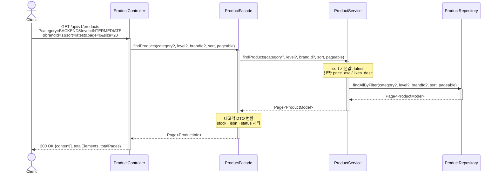
```mermaid
sequenceDiagram
    actor Client
    participant PC as ProductController
    participant PF as ProductFacade
    participant PS as ProductService
    participant PR as ProductRepository

    Client->>PC: GET /api/v1/products<br/>?category=BACKEND&level=INTERMEDIATE<br/>&brandId=1&sort=latest&page=0&size=20
    activate PC

    PC->>PF: findProducts(category?, level?, brandId?, sort, pageable)
    activate PF
    PF->>PS: findProducts(category?, level?, brandId?, sort, pageable)
    activate PS

    Note over PS: sort 기본값: latest<br/>선택: price_asc / likes_desc

    PS->>PR: findAllByFilter(category?, level?, brandId?, sort, pageable)
    activate PR
    PR-->>PS: Page<ProductModel>
    deactivate PR
    PS-->>PF: Page<ProductModel>
    deactivate PS

    Note over PF: 대고객 DTO 변환<br/>stock · isbn · status 제외

    PF-->>PC: Page<ProductInfo>
    deactivate PF
    PC-->>Client: 200 OK {content[], totalElements, totalPages}
    deactivate PC
```

---

### 2-3. 상품 상세 조회 [로직 단위]

`GET /api/v1/products/{productId}` — 인증 불필요

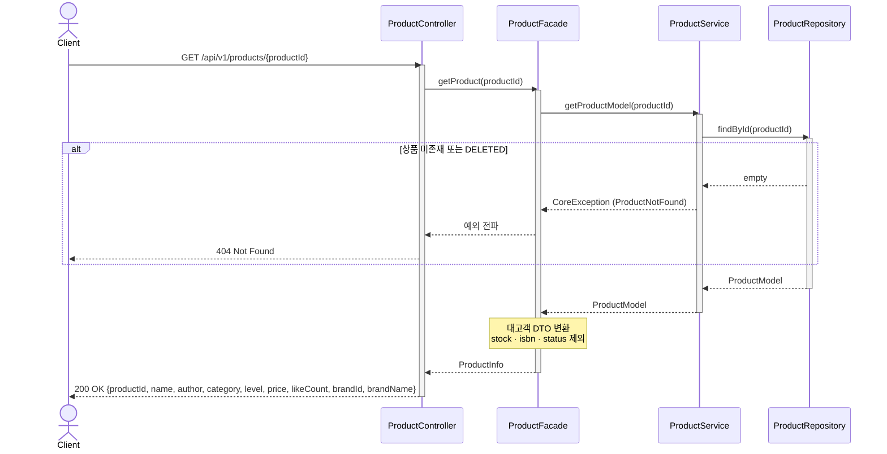
```mermaid
sequenceDiagram
    actor Client
    participant PC as ProductController
    participant PF as ProductFacade
    participant PS as ProductService
    participant PR as ProductRepository

    Client->>PC: GET /api/v1/products/{productId}
    activate PC

    PC->>PF: getProduct(productId)
    activate PF
    PF->>PS: getProductModel(productId)
    activate PS
    PS->>PR: findById(productId)
    activate PR
    alt 상품 미존재 또는 DELETED
        PR-->>PS: empty
        PS-->>PF: CoreException (ProductNotFound)
        PF-->>PC: 예외 전파
        PC-->>Client: 404 Not Found
    end
    PR-->>PS: ProductModel
    deactivate PR
    PS-->>PF: ProductModel
    deactivate PS

    Note over PF: 대고객 DTO 변환<br/>stock · isbn · status 제외

    PF-->>PC: ProductInfo
    deactivate PF
    PC-->>Client: 200 OK {productId, name, author, category, level, price, likeCount, brandId, brandName}
    deactivate PC
```

---

## 3. 브랜드·상품 — 어드민

> 모든 어드민 API는 `X-Loopers-Ldap: loopers.admin` 헤더를 `AdminAuthFilter`가 검증한다.  
> 인증 실패 시 401 반환. 이후 다이어그램에서는 인증 통과를 전제로 표기한다.

### 3-1. 브랜드 목록 조회 [로직 단위]

`GET /api-admin/v1/brands?page=0&size=20` — 어드민 인증

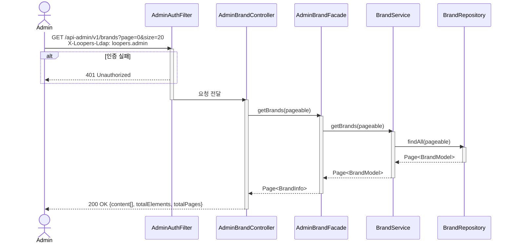
```mermaid
sequenceDiagram
    actor Admin
    participant AF as AdminAuthFilter
    participant BC as AdminBrandController
    participant BF as AdminBrandFacade
    participant BS as BrandService
    participant BR as BrandRepository

    Admin->>AF: GET /api-admin/v1/brands?page=0&size=20<br/>X-Loopers-Ldap: loopers.admin
    activate AF
    alt 인증 실패
        AF-->>Admin: 401 Unauthorized
    end
    AF->>BC: 요청 전달
    deactivate AF
    activate BC

    BC->>BF: getBrands(pageable)
    activate BF
    BF->>BS: getBrands(pageable)
    activate BS
    BS->>BR: findAll(pageable)
    activate BR
    BR-->>BS: Page<BrandModel>
    deactivate BR
    BS-->>BF: Page<BrandModel>
    deactivate BS

    BF-->>BC: Page<BrandInfo>
    deactivate BF
    BC-->>Admin: 200 OK {content[], totalElements, totalPages}
    deactivate BC
```

---

### 3-2. 브랜드 상세 조회 [로직 단위]

`GET /api-admin/v1/brands/{brandId}` — 어드민 인증

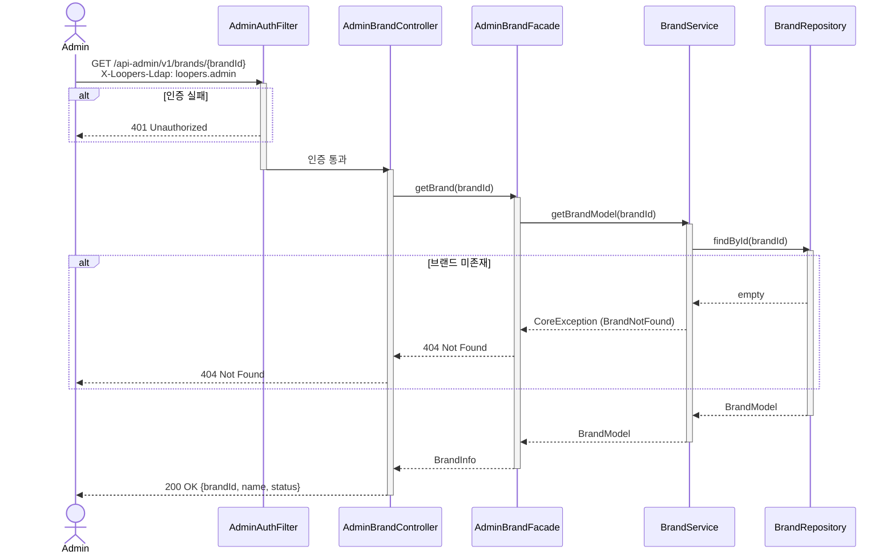
```mermaid
sequenceDiagram
    actor Admin
    participant AF as AdminAuthFilter
    participant BC as AdminBrandController
    participant BF as AdminBrandFacade
    participant BS as BrandService
    participant BR as BrandRepository

    Admin->>AF: GET /api-admin/v1/brands/{brandId}<br/>X-Loopers-Ldap: loopers.admin
    activate AF
    alt 인증 실패
        AF-->>Admin: 401 Unauthorized
    end
    AF->>BC: 인증 통과
    deactivate AF
    activate BC

    BC->>BF: getBrand(brandId)
    activate BF
    BF->>BS: getBrandModel(brandId)
    activate BS
    BS->>BR: findById(brandId)
    activate BR
    alt 브랜드 미존재
        BR-->>BS: empty
        BS-->>BF: CoreException (BrandNotFound)
        BF-->>BC: 404 Not Found
        BC-->>Admin: 404 Not Found
    end
    BR-->>BS: BrandModel
    deactivate BR
    BS-->>BF: BrandModel
    deactivate BS

    BF-->>BC: BrandInfo
    deactivate BF
    BC-->>Admin: 200 OK {brandId, name, status}
    deactivate BC
```

---

### 3-3. 브랜드 등록 [로직 단위]

`POST /api-admin/v1/brands` — 어드민 인증

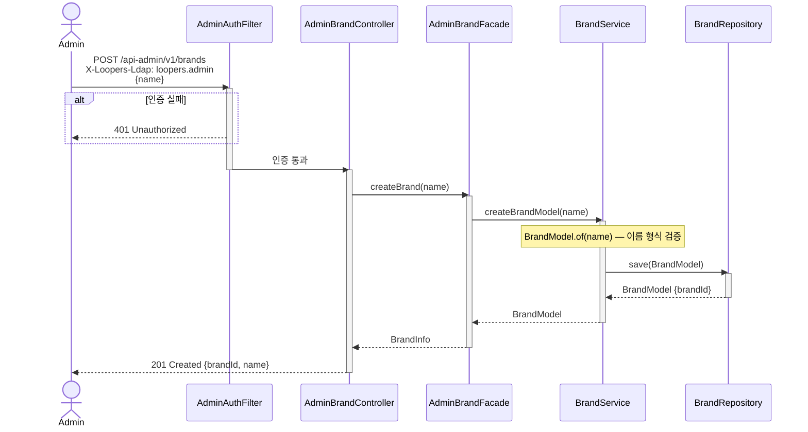
```mermaid
sequenceDiagram
    actor Admin
    participant AF as AdminAuthFilter
    participant BC as AdminBrandController
    participant BF as AdminBrandFacade
    participant BS as BrandService
    participant BR as BrandRepository

    Admin->>AF: POST /api-admin/v1/brands<br/>X-Loopers-Ldap: loopers.admin<br/>{name}
    activate AF
    alt 인증 실패
        AF-->>Admin: 401 Unauthorized
    end
    AF->>BC: 인증 통과
    deactivate AF
    activate BC

    BC->>BF: createBrand(name)
    activate BF
    BF->>BS: createBrandModel(name)
    activate BS

    Note over BS: BrandModel.of(name) — 이름 형식 검증
    BS->>BR: save(BrandModel)
    activate BR
    BR-->>BS: BrandModel {brandId}
    deactivate BR
    BS-->>BF: BrandModel
    deactivate BS

    BF-->>BC: BrandInfo
    deactivate BF
    BC-->>Admin: 201 Created {brandId, name}
    deactivate BC
```

---

### 3-4. 브랜드 수정 [로직 단위]

`PUT /api-admin/v1/brands/{brandId}` — 어드민 인증

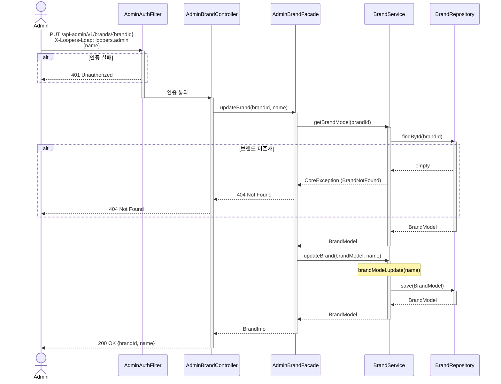
```mermaid
sequenceDiagram
    actor Admin
    participant AF as AdminAuthFilter
    participant BC as AdminBrandController
    participant BF as AdminBrandFacade
    participant BS as BrandService
    participant BR as BrandRepository

    Admin->>AF: PUT /api-admin/v1/brands/{brandId}<br/>X-Loopers-Ldap: loopers.admin<br/>{name}
    activate AF
    alt 인증 실패
        AF-->>Admin: 401 Unauthorized
    end
    AF->>BC: 인증 통과
    deactivate AF
    activate BC

    BC->>BF: updateBrand(brandId, name)
    activate BF
    BF->>BS: getBrandModel(brandId)
    activate BS
    BS->>BR: findById(brandId)
    activate BR
    alt 브랜드 미존재
        BR-->>BS: empty
        BS-->>BF: CoreException (BrandNotFound)
        BF-->>BC: 404 Not Found
        BC-->>Admin: 404 Not Found
    end
    BR-->>BS: BrandModel
    deactivate BR
    BS-->>BF: BrandModel
    deactivate BS

    BF->>BS: updateBrand(brandModel, name)
    activate BS
    Note over BS: brandModel.update(name)
    BS->>BR: save(BrandModel)
    activate BR
    BR-->>BS: BrandModel
    deactivate BR
    BS-->>BF: BrandModel
    deactivate BS

    BF-->>BC: BrandInfo
    deactivate BF
    BC-->>Admin: 200 OK {brandId, name}
    deactivate BC
```

---

### 3-5. 브랜드 삭제 [로직 단위] — 소속 상품 cascade 삭제

`DELETE /api-admin/v1/brands/{brandId}` — 어드민 인증, R2: 소속 상품 전체 삭제

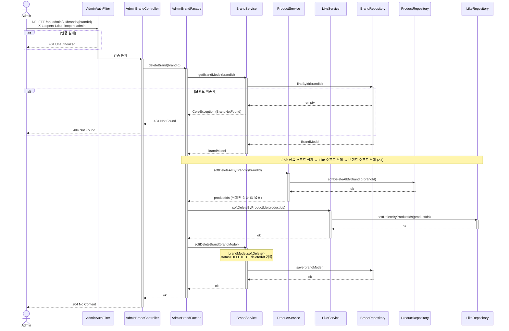
```mermaid
sequenceDiagram
    actor Admin
    participant AF as AdminAuthFilter
    participant BC as AdminBrandController
    participant BF as AdminBrandFacade
    participant BS as BrandService
    participant PS as ProductService
    participant LS as LikeService
    participant BR as BrandRepository
    participant PR as ProductRepository
    participant LR as LikeRepository

    Admin->>AF: DELETE /api-admin/v1/brands/{brandId}<br/>X-Loopers-Ldap: loopers.admin
    activate AF
    alt 인증 실패
        AF-->>Admin: 401 Unauthorized
    end
    AF->>BC: 인증 통과
    deactivate AF
    activate BC

    BC->>BF: deleteBrand(brandId)
    activate BF
    BF->>BS: getBrandModel(brandId)
    activate BS
    BS->>BR: findById(brandId)
    activate BR
    alt 브랜드 미존재
        BR-->>BS: empty
        BS-->>BF: CoreException (BrandNotFound)
        BF-->>BC: 404 Not Found
        BC-->>Admin: 404 Not Found
    end
    BR-->>BS: BrandModel
    deactivate BR
    BS-->>BF: BrandModel
    deactivate BS

    Note over BF,LR: 순서: 상품 소프트 삭제 → Like 소프트 삭제 → 브랜드 소프트 삭제 (A1)
    BF->>PS: softDeleteAllByBrandId(brandId)
    activate PS
    PS->>PR: softDeleteAllByBrandId(brandId)
    activate PR
    PR-->>PS: ok
    deactivate PR
    PS-->>BF: productIds (삭제된 상품 ID 목록)
    deactivate PS

    BF->>LS: softDeleteByProductIds(productIds)
    activate LS
    LS->>LR: softDeleteByProductIds(productIds)
    activate LR
    LR-->>LS: ok
    deactivate LR
    LS-->>BF: ok
    deactivate LS

    BF->>BS: softDeleteBrand(brandModel)
    activate BS
    Note over BS: brandModel.softDelete()<br/>status=DELETED + deletedAt 기록
    BS->>BR: save(brandModel)
    activate BR
    BR-->>BS: ok
    deactivate BR
    BS-->>BF: ok
    deactivate BS

    BF-->>BC: ok
    deactivate BF
    BC-->>Admin: 204 No Content
    deactivate BC
```

---

### 3-6. 상품 목록 조회 (어드민) [로직 단위]

`GET /api-admin/v1/products?page=0&size=20&brandId={brandId}` — 어드민 인증

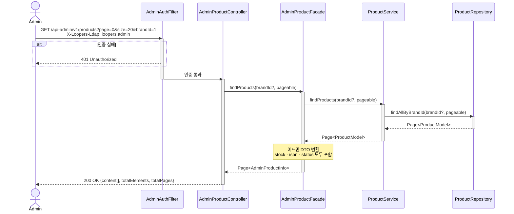
```mermaid
sequenceDiagram
    actor Admin
    participant AF as AdminAuthFilter
    participant PC as AdminProductController
    participant PF as AdminProductFacade
    participant PS as ProductService
    participant PR as ProductRepository

    Admin->>AF: GET /api-admin/v1/products?page=0&size=20&brandId=1<br/>X-Loopers-Ldap: loopers.admin
    activate AF
    alt 인증 실패
        AF-->>Admin: 401 Unauthorized
    end
    AF->>PC: 인증 통과
    deactivate AF
    activate PC

    PC->>PF: findProducts(brandId?, pageable)
    activate PF
    PF->>PS: findProducts(brandId?, pageable)
    activate PS
    PS->>PR: findAllByBrandId(brandId?, pageable)
    activate PR
    PR-->>PS: Page<ProductModel>
    deactivate PR
    PS-->>PF: Page<ProductModel>
    deactivate PS

    Note over PF: 어드민 DTO 변환<br/>stock · isbn · status 모두 포함

    PF-->>PC: Page<AdminProductInfo>
    deactivate PF
    PC-->>Admin: 200 OK {content[], totalElements, totalPages}
    deactivate PC
```

---

### 3-7. 상품 상세 조회 (어드민) [로직 단위]

`GET /api-admin/v1/products/{productId}` — 어드민 인증

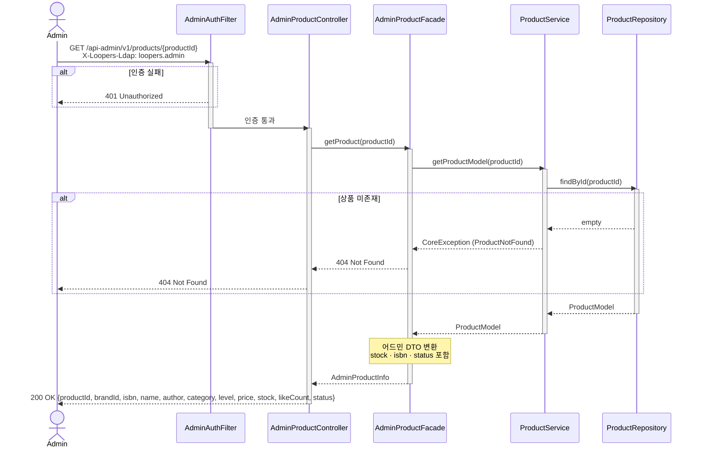
```mermaid
sequenceDiagram
    actor Admin
    participant AF as AdminAuthFilter
    participant PC as AdminProductController
    participant PF as AdminProductFacade
    participant PS as ProductService
    participant PR as ProductRepository

    Admin->>AF: GET /api-admin/v1/products/{productId}<br/>X-Loopers-Ldap: loopers.admin
    activate AF
    alt 인증 실패
        AF-->>Admin: 401 Unauthorized
    end
    AF->>PC: 인증 통과
    deactivate AF
    activate PC

    PC->>PF: getProduct(productId)
    activate PF
    PF->>PS: getProductModel(productId)
    activate PS
    PS->>PR: findById(productId)
    activate PR
    alt 상품 미존재
        PR-->>PS: empty
        PS-->>PF: CoreException (ProductNotFound)
        PF-->>PC: 404 Not Found
        PC-->>Admin: 404 Not Found
    end
    PR-->>PS: ProductModel
    deactivate PR
    PS-->>PF: ProductModel
    deactivate PS

    Note over PF: 어드민 DTO 변환<br/>stock · isbn · status 포함

    PF-->>PC: AdminProductInfo
    deactivate PF
    PC-->>Admin: 200 OK {productId, brandId, isbn, name, author, category, level, price, stock, likeCount, status}
    deactivate PC
```

---

### 3-8. 상품 등록 (어드민) [로직 단위]

`POST /api-admin/v1/products` — 어드민 인증, R3: Brand ACTIVE 확인, R5: ISBN 중복 확인

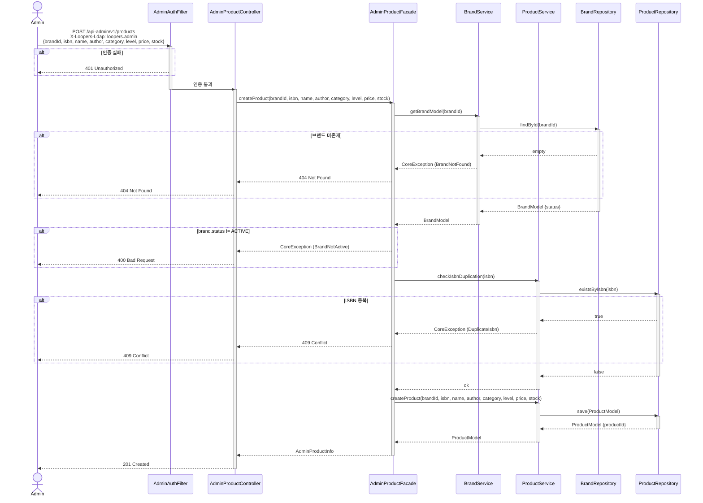
```mermaid
sequenceDiagram
    actor Admin
    participant AF as AdminAuthFilter
    participant PC as AdminProductController
    participant PF as AdminProductFacade
    participant BS as BrandService
    participant PS as ProductService
    participant BR as BrandRepository
    participant PR as ProductRepository

    Admin->>AF: POST /api-admin/v1/products<br/>X-Loopers-Ldap: loopers.admin<br/>{brandId, isbn, name, author, category, level, price, stock}
    activate AF
    alt 인증 실패
        AF-->>Admin: 401 Unauthorized
    end
    AF->>PC: 인증 통과
    deactivate AF
    activate PC

    PC->>PF: createProduct(brandId, isbn, name, author, category, level, price, stock)
    activate PF

    PF->>BS: getBrandModel(brandId)
    activate BS
    BS->>BR: findById(brandId)
    activate BR
    alt 브랜드 미존재
        BR-->>BS: empty
        BS-->>PF: CoreException (BrandNotFound)
        PF-->>PC: 404 Not Found
        PC-->>Admin: 404 Not Found
    end
    BR-->>BS: BrandModel {status}
    deactivate BR
    BS-->>PF: BrandModel
    deactivate BS

    alt brand.status != ACTIVE
        PF-->>PC: CoreException (BrandNotActive)
        PC-->>Admin: 400 Bad Request
    end

    PF->>PS: checkIsbnDuplication(isbn)
    activate PS
    PS->>PR: existsByIsbn(isbn)
    activate PR
    alt ISBN 중복
        PR-->>PS: true
        PS-->>PF: CoreException (DuplicateIsbn)
        PF-->>PC: 409 Conflict
        PC-->>Admin: 409 Conflict
    end
    PR-->>PS: false
    deactivate PR
    PS-->>PF: ok
    deactivate PS

    PF->>PS: createProduct(brandId, isbn, name, author, category, level, price, stock)
    activate PS
    PS->>PR: save(ProductModel)
    activate PR
    PR-->>PS: ProductModel {productId}
    deactivate PR
    PS-->>PF: ProductModel
    deactivate PS

    PF-->>PC: AdminProductInfo
    deactivate PF
    PC-->>Admin: 201 Created
    deactivate PC
```

---

### 3-9. 상품 수정 (어드민) [로직 단위]

`PUT /api-admin/v1/products/{productId}` — 어드민 인증, R4: brandId 수정 불가

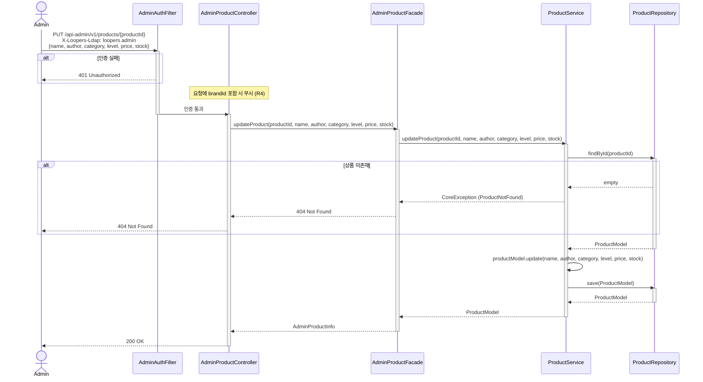
```mermaid
sequenceDiagram
    actor Admin
    participant AF as AdminAuthFilter
    participant PC as AdminProductController
    participant PF as AdminProductFacade
    participant PS as ProductService
    participant PR as ProductRepository

    Admin->>AF: PUT /api-admin/v1/products/{productId}<br/>X-Loopers-Ldap: loopers.admin<br/>{name, author, category, level, price, stock}
    activate AF
    alt 인증 실패
        AF-->>Admin: 401 Unauthorized
    end
    Note over PC: 요청에 brandId 포함 시 무시 (R4)
    AF->>PC: 인증 통과
    deactivate AF
    activate PC

    PC->>PF: updateProduct(productId, name, author, category, level, price, stock)
    activate PF
    PF->>PS: updateProduct(productId, name, author, category, level, price, stock)
    activate PS
    PS->>PR: findById(productId)
    activate PR
    alt 상품 미존재
        PR-->>PS: empty
        PS-->>PF: CoreException (ProductNotFound)
        PF-->>PC: 404 Not Found
        PC-->>Admin: 404 Not Found
    end
    PR-->>PS: ProductModel
    deactivate PR

    PS->>PS: productModel.update(name, author, category, level, price, stock)
    PS->>PR: save(ProductModel)
    activate PR
    PR-->>PS: ProductModel
    deactivate PR
    PS-->>PF: ProductModel
    deactivate PS

    PF-->>PC: AdminProductInfo
    deactivate PF
    PC-->>Admin: 200 OK
    deactivate PC
```

---

### 3-10. 상품 삭제 (어드민) [로직 단위]

`DELETE /api-admin/v1/products/{productId}` — 어드민 인증

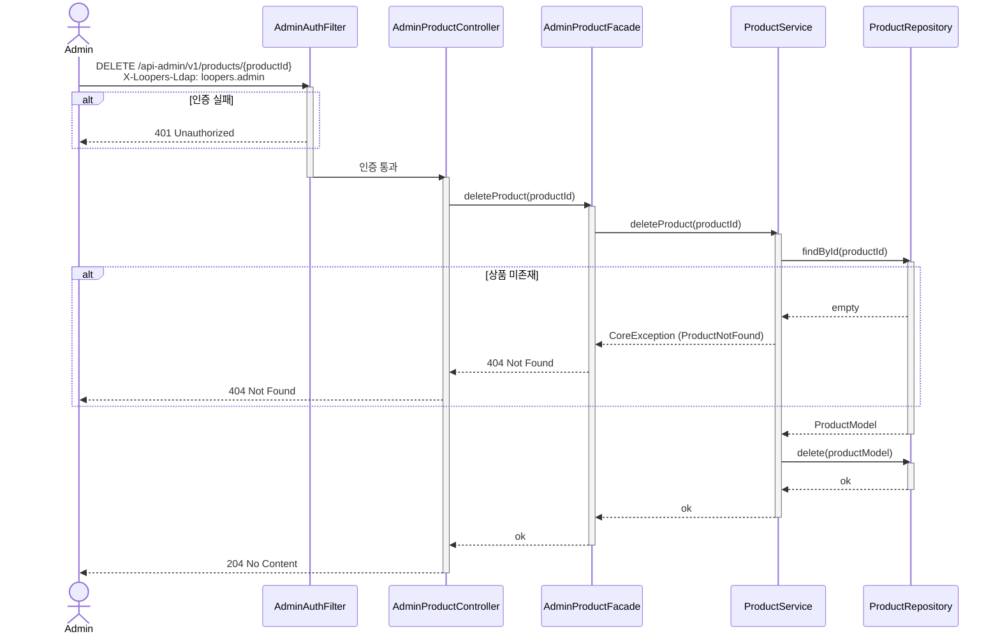
```mermaid
sequenceDiagram
    actor Admin
    participant AF as AdminAuthFilter
    participant PC as AdminProductController
    participant PF as AdminProductFacade
    participant PS as ProductService
    participant PR as ProductRepository

    Admin->>AF: DELETE /api-admin/v1/products/{productId}<br/>X-Loopers-Ldap: loopers.admin
    activate AF
    alt 인증 실패
        AF-->>Admin: 401 Unauthorized
    end
    AF->>PC: 인증 통과
    deactivate AF
    activate PC

    PC->>PF: deleteProduct(productId)
    activate PF
    PF->>PS: deleteProduct(productId)
    activate PS
    PS->>PR: findById(productId)
    activate PR
    alt 상품 미존재
        PR-->>PS: empty
        PS-->>PF: CoreException (ProductNotFound)
        PF-->>PC: 404 Not Found
        PC-->>Admin: 404 Not Found
    end
    PR-->>PS: ProductModel
    deactivate PR

    PS->>PR: delete(productModel)
    activate PR
    PR-->>PS: ok
    deactivate PR
    PS-->>PF: ok
    deactivate PS

    PF-->>PC: ok
    deactivate PF
    PC-->>Admin: 204 No Content
    deactivate PC
```

---

## 4. 좋아요

> **멱등성 정책** (`01-requirements.md` §좋아요 멱등성 정책) — **완전 멱등**  
> 좋아요는 상태 표현(Binary State Toggle)이므로 REST PUT 시맨틱을 따른다.  
> POST: 신규 시 `201 Created`, 중복 시 `200 OK` (likeCount 증분 없이 no-op)  
> DELETE: 삭제 성공 시 `204 No Content`, 미존재 시도 시 `204 No Content` (likeCount 감소 없이 no-op)  
> 자원의 최종 상태가 동일하면 동일 응답으로 처리한다.

---

### 4-1. 좋아요 등록 [어그리거트 단위]

`POST /api/v1/products/{productId}/likes` — 유저 인증  
`LikeFacade`가 `LikeService`(Like 생성)와 `ProductService`(likeCount 증가)를 조율한다.

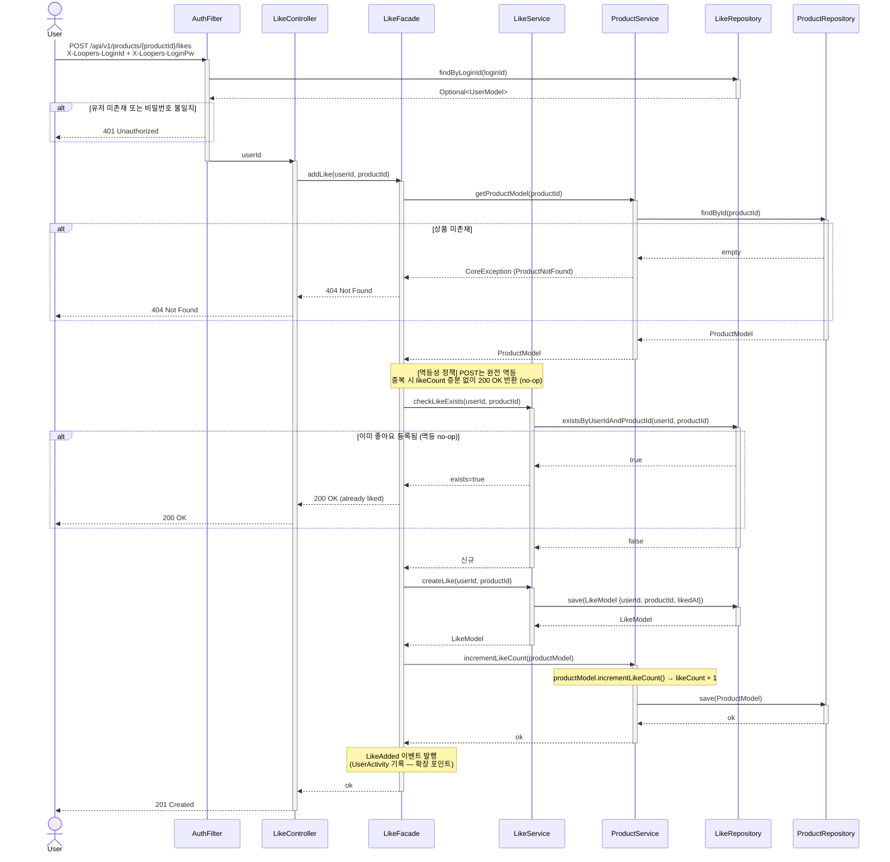
```mermaid
sequenceDiagram
    actor User
    participant AF as AuthFilter
    participant LC as LikeController
    participant LF as LikeFacade
    participant LS as LikeService
    participant PS as ProductService
    participant LR as LikeRepository
    participant PR as ProductRepository

    User->>AF: POST /api/v1/products/{productId}/likes<br/>X-Loopers-LoginId + X-Loopers-LoginPw
    activate AF
    AF->>LR: findByLoginId(loginId)
    activate LR
    LR-->>AF: Optional<UserModel>
    deactivate LR
    alt 유저 미존재 또는 비밀번호 불일치
        AF-->>User: 401 Unauthorized
    end
    AF->>LC: userId
    deactivate AF
    activate LC

    LC->>LF: addLike(userId, productId)
    activate LF

    LF->>PS: getProductModel(productId)
    activate PS
    PS->>PR: findById(productId)
    activate PR
    alt 상품 미존재
        PR-->>PS: empty
        PS-->>LF: CoreException (ProductNotFound)
        LF-->>LC: 404 Not Found
        LC-->>User: 404 Not Found
    end
    PR-->>PS: ProductModel
    deactivate PR
    PS-->>LF: ProductModel
    deactivate PS

    Note over LF,LS: [멱등성 정책] POST는 완전 멱등<br/>중복 시 likeCount 증분 없이 200 OK 반환 (no-op)
    LF->>LS: checkLikeExists(userId, productId)
    activate LS
    LS->>LR: existsByUserIdAndProductId(userId, productId)
    activate LR
    alt 이미 좋아요 등록됨 (멱등 no-op)
        LR-->>LS: true
        LS-->>LF: exists=true
        LF-->>LC: 200 OK (already liked)
        LC-->>User: 200 OK
    end
    LR-->>LS: false
    deactivate LR
    LS-->>LF: 신규
    deactivate LS

    LF->>LS: createLike(userId, productId)
    activate LS
    LS->>LR: save(LikeModel {userId, productId, likedAt})
    activate LR
    LR-->>LS: LikeModel
    deactivate LR
    LS-->>LF: LikeModel
    deactivate LS

    LF->>PS: incrementLikeCount(productModel)
    activate PS
    Note over PS: productModel.incrementLikeCount() → likeCount + 1
    PS->>PR: save(ProductModel)
    activate PR
    PR-->>PS: ok
    deactivate PR
    PS-->>LF: ok
    deactivate PS

    Note over LF: LikeAdded 이벤트 발행<br/>(UserActivity 기록 — 확장 포인트)

    LF-->>LC: ok
    deactivate LF
    LC-->>User: 201 Created
    deactivate LC
```

---

### 4-2. 좋아요 취소 [어그리거트 단위]

`DELETE /api/v1/products/{productId}/likes` — 유저 인증  
`LikeFacade`가 `LikeService`(Like 삭제)와 `ProductService`(likeCount 감소)를 조율한다.

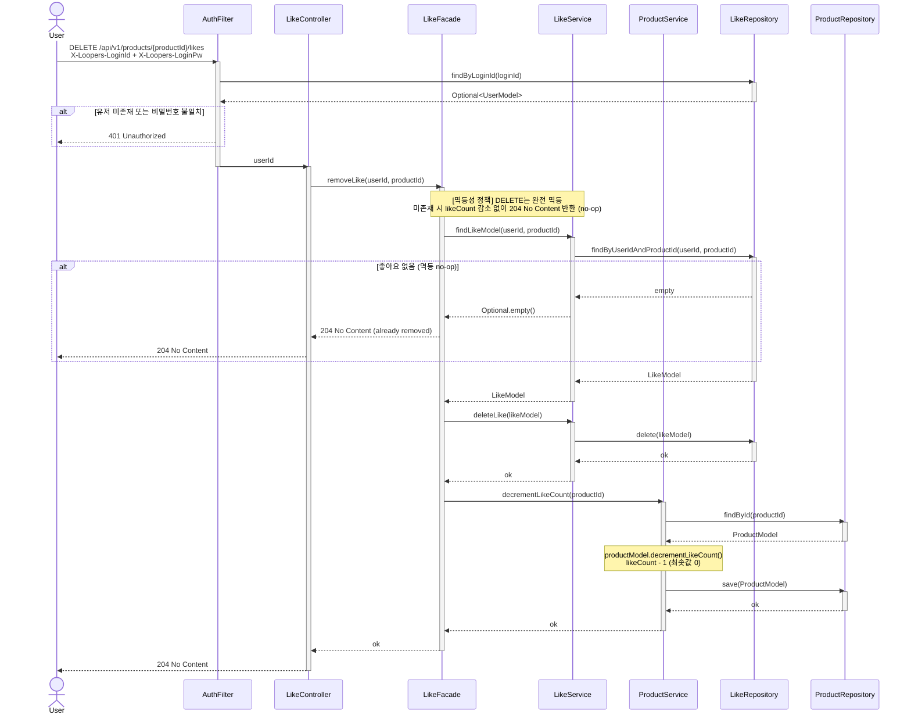
```mermaid
sequenceDiagram
    actor User
    participant AF as AuthFilter
    participant LC as LikeController
    participant LF as LikeFacade
    participant LS as LikeService
    participant PS as ProductService
    participant LR as LikeRepository
    participant PR as ProductRepository

    User->>AF: DELETE /api/v1/products/{productId}/likes<br/>X-Loopers-LoginId + X-Loopers-LoginPw
    activate AF
    AF->>LR: findByLoginId(loginId)
    activate LR
    LR-->>AF: Optional<UserModel>
    deactivate LR
    alt 유저 미존재 또는 비밀번호 불일치
        AF-->>User: 401 Unauthorized
    end
    AF->>LC: userId
    deactivate AF
    activate LC

    LC->>LF: removeLike(userId, productId)
    activate LF

    Note over LF,LS: [멱등성 정책] DELETE는 완전 멱등<br/>미존재 시 likeCount 감소 없이 204 No Content 반환 (no-op)
    LF->>LS: findLikeModel(userId, productId)
    activate LS
    LS->>LR: findByUserIdAndProductId(userId, productId)
    activate LR
    alt 좋아요 없음 (멱등 no-op)
        LR-->>LS: empty
        LS-->>LF: Optional.empty()
        LF-->>LC: 204 No Content (already removed)
        LC-->>User: 204 No Content
    end
    LR-->>LS: LikeModel
    deactivate LR
    LS-->>LF: LikeModel
    deactivate LS

    LF->>LS: deleteLike(likeModel)
    activate LS
    LS->>LR: delete(likeModel)
    activate LR
    LR-->>LS: ok
    deactivate LR
    LS-->>LF: ok
    deactivate LS

    LF->>PS: decrementLikeCount(productId)
    activate PS
    PS->>PR: findById(productId)
    activate PR
    PR-->>PS: ProductModel
    deactivate PR
    Note over PS: productModel.decrementLikeCount()<br/>likeCount - 1 (최솟값 0)
    PS->>PR: save(ProductModel)
    activate PR
    PR-->>PS: ok
    deactivate PR
    PS-->>LF: ok
    deactivate PS

    LF-->>LC: ok
    deactivate LF
    LC-->>User: 204 No Content
    deactivate LC
```

---

### 4-3. 좋아요 상품 목록 조회 [로직 단위]

`GET /api/v1/users/{userId}/likes` — 유저 인증, R4: 본인 것만 조회 가능

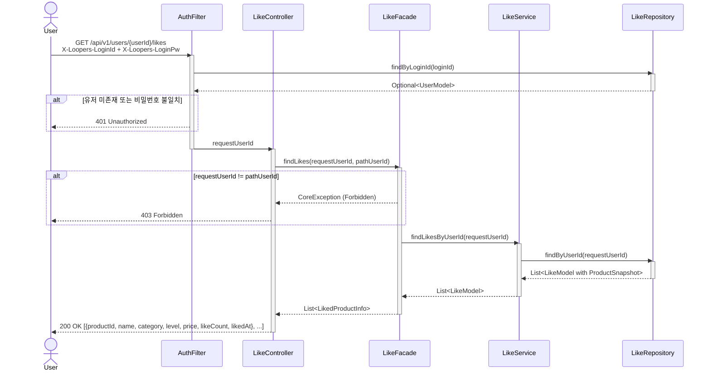
```mermaid
sequenceDiagram
    actor User
    participant AF as AuthFilter
    participant LC as LikeController
    participant LF as LikeFacade
    participant LS as LikeService
    participant LR as LikeRepository

    User->>AF: GET /api/v1/users/{userId}/likes<br/>X-Loopers-LoginId + X-Loopers-LoginPw
    activate AF
    AF->>LR: findByLoginId(loginId)
    activate LR
    LR-->>AF: Optional<UserModel>
    deactivate LR
    alt 유저 미존재 또는 비밀번호 불일치
        AF-->>User: 401 Unauthorized
    end
    AF->>LC: requestUserId
    deactivate AF
    activate LC

    LC->>LF: findLikes(requestUserId, pathUserId)
    activate LF

    alt requestUserId != pathUserId
        LF-->>LC: CoreException (Forbidden)
        LC-->>User: 403 Forbidden
    end

    LF->>LS: findLikesByUserId(requestUserId)
    activate LS
    LS->>LR: findByUserId(requestUserId)
    activate LR
    LR-->>LS: List<LikeModel with ProductSnapshot>
    deactivate LR
    LS-->>LF: List<LikeModel>
    deactivate LS

    LF-->>LC: List<LikedProductInfo>
    deactivate LF
    LC-->>User: 200 OK [{productId, name, category, level, price, likeCount, likedAt}, ...]
    deactivate LC
```

---

## 5. 주문 — 대고객

### 5-1. 주문 요청 [어그리거트 단위]

`POST /api/v1/orders` — 유저 인증  
`OrderFacade`가 `ProductService`(재고 확인·차감)와 `OrderService`(주문 생성)를 3단계로 조율한다.

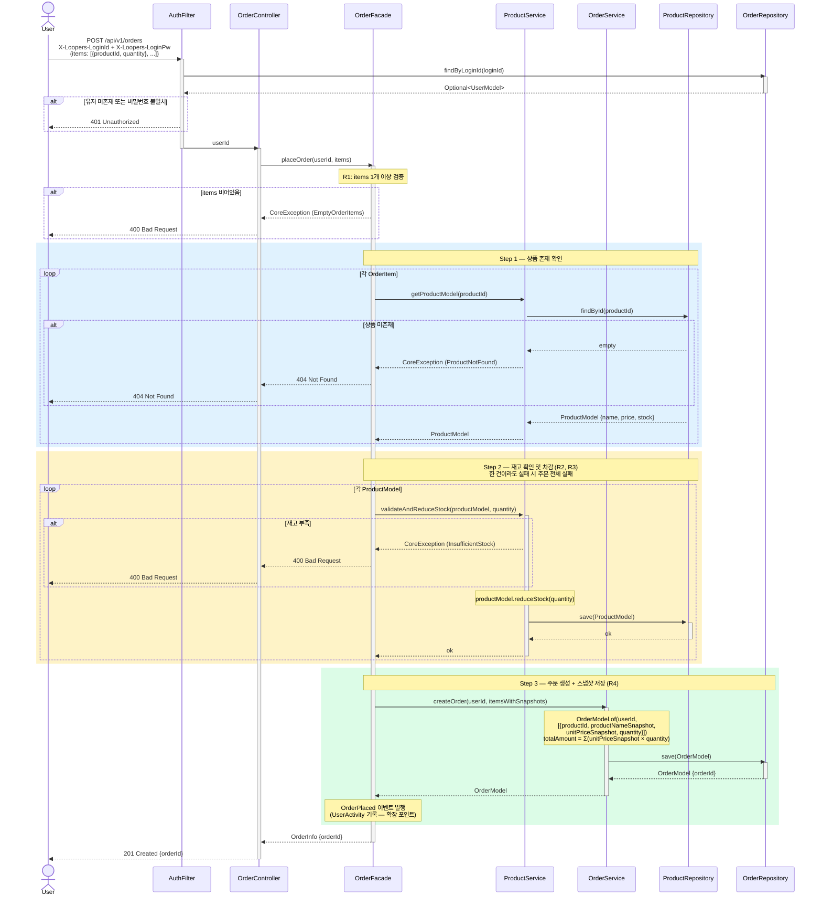
```mermaid
sequenceDiagram
    actor User
    participant AF as AuthFilter
    participant OC as OrderController
    participant OF as OrderFacade
    participant PS as ProductService
    participant OS as OrderService
    participant PR as ProductRepository
    participant OR as OrderRepository

    User->>AF: POST /api/v1/orders<br/>X-Loopers-LoginId + X-Loopers-LoginPw<br/>{items: [{productId, quantity}, ...]}
    activate AF
    AF->>OR: findByLoginId(loginId)
    activate OR
    OR-->>AF: Optional<UserModel>
    deactivate OR
    alt 유저 미존재 또는 비밀번호 불일치
        AF-->>User: 401 Unauthorized
    end
    AF->>OC: userId
    deactivate AF
    activate OC

    OC->>OF: placeOrder(userId, items)
    activate OF

    Note over OF: R1: items 1개 이상 검증
    alt items 비어있음
        OF-->>OC: CoreException (EmptyOrderItems)
        OC-->>User: 400 Bad Request
    end

    rect rgb(224, 242, 254)
        Note over OF,PR: Step 1 — 상품 존재 확인
        loop 각 OrderItem
            OF->>PS: getProductModel(productId)
            activate PS
            PS->>PR: findById(productId)
            activate PR
            alt 상품 미존재
                PR-->>PS: empty
                PS-->>OF: CoreException (ProductNotFound)
                OF-->>OC: 404 Not Found
                OC-->>User: 404 Not Found
            end
            PR-->>PS: ProductModel {name, price, stock}
            PS-->>OF: ProductModel
        end
    end

    rect rgb(254, 243, 199)
        Note over OF,PR: Step 2 — 재고 확인 및 차감 (R2, R3)<br/>한 건이라도 실패 시 주문 전체 실패
        loop 각 ProductModel
            OF->>PS: validateAndReduceStock(productModel, quantity)
            activate PS
            alt 재고 부족
                PS-->>OF: CoreException (InsufficientStock)
                OF-->>OC: 400 Bad Request
                OC-->>User: 400 Bad Request
            end
            Note over PS: productModel.reduceStock(quantity)
            PS->>PR: save(ProductModel)
            activate PR
            PR-->>PS: ok
            deactivate PR
            PS-->>OF: ok
            deactivate PS
        end
    end

    rect rgb(220, 252, 231)
        Note over OF,OR: Step 3 — 주문 생성 + 스냅샷 저장 (R4)
        OF->>OS: createOrder(userId, itemsWithSnapshots)
        activate OS
        Note over OS: OrderModel.of(userId,<br/>  [{productId, productNameSnapshot,<br/>    unitPriceSnapshot, quantity}])<br/>totalAmount = Σ(unitPriceSnapshot × quantity)
        OS->>OR: save(OrderModel)
        activate OR
        OR-->>OS: OrderModel {orderId}
        deactivate OR
        OS-->>OF: OrderModel
        deactivate OS

        Note over OF: OrderPlaced 이벤트 발행<br/>(UserActivity 기록 — 확장 포인트)
    end

    OF-->>OC: OrderInfo {orderId}
    deactivate OF
    OC-->>User: 201 Created {orderId}
    deactivate OC
```

---

### 5-2. 주문 목록 조회 [로직 단위]

`GET /api/v1/orders?startAt=...&endAt=...` — 유저 인증, R5·R6: 본인 주문·날짜 범위 필터

```mermaid
sequenceDiagram
    actor User
    participant AF as AuthFilter
    participant OC as OrderController
    participant OF as OrderFacade
    participant OS as OrderService
    participant OR as OrderRepository

    User->>AF: GET /api/v1/orders?startAt=2026-01-31&endAt=2026-02-10<br/>X-Loopers-LoginId + X-Loopers-LoginPw
    activate AF
    AF->>OR: findByLoginId(loginId)
    activate OR
    OR-->>AF: Optional<UserModel>
    deactivate OR
    alt 유저 미존재 또는 비밀번호 불일치
        AF-->>User: 401 Unauthorized
    end
    AF->>OC: userId
    deactivate AF
    activate OC

    OC->>OF: findOrders(userId, startAt, endAt)
    activate OF
    OF->>OS: findOrders(userId, startAt, endAt)
    activate OS

    Note over OS: R5: userId로 본인 주문만 필터링<br/>R6: startAt ~ endAt 날짜 범위 적용
    OS->>OR: findByUserIdAndOrderedAtBetween(userId, startAt, endAt)
    activate OR
    OR-->>OS: List<OrderModel>
    deactivate OR
    OS-->>OF: List<OrderModel>
    deactivate OS

    OF-->>OC: List<OrderSummaryInfo>
    deactivate OF
    OC-->>User: 200 OK [{orderId, totalAmount, status, orderedAt, itemCount}, ...]
    deactivate OC
```

---

### 5-3. 주문 상세 조회 [로직 단위]

`GET /api/v1/orders/{orderId}` — 유저 인증, R5: 본인 주문만 조회 가능

```mermaid
sequenceDiagram
    actor User
    participant AF as AuthFilter
    participant OC as OrderController
    participant OF as OrderFacade
    participant OS as OrderService
    participant OR as OrderRepository

    User->>AF: GET /api/v1/orders/{orderId}<br/>X-Loopers-LoginId + X-Loopers-LoginPw
    activate AF
    AF->>OR: findByLoginId(loginId)
    activate OR
    OR-->>AF: Optional<UserModel>
    deactivate OR
    alt 유저 미존재 또는 비밀번호 불일치
        AF-->>User: 401 Unauthorized
    end
    AF->>OC: userId
    deactivate AF
    activate OC

    OC->>OF: getOrder(userId, orderId)
    activate OF
    OF->>OS: getOrderModel(orderId)
    activate OS
    OS->>OR: findById(orderId)
    activate OR
    alt 주문 미존재
        OR-->>OS: empty
        OS-->>OF: CoreException (OrderNotFound)
        OF-->>OC: 404 Not Found
        OC-->>User: 404 Not Found
    end
    OR-->>OS: OrderModel {userId, items[]}
    deactivate OR
    OS-->>OF: OrderModel
    deactivate OS

    alt orderModel.userId != requestUserId
        OF-->>OC: CoreException (Forbidden)
        OC-->>User: 403 Forbidden
    end

    OF-->>OC: OrderDetailInfo
    deactivate OF
    OC-->>User: 200 OK {orderId, totalAmount, status, orderedAt,<br/>items: [{productId, productNameSnapshot, unitPriceSnapshot, quantity}]}
    deactivate OC
```

---

## 6. 주문 — 어드민

### 6-1. 전체 주문 목록 조회 [로직 단위]

`GET /api-admin/v1/orders?page=0&size=20` — 어드민 인증, R7: 관리자만 전체 조회 가능

```mermaid
sequenceDiagram
    actor Admin
    participant AF as AdminAuthFilter
    participant OC as AdminOrderController
    participant OF as AdminOrderFacade
    participant OS as OrderService
    participant OR as OrderRepository

    Admin->>AF: GET /api-admin/v1/orders?page=0&size=20<br/>X-Loopers-Ldap: loopers.admin
    activate AF
    alt 인증 실패
        AF-->>Admin: 401 Unauthorized
    end
    AF->>OC: 인증 통과
    deactivate AF
    activate OC

    OC->>OF: findAllOrders(pageable)
    activate OF
    OF->>OS: findAllOrders(pageable)
    activate OS

    Note over OS: userId 필터 없음 — 전체 주문 조회
    OS->>OR: findAll(pageable)
    activate OR
    OR-->>OS: Page<OrderModel>
    deactivate OR
    OS-->>OF: Page<OrderModel>
    deactivate OS

    OF-->>OC: Page<AdminOrderSummaryInfo>
    deactivate OF
    OC-->>Admin: 200 OK {content[], totalElements, totalPages}
    deactivate OC
```

---

### 6-2. 주문 상세 조회 (어드민) [로직 단위]

`GET /api-admin/v1/orders/{orderId}` — 어드민 인증, 유저 소유권 확인 없음

```mermaid
sequenceDiagram
    actor Admin
    participant AF as AdminAuthFilter
    participant OC as AdminOrderController
    participant OF as AdminOrderFacade
    participant OS as OrderService
    participant OR as OrderRepository

    Admin->>AF: GET /api-admin/v1/orders/{orderId}<br/>X-Loopers-Ldap: loopers.admin
    activate AF
    alt 인증 실패
        AF-->>Admin: 401 Unauthorized
    end
    AF->>OC: 인증 통과
    deactivate AF
    activate OC

    OC->>OF: getOrder(orderId)
    activate OF
    OF->>OS: getOrderModel(orderId)
    activate OS
    OS->>OR: findById(orderId)
    activate OR
    alt 주문 미존재
        OR-->>OS: empty
        OS-->>OF: CoreException (OrderNotFound)
        OF-->>OC: 404 Not Found
        OC-->>Admin: 404 Not Found
    end
    OR-->>OS: OrderModel
    deactivate OR
    OS-->>OF: OrderModel
    deactivate OS

    Note over OF: 어드민은 userId 소유권 확인 없이 모든 주문 조회 가능

    OF-->>OC: AdminOrderDetailInfo
    deactivate OF
    OC-->>Admin: 200 OK {orderId, userId, totalAmount, status, orderedAt,<br/>items: [{productId, productNameSnapshot, unitPriceSnapshot, quantity}]}
    deactivate OC
```

---

## 7. 결제

### 7-1. 결제 요청 [어그리거트 단위]

`POST /api/v1/orders/{orderId}/payments` — 유저 인증 필요

> 주문 생성(`POST /api/v1/orders`) 이후 별도로 호출한다.  
> PENDING → 결제 성공 시 CONFIRMED, 실패 시 CANCELLED(재고 복구).

```mermaid
sequenceDiagram
    actor Client
    participant AF as UserAuthFilter
    participant PC as PaymentController
    participant PF as PaymentFacade
    participant OS as OrderService
    participant PayS as PaymentService
    participant PG as PaymentGateway
    participant ProdS as ProductService
    participant OR as OrderRepository
    participant ProdR as ProductRepository

    Client->>AF: POST /api/v1/orders/{orderId}/payments<br/>X-Loopers-LoginId/Pw + {paymentMethod, amount}
    activate AF
    alt 인증 실패
        AF-->>Client: 401 Unauthorized
    end
    AF->>PC: 인증 통과 (userId)
    deactivate AF
    activate PC

    PC->>PF: pay(userId, orderId, paymentMethod, amount)
    activate PF

    PF->>OS: getOrderModel(orderId)
    activate OS
    OS->>OR: findById(orderId)
    activate OR
    alt 주문 미존재
        OR-->>OS: empty
        OS-->>PF: CoreException (OrderNotFound)
        PF-->>PC: 예외 전파
        PC-->>Client: 404 Not Found
    end
    OR-->>OS: OrderModel
    deactivate OR
    OS-->>PF: OrderModel
    deactivate OS

    alt 타인 주문 접근 (orderModel.userId ≠ userId)
        PF-->>PC: CoreException (Forbidden)
        PC-->>Client: 403 Forbidden
    else 주문 상태가 PENDING 아님
        PF-->>PC: CoreException (InvalidOrderStatus)
        PC-->>Client: 400 Bad Request
    else amount ≠ orderModel.totalAmount
        PF-->>PC: CoreException (AmountMismatch)
        PC-->>Client: 400 Bad Request
    end

    PF->>PayS: processPayment(paymentMethod, amount)
    activate PayS
    PayS->>PG: 외부 PG API 호출
    activate PG
    PG-->>PayS: PG 응답 (성공 / 실패)
    deactivate PG
    PayS-->>PF: PaymentResult
    deactivate PayS

    alt PG 결제 실패
        PF->>OS: cancelOrder(orderModel)
        OS->>ProdS: restoreStock(orderItems)
        ProdS->>ProdR: save — stock += quantity (항목별)
        ProdR-->>ProdS: ok
        ProdS-->>OS: 재고 복구 완료
        OS->>OR: save — status=CANCELLED
        OR-->>OS: ok
        OS-->>PF: 완료
        PF-->>PC: CoreException (PaymentFailed)
        PC-->>Client: 400 Bad Request
    end

    Note over PF,OS: PG 성공 경로 — 주문 상태 확정
    PF->>OS: confirmOrder(orderModel)
    activate OS
    OS->>OR: save — status=CONFIRMED
    activate OR
    OR-->>OS: OrderModel
    deactivate OR
    OS-->>PF: OrderModel
    deactivate OS

    PF-->>PC: PaymentResultInfo {orderId, status, paidAmount}
    deactivate PF
    PC-->>Client: 200 OK {orderId, status: CONFIRMED, paidAmount}
    deactivate PC
```
