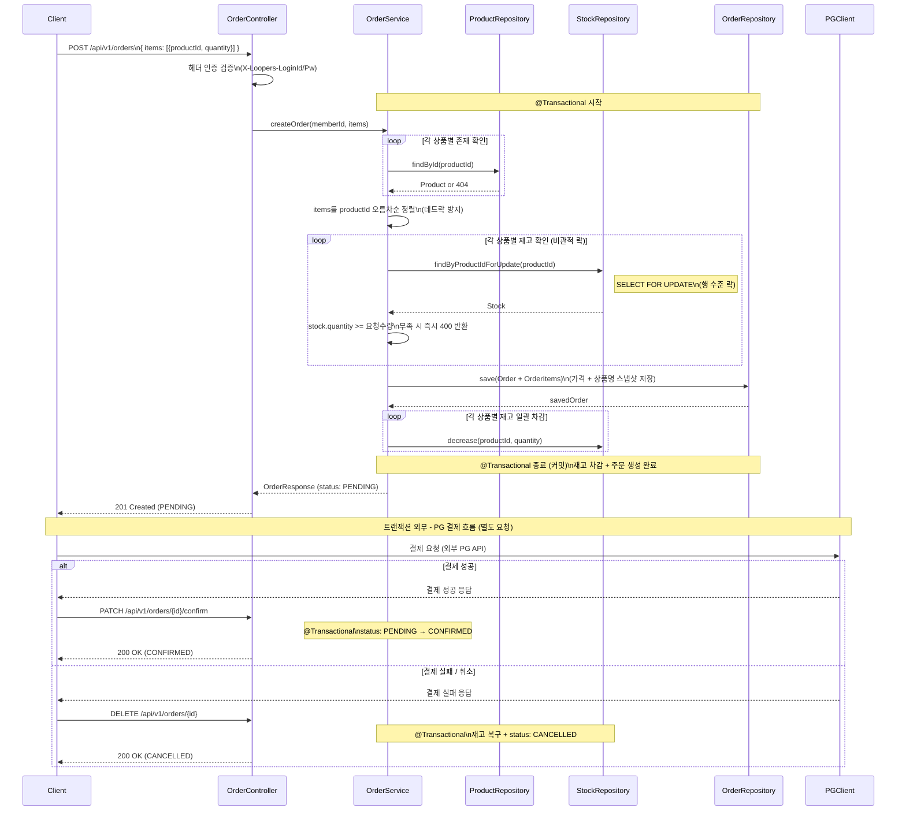
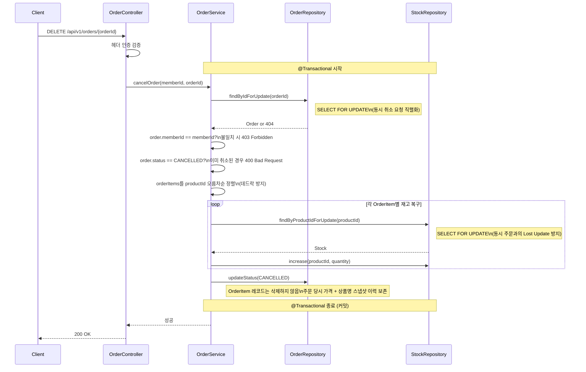
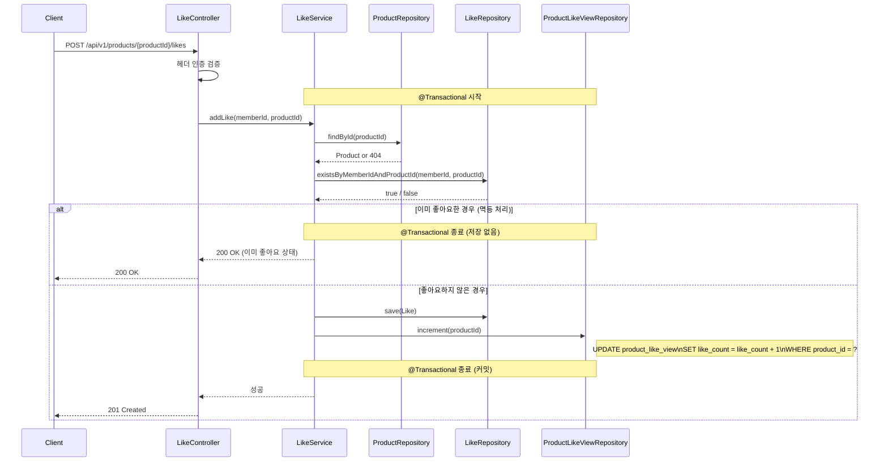
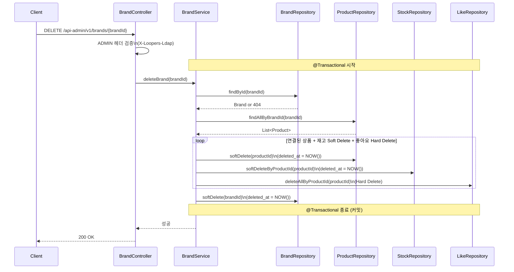

# 02. 시퀀스 다이어그램

> 작성일: 2026-05-21
> 아키텍처: Controller → ApplicationService → Domain → Repository
> 트랜잭션 경계는 `@Transactional` 범위로 표시

---

## 다이어그램 목록

| # | 유스케이스 | 핵심 포인트 |
|---|-----------|------------|
| SD-01 | 주문 생성 | 전체 재고 검증 → 일괄 차감, 비관적 락, 단일 트랜잭션 |
| SD-02 | 주문 취소 | 재고 복구 + 상태 변경 단일 트랜잭션, 본인 확인 |
| SD-03 | 좋아요 등록 | likeCount 동기화, 중복 방지 |
| SD-04 | 브랜드 삭제 | 연쇄 Soft Delete (브랜드 → 상품 → 재고), 좋아요 Hard Delete |

---

## SD-01. 주문 생성

### 왜 이 다이어그램이 필요한가?
주문 생성은 이 시스템에서 가장 복잡한 흐름입니다.
- 여러 상품의 재고를 **전체 검증 후 일괄 차감**하는 순서가 중요하고
- **비관적 락**이 어느 시점에 걸리는지
- **트랜잭션 경계**가 어디서 시작해서 어디서 끝나는지를 확인합니다.

### 검증 포인트
- 재고 검증 실패 시 차감 없이 즉시 롤백되는가?
- Order 생성과 재고 차감이 같은 트랜잭션 안에 있는가?

### 읽는 포인트
1. 트랜잭션 범위는 재고 차감 + 주문 생성으로만 묶었습니다. PG 호출은 트랜잭션 밖이라 PG가 느려도 DB 락을 잡지 않습니다.
2. 주문 생성(PENDING)과 결제 확정(CONFIRMED)은 완전히 분리된 요청입니다. 비즈니스적으로는 하나의 흐름이지만 트랜잭션은 두 개입니다.
3. 결제 실패 시 주문 취소 API를 호출해 재고를 복구합니다. SAGA 패턴의 보상 트랜잭션입니다.
4. 재고 조회 시점에 SELECT FOR UPDATE로 락을 잡아 동시 주문 시 정합성을 보장합니다.

### 잠재 리스크
- 결제 성공 후 클라이언트가 confirm API를 호출하지 않으면 재고 차감된 채 PENDING으로 영구 방치 → 일정 시간 후 자동 취소 배치 처리로 해결 필요
- 결제 실패 후 클라이언트가 취소 API를 호출하지 않으면 재고가 영구 차감된 채 PENDING으로 남음 → 동일하게 배치 처리로 해결
- 현재 B 방식(Client가 confirm 호출)은 클라이언트 신뢰에 의존 → 추후 실제 PG 연동 시 아래 Webhook 방식으로 교체 예정
  - PG가 결제 성공/실패 시 `POST /api/v1/payments/webhook` 자동 호출
  - 서버가 Webhook 수신 후 주문 상태 자동 변경 (Client 개입 없음)
  - Webhook 유실 대비 PENDING 자동 취소 배치는 동일하게 유지
- 상품 수가 많을수록 락 보유 시간이 길어져 동시성 저하 가능
- 여러 상품 주문 시 락 획득 순서가 다르면 데드락 발생 가능 → productId 오름차순 정렬 후 순서대로 락 획득으로 방지

---

## SD-02. 주문 취소

### 왜 이 다이어그램이 필요한가?
주문 취소는 **재고 복구**와 **상태 변경**이 반드시 원자적으로 처리되어야 합니다.
- 상태는 바뀌었는데 재고가 안 돌아오는 상황을 막아야 하고
- **본인 주문 확인** 책임이 어느 레이어에 있는지를 확인합니다.

### 검증 포인트
- 재고 복구와 상태 변경이 같은 트랜잭션 안에 있는가?
- 타인 주문 접근 시 403이 올바르게 반환되는가?

### 읽는 포인트
1. 본인 확인은 Controller가 아닌 Service에서 memberId를 비교합니다. 비즈니스 규칙은 도메인 레이어에 가깝게 둡니다.
2. 재고 복구 먼저, 상태 변경 나중 순서입니다. 둘 다 같은 트랜잭션이라 순서는 무관하지만 의도를 명확히 합니다.
3. 상태 체크는 CANCELLED 여부만 확인해 PENDING / CONFIRMED 모두 취소 가능합니다.
4. 취소해도 OrderItem 레코드는 삭제하지 않습니다. Order 상태만 CANCELLED로 변경합니다. "취소한 주문도 당시 상품명/가격을 조회할 수 있어야 한다"는 비즈니스 요구사항 때문입니다.

### 잠재 리스크
- 재고 복구 후 상태 변경 사이에 장애 발생 시 → 트랜잭션 롤백으로 자동 복구
- 동시 취소 요청 (클라이언트 + 자동 배치) → Order 조회 시 `SELECT FOR UPDATE`로 직렬화하여 이중 재고 복구 방지
- 취소 중 다른 주문과 동일 재고 동시 접근 → Stock 조회 시 `SELECT FOR UPDATE`로 Lost Update 방지 (JPA read-modify-write 패턴 특성)

---

## SD-03. 좋아요 등록

### 왜 이 다이어그램이 필요한가?
좋아요는 단순해 보이지만 **product_like_view 동기화** 책임이 숨어 있습니다.
- Like 저장과 product_like_view.like_count +1이 같은 트랜잭션인지
- 중복 좋아요 방지 로직의 위치를 확인합니다.

### 검증 포인트
- Like 저장과 like_count 증가가 같은 트랜잭션 안에 있는가?
- 이미 좋아요한 상품에 재등록 시 200으로 멱등 처리되는가?

### 읽는 포인트
1. Like 저장과 like_count +1은 단일 트랜잭션입니다. 둘 중 하나가 실패하면 전체 롤백되어 카운트 불일치를 방지합니다.
2. `product_like_view`는 좋아요 연산만 접근하는 전용 테이블이라, `products` 테이블과 락 경합이 발생하지 않습니다.
3. 동시 좋아요 요청이 몰릴 경우 like_count가 순간적으로 정확하지 않을 수 있습니다. 정렬 참고용 수치이므로 소폭 오차는 허용합니다.
4. 중복 체크는 Service 레이어에서 DB 조회로 확인합니다.

### 잠재 리스크
- 동시에 같은 사용자가 동일 상품에 좋아요를 2번 요청하면 둘 다 existsByMemberIdAndProductId 체크를 통과할 수 있음 → DB Unique 제약(member_id + product_id)으로 하나만 저장되고 나머지는 예외 발생. 멱등 처리로 재시도는 안전하게 200 반환

---

## SD-04. 브랜드 삭제

### 왜 이 다이어그램이 필요한가?
브랜드 삭제는 **연쇄 Soft Delete** 로직이 핵심입니다.
- 브랜드와 연결된 모든 상품이 함께 Soft Delete되어야 하고
- 이 과정이 단일 트랜잭션 안에서 처리되는지 확인합니다.

### 검증 포인트
- 브랜드 삭제와 상품 연쇄 삭제가 같은 트랜잭션 안에 있는가?
- 상품 삭제 후 브랜드 삭제 순서인가, 반대인가?

### 읽는 포인트
1. 연결된 상품을 먼저 삭제한 후 브랜드를 삭제합니다. 순서를 지켜 데이터 정합성을 유지합니다.
2. 상품 10개 삭제 중 실패하면 브랜드도, 나머지 상품도 모두 롤백됩니다.
3. `deleted_at`만 채우므로 기존 주문 내역에서 상품명 조회는 여전히 가능합니다.
4. 상품 삭제 시 연결된 좋아요는 Hard Delete합니다. 브랜드 재입점 시 좋아요가 초기화되는 것을 의도한 설계입니다.

### 잠재 리스크
- 연결된 상품이 매우 많을 경우 트랜잭션이 길어져 성능 저하 가능 → 배치 처리나 비동기 이벤트 방식으로 전환 가능 (현재 범위에서는 단일 트랜잭션으로 충분)
- Like Hard Delete로 인해 브랜드 재입점 시 기존 좋아요 이력 복구 불가 (의도된 정책)
