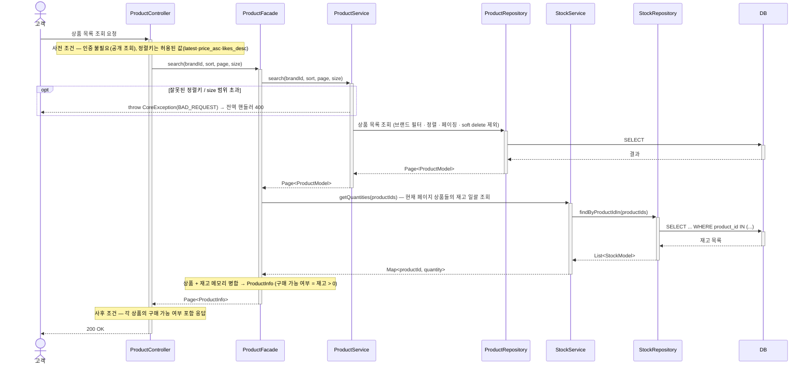
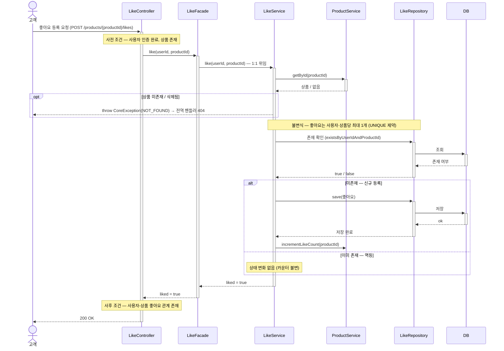
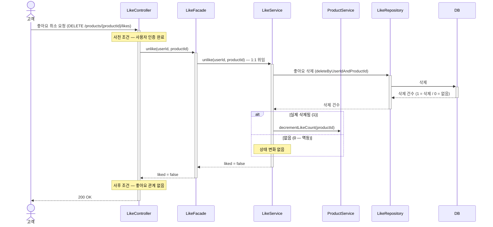
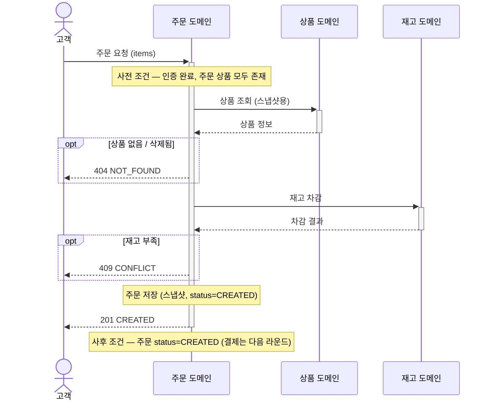
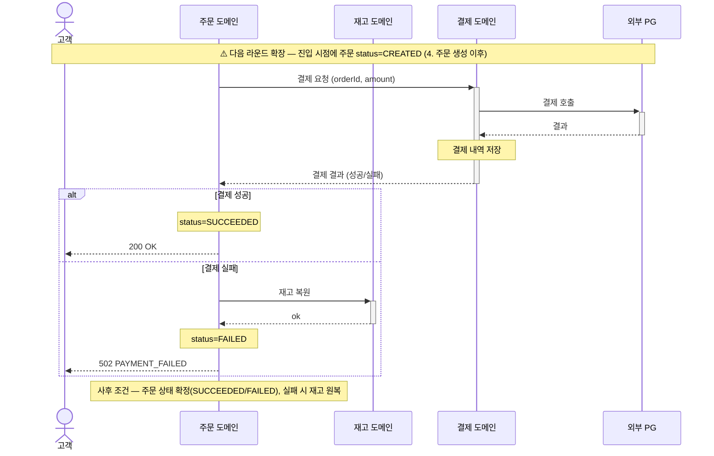

# 02. 시퀀스 다이어그램

## 시퀀스다이어그램 표기 규칙

- **사전 조건 · 불변식 · 사후 조건은 해당 흐름에 *실재할 때만* 표기**한다 (없으면 누락이 아니라 그 조건이 없다는 뜻). **사전 조건은 진입점(Controller; 도메인 단위 다이어그램이면 진입 도메인)에, 사후 조건은 응답 직전에** 둔다 — 흐름 중간이 아니라 *경계*에 둬야 계약이 또렷하다. 불변식은 강제되는 지점(흐름 중간)에 둔다. 예: 조회(읽기)는 상태 변경이 없어 불변식을 표기하지 않는다.
- **예외**는 도메인이 `throw`하고 전역 핸들러(`@RestControllerAdvice`)가 HTTP 상태로 변환한다.
- **추상화 레벨은 다이어그램의 *의도*에 맞춘다. 참여자 수는 그 방아쇠다** — 참여자가 많아 핵심이 묻히면 *도메인 단위*로 올리고, 단일 도메인 흐름이면 *레이어드*(Controller/Service/Repository/DB)로 내린다. 단 둘이 충돌하면(참여자가 적어도 크로스 도메인 책임이 핵심이거나, 많아도 레이어 책임이 핵심) **의도가 이긴다**.
- **한 다이어그램 안에서는 추상화 레벨을 통일**한다. 레이어드 흐름에서는 *주 도메인*의 Repository→DB까지 표기하고, *다른 도메인의 협력 Service*는 블랙박스(Service 호출까지만)로 둔다 — 일부만 DB까지 내려가면 잘못된 강조가 생긴다. **단 협력 도메인의 DB 접근 자체가 흐름의 핵심이면(예: 상품 목록 조회의 재고 일괄 조회) 그 도메인도 Repository→DB까지 펼쳐 대칭을 맞춘다** — 핵심을 블랙박스로 가리면 오히려 잘못된 강조가 된다.
- 각 다이어그램 상단에 **추상화 레벨 라벨**(`도메인 단위` / `레이어드 아키텍처`)을 붙인다. 도메인 단위일 때는 도메인↔레이어 매핑도 한 줄 적는다.
- **01 요구사항의 상태 전이와 02 시퀀스의 종료 상태가 일치해야 한다** — 주문 생성 primary 다이어그램은 `status=CREATED`로 끝낸다. 결제 성공/실패(`SUCCEEDED`/`FAILED`) 분기는 본 라운드 미구현이므로 별도 *확장 다이어그램*으로 분리한다.

---

## 1. 상품 목록 조회
> 추상화 레벨: **레이어드 아키텍처**

> ProductFacade가 ProductService(페이지 조회) + StockService(재고 일괄 조회)를 *조회 합성*한다 — Stock은 독립 애그리거트(D13)라 DB 조인 대신 **앱 병합**으로 경계를 지킨다. Product로 정렬·페이징을 먼저 끝내고 그 페이지의 `product_id`만 `IN`으로 조회해 N+1을 피한다. 조회 합성이라 Facade `@Transactional`은 없다(D17).

---

## 2. 좋아요 등록
> 추상화 레벨: **레이어드 아키텍처**

> 카운터 증감을 **LikeService 안**에 둔 이유(D7) — 등록·취소가 *실제 반영될 때만* 카운터를 바꾸는 **멱등 분기**가 핵심 유스케이스 흐름이라, Facade 분기 금지 규약상 Service에 둔다. `like_count`는 약한 일관성(D3)이라 Service↔Service 쓰기를 *이 카운터에 한해* 좁게 허용한다.
> 동시 등록 레이스(두 요청이 동시에 `existsBy`를 통과)는 `UNIQUE(user_id, product_id)` 위반으로 한쪽이 실패한다 — 위반 예외 처리는 동시성 라운드에서 합류(D6).

---

## 3. 좋아요 취소
> 추상화 레벨: **레이어드 아키텍처**

---

## 4. 주문 생성

> 추상화 레벨: **도메인 단위** (참여자 다수 · 크로스 도메인 협력) — 주문 도메인 = OrderFacade+OrderService, 상품/재고 = 각 Service

> 본 라운드 구현 범위는 **주문 생성·재고 차감까지**이며 주문은 `CREATED`로 종료한다(01 §4.4). 결제 호출과 성공/실패 분기는 아래 *5. 주문 결제*로 분리했다.

---

## 5. 주문 결제 (다음 라운드 확장)

> 추상화 레벨: **도메인 단위** (다음 라운드 확장) — 주문/재고/결제 = 각 Service. **본 라운드 미구현 — 흐름 합의용**

