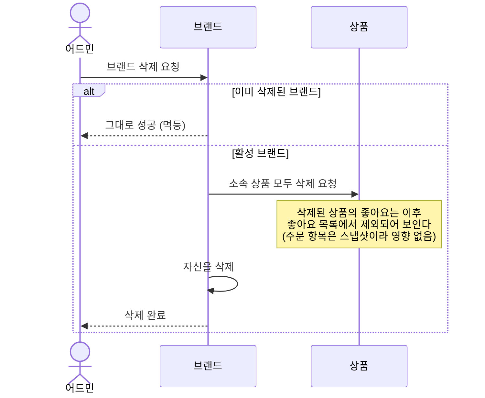
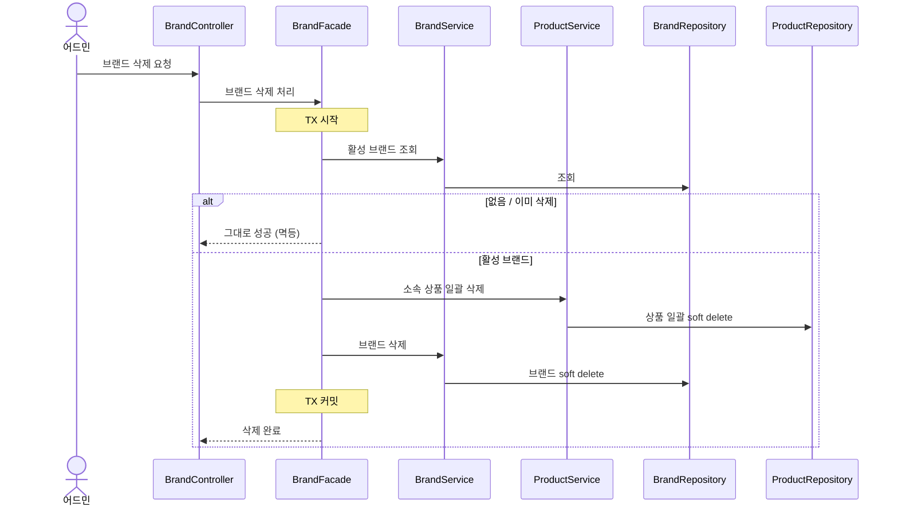
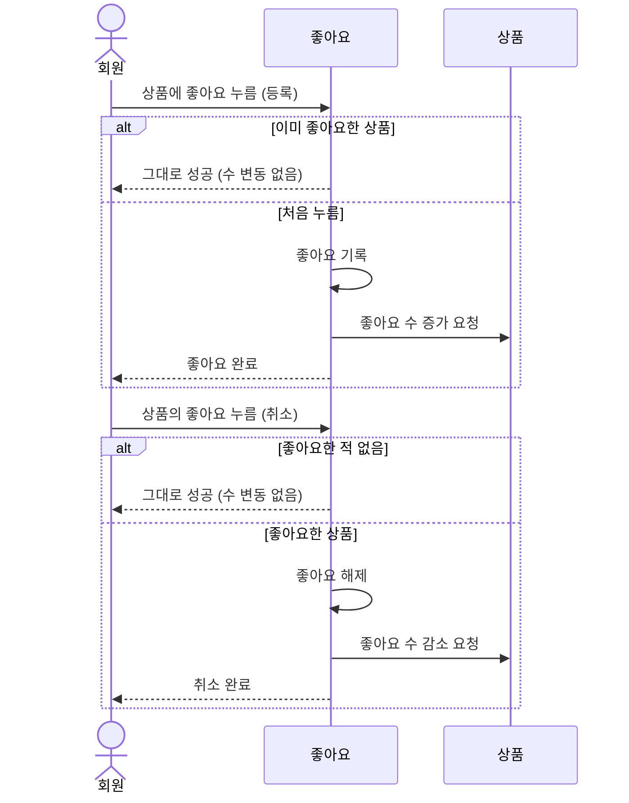
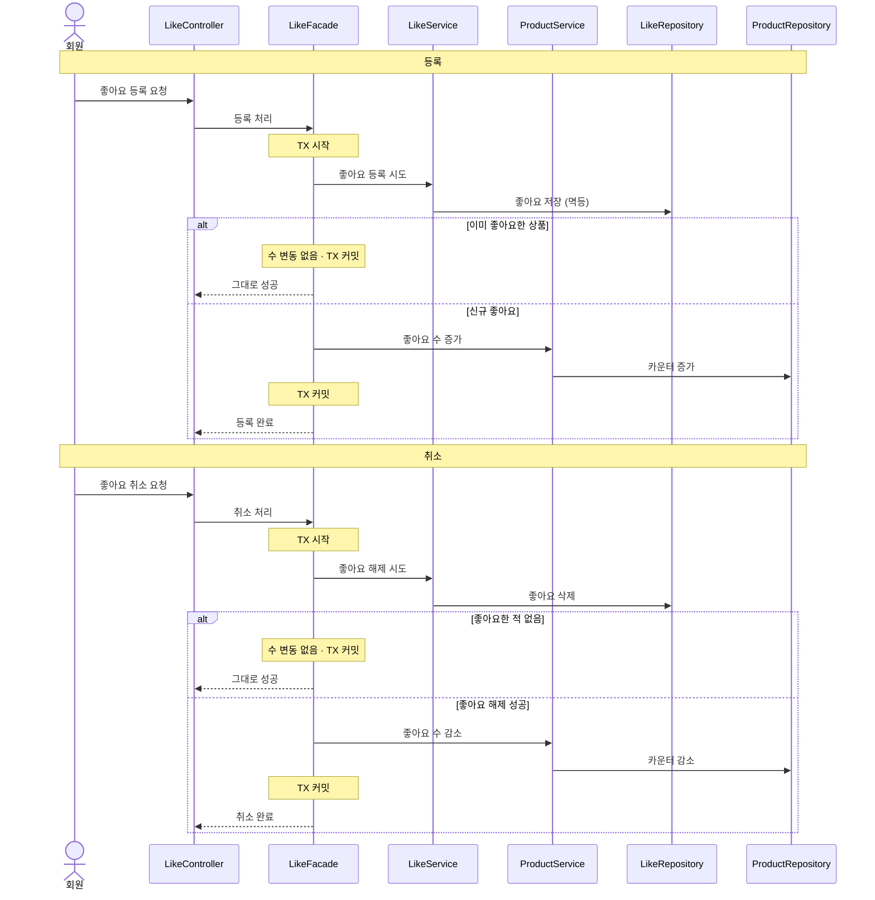
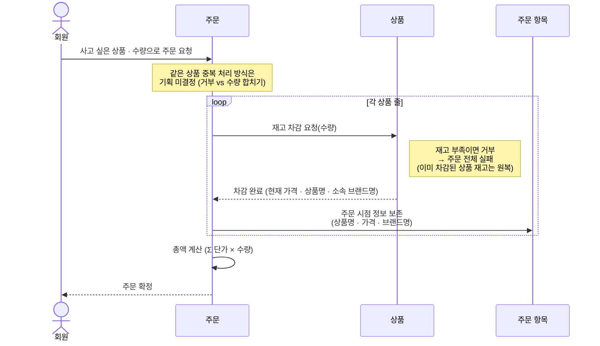
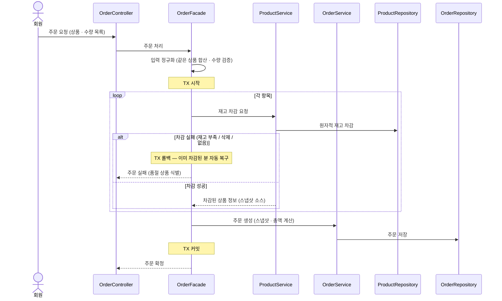

# 시퀀스 다이어그램

이 문서는 이커머스 흐름 중 **누구의 일인가·연쇄·멱등·스냅샷** 같은 비자명한 결정이 있는 것만 골라, 두 관점 — *도메인 협력* 과 *구현 결정* — 으로 함께 그린 것이다.

---

## 1. 이 다이어그램의 목적

1. **누가 무엇을 책임지는가** 를 그림 한 장으로 합의한다.
2. 코드를 보지 않고도 **흐름 구조** 를 팀 안에서 공유할 수 있게 한다.
3. **프론트엔드·백엔드·기획** 이 함께 읽을 수 있는 공통 언어가 된다.

청중은 개발자만이 아니다 — 도메인 전문가·기획자도 함께 본다. 그래서 이 문서의 **도메인 협력** 섹션은 Controller→Service→Repository 같은 관성적 위임 사슬이 아니라 **책임 분리·경계·핵심 협력 객체** 가 드러나도록 그린다. 결과적으로 코드 어휘(Controller, Service, Repository, DTO, JPA 등)는 대개 등장하지 않는데, 이는 단어 자체를 금지한 게 아니라 *관성* 을 금지한 것이다.

한편 트랜잭션 경계·동시성·실패 처리 같은 *구현 결정* 은 도메인 협력에 섞지 않고, 같은 UC 아래 별도 **구현 결정** 섹션으로 분리한다. 두 섹션은 서로 다른 청중과 다른 수명을 가진다 — 도메인 협력은 살아 있는 문서, 구현 결정은 그 시점 선택의 기록이다.

---

## 2. 작성 원칙

이 문서는 UC 당 두 종류의 시퀀스를 담는다 — **도메인 협력**(필수)과 **구현 결정**(필요 시).

### 2.1 도메인 협력 — 책임이 드러나야 한다

이 섹션의 가치는 **책임 분리·경계·핵심 협력 객체** 가 그림에 드러나는 데 있다. Controller→Service→Repository 같은 위임 사슬은 어떤 기능에도 같은 모양으로 적용되어 설계 결정을 담지 못하므로 그리지 않는다.

1. **도메인 어휘만 쓴다** — 참여자도 메시지도. 클래스명·메서드 시그니처·HTTP·DB 는 등장하지 않는다 (단어 금지가 아니라 *관성* 금지).
2. **메시지를 받는 쪽이 책임 객체** — 결정·불변식을 그 객체가 *소유* 한다. "재고 차감"이 *상품* 에게 가면 재고 불변식은 상품 책임, *주문 서비스* 에 가면 상품은 데이터 그릇으로 강등된다.
3. **비즈니스 분기만 그린다** — 재고 부족 · 멱등 · 삭제된 상품 같은 도메인 결정만. 락 재시도 · 롤백 · 이벤트 실패 같은 기술 분기는 §2.2 구현 결정 섹션에서 다룬다.

### 2.2 구현 결정 — 안전한 실행을 검증한다

도메인 협력이 합의된 뒤, *이를 어떻게 안전하게 구현하는가* 가 별개 질문으로 남는다. 청중은 백엔드 개발자, 수명은 *그 시점 선택의 기록* (ADR 톤) 이다.

1. **트랜잭션 경계·레이어 책임·조건 분기의 큰 흐름이 보여야 한다** — 그게 이 섹션이 답하는 것.
2. **SQL · 메서드명 · HTTP 상태 같은 구현 디테일은 담지 않는다** — 그건 코드의 자리. 다이어그램은 *결정의 윤곽* 까지만.
3. **레이어 사슬은 본 프로젝트 아키텍처를 따른다** — Controller → Facade → Service → Repository. 단, *비자명한 결정이 없는* UC 엔 구현 결정 섹션을 두지 않는다 (관성적 그림 금지는 여기서도 동일).
4. **정본은 도메인 협력** — 정책이 바뀌면 도메인 협력 갱신이 우선, 구현 결정은 그 변경에 맞춰 후속 갱신한다.

---

## 3. 그릴 대상 선정 기준

모든 UC 를 그리지는 않는다. 다음 중 **하나라도** 해당하는 UC만 그린다.

- 누구의 일인지 자명하지 않다 (어느 객체가 결정하는지가 토론거리)
- 동시성 · 일관성 결정이 있다
- 연쇄 효과가 있다 (한 행위가 다른 객체에 파급)
- 멱등성 · 스냅샷 같은 비자명한 불변식이 있다

단순 CRUD(등록 · 수정 · 단건 조회) 는 그리지 않는다 — 그림이 보일러플레이트가 되고, **화살표가 한 줄로 직진해 자명한 흐름은 텍스트의 분량을 늘릴 뿐 토론거리를 새로 만들지 않기 때문** 이다.

**판단 기준 한 줄**: UC 를 그렸을 때 *화살표의 방향* 이 토론거리가 되면 그릴 가치가 있고, 자명하면 그리지 않는다.

### 3.1 이번 문서에서 그린 흐름

각 흐름은 *도메인 협력* 으로 그리되, **구현 결정** 이 비자명한 경우 같은 절 안에 구현 결정 섹션을 함께 둔다 (UC 단위로 묶이지만 청중·수명은 분리).

| 흐름 | 도메인 협력을 그리는 이유 | 구현 결정 포함 |
|---|---|---|
| 브랜드 삭제 | **연쇄 효과** — 브랜드 삭제가 소속 상품 삭제까지 보장해야 한다. "브랜드 없는 상품" 불변식의 주인이 누구인지 결정 필요 | ✅ 두 애그리거트를 한 TX 에 묶는 *의도적 예외* 의 기록 |
| 좋아요 토글 (등록 · 취소) | **멱등성 + 누구의 일인가** — "한 회원-한 상품 1개" 불변식의 주인, "좋아요 수" 갱신 주체 | ✅ 멱등성 보장 위치 + 좋아요 수 저장 방식 결정 |
| 주문 생성 | **스냅샷 + 올-오어-낫싱 + 재고는 누구의 일인가** — 가장 비자명한 결정 세 가지가 한 흐름에 묶여 있음 | ✅ 단일 TX · 원자적 재고 차감으로 동시성 흡수 |

### 3.2 이번 문서에서 그리지 않은 흐름

| 흐름 | 이유 |
|---|---|
| 브랜드 조회 · 등록 · 수정 | 책임이 *브랜드* 하나로 자명한 단순 CRUD |
| 상품 조회 · 등록 · 수정 · 삭제 | 등록 시 브랜드 활성 여부 확인 외에는 단일 객체 CRUD |
| 내 좋아요 목록 조회 | 단순 목록 조회. "삭제된 상품 제외"는 조회 시점 필터 한 줄 |
| 주문 조회 (본인 · 어드민) | 권한 분기(본인 vs 어드민) 외에 객체 간 협력이 없음 |

---

## 4. 흐름별 다이어그램

### 4.1 브랜드 삭제

#### 도메인 협력

> 청중: 기획 · 프론트 · 백엔드 · 도메인 전문가 / 수명: 살아 있는 문서

**왜 이 다이어그램이 필요한가**
"브랜드 없는 상품은 존재할 수 없다"는 불변식의 주인이 누구인지, 그리고 삭제의 연쇄가 어디까지 동기적으로 일어나야 하는지 결정해야 한다.

**다이어그램**

**읽는 포인트**
- "브랜드 없는 상품" 을 막을 책임은 *브랜드* — 그래서 브랜드 삭제가 소속 상품 삭제를 직접 트리거한다.
- 좋아요 · 주문은 동기 호출이 아닌 *결과로 흡수* 된다. 좋아요는 조회 시 필터링, 주문은 스냅샷으로 격리.
- 이미 없는 브랜드의 재삭제는 "오류"가 아니라 "변동 없는 성공" — 결과 상태가 같으면 성공.

#### 구현 결정

> 청중: 백엔드 개발자 / 수명: 결정 시점의 기록

**검증할 결정**
"한 TX 안에서 Brand + Product 양쪽을 변경한다" — DDD 의 "한 TX 에 한 애그리거트" 원칙에 대한 *의도적 예외* 다. 연쇄 불변식("브랜드 없는 상품 없음")이 외부 관찰자에게 즉시 보장되어야 하기 때문.

**다이어그램**

**결정과 대안**
- **단일 TX 채택** — 부분 실패 시 양쪽 모두 롤백되어 "브랜드만 살아남고 상품은 죽은" 상태가 발생하지 않는다.
- 대안: 도메인 이벤트로 분리 (브랜드 삭제 → 상품 삭제 이벤트 발행 → 별도 핸들러). 결과적 일관성 모델로, TX 부담은 줄지만 *어드민 응답 시점의 일관성* 이 약해진다. 현 범위에서는 채택하지 않음.

---

### 4.2 좋아요 토글 (등록 · 취소)

#### 도메인 협력

> 청중: 기획 · 프론트 · 백엔드 · 도메인 전문가 / 수명: 살아 있는 문서

**왜 이 다이어그램이 필요한가**
따닥 클릭에도 좋아요 수가 어긋나지 않으려면, "한 회원-한 상품 1개" 불변식의 주인과 "좋아요 수" 의 갱신 주체가 명확해야 한다.

**다이어그램**

**읽는 포인트**
- "한 회원-한 상품 1개" 불변식의 주인은 *좋아요* — 중복을 거부할 권한이 좋아요에 있다.
- *상품* 은 자기 좋아요 수의 주인 — 외부 카운터가 아니라 상품 스스로 자기 인기 수치를 갱신한다.
- 등록 / 취소 모두 멱등: "거부"가 아니라 "변동 없는 성공". 따닥 클릭은 마지막 의도된 상태로 수렴한다.

#### 구현 결정

> 청중: 백엔드 개발자 / 수명: 결정 시점의 기록

**검증할 결정**
- "한 회원-한 상품 1개" 불변식을 *애플리케이션 분기로 막을지, DB 제약으로 막을지*.
- 좋아요 수를 *비정규화 카운터로 둘지, 매번 집계할지* — 인기순 정렬 성능과 정합성 트레이드오프.

**다이어그램**

**결정과 대안**
- **멱등성은 DB 유니크 제약에 위임** — 애플리케이션 분기보다 견고하고, 따닥 클릭 동시성에서도 흔들리지 않는다.
- **좋아요 수는 비정규화 카운터 컬럼 채택** — 인기순 정렬에서 매번 집계 쿼리를 피하기 위함. 같은 TX 안에서 좋아요 변경 + 카운터 갱신이 원자적으로 일어나 정합 어긋남이 없다.
- 대안 1: 좋아요 수를 매번 집계 쿼리로 산출 — 정합 고민이 사라지지만 인기순 정렬 비용 ↑.
- 대안 2: 좋아요 카운터를 외부 캐시에 두기 — 더 빠르지만 RDB 와의 동기화 일관성 문제. 현 범위에서 과설계이므로 채택하지 않음.

---

### 4.3 주문 생성

#### 도메인 협력

> 청중: 기획 · 프론트 · 백엔드 · 도메인 전문가 / 수명: 살아 있는 문서

**왜 이 다이어그램이 필요한가**
주문 전체 실패(올-오어-낫싱), 주문 시점 스냅샷, 재고는 누구의 일인가 — 가장 비자명한 결정 세 가지가 한 흐름에 묶여 있다.

**다이어그램**

**읽는 포인트**
- 재고 차감을 거부할 권한은 *상품* — 자기 재고 불변식(0 미만 금지)을 상품 스스로 안다.
- 주문 시점 정보 보존(스냅샷)의 주인은 *주문 항목* — 원본 상품의 가격 변경 · 삭제와 격리된다.
- 총액 계산은 *주문* 자신의 일 — 외부 계산기가 아닌 집합체 내부 규칙. 올-오어-낫싱 경계도 주문이 책임진다.

#### 구현 결정

> 청중: 백엔드 개발자 / 수명: 결정 시점의 기록

**검증할 결정**
- 다항목 주문을 *단일 TX 안* 에서 처리, 한 항목이라도 실패하면 자동 롤백.
- 재고 차감은 *조회 후 차감* 이 아니라 *원자적 차감* 으로 동시성 흡수 — 마지막 재고 경합에서도 음수 불가.
- 스냅샷은 *차감 직후 같은 TX 안* 에서 조회한 상품으로 복사 — 차감된 상품과 일관.

**다이어그램**

**결정과 대안**
- **원자적 차감 채택** — 조회 · 검증 · 차감을 하나의 갱신 연산으로 묶어 마지막 재고 경합에서도 음수가 불가능하게 한다.
- 대안 1: 비관적 락 (행 잠금) — 직관적이나 다항목 주문 시 락 획득 순서 차이로 데드락 가능. 채택하지 않음.
- 대안 2: 낙관적 락 (버전 컬럼) + 재시도 — 경합이 적을 때 유리하나 핫상품에서 재시도 폭증. 현 범위 트래픽엔 과설계.
- **스냅샷은 차감 직후 같은 TX 안에서 조회한 상품으로 복사** — 차감 응답에 상품 정보를 함께 실어 조회 횟수를 줄이는 최적화 여지가 있다 (구현 시 결정).

---

## 5. 참고

- 관련 문서: [01-requirements.md](./01-requirements.md) — 도메인 용어 정의 · 유스케이스 본문 · 미결정 사항 (이 문서의 "주문 생성" 주석에 반영)
