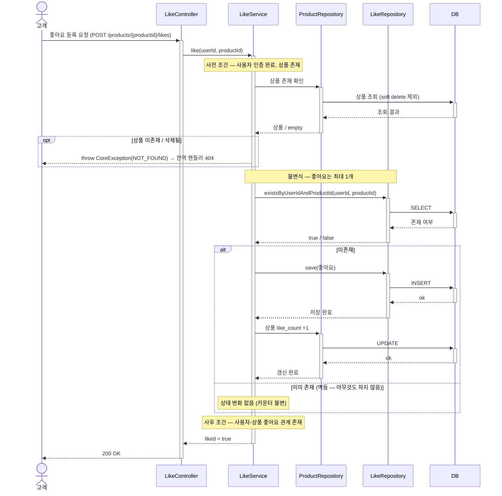
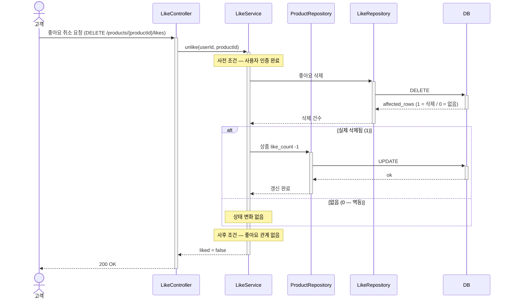

# 02. 시퀀스 다이어그램

### 시퀀스다이어그램 표기 규칙

- **사전 조건 · 불변식 · 사후 조건은 해당 흐름에 *실재할 때만* 표기**한다 (없으면 누락이 아니라 그 조건이 없다는 뜻). 예: 좋아요 취소는 강제할 불변식이 없어 불변식을 표기하지 않는다.
- **예외**는 도메인이 `throw`하고 전역 핸들러(`@RestControllerAdvice`)가 HTTP 상태로 변환한다.
- **복잡도가 높아지면 추상화 단계를 올린다** — participant가 많아 핵심 흐름이 묻히면 *도메인 단위*(주문/상품/재고 도메인 등) 또는 *레이어드 아키텍처 단위*(Controller/Facade/Service/Repository)로 표기한다. 단, **한 다이어그램 안에서는 모든 요소를 같은 추상화 레벨로 통일**한다 — 일부 요소만 Repository·SQL까지 내려가면 흐름이 난잡해지고 잘못된 강조가 생긴다.

---

## 1. 주문 생성

---

## 좋아요 등록

## 좋아요 취소

