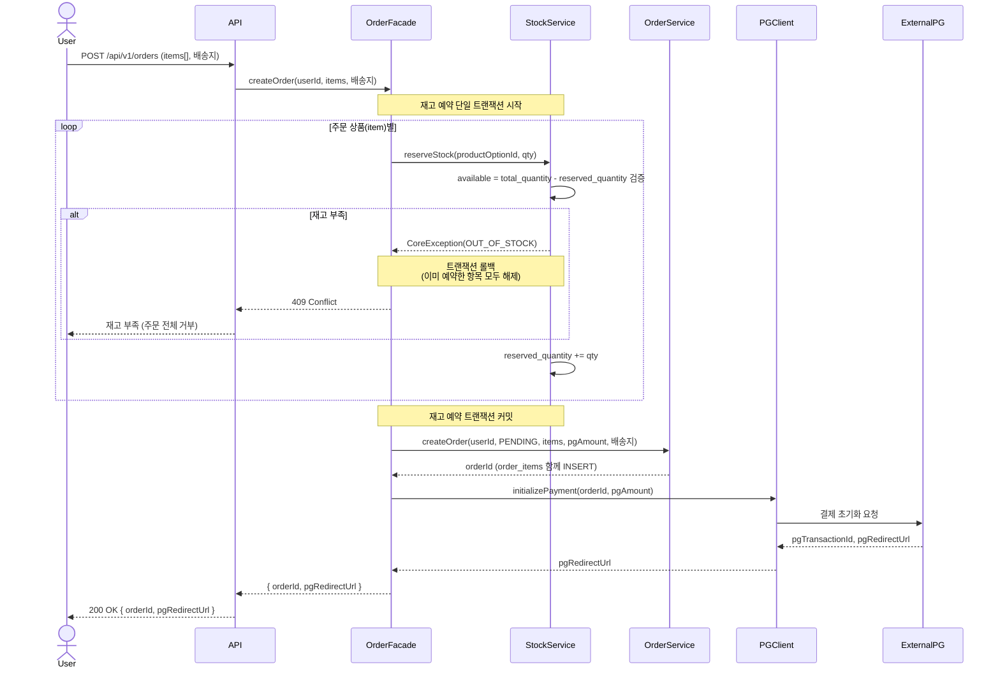
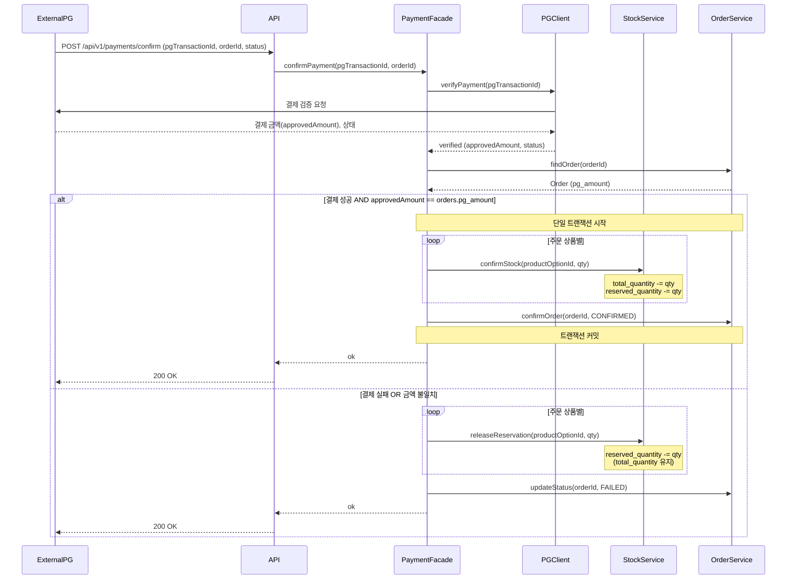
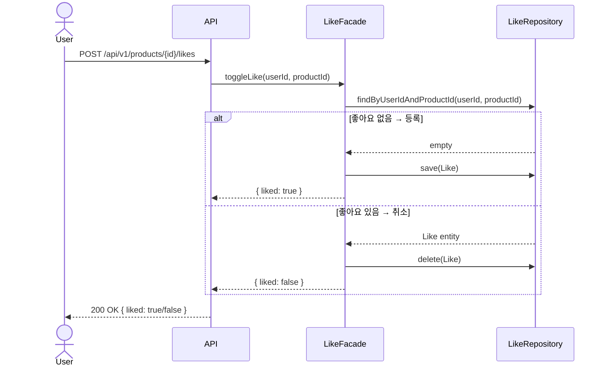
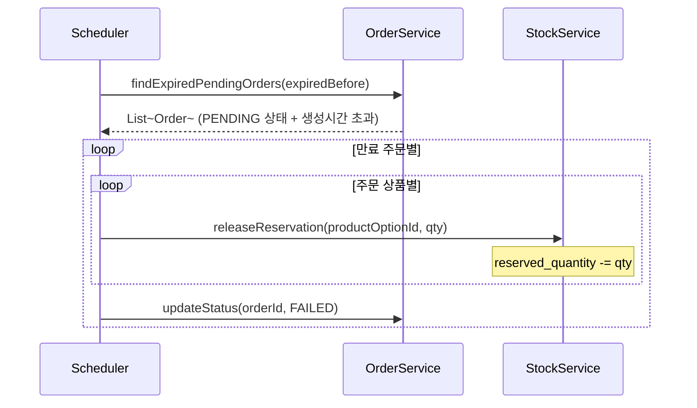
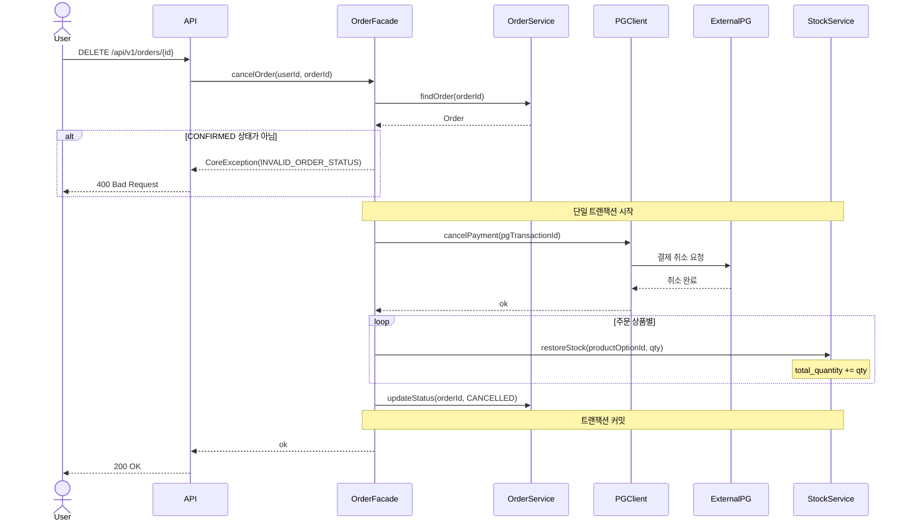
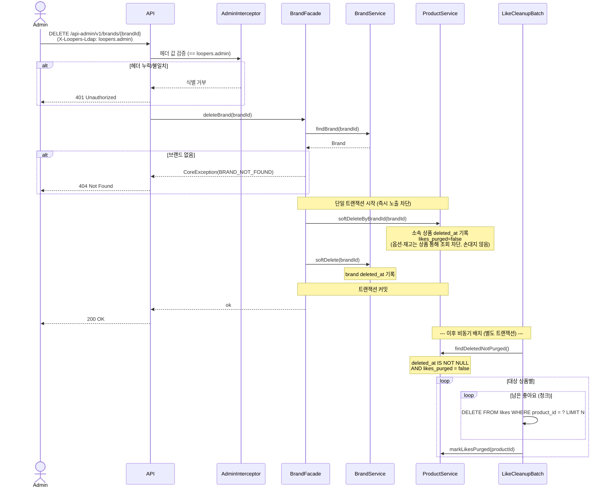
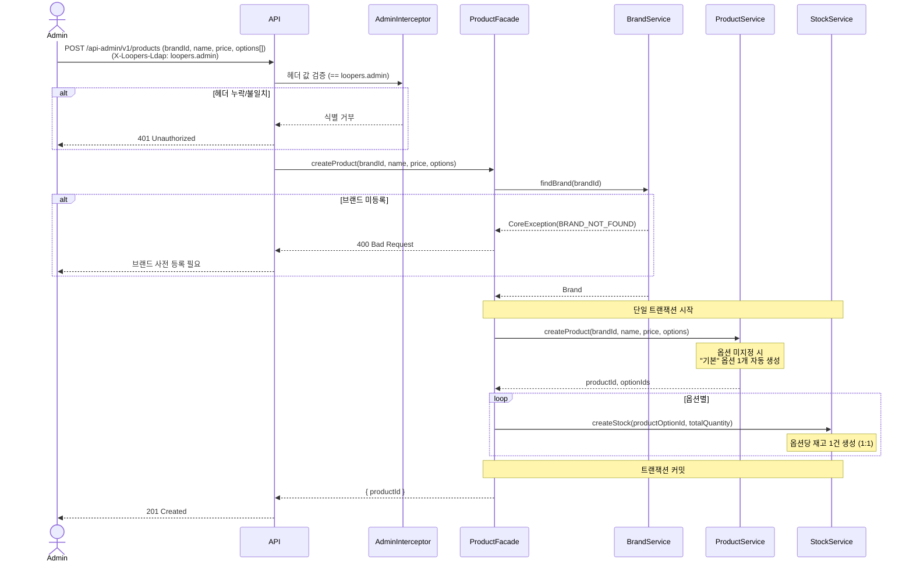

# 시퀀스 다이어그램

## 1. 주문 생성 (POST /api/v1/orders)

**목적**: 여러 상품을 한 번에 주문할 때 재고 예약 → PG 초기화까지의 책임 경계와 호출 순서를 검증한다.
**검증 포인트**: 모든 상품 재고 예약이 원자적으로 처리되는 것(하나라도 부족하면 전체 롤백), 재고 검증 실패 시 PG를 호출하지 않는 것.

**읽는 포인트**
- 주문에 포함된 모든 상품 재고 예약이 **단일 트랜잭션**으로 묶인다. 하나라도 부족하면 이미 예약한 항목까지 전부 롤백하고 주문 전체를 거부한다. (부분 주문 없음)
- 재고가 모두 확보된 뒤에야 PG 초기화로 넘어간다. 재고 실패 시 PG를 호출하지 않는다.
- `pgAmount`는 주문 라인들의 (단가 × 수량) 합계. 포인트가 없으므로 주문 총액 = PG 결제 금액.

---

## 2. 결제 확정 (POST /api/v1/payments/confirm)

**목적**: PG 콜백 수신 후 재고 확정 / 주문 상태 전이의 트랜잭션 경계와 실패 분기를 검증한다.
**검증 포인트**: 재고 확정과 주문 확정이 단일 트랜잭션에 묶이는 것, 실패 시 모든 상품 예약이 즉시 해제되는 것.

**읽는 포인트**
- PG 승인 금액(`approvedAmount`)이 우리 `orders.pg_amount`와 일치하는지 검증한 뒤에야 확정으로 넘어간다. 금액 위·변조나 계산 버그를 결제 확정 직전에 차단한다.
- 금액 불일치는 결제 실패와 동일하게 처리한다(재고 예약 해제 + 주문 FAILED). "5만원 주문이 5천원에 확정"되는 사고를 막는다.
- 결제 성공 시 모든 상품의 재고 확정 → 주문 확정이 단일 트랜잭션으로 묶인다. 하나라도 실패하면 전체 롤백된다.
- 포인트 차감 단계가 제거되어 트랜잭션이 재고 확정 + 주문 확정 2단계로 단순해졌다.
- 결제 실패 시 모든 상품의 reserved_quantity만 되돌린다. total_quantity는 건드리지 않는다.

---

## 3. 좋아요 등록/취소 (POST /api/v1/products/{id}/likes)

**목적**: 멱등 동작이 실제로 어떻게 구현되는지 DB 조회 → 분기 흐름을 명시한다.
**검증 포인트**: 같은 요청이 반복되어도 결과가 수렴하는 것, 단일 엔드포인트로 토글을 처리하는 것.

**읽는 포인트**
- 같은 엔드포인트를 여러 번 호출해도 결과가 수렴한다. 등록 → 취소 → 등록으로 안정적으로 전이된다.
- `likes` 테이블의 `(user_id, product_id)` 유니크 제약이 동시 요청 시 중복 등록을 DB 레벨에서 방어한다.
- 비로그인 사용자는 API 인증 단계에서 401로 차단된다.

---

## 4. PENDING 주문 만료 처리 (스케줄러)

**목적**: PG 콜백 미수신으로 PENDING 상태에 머문 주문의 재고 예약을 자동 해제하는 흐름을 정의한다.
**검증 포인트**: 스케줄러가 만료 기준을 어떻게 판단하고, 주문에 포함된 모든 상품의 예약을 해제하는지.

**읽는 포인트**
- 스케줄러는 조회와 위임만 한다. 실제 재고 해제는 StockService, 상태 전이는 OrderService가 책임진다.
- 복수 상품 주문이므로 주문 1건당 포함된 모든 상품 라인의 예약을 해제한다.
- 만료 기준은 주문 생성 시간 기준으로 설정한다. (ex. 생성 후 30분 초과 PENDING)

---

## 5. 주문 취소 (DELETE /api/v1/orders/{id})

**목적**: CONFIRMED 상태 주문 취소 시 PG 결제 취소 → 재고 복구의 처리 순서와 각 서비스의 책임을 검증한다.
**검증 포인트**: PG 취소와 재고 복구가 단일 트랜잭션으로 묶이는 것, 외부 PG 취소 실패 시 전체 롤백되는 것.

**읽는 포인트**
- PG 취소를 가장 먼저 호출한다. 외부 시스템 취소가 실패하면 재고를 건드리지 않고 전체 롤백한다.
- 포인트 환불 단계가 제거되어 취소 트랜잭션은 PG 취소 + 재고 복구 + 상태 전이로 단순해졌다.
- 복수 상품 주문이므로 모든 상품 라인의 재고를 복구한다.
- 취소 가능 상태는 CONFIRMED만 해당한다. PENDING/FAILED/CANCELLED 주문은 취소 요청 시 400을 반환한다.

---

## 6. 관리자 — 브랜드 삭제 (DELETE /api-admin/v1/brands/{brandId})

**목적**: 브랜드 삭제 시 소속 상품의 소프트 딜리트(즉시 노출 차단)와, 좋아요의 비동기 물리 정리로 분리되는 흐름을 검증한다.
**검증 포인트**: `X-Loopers-Ldap` 헤더로 식별돼야만 진입하는 것, 동기 트랜잭션은 brands/products의 deleted_at만 기록하는 것, 고용량 좋아요 삭제는 비동기 배치로 분리되는 것.

**읽는 포인트**
- 관리자 식별 게이트(Interceptor)가 비즈니스 로직 진입 전에 `X-Loopers-Ldap` 헤더 값을 확인한다. 인증/인가는 구현 범위가 아니며 헤더 값 일치 여부만 본다. 불일치 시 Facade를 호출하지 않는다.
- 동기 트랜잭션은 brands/products의 `deleted_at`만 기록한다(저용량, 즉시 노출 차단). 과거 주문의 order_items는 스냅샷이라 영향받지 않는다.
- 옵션·재고는 상품을 통해서만 도달하므로 손대지 않는다. 상품 복구 시 자동으로 함께 복구된다.
- 좋아요는 고용량(수천만~수억)이고 복구 가치가 없으므로, 동기 삭제 대신 **비동기 배치가 청크 단위로 물리 삭제**한다. `likes_purged` 플래그로 정리 완료를 마킹해 반복 스캔을 막는다.

---

## 7. 관리자 — 상품 등록 (POST /api-admin/v1/products)

**목적**: 상품 + 옵션 + 재고를 한 번에 등록하는 흐름과 브랜드 사전 등록 검증을 확인한다.
**검증 포인트**: 사전 등록되지 않은 브랜드면 거부하는 것, 상품·옵션·재고가 단일 트랜잭션으로 함께 생성되는 것.

**읽는 포인트**
- 브랜드 사전 등록 여부를 가장 먼저 검증한다. 미등록이면 상품·옵션·재고를 만들지 않고 거부한다.
- 상품·옵션·재고가 단일 트랜잭션으로 함께 생성되어 옵션만 있고 재고가 없는 불완전 상태가 생기지 않는다.
- 옵션을 지정하지 않은 상품은 `option_name = "기본"` 옵션 1개가 자동 생성되며, 그 옵션에 재고 1건이 매핑된다.
