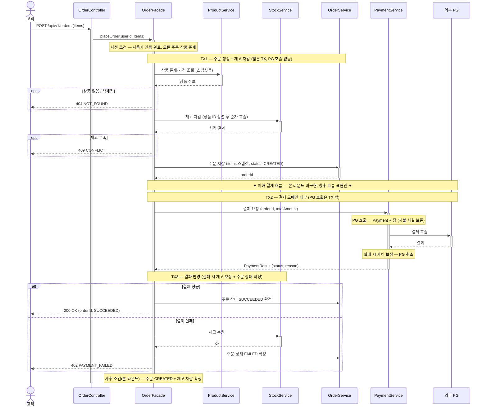
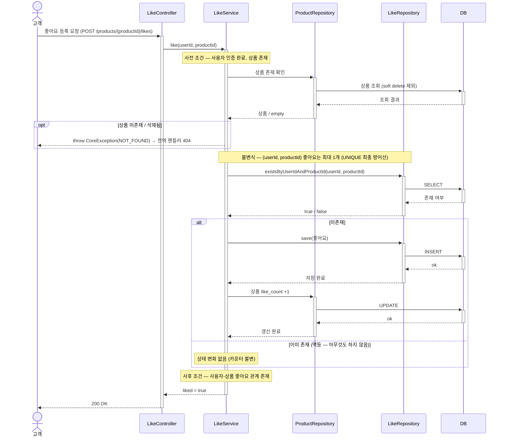
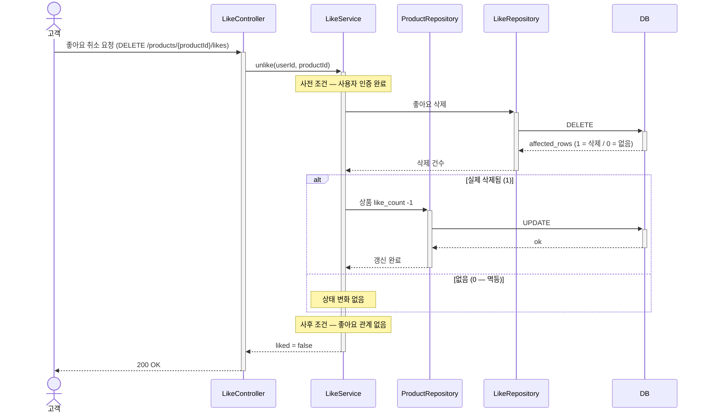

# 02. 시퀀스 다이어그램

### 시퀀스다이어그램 표기 규칙

- **사전 조건 · 불변식 · 사후 조건은 해당 흐름에 *실재할 때만* 표기**한다 (없으면 누락이 아니라 그 조건이 없다는 뜻). 예: 좋아요 취소는 강제할 불변식이 없어 불변식을 표기하지 않는다.
- **TX1 · TX2 · TX3** 은 트랜잭션 경계 — 외부 I/O(PG 호출)는 트랜잭션 밖.
- **예외**는 Service가 `throw`하고 전역 핸들러(`@RestControllerAdvice`)가 HTTP 상태로 변환한다.

---

## 1. 주문 생성

## 의도적 단순화

- **결제 도메인 모델·테이블·정책은 정의하지 않음**
- **동시성 처리는 시퀀스 표현 수준에서만**.

---

## 좋아요 등록

## 좋아요 취소

