# 02. Sequence Diagrams — 시퀀스 다이어그램

전체 시나리오를 다룬다.

---

## 시나리오 1. 상품 목록 조회

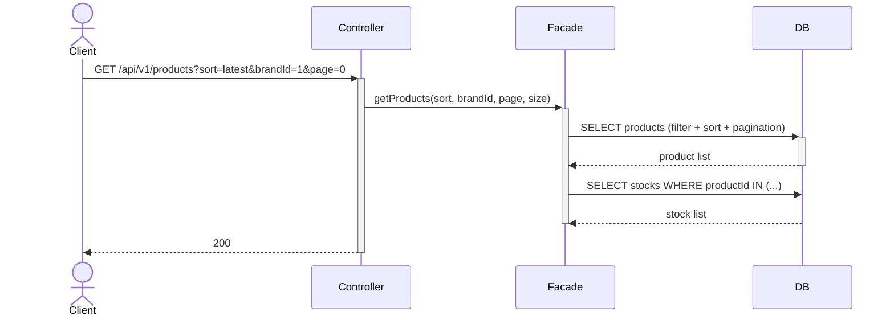

---

## 시나리오 2. 상품 상세 조회

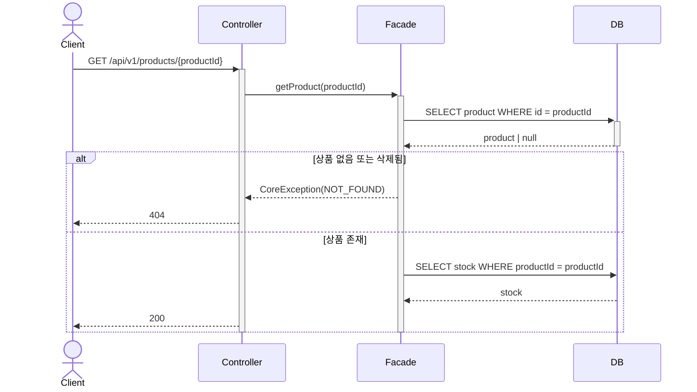

---

## 시나리오 3. 브랜드 정보 조회

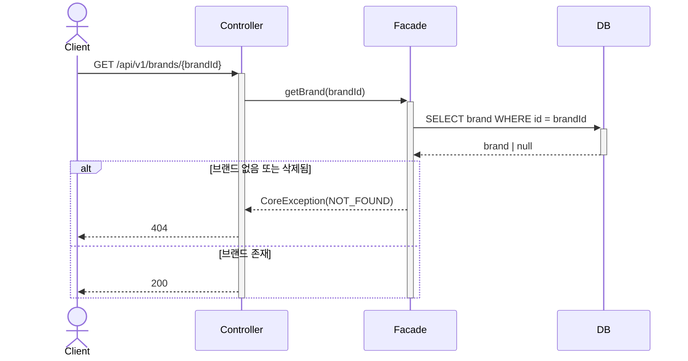

---

## 시나리오 4. 좋아요

### 4-1. 좋아요 등록

상품 존재 확인 후 중복 확인 순으로 검증한다. 존재하지 않는 상품에 대한 중복 여부를 묻는 것은 의미 없으므로 순서가 중요하다.

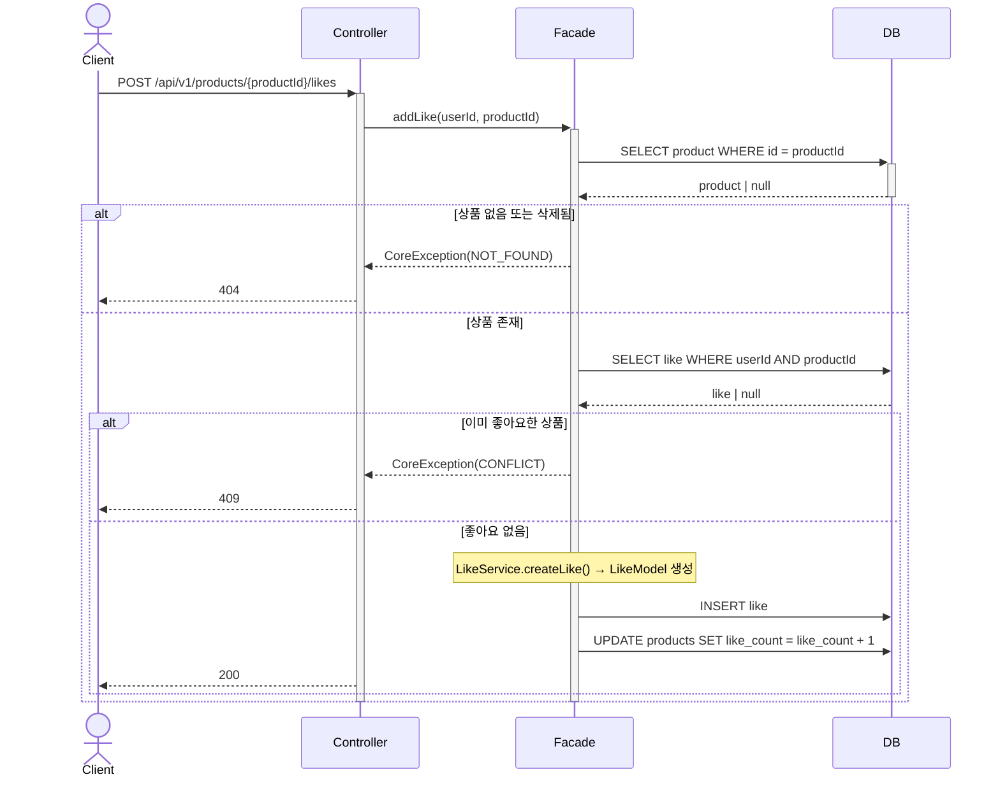

### 4-2. 좋아요 취소

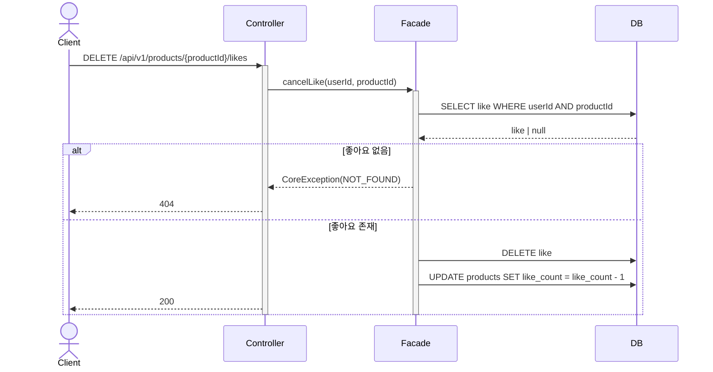

### 4-3. 내 좋아요 목록 조회

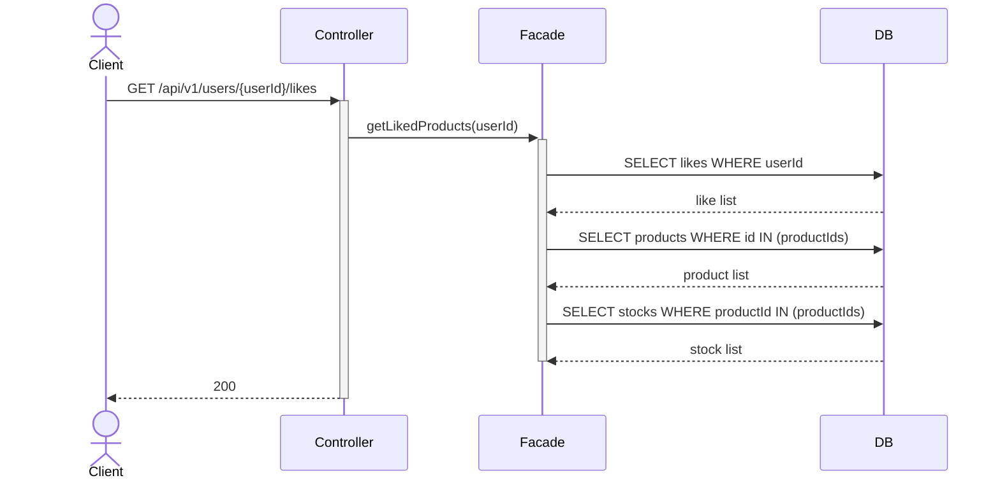

---

## 시나리오 5. 주문

### 5-1. 주문 생성

상품 존재 여부를 검증하고 PENDING_PAYMENT 상태의 주문을 생성한다. 재고는 이 단계에서 변경하지 않는다.

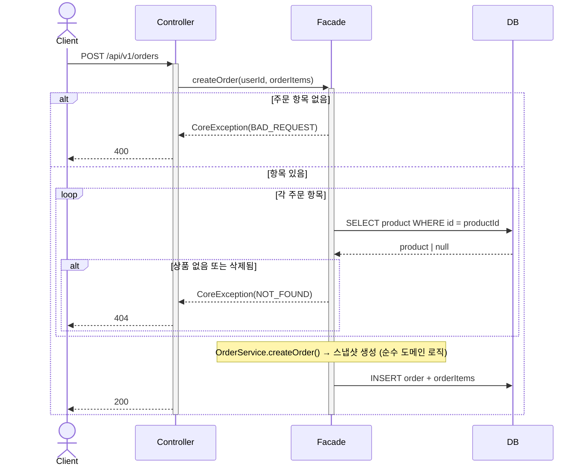

### 5-2. 결제 진입 (재고 선점)

결제 화면 진입 시 재고를 선점한다. 재고가 부족하면 결제 진입 자체가 실패한다.

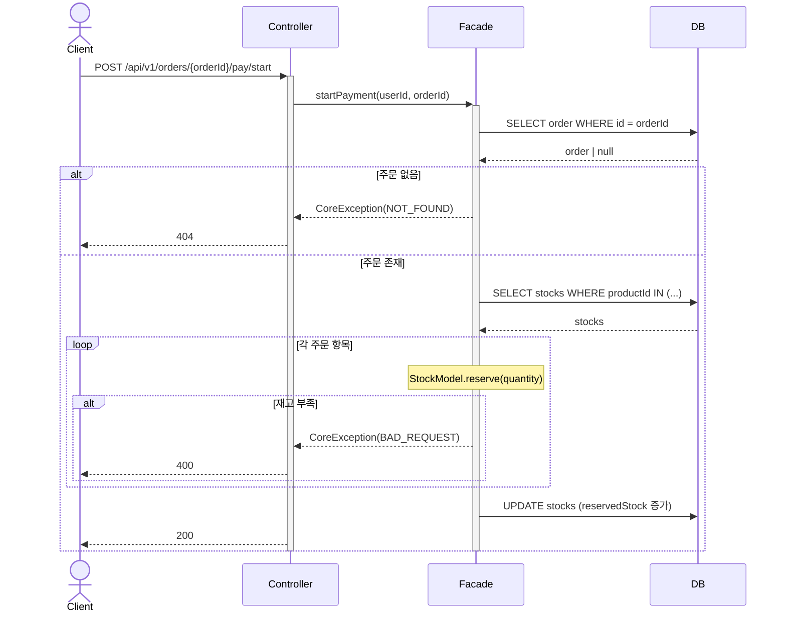

### 5-3. 결제 완료 (재고 확정)

결제가 완료되면 선점한 재고를 확정 차감하고 주문을 CONFIRMED 상태로 전환한다.

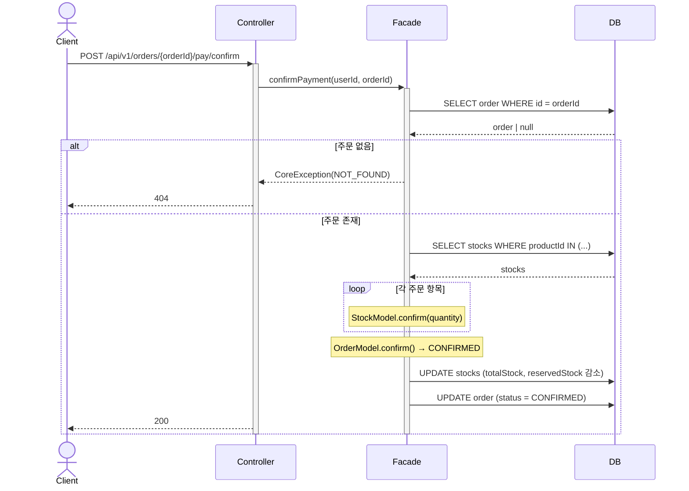

---

## 시나리오 6. 주문 내역 조회

### 6-1. 주문 목록 조회

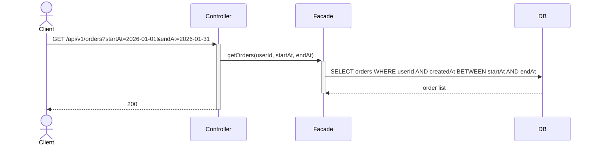

### 6-2. 주문 상세 조회

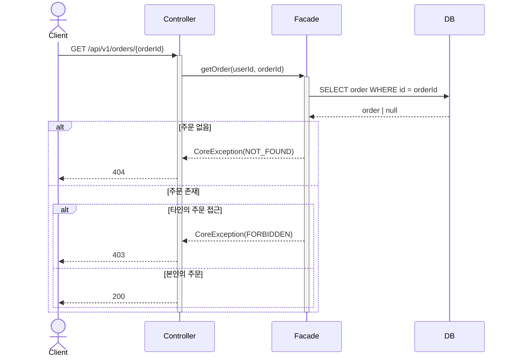

---

## 시나리오 7. 브랜드 관리 (어드민)

### 7-1. 브랜드 등록

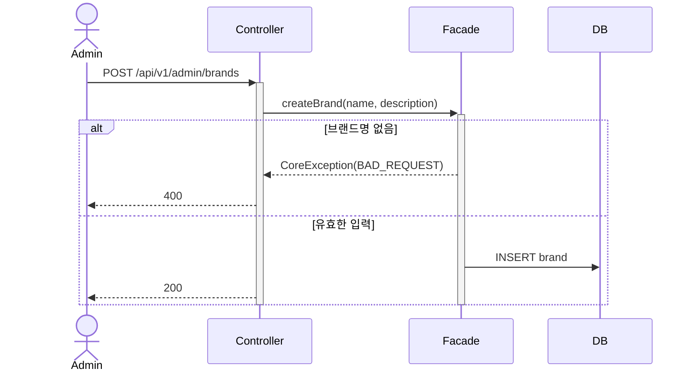

### 7-2. 브랜드 수정

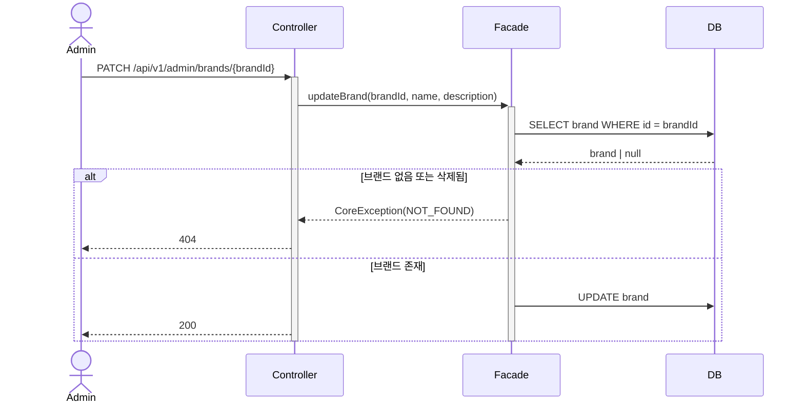

### 7-3. 브랜드 삭제

소속 상품 삭제와 브랜드 삭제를 하나의 트랜잭션 안에서 처리한다.

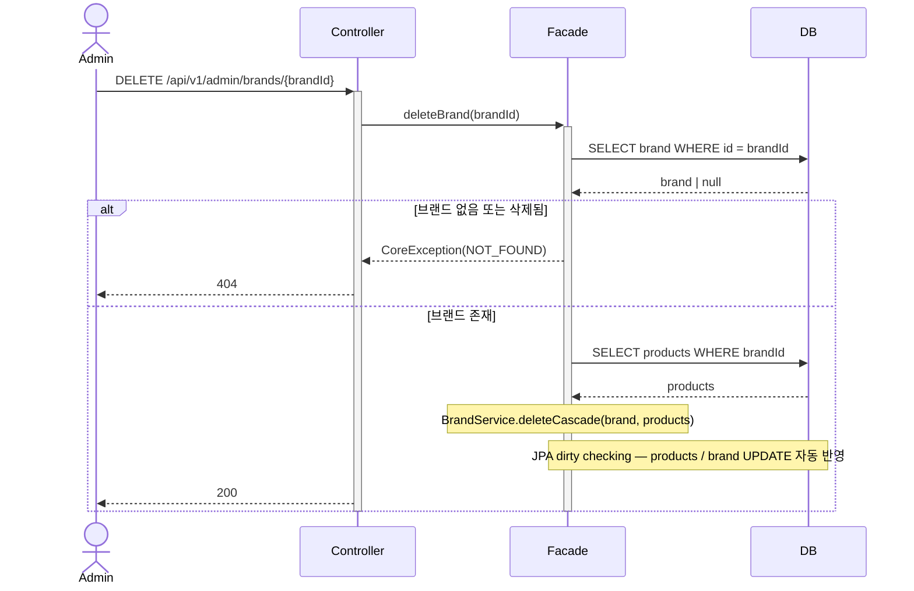

---

## 시나리오 8. 상품 관리 (어드민)

### 8-1. 상품 등록

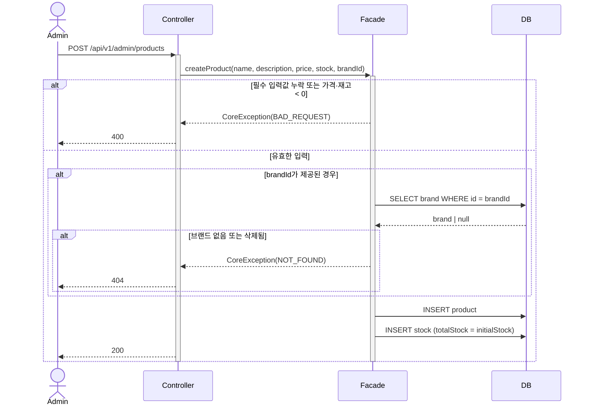

### 8-2. 상품 수정

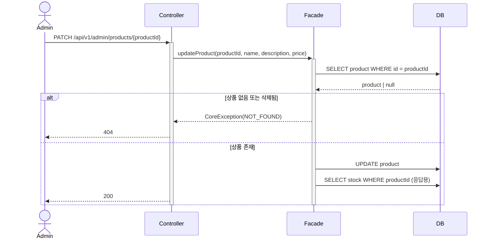

### 8-3. 상품 삭제

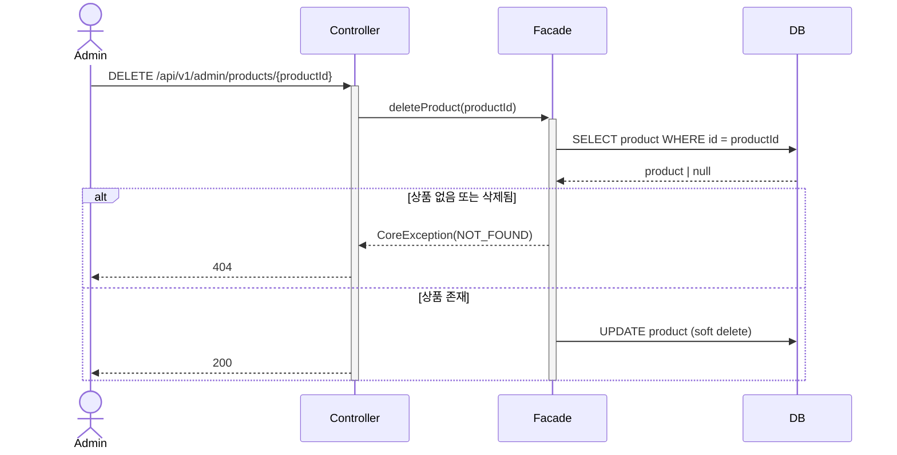
