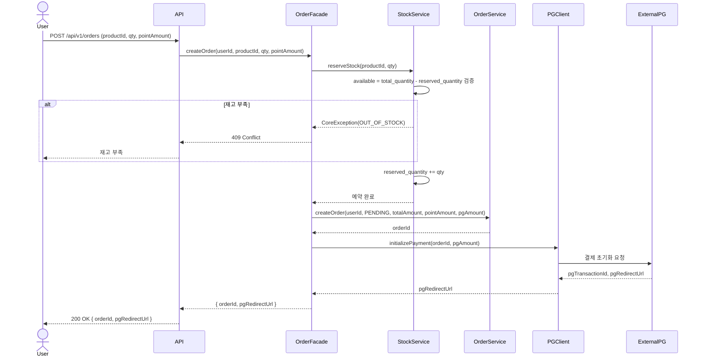
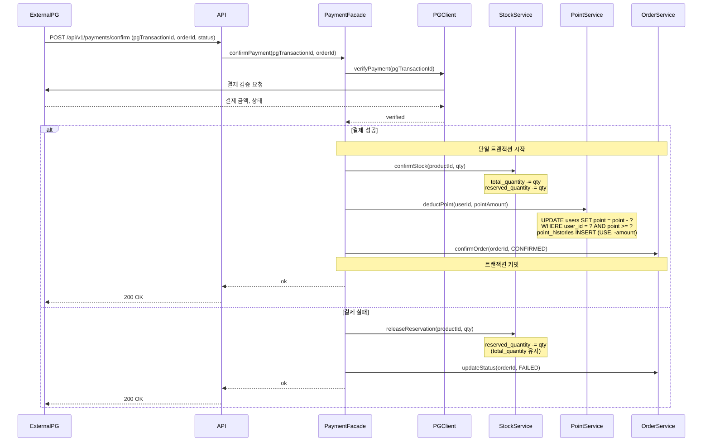
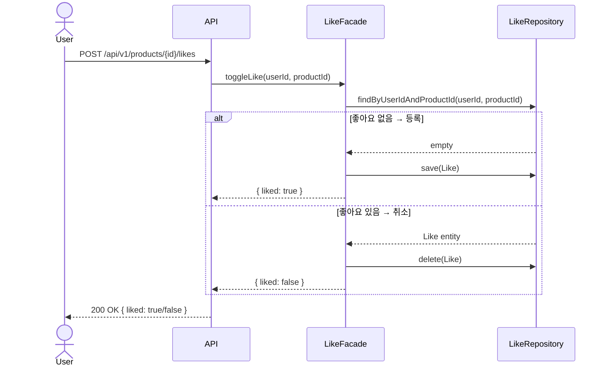
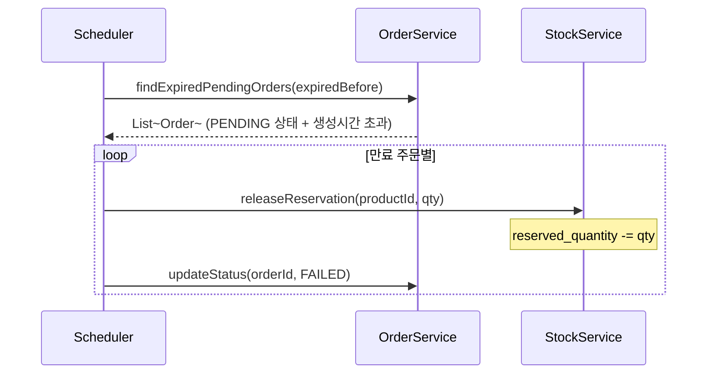
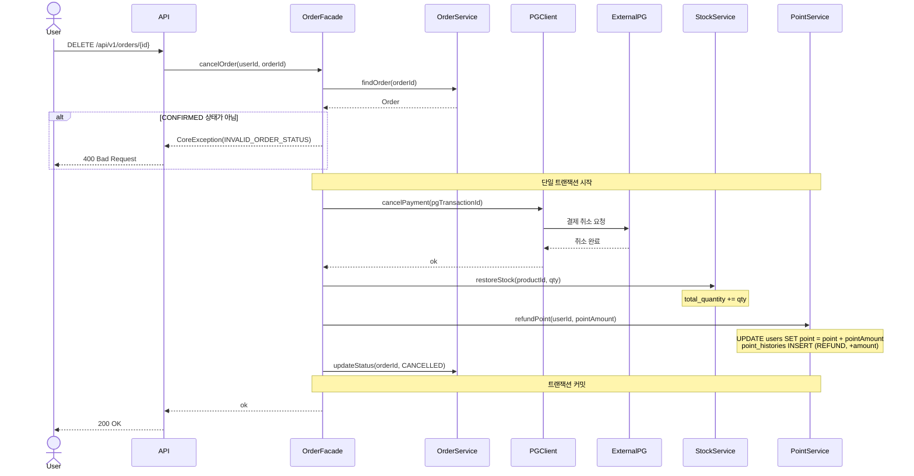

# 시퀀스 다이어그램

## 1. 주문 생성 (POST /api/v1/orders)

**목적**: 주문하기 버튼 클릭 시 재고 예약 → PG 초기화까지의 책임 경계와 호출 순서를 검증한다.
**검증 포인트**: 재고 검증 실패 시 PG를 호출하지 않는 것, StockService가 예약 로직을 단독으로 책임지는 것.

**읽는 포인트**
- 재고 검증과 예약이 먼저 일어난 뒤 PG 초기화로 넘어간다. 재고 없으면 PG를 호출하지 않는다.
- `available = total_quantity - reserved_quantity` 계산은 StockService가 책임진다. total_quantity는 결제 확정 전까지 건드리지 않는다.
- 주문은 PENDING 상태로 생성되며, 결제 확정 콜백을 받기 전까지 이 상태를 유지한다.

---

## 2. 결제 확정 (POST /api/v1/payments/confirm)

**목적**: PG 콜백 수신 후 재고 확정 / 포인트 차감 / 주문 상태 전이의 트랜잭션 경계와 실패 분기를 검증한다.
**검증 포인트**: 세 작업이 단일 트랜잭션에 묶이는 것, 실패 시 즉시 예약 해제되는 것.

**읽는 포인트**
- 결제 성공 시 재고 확정 → 포인트 차감 → 주문 확정이 단일 트랜잭션으로 묶인다. 셋 중 하나라도 실패하면 전체 롤백된다.
- 포인트 차감은 `WHERE point >= requestAmount` 조건으로 음수 방지를 DB 레벨에서 보장한다. affected rows = 0이면 예외 발생.
- 결제 실패 시 reserved_quantity만 되돌린다. total_quantity는 건드리지 않는다.

---

## 3. 좋아요 등록/취소 (POST /api/v1/products/{id}/likes)

**목적**: 멱등 동작이 실제로 어떻게 구현되는지 DB 조회 → 분기 흐름을 명시한다.
**검증 포인트**: 같은 요청이 반복되어도 결과가 수렴하는 것, 단일 엔드포인트로 토글을 처리하는 것.

**읽는 포인트**
- 같은 엔드포인트를 여러 번 호출해도 결과가 수렴한다. 등록 → 취소 → 등록으로 안정적으로 전이된다.
- `likes` 테이블의 `(user_id, product_id)` 유니크 제약이 동시 요청 시 중복 등록을 DB 레벨에서 방어한다.
- 비로그인 사용자는 API 인증 단계에서 401로 차단된다.

---

## 4. PENDING 주문 만료 처리 (스케줄러)

**목적**: PG 콜백 미수신으로 PENDING 상태에 머문 주문의 재고 예약을 자동 해제하는 흐름을 정의한다.
**검증 포인트**: 스케줄러가 만료 기준을 어떻게 판단하고 어느 서비스에 위임하는지.

**읽는 포인트**
- 스케줄러는 조회와 위임만 한다. 실제 재고 해제는 StockService, 상태 전이는 OrderService가 책임진다.
- 만료 기준은 주문 생성 시간 기준으로 설정한다. (ex. 생성 후 30분 초과 PENDING)

---

## 5. 주문 취소 (DELETE /api/v1/orders/{id})

**목적**: CONFIRMED 상태 주문 취소 시 PG 결제 취소 → 재고 복구 → 포인트 환불의 처리 순서와 각 서비스의 책임을 검증한다.
**검증 포인트**: 세 작업이 단일 트랜잭션으로 묶이는 것, 외부 PG 취소 실패 시 전체 롤백되는 것.

**읽는 포인트**
- PG 취소를 가장 먼저 호출한다. 외부 시스템 취소가 실패하면 재고/포인트를 건드리지 않고 전체 롤백한다.
- 포인트 환불은 `point_histories`에 `type=REFUND`로 INSERT되어 이력이 남는다.
- 취소 가능 상태는 CONFIRMED만 해당한다. PENDING/FAILED/CANCELLED 주문은 취소 요청 시 400을 반환한다.
