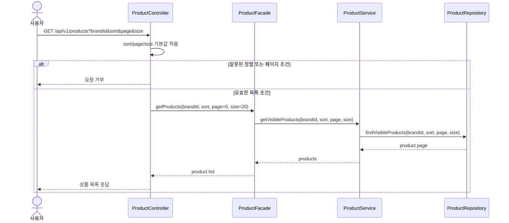
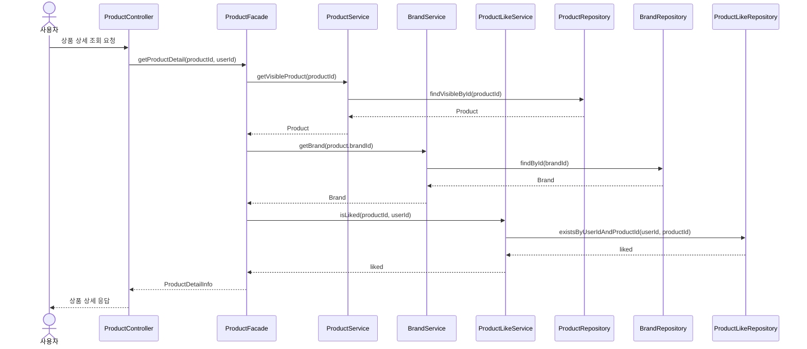
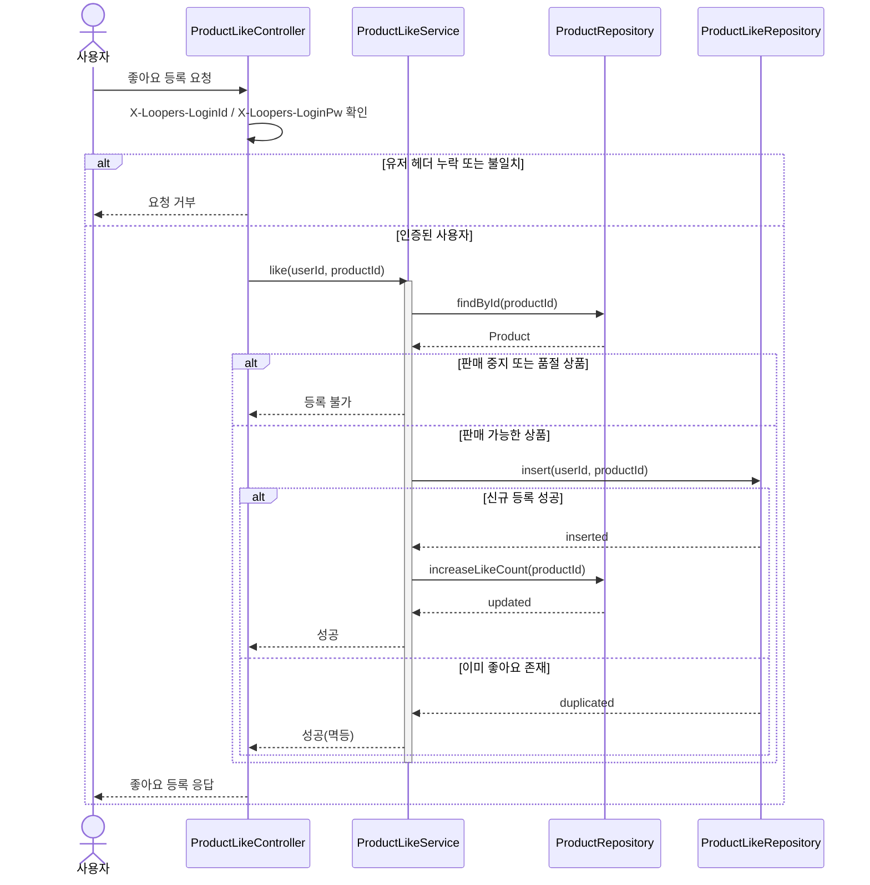
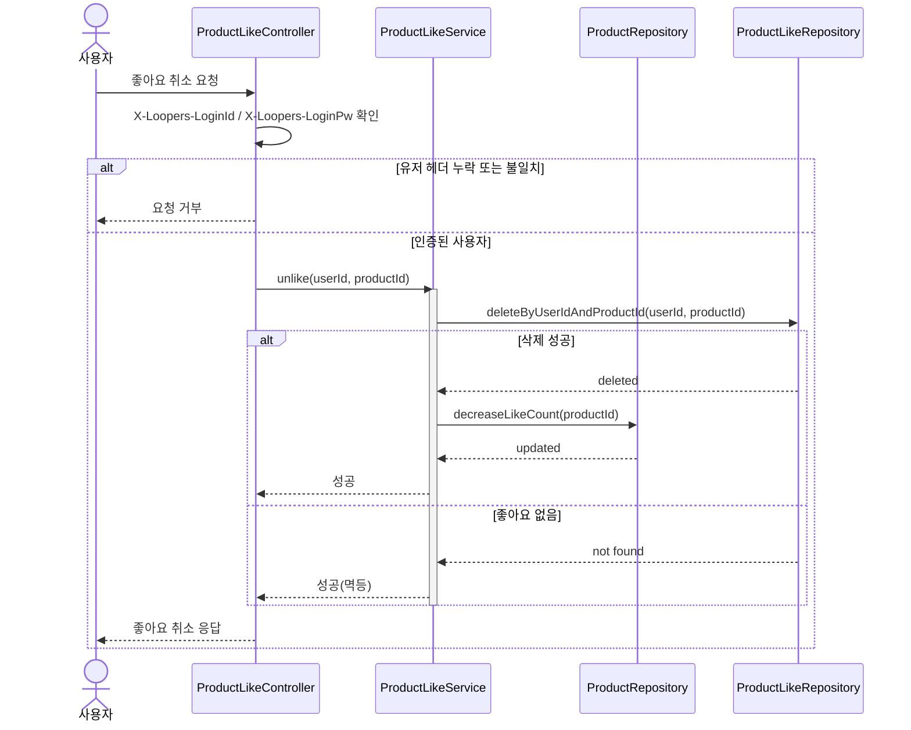
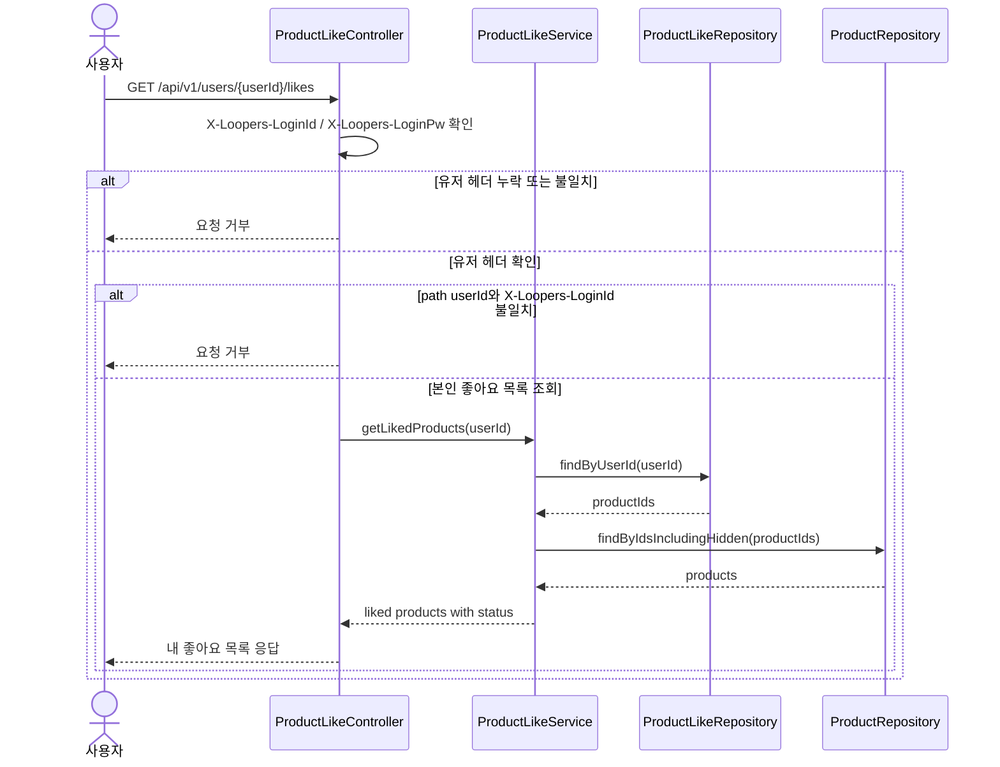
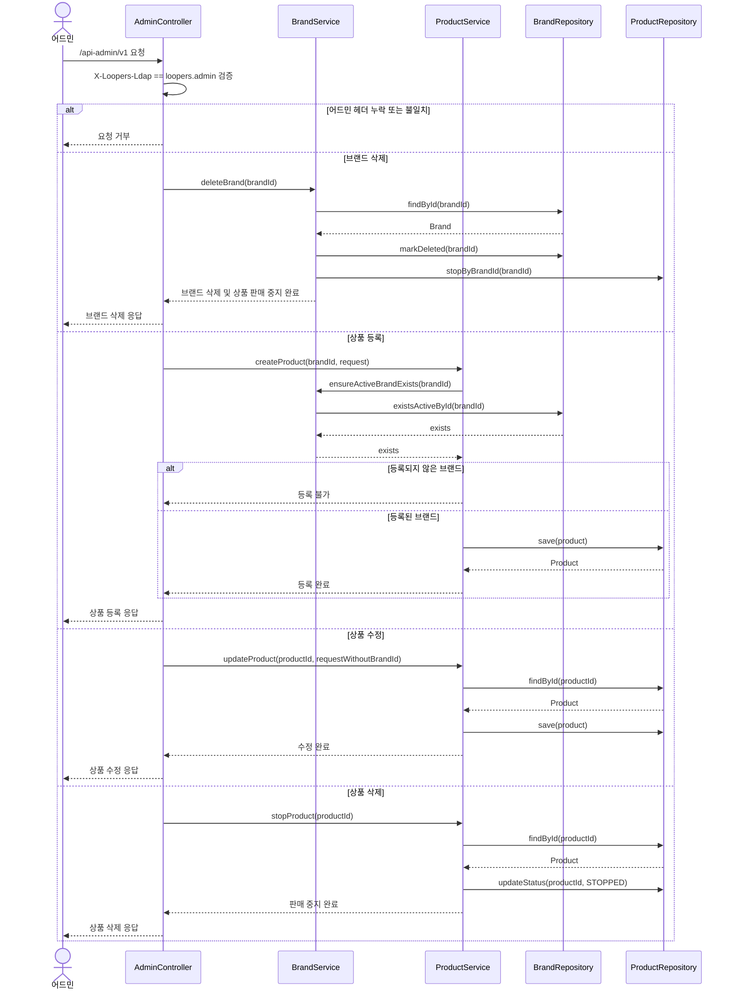
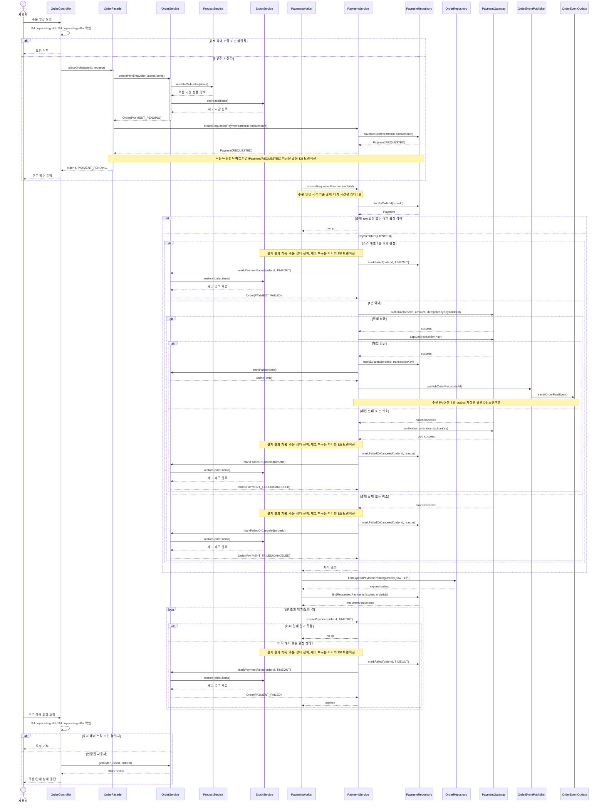
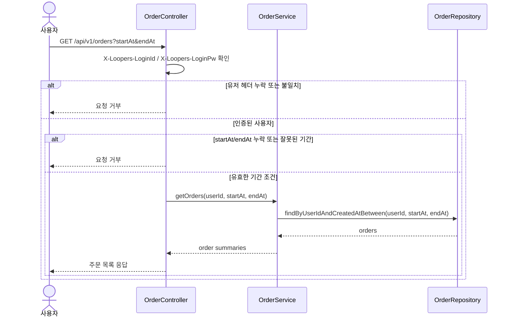
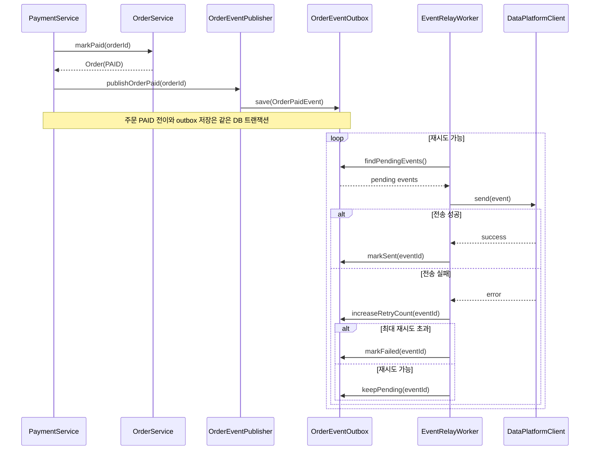

# 시퀀스 다이어그램 이력 및 3주차 반영 기준

## 읽는 포인트

- 각 다이어그램은 호출 순서 자체보다 책임 경계와 트랜잭션 경계를 확인하기 위한 것이다.
- 상품 조회와 좋아요는 비교적 짧은 흐름이고, 주문/결제는 내부 정합성과 외부 장애를 분리하는 흐름이다.
- 결제 성공 이벤트 전송은 사용자 응답 성공과 외부 데이터 플랫폼 전송 성공이 같은 의미가 아님을 보여준다.

## 트랜잭션 경계 요약

| 유스케이스 | 트랜잭션 경계 | 포함 작업 | 제외 작업 | 실패 처리 |
| --- | --- | --- | --- | --- |
| 상품 목록 조회 | read-only | 판매 가능 상품을 `brandId`, `sort`, `page`, `size` 조건으로 조회 | 없음 | 잘못된 정렬/페이지 조건이면 조회 실패 |
| 상품 상세 조회 | read-only | 판매 가능 상품 조회, 브랜드 조회, 좋아요 여부 조회 | 없음 | 상품이 없거나 숨김 상태면 조회 실패 |
| 좋아요 등록 | write | `X-Loopers-LoginId`/`X-Loopers-LoginPw` 검증, 상품 상태 확인, `product_like` insert, `product.like_count` 증가 | 없음 | 헤더 불일치면 실패, 중복 insert는 멱등 성공 |
| 좋아요 취소 | write | `X-Loopers-LoginId`/`X-Loopers-LoginPw` 검증, `product_like` delete, 실제 삭제 시 `product.like_count` 감소 | 없음 | 헤더 불일치면 실패, 좋아요 이력 없음은 멱등 성공 |
| 주문 목록 조회 | read-only | `X-Loopers-LoginId`/`X-Loopers-LoginPw` 검증, 로그인 사용자 주문을 `startAt`, `endAt` 기간 조건으로 조회 | 없음 | 헤더 불일치 또는 잘못된 기간 조건이면 조회 실패 |
| 주문 생성 | write | `X-Loopers-LoginId`/`X-Loopers-LoginPw` 검증, 상품 판매 상태 검증, 비관적 락 기반 재고 차감, 주문/주문 항목 저장, `payment(order_id, REQUESTED)` 저장 | 외부 결제 요청 | 헤더 불일치 또는 재고 부족이면 주문과 결제를 생성하지 않음 |
| 브랜드 ADMIN 등록/수정/삭제 | write | `X-Loopers-Ldap` 검증, 브랜드 저장/수정, 브랜드 삭제 시 브랜드 `deletedAt` 표시와 상품 `STOPPED` 전환 | 없음 | 어드민 헤더 불일치 또는 대상 없음이면 실패 |
| 상품 ADMIN 등록/수정/삭제 | write | `X-Loopers-Ldap` 검증, 상품 저장/수정, 삭제 시 상품 `STOPPED` 전환, 등록 브랜드 존재 검증 | 없음 | 브랜드 없음, 브랜드 변경 요청, 대상 없음이면 실패 |
| 주문 ADMIN 조회 | read-only | `X-Loopers-Ldap` 검증, 전체 주문 목록/상세 조회 | 없음 | 어드민 헤더 불일치 또는 대상 없음이면 실패 |
| 결제 성공 확정 | write | 결제 성공 기록, 주문 `PAID` 전이, 주문 완료 outbox 저장 | 외부 데이터 플랫폼 전송 | 확정 상태 중복 수신은 no-op |
| 결제 실패/취소/타임아웃 | write | 결제 결과 기록, 주문 실패/취소 전이, 재고 복구 | 외부 데이터 플랫폼 전송 | 중복 실행은 상태 기반 no-op |
| Outbox 전송 | write per event | 전송 성공 시 `SENT`, 실패 시 `retry_count` 증가 또는 `FAILED` 확정 | 주문/결제 상태 변경 | 외부 전송 실패는 주문 성공을 되돌리지 않음 |

## 상품 목록 조회

이 다이어그램은 `service.md`의 상품 목록 조건인 `brandId`, `sort`, `page`, `size`가 어떤 책임으로 처리되는지 확인하기 위해 필요하다. 목록 조회는 판매 가능한 상품만 대상으로 하며, 기본값은 `sort=latest`, `page=0`, `size=20`이다.

해석 포인트:

- 상품 목록 API는 `GET /api/v1/products`를 사용한다.
- `page` 기본값은 `0`, `size` 기본값은 `20`이다.
- 정렬 기준은 `latest`, `price_asc`, `likes_desc`만 허용한다.
- 판매 중지/품절 상품은 목록에 노출하지 않는다.
- `brandId`가 있으면 특정 브랜드 상품만 조회한다.

## 상품 상세 조회

이 다이어그램은 상품 상세 조회에서 상품, 브랜드, 좋아요 여부가 어떤 책임으로 조합되는지 확인하기 위해 필요하다. 좋아요 수는 `product.like_count` 카운터를 사용하고, 사용자별 좋아요 여부만 좋아요 이력에서 확인한다.

해석 포인트:

- `ProductService`는 상품 자체의 유효성과 조회 책임에 집중한다.
- 일반 상품 상세 조회는 판매 가능한 상품만 대상으로 한다.
- 브랜드와 좋아요 요약은 `ProductFacade`에서 조합해 도메인 간 직접 의존을 줄인다.
- 좋아요 수는 `product.like_count`를 사용하고, `product_like`는 사용자별 좋아요 여부 확인에 사용한다.
- 좋아요 여부는 로그인 사용자 기준 정보이므로, 비로그인 조회 정책이 필요하다.

## 좋아요 등록

이 다이어그램은 좋아요 등록의 상품 상태 정책, 멱등성, 카운터 갱신 책임을 확인하기 위해 필요하다. 판매 가능한 상품에만 새 좋아요를 등록할 수 있고, 실제 신규 등록일 때만 상품 좋아요 수를 증가시킨다.

해석 포인트:

- 좋아요 멱등성 기준은 `userId + productId` 유니크 제약이다.
- 좋아요 등록은 판매 가능한 상품에만 허용한다.
- 판매 중지/품절 상품에 대한 좋아요 등록 요청은 허용하지 않는다.
- 좋아요 이력 insert와 `like_count` 증가는 같은 DB 트랜잭션에서 처리한다.
- 좋아요 카운터는 신규 등록 시에만 DB 원자적 업데이트로 증가한다.
- 중복 요청 경합을 대비해 DB unique 제약 위반은 성공 또는 재조회로 변환한다.
- user_required API이므로 `X-Loopers-LoginId`와 `X-Loopers-LoginPw`를 모두 확인한 뒤 처리한다.

## 좋아요 취소

이 다이어그램은 좋아요 취소의 멱등성과 카운터 감소 책임을 확인하기 위해 필요하다. 사용자가 좋아요하지 않은 상품에 취소 요청을 보내도 성공으로 처리하되, 실제 삭제된 이력이 있을 때만 상품 좋아요 수를 감소시킨다.

해석 포인트:

- 좋아요 이력 delete와 `like_count` 감소는 같은 DB 트랜잭션에서 처리한다.
- 좋아요 취소는 기존 이력 정리 목적이므로 상품 상태와 무관하게 허용한다.
- 좋아요 카운터는 실제 삭제된 이력이 있을 때만 DB 원자적 업데이트로 감소한다.
- 감소 시 `like_count > 0` 조건을 둬 음수 카운터를 방지한다.
- user_required API이므로 `X-Loopers-LoginId`와 `X-Loopers-LoginPw`를 모두 확인한 뒤 처리한다.

## 내 좋아요 목록 조회

이 다이어그램은 일반 상품 목록과 내 좋아요 목록의 노출 정책이 다르다는 점을 확인하기 위해 필요하다. 일반 상품 목록과 상세 조회는 판매 가능한 상품만 보여주지만, 내 좋아요 목록은 사용자가 예전에 남긴 이력이므로 판매 중지/품절 상품도 포함한다.

해석 포인트:

- 내 좋아요 목록 API는 `GET /api/v1/users/{userId}/likes`를 사용한다.
- user_required API이므로 `X-Loopers-LoginId`와 `X-Loopers-LoginPw`를 모두 확인한 뒤 처리한다.
- `X-Loopers-LoginId`와 path `userId`가 다르면 타 유저 직접 접근으로 보고 거부한다.
- 내 좋아요 목록은 `product_like` 이력을 기준으로 조회한다.
- 판매 중지/품절 상품도 예전에 좋아요한 이력이 있으면 목록에 포함한다.
- 응답에는 현재 상품 상태를 포함해 주문 가능 상품과 불가능 상품을 구분할 수 있게 한다.
- 일반 상품 목록과 상세 조회의 판매 가능 상품 필터를 그대로 재사용하면 과거 좋아요 이력이 누락될 수 있다.

## 브랜드/상품 ADMIN 관리

이 다이어그램은 `service.md`의 `/api-admin/v1` 경계와 운영 정책을 확인하기 위해 필요하다. ADMIN API는 `X-Loopers-Ldap: loopers.admin` 헤더를 검증한 뒤 브랜드와 상품의 등록/수정/삭제를 수행한다.

해석 포인트:

- ADMIN API는 `/api-admin/v1` prefix를 사용한다.
- ADMIN API는 `X-Loopers-Ldap: loopers.admin` 헤더가 있어야 처리한다.
- 브랜드 삭제는 브랜드 row를 물리 삭제하지 않고 `deletedAt`을 표시하며, 해당 브랜드 상품의 `STOPPED` 전환과 같은 트랜잭션에서 처리한다.
- 상품 등록 시 브랜드는 이미 등록되어 있고 삭제되지 않은 상태여야 한다.
- 상품 수정 요청에는 `brandId`를 받지 않아 상품의 브랜드를 변경할 수 없게 한다.
- 상품 삭제 API는 상품 row를 물리 삭제하지 않고 `STOPPED` 상태로 전환한다.
- `STOPPED` 상품은 대고객 목록/상세와 주문 대상에서 제외하지만, 과거 주문의 `order_line.product_id` 참조와 `product.brand_id` 참조는 유지한다.

## 주문 생성 및 내부 비동기 결제

이 다이어그램은 주문, 재고, 결제의 책임 경계와 트랜잭션 범위를 확인하기 위해 필요하다. 주문 생성 API는 `PAYMENT_PENDING` 주문과 `REQUESTED` 결제 row를 같은 DB 트랜잭션에서 만든 뒤 응답하고, 외부 결제 요청은 내부 비동기 흐름에서 처리한다.

해석 포인트:

- 주문 생성 트랜잭션에는 상품 검증, 재고 차감, 주문/주문 항목 저장, `Payment(REQUESTED)` 저장이 포함된다.
- 주문 생성과 주문 상태 조회는 user_required API이므로 `X-Loopers-LoginId`와 `X-Loopers-LoginPw`를 모두 확인한 뒤 처리한다.
- 주문 생성 API는 `orderId`와 `PAYMENT_PENDING`을 응답하고 사용자는 상태 조회 API로 결제 결과를 확인한다.
- 주문 목록/상세 조회의 `paymentStatus`는 주문 생성 직후에도 `REQUESTED`로 반환된다.
- 외부 결제 요청은 서버 내부 비동기 흐름에서 실행해 사용자 응답과 외부 결제 지연을 분리한다.
- worker는 주문 생성 시 만들어진 `payment(order_id, status=REQUESTED)` row를 읽어 외부 결제를 요청한다.
- `payment.order_id` unique 제약 때문에 같은 주문에는 하나의 결제 row만 존재한다.
- 외부 결제 요청에는 `orderId` 기반 idempotency key를 사용한다.
- 외부 결제 시스템은 `auth/capture/void` 계약을 지원한다고 가정한다.
- `auth`는 승인, `capture`는 실제 매입, `void`는 승인 취소로 정의한다.
- 결제 성공 시 `PaymentService`는 외부 데이터 플랫폼을 직접 호출하지 않고, `OrderEventPublisher`를 통해 outbox 저장만 요청한다.
- `PAYMENT_PENDING` 1분 초과 여부는 주문 생성 시각 기준으로 소스 레벨에서 판정하며, 별도 타임아웃 컬럼은 두지 않는다.
- worker는 `PAYMENT_PENDING` 주문과 `REQUESTED` 결제를 스캔해 외부 결제 응답 지연이나 worker 중단 후에도 1분 초과 건을 만료 처리한다.
- 1분 초과 시 `PAYMENT_FAILED`로 전이하고 실패 사유 값은 `TIMEOUT`으로 처리한다.
- 이미 성공/실패/취소로 확정된 결제 결과는 만료 스캔에서 다시 처리하지 않는다.
- 1분 이후 도착한 결제 성공 응답은 이미 실패 처리된 주문을 다시 `PAID`로 되돌리지 않는다.
- 결제 실패, 취소, 타임아웃 시 결제 결과 기록, 주문 상태 전이, 재고 복구는 하나의 DB 트랜잭션으로 처리한다.

## 주문 목록 조회

이 다이어그램은 `service.md`의 주문 목록 조회 API가 본인 주문만 기간 조건으로 반환한다는 점을 확인하기 위해 필요하다. 목록 조회는 주문 상태를 변경하지 않는 read-only 흐름이다.

해석 포인트:

- 주문 목록 조회 API는 `GET /api/v1/orders?startAt&endAt`를 사용한다.
- user_required API이므로 `X-Loopers-LoginId`와 `X-Loopers-LoginPw`를 모두 확인한 뒤 처리한다.
- `X-Loopers-LoginId` 기준으로 본인의 주문만 조회한다.
- `startAt`, `endAt`은 주문 생성 시각 기준 기간 필터다.
- 목록 응답은 상세 주문 항목 스냅샷을 모두 펼치지 않고 주문 요약 정보만 반환한다.

## 결제 성공 이벤트 전송

이 다이어그램은 외부 데이터 플랫폼 장애가 주문 성공 자체를 깨지 않도록 분리하는 흐름을 확인하기 위해 필요하다. 주문/결제 성공과 외부 전송은 서로 다른 신뢰 경계를 가진다.

해석 포인트:

- 외부 데이터 플랫폼 전송은 주문 결제 성공 이후의 부가 연동으로 분리한다.
- Outbox를 두면 주문 성공 이벤트 저장과 주문 상태 변경을 같은 DB 트랜잭션으로 묶을 수 있다.
- `DataPlatformClient`는 `EventRelayWorker`만 사용하고, `PaymentService`는 직접 의존하지 않는다.
- 전송 실패는 사용자 응답 실패가 아니라 재시도 대상이며, 실패할 때마다 `retry_count`를 증가시킨다.
- 최대 재시도 횟수를 초과하면 outbox 상태를 `FAILED`로 확정하고 수동 확인 대상으로 남긴다.
