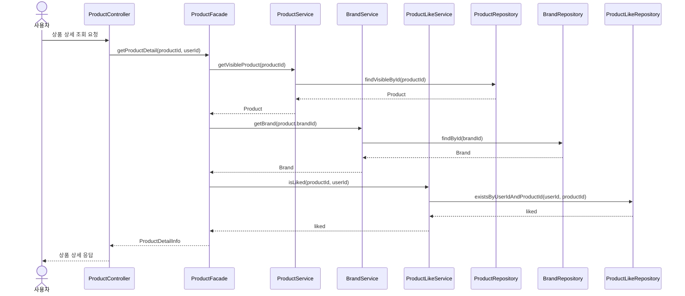
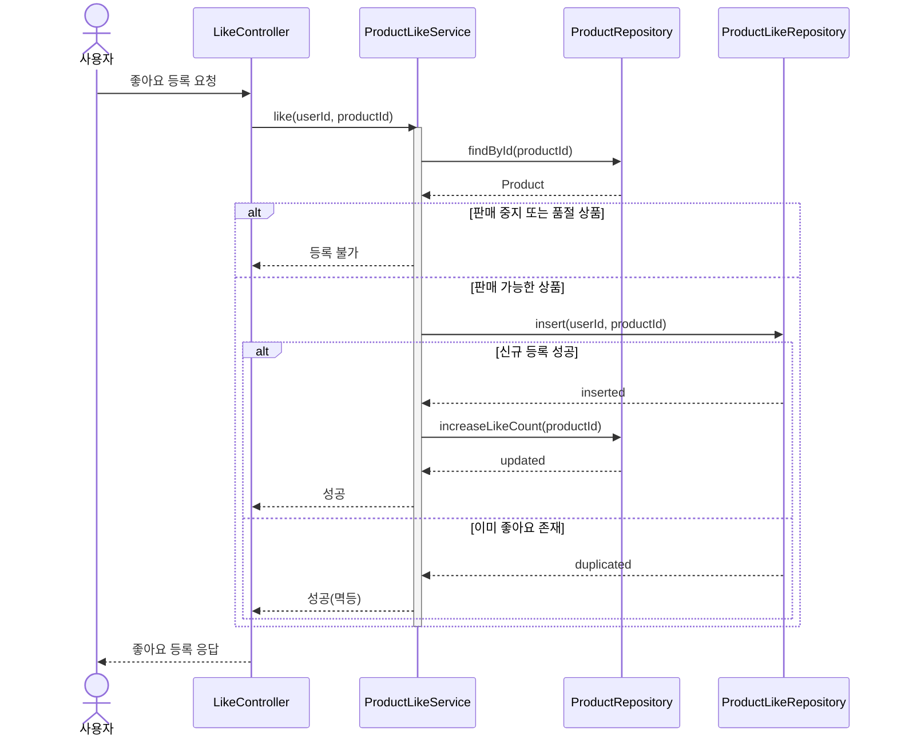
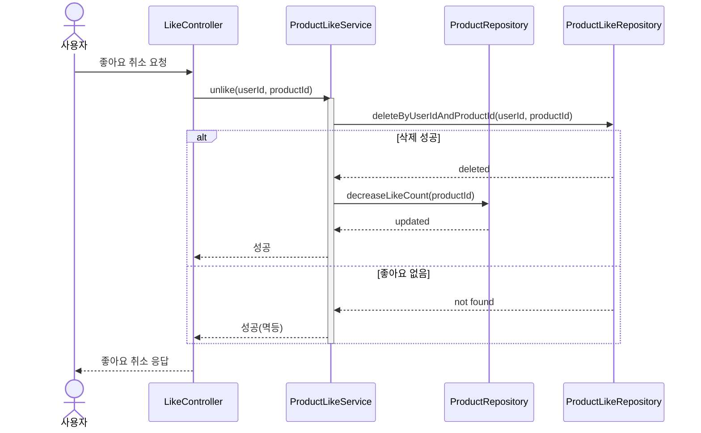
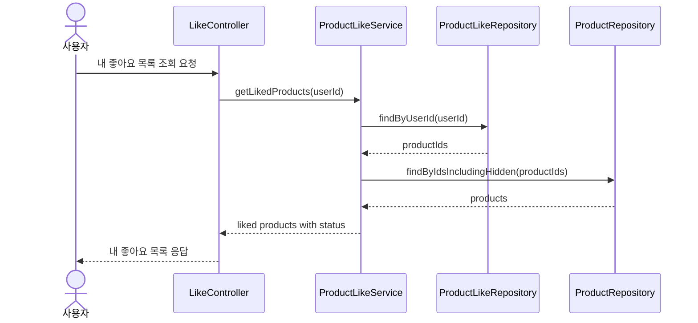
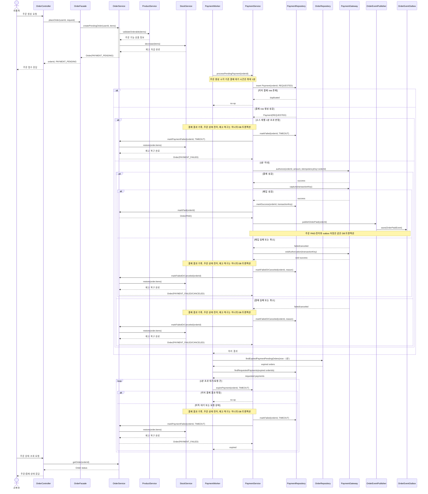
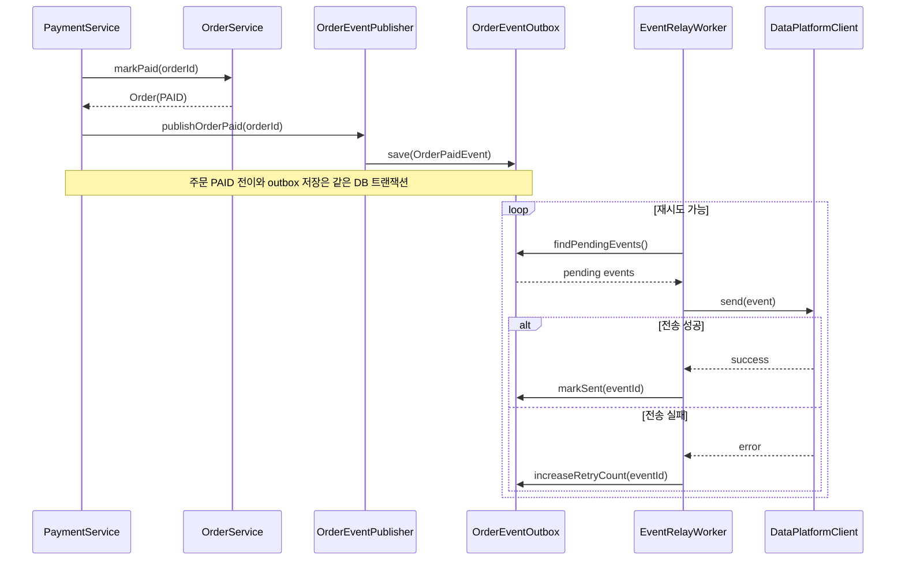

# 2주차 시퀀스 다이어그램

## 읽는 포인트

- 각 다이어그램은 호출 순서 자체보다 책임 경계와 트랜잭션 경계를 확인하기 위한 것이다.
- 상품 조회와 좋아요는 비교적 짧은 흐름이고, 주문/결제는 내부 정합성과 외부 장애를 분리하는 흐름이다.
- 결제 성공 이벤트 전송은 사용자 응답 성공과 외부 데이터 플랫폼 전송 성공이 같은 의미가 아님을 보여준다.

## 상품 상세 조회

이 다이어그램은 상품 상세 조회에서 상품, 브랜드, 좋아요 여부가 어떤 책임으로 조합되는지 확인하기 위해 필요하다. 좋아요 수는 `product.like_count` 카운터를 사용하고, 사용자별 좋아요 여부만 좋아요 이력에서 확인한다.

해석 포인트:

- `ProductService`는 상품 자체의 유효성과 조회 책임에 집중한다.
- 일반 상품 상세 조회는 판매 가능한 상품만 대상으로 한다.
- 브랜드와 좋아요 요약은 `ProductFacade`에서 조합해 도메인 간 직접 의존을 줄인다.
- 좋아요 수는 `product.like_count`를 사용하고, `product_like`는 사용자별 좋아요 여부 확인에 사용한다.
- 좋아요 여부는 로그인 사용자 기준 정보이므로, 비로그인 조회 정책이 필요하다.

## 좋아요 등록

이 다이어그램은 좋아요 등록의 상품 상태 정책, 멱등성, 카운터 갱신 책임을 확인하기 위해 필요하다. 판매 가능한 상품에만 새 좋아요를 등록할 수 있고, 실제 신규 등록일 때만 상품 좋아요 수를 증가시킨다.

해석 포인트:

- 좋아요 멱등성 기준은 `userId + productId` 유니크 제약이다.
- 좋아요 등록은 판매 가능한 상품에만 허용한다.
- 판매 중지/품절 상품에 대한 좋아요 등록 요청은 허용하지 않는다.
- 좋아요 이력 insert와 `like_count` 증가는 같은 DB 트랜잭션에서 처리한다.
- 좋아요 카운터는 신규 등록 시에만 DB 원자적 업데이트로 증가한다.
- 중복 요청 경합을 대비해 DB unique 제약 위반은 성공 또는 재조회로 변환한다.

## 좋아요 취소

이 다이어그램은 좋아요 취소의 멱등성과 카운터 감소 책임을 확인하기 위해 필요하다. 사용자가 좋아요하지 않은 상품에 취소 요청을 보내도 성공으로 처리하되, 실제 삭제된 이력이 있을 때만 상품 좋아요 수를 감소시킨다.

해석 포인트:

- 좋아요 이력 delete와 `like_count` 감소는 같은 DB 트랜잭션에서 처리한다.
- 좋아요 취소는 기존 이력 정리 목적이므로 상품 상태와 무관하게 허용한다.
- 좋아요 카운터는 실제 삭제된 이력이 있을 때만 DB 원자적 업데이트로 감소한다.
- 감소 시 `like_count > 0` 조건을 둬 음수 카운터를 방지한다.

## 내 좋아요 목록 조회

이 다이어그램은 일반 상품 목록과 내 좋아요 목록의 노출 정책이 다르다는 점을 확인하기 위해 필요하다. 일반 상품 목록과 상세 조회는 판매 가능한 상품만 보여주지만, 내 좋아요 목록은 사용자가 예전에 남긴 이력이므로 판매 중지/품절 상품도 포함한다.

해석 포인트:

- 내 좋아요 목록은 `product_like` 이력을 기준으로 조회한다.
- 판매 중지/품절 상품도 예전에 좋아요한 이력이 있으면 목록에 포함한다.
- 응답에는 현재 상품 상태를 포함해 주문 가능 상품과 불가능 상품을 구분할 수 있게 한다.
- 일반 상품 목록과 상세 조회의 판매 가능 상품 필터를 그대로 재사용하면 과거 좋아요 이력이 누락될 수 있다.

## 주문 생성 및 내부 비동기 결제

이 다이어그램은 주문, 재고, 결제의 책임 경계와 트랜잭션 범위를 확인하기 위해 필요하다. 주문 생성 API는 `PAYMENT_PENDING`을 먼저 응답하고, 외부 결제 요청은 내부 비동기 흐름에서 처리한다.

해석 포인트:

- `createPendingOrder` 내부는 DB 정합성이 필요한 트랜잭션 경계다.
- 주문 생성 API는 `orderId`와 `PAYMENT_PENDING`을 응답하고 사용자는 상태 조회 API로 결제 결과를 확인한다.
- 외부 결제 요청은 서버 내부 비동기 흐름에서 실행해 사용자 응답과 외부 결제 지연을 분리한다.
- 외부 결제 요청 전 `payment(order_id, status=REQUESTED)` row를 먼저 생성해 처리 권한을 선점한다.
- `payment.order_id` unique 제약 때문에 같은 주문은 하나의 worker만 외부 결제를 요청한다.
- 외부 결제 요청에는 `orderId` 기반 idempotency key를 사용한다.
- 외부 결제 시스템은 `auth/capture/void` 계약을 지원한다고 가정한다.
- `auth`는 승인, `capture`는 실제 매입, `void`는 승인 취소로 정의한다.
- 결제 성공 시 `PaymentService`는 외부 데이터 플랫폼을 직접 호출하지 않고, `OrderEventPublisher`를 통해 outbox 저장만 요청한다.
- `PAYMENT_PENDING` 1분 초과 여부는 주문 생성 시각 기준으로 소스 레벨에서 판정하며, 별도 타임아웃 컬럼은 두지 않는다.
- worker는 `PAYMENT_PENDING` 주문과 `REQUESTED` 결제를 스캔해 외부 결제 응답 지연이나 worker 중단 후에도 1분 초과 건을 만료 처리한다.
- 1분 초과 시 `PAYMENT_FAILED`로 전이하고 실패 사유 값은 `TIMEOUT`으로 처리한다.
- 이미 성공/실패/취소로 확정된 결제 결과는 만료 스캔에서 다시 처리하지 않는다.
- 1분 이후 도착한 결제 성공 응답은 이미 실패 처리된 주문을 다시 `PAID`로 되돌리지 않는다.
- 결제 실패, 취소, 타임아웃 시 결제 결과 기록, 주문 상태 전이, 재고 복구는 하나의 DB 트랜잭션으로 처리한다.

## 결제 성공 이벤트 전송

이 다이어그램은 외부 데이터 플랫폼 장애가 주문 성공 자체를 깨지 않도록 분리하는 흐름을 확인하기 위해 필요하다. 주문/결제 성공과 외부 전송은 서로 다른 신뢰 경계를 가진다.

해석 포인트:

- 외부 데이터 플랫폼 전송은 주문 결제 성공 이후의 부가 연동으로 분리한다.
- Outbox를 두면 주문 성공 이벤트 저장과 주문 상태 변경을 같은 DB 트랜잭션으로 묶을 수 있다.
- `DataPlatformClient`는 `EventRelayWorker`만 사용하고, `PaymentService`는 직접 의존하지 않는다.
- 전송 실패는 사용자 응답 실패가 아니라 재시도 대상이다.
