# 02. 시퀀스 다이어그램

> 본 문서는 `.docs/design/01-requirements.md` 의 기능 ID 기준으로 작성한다.
> 시퀀스 다이어그램은 기능 하나당 하나의 Mermaid `sequenceDiagram` 으로 작성한다.
> DDD 관점에서 `API` 는 입출력 계약, `Facade` 는 유스케이스/트랜잭션 경계, `Domain` 은 규칙과 상태 전이, `Repository` 는 도메인 저장소 계약으로 표현한다.

## 0. 공통 설계 관점

- 사용자 API 는 `interfaces.api.<domain>`, 관리자 API 는 `interfaces.api.admin.<domain>` 책임으로 본다.
- 여러 도메인이 결합되는 주문/결제 흐름은 `application.order` 또는 `application.payment` Facade 가 오케스트레이션한다.
- 도메인 규칙은 Aggregate 또는 Domain Service 가 판단하고, Repository 는 조회/저장 계약만 수행한다.
- 행동 기록은 `UserActionLog` 또는 이후 이벤트 발행 대상으로 남긴다.
- 로그인 실패, 존재하지 않는 리소스, 논리 삭제 상태, 상태 전이 불가, 금액/재고 불일치는 중요 예외로 명시한다.

## 1. 회원

### F-Member-1. 회원가입한다

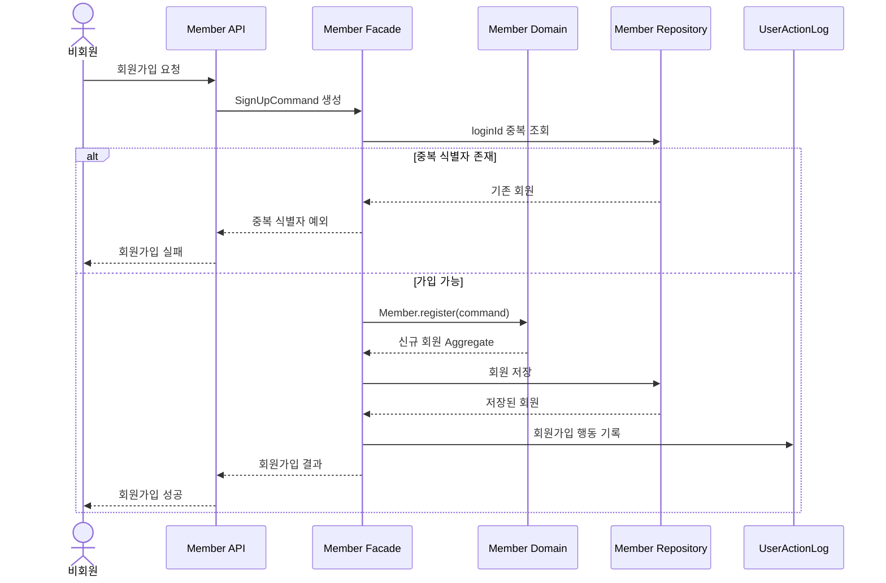
```mermaid
sequenceDiagram
    actor Guest as 비회원
    participant API as Member API
    participant Facade as Member Facade
    participant Member as Member Domain
    participant Repo as Member Repository
    participant Log as UserActionLog

    Guest->>API: 회원가입 요청
    API->>Facade: SignUpCommand 생성
    Facade->>Repo: loginId 중복 조회
    alt 중복 식별자 존재
        Repo-->>Facade: 기존 회원
        Facade-->>API: 중복 식별자 예외
        API-->>Guest: 회원가입 실패
    else 가입 가능
        Facade->>Member: Member.register(command)
        Member-->>Facade: 신규 회원 Aggregate
        Facade->>Repo: 회원 저장
        Repo-->>Facade: 저장된 회원
        Facade->>Log: 회원가입 행동 기록
        Facade-->>API: 회원가입 결과
        API-->>Guest: 회원가입 성공
    end
```

### F-Member-2. 내 정보를 조회한다

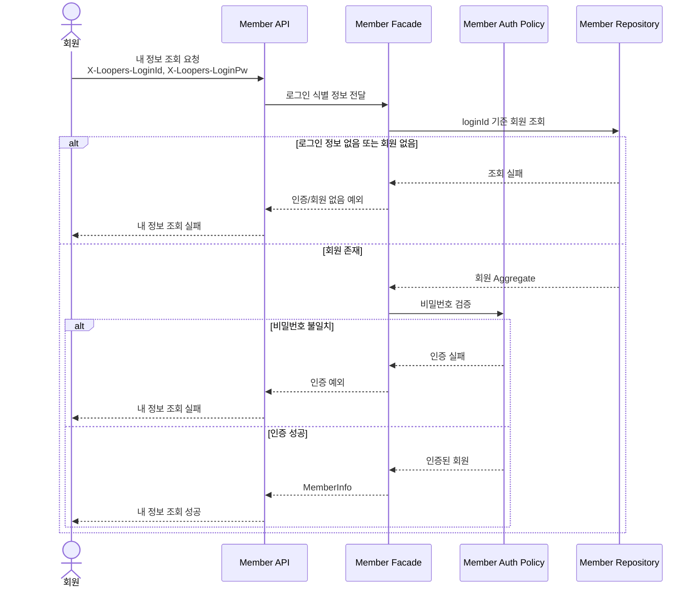
```mermaid
sequenceDiagram
    actor MemberUser as 회원
    participant API as Member API
    participant Facade as Member Facade
    participant Auth as Member Auth Policy
    participant Repo as Member Repository

    MemberUser->>API: 내 정보 조회 요청<br/>X-Loopers-LoginId, X-Loopers-LoginPw
    API->>Facade: 로그인 식별 정보 전달
    Facade->>Repo: loginId 기준 회원 조회
    alt 로그인 정보 없음 또는 회원 없음
        Repo-->>Facade: 조회 실패
        Facade-->>API: 인증/회원 없음 예외
        API-->>MemberUser: 내 정보 조회 실패
    else 회원 존재
        Repo-->>Facade: 회원 Aggregate
        Facade->>Auth: 비밀번호 검증
        alt 비밀번호 불일치
            Auth-->>Facade: 인증 실패
            Facade-->>API: 인증 예외
            API-->>MemberUser: 내 정보 조회 실패
        else 인증 성공
            Auth-->>Facade: 인증된 회원
            Facade-->>API: MemberInfo
            API-->>MemberUser: 내 정보 조회 성공
        end
    end
```

### F-Member-3. 비밀번호를 변경한다

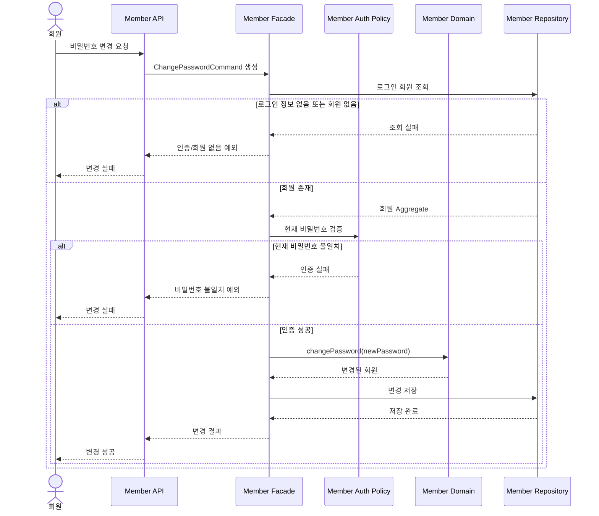
```mermaid
sequenceDiagram
    actor MemberUser as 회원
    participant API as Member API
    participant Facade as Member Facade
    participant Auth as Member Auth Policy
    participant Member as Member Domain
    participant Repo as Member Repository

    MemberUser->>API: 비밀번호 변경 요청
    API->>Facade: ChangePasswordCommand 생성
    Facade->>Repo: 로그인 회원 조회
    alt 로그인 정보 없음 또는 회원 없음
        Repo-->>Facade: 조회 실패
        Facade-->>API: 인증/회원 없음 예외
        API-->>MemberUser: 변경 실패
    else 회원 존재
        Repo-->>Facade: 회원 Aggregate
        Facade->>Auth: 현재 비밀번호 검증
        alt 현재 비밀번호 불일치
            Auth-->>Facade: 인증 실패
            Facade-->>API: 비밀번호 불일치 예외
            API-->>MemberUser: 변경 실패
        else 인증 성공
            Facade->>Member: changePassword(newPassword)
            Member-->>Facade: 변경된 회원
            Facade->>Repo: 변경 저장
            Repo-->>Facade: 저장 완료
            Facade-->>API: 변경 결과
            API-->>MemberUser: 변경 성공
        end
    end
```

## 2. 브랜드 및 상품

### F-Brand-1. 브랜드 정보를 조회한다

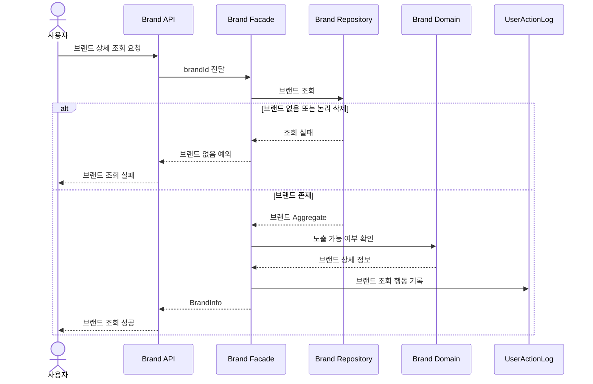
```mermaid
sequenceDiagram
    actor User as 사용자
    participant API as Brand API
    participant Facade as Brand Facade
    participant Repo as Brand Repository
    participant Brand as Brand Domain
    participant Log as UserActionLog

    User->>API: 브랜드 상세 조회 요청
    API->>Facade: brandId 전달
    Facade->>Repo: 브랜드 조회
    alt 브랜드 없음 또는 논리 삭제
        Repo-->>Facade: 조회 실패
        Facade-->>API: 브랜드 없음 예외
        API-->>User: 브랜드 조회 실패
    else 브랜드 존재
        Repo-->>Facade: 브랜드 Aggregate
        Facade->>Brand: 노출 가능 여부 확인
        Brand-->>Facade: 브랜드 상세 정보
        Facade->>Log: 브랜드 조회 행동 기록
        Facade-->>API: BrandInfo
        API-->>User: 브랜드 조회 성공
    end
```

### F-Product-1. 상품 목록을 조회한다

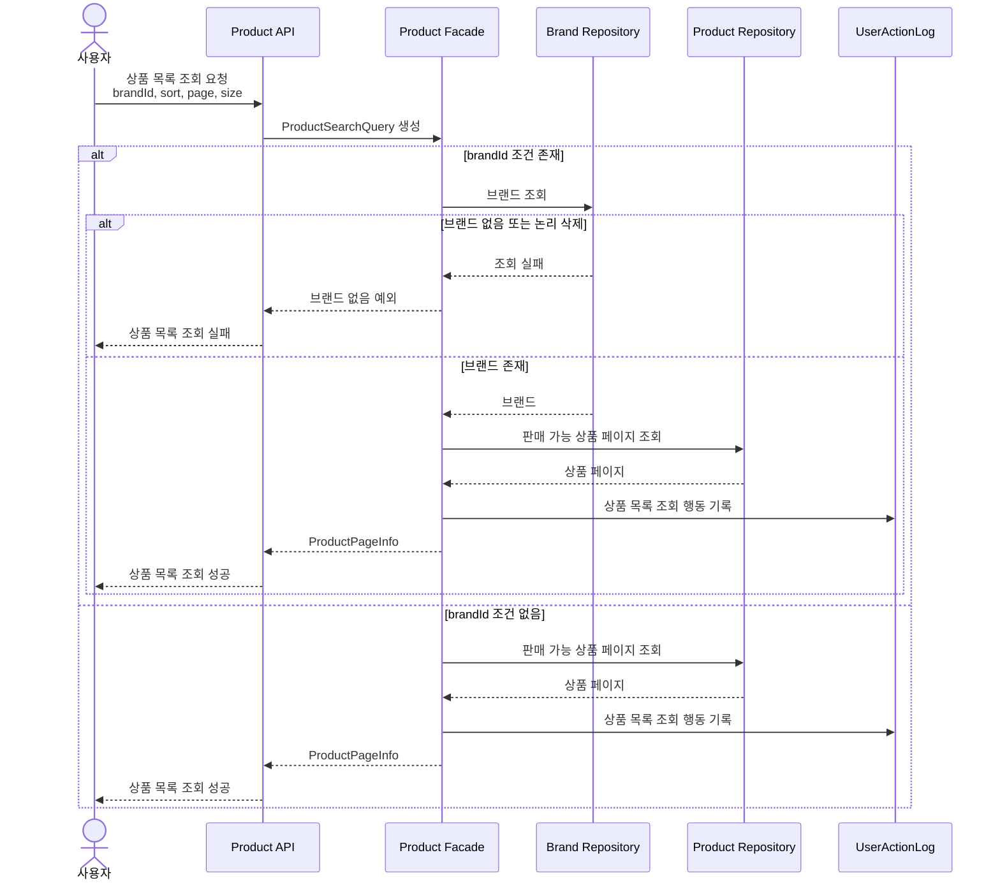
```mermaid
sequenceDiagram
    actor User as 사용자
    participant API as Product API
    participant Facade as Product Facade
    participant BrandRepo as Brand Repository
    participant ProductRepo as Product Repository
    participant Log as UserActionLog

    User->>API: 상품 목록 조회 요청<br/>brandId, sort, page, size
    API->>Facade: ProductSearchQuery 생성
    alt brandId 조건 존재
        Facade->>BrandRepo: 브랜드 조회
        alt 브랜드 없음 또는 논리 삭제
            BrandRepo-->>Facade: 조회 실패
            Facade-->>API: 브랜드 없음 예외
            API-->>User: 상품 목록 조회 실패
        else 브랜드 존재
            BrandRepo-->>Facade: 브랜드
            Facade->>ProductRepo: 판매 가능 상품 페이지 조회
            ProductRepo-->>Facade: 상품 페이지
            Facade->>Log: 상품 목록 조회 행동 기록
            Facade-->>API: ProductPageInfo
            API-->>User: 상품 목록 조회 성공
        end
    else brandId 조건 없음
        Facade->>ProductRepo: 판매 가능 상품 페이지 조회
        ProductRepo-->>Facade: 상품 페이지
        Facade->>Log: 상품 목록 조회 행동 기록
        Facade-->>API: ProductPageInfo
        API-->>User: 상품 목록 조회 성공
    end
```

### F-Product-2. 상품 상세 정보를 조회한다

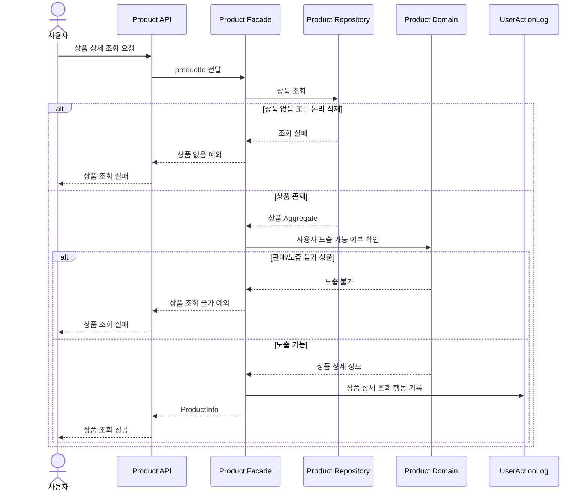
```mermaid
sequenceDiagram
    actor User as 사용자
    participant API as Product API
    participant Facade as Product Facade
    participant Repo as Product Repository
    participant Product as Product Domain
    participant Log as UserActionLog

    User->>API: 상품 상세 조회 요청
    API->>Facade: productId 전달
    Facade->>Repo: 상품 조회
    alt 상품 없음 또는 논리 삭제
        Repo-->>Facade: 조회 실패
        Facade-->>API: 상품 없음 예외
        API-->>User: 상품 조회 실패
    else 상품 존재
        Repo-->>Facade: 상품 Aggregate
        Facade->>Product: 사용자 노출 가능 여부 확인
        alt 판매/노출 불가 상품
            Product-->>Facade: 노출 불가
            Facade-->>API: 상품 조회 불가 예외
            API-->>User: 상품 조회 실패
        else 노출 가능
            Product-->>Facade: 상품 상세 정보
            Facade->>Log: 상품 상세 조회 행동 기록
            Facade-->>API: ProductInfo
            API-->>User: 상품 조회 성공
        end
    end
```

## 3. 좋아요

### F-ProductLike-1. 상품 좋아요를 등록한다

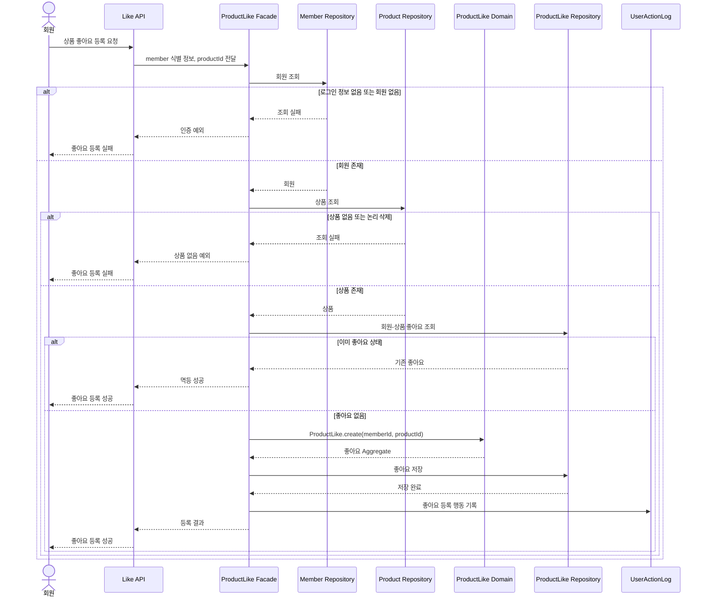
```mermaid
sequenceDiagram
    actor MemberUser as 회원
    participant API as Like API
    participant Facade as ProductLike Facade
    participant MemberRepo as Member Repository
    participant ProductRepo as Product Repository
    participant Like as ProductLike Domain
    participant LikeRepo as ProductLike Repository
    participant Log as UserActionLog

    MemberUser->>API: 상품 좋아요 등록 요청
    API->>Facade: member 식별 정보, productId 전달
    Facade->>MemberRepo: 회원 조회
    alt 로그인 정보 없음 또는 회원 없음
        MemberRepo-->>Facade: 조회 실패
        Facade-->>API: 인증 예외
        API-->>MemberUser: 좋아요 등록 실패
    else 회원 존재
        MemberRepo-->>Facade: 회원
        Facade->>ProductRepo: 상품 조회
        alt 상품 없음 또는 논리 삭제
            ProductRepo-->>Facade: 조회 실패
            Facade-->>API: 상품 없음 예외
            API-->>MemberUser: 좋아요 등록 실패
        else 상품 존재
            ProductRepo-->>Facade: 상품
            Facade->>LikeRepo: 회원-상품 좋아요 조회
            alt 이미 좋아요 상태
                LikeRepo-->>Facade: 기존 좋아요
                Facade-->>API: 멱등 성공
                API-->>MemberUser: 좋아요 등록 성공
            else 좋아요 없음
                Facade->>Like: ProductLike.create(memberId, productId)
                Like-->>Facade: 좋아요 Aggregate
                Facade->>LikeRepo: 좋아요 저장
                LikeRepo-->>Facade: 저장 완료
                Facade->>Log: 좋아요 등록 행동 기록
                Facade-->>API: 등록 결과
                API-->>MemberUser: 좋아요 등록 성공
            end
        end
    end
```

### F-ProductLike-2. 상품 좋아요를 취소한다

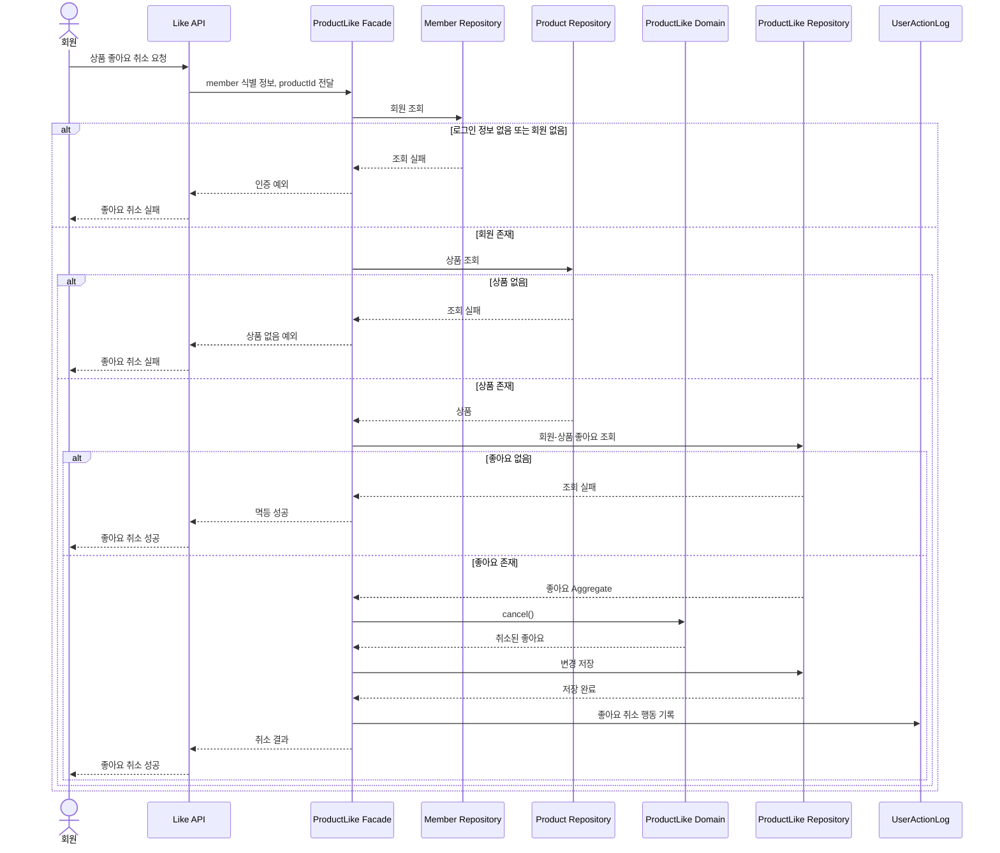
```mermaid
sequenceDiagram
    actor MemberUser as 회원
    participant API as Like API
    participant Facade as ProductLike Facade
    participant MemberRepo as Member Repository
    participant ProductRepo as Product Repository
    participant Like as ProductLike Domain
    participant LikeRepo as ProductLike Repository
    participant Log as UserActionLog

    MemberUser->>API: 상품 좋아요 취소 요청
    API->>Facade: member 식별 정보, productId 전달
    Facade->>MemberRepo: 회원 조회
    alt 로그인 정보 없음 또는 회원 없음
        MemberRepo-->>Facade: 조회 실패
        Facade-->>API: 인증 예외
        API-->>MemberUser: 좋아요 취소 실패
    else 회원 존재
        Facade->>ProductRepo: 상품 조회
        alt 상품 없음
            ProductRepo-->>Facade: 조회 실패
            Facade-->>API: 상품 없음 예외
            API-->>MemberUser: 좋아요 취소 실패
        else 상품 존재
            ProductRepo-->>Facade: 상품
            Facade->>LikeRepo: 회원-상품 좋아요 조회
            alt 좋아요 없음
                LikeRepo-->>Facade: 조회 실패
                Facade-->>API: 멱등 성공
                API-->>MemberUser: 좋아요 취소 성공
            else 좋아요 존재
                LikeRepo-->>Facade: 좋아요 Aggregate
                Facade->>Like: cancel()
                Like-->>Facade: 취소된 좋아요
                Facade->>LikeRepo: 변경 저장
                LikeRepo-->>Facade: 저장 완료
                Facade->>Log: 좋아요 취소 행동 기록
                Facade-->>API: 취소 결과
                API-->>MemberUser: 좋아요 취소 성공
            end
        end
    end
```

### F-ProductLike-3. 내가 좋아요 한 상품 목록을 조회한다

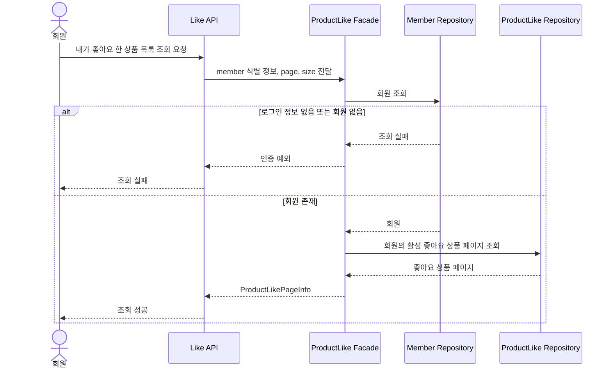
```mermaid
sequenceDiagram
    actor MemberUser as 회원
    participant API as Like API
    participant Facade as ProductLike Facade
    participant MemberRepo as Member Repository
    participant LikeRepo as ProductLike Repository

    MemberUser->>API: 내가 좋아요 한 상품 목록 조회 요청
    API->>Facade: member 식별 정보, page, size 전달
    Facade->>MemberRepo: 회원 조회
    alt 로그인 정보 없음 또는 회원 없음
        MemberRepo-->>Facade: 조회 실패
        Facade-->>API: 인증 예외
        API-->>MemberUser: 조회 실패
    else 회원 존재
        MemberRepo-->>Facade: 회원
        Facade->>LikeRepo: 회원의 활성 좋아요 상품 페이지 조회
        LikeRepo-->>Facade: 좋아요 상품 페이지
        Facade-->>API: ProductLikePageInfo
        API-->>MemberUser: 조회 성공
    end
```

## 4. 쿠폰, 주문, 결제

### F-Coupon-1. 쿠폰을 발급받는다

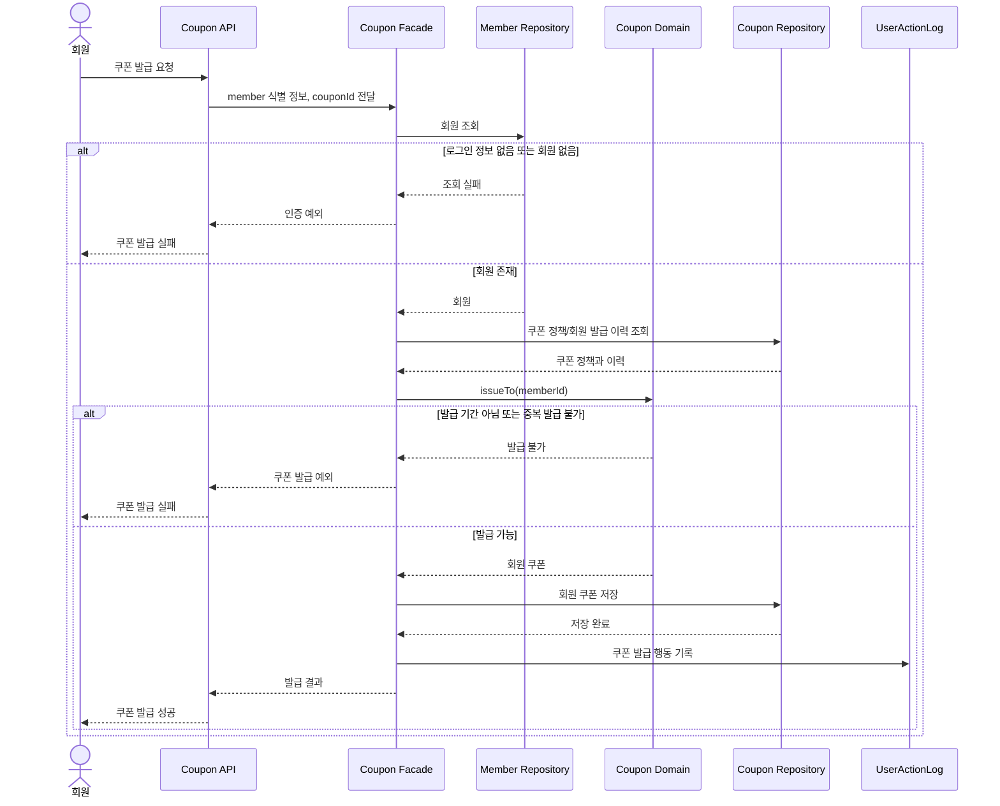
```mermaid
sequenceDiagram
    actor MemberUser as 회원
    participant API as Coupon API
    participant Facade as Coupon Facade
    participant MemberRepo as Member Repository
    participant Coupon as Coupon Domain
    participant Repo as Coupon Repository
    participant Log as UserActionLog

    MemberUser->>API: 쿠폰 발급 요청
    API->>Facade: member 식별 정보, couponId 전달
    Facade->>MemberRepo: 회원 조회
    alt 로그인 정보 없음 또는 회원 없음
        MemberRepo-->>Facade: 조회 실패
        Facade-->>API: 인증 예외
        API-->>MemberUser: 쿠폰 발급 실패
    else 회원 존재
        MemberRepo-->>Facade: 회원
        Facade->>Repo: 쿠폰 정책/회원 발급 이력 조회
        Repo-->>Facade: 쿠폰 정책과 이력
        Facade->>Coupon: issueTo(memberId)
        alt 발급 기간 아님 또는 중복 발급 불가
            Coupon-->>Facade: 발급 불가
            Facade-->>API: 쿠폰 발급 예외
            API-->>MemberUser: 쿠폰 발급 실패
        else 발급 가능
            Coupon-->>Facade: 회원 쿠폰
            Facade->>Repo: 회원 쿠폰 저장
            Repo-->>Facade: 저장 완료
            Facade->>Log: 쿠폰 발급 행동 기록
            Facade-->>API: 발급 결과
            API-->>MemberUser: 쿠폰 발급 성공
        end
    end
```

### F-Order-1. 여러 상품을 한 번에 주문한다

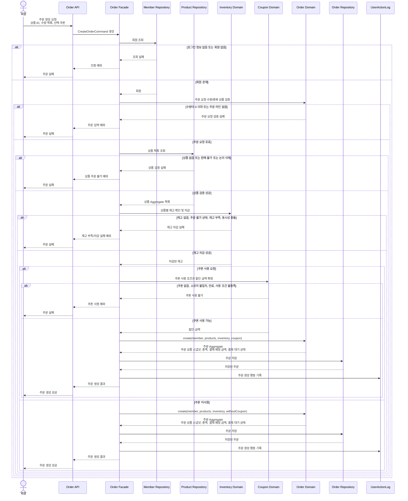
```mermaid
sequenceDiagram
    actor MemberUser as 회원
    participant API as Order API
    participant Facade as Order Facade
    participant MemberRepo as Member Repository
    participant ProductRepo as Product Repository
    participant Inventory as Inventory Domain
    participant Coupon as Coupon Domain
    participant Order as Order Domain
    participant OrderRepo as Order Repository
    participant Log as UserActionLog

    MemberUser->>API: 주문 생성 요청<br/>상품 ID, 수량 목록, 선택 쿠폰
    API->>Facade: CreateOrderCommand 생성
    Facade->>MemberRepo: 회원 조회
    alt 로그인 정보 없음 또는 회원 없음
        MemberRepo-->>Facade: 조회 실패
        Facade-->>API: 인증 예외
        API-->>MemberUser: 주문 실패
    else 회원 존재
        MemberRepo-->>Facade: 회원
        Facade->>Order: 주문 요청 수량/중복 상품 검증
        alt 수량이 0 이하 또는 주문 라인 없음
            Order-->>Facade: 주문 요청 검증 실패
            Facade-->>API: 주문 입력 예외
            API-->>MemberUser: 주문 실패
        else 주문 요청 유효
            Facade->>ProductRepo: 상품 목록 조회
            alt 상품 없음 또는 판매 불가 또는 논리 삭제
                ProductRepo-->>Facade: 상품 검증 실패
                Facade-->>API: 상품 주문 불가 예외
                API-->>MemberUser: 주문 실패
            else 상품 검증 성공
                ProductRepo-->>Facade: 상품 Aggregate 목록
                Facade->>Inventory: 상품별 재고 확인 및 차감
                alt 재고 없음, 주문 불가 상태, 재고 부족, 동시성 충돌
                    Inventory-->>Facade: 재고 차감 실패
                    Facade-->>API: 재고 부족/차감 실패 예외
                    API-->>MemberUser: 주문 실패
                else 재고 차감 성공
                    Inventory-->>Facade: 차감된 재고
                    alt 쿠폰 사용 요청
                        Facade->>Coupon: 쿠폰 사용 조건과 할인 금액 확정
                        alt 쿠폰 없음, 소유자 불일치, 만료, 사용 조건 불충족
                            Coupon-->>Facade: 쿠폰 사용 불가
                            Facade-->>API: 쿠폰 사용 예외
                            API-->>MemberUser: 주문 실패
                        else 쿠폰 사용 가능
                            Coupon-->>Facade: 할인 금액
                            Facade->>Order: create(member, products, inventory, coupon)
                            Order-->>Facade: 주문 Aggregate<br/>주문 상품 스냅샷, 총액, 결제 예정 금액, 결제 대기 상태
                            Facade->>OrderRepo: 주문 저장
                            OrderRepo-->>Facade: 저장된 주문
                            Facade->>Log: 주문 생성 행동 기록
                            Facade-->>API: 주문 생성 결과
                            API-->>MemberUser: 주문 생성 성공
                        end
                    else 쿠폰 미사용
                        Facade->>Order: create(member, products, inventory, withoutCoupon)
                        Order-->>Facade: 주문 Aggregate<br/>주문 상품 스냅샷, 총액, 결제 예정 금액, 결제 대기 상태
                        Facade->>OrderRepo: 주문 저장
                        OrderRepo-->>Facade: 저장된 주문
                        Facade->>Log: 주문 생성 행동 기록
                        Facade-->>API: 주문 생성 결과
                        API-->>MemberUser: 주문 생성 성공
                    end
                end
            end
        end
    end
```

### F-Order-2. 내 주문 목록을 조회한다

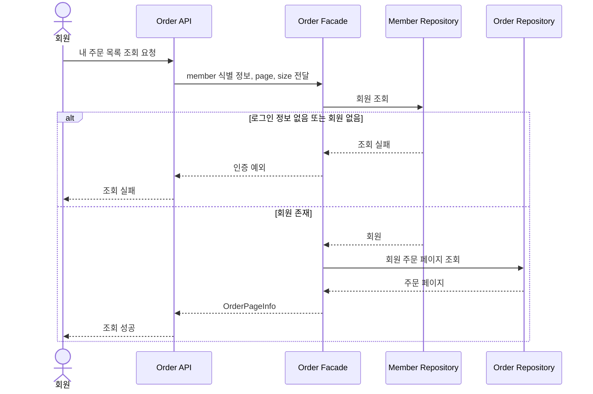
```mermaid
sequenceDiagram
    actor MemberUser as 회원
    participant API as Order API
    participant Facade as Order Facade
    participant MemberRepo as Member Repository
    participant OrderRepo as Order Repository

    MemberUser->>API: 내 주문 목록 조회 요청
    API->>Facade: member 식별 정보, page, size 전달
    Facade->>MemberRepo: 회원 조회
    alt 로그인 정보 없음 또는 회원 없음
        MemberRepo-->>Facade: 조회 실패
        Facade-->>API: 인증 예외
        API-->>MemberUser: 조회 실패
    else 회원 존재
        MemberRepo-->>Facade: 회원
        Facade->>OrderRepo: 회원 주문 페이지 조회
        OrderRepo-->>Facade: 주문 페이지
        Facade-->>API: OrderPageInfo
        API-->>MemberUser: 조회 성공
    end
```

### F-Order-3. 내 주문 상세를 조회한다

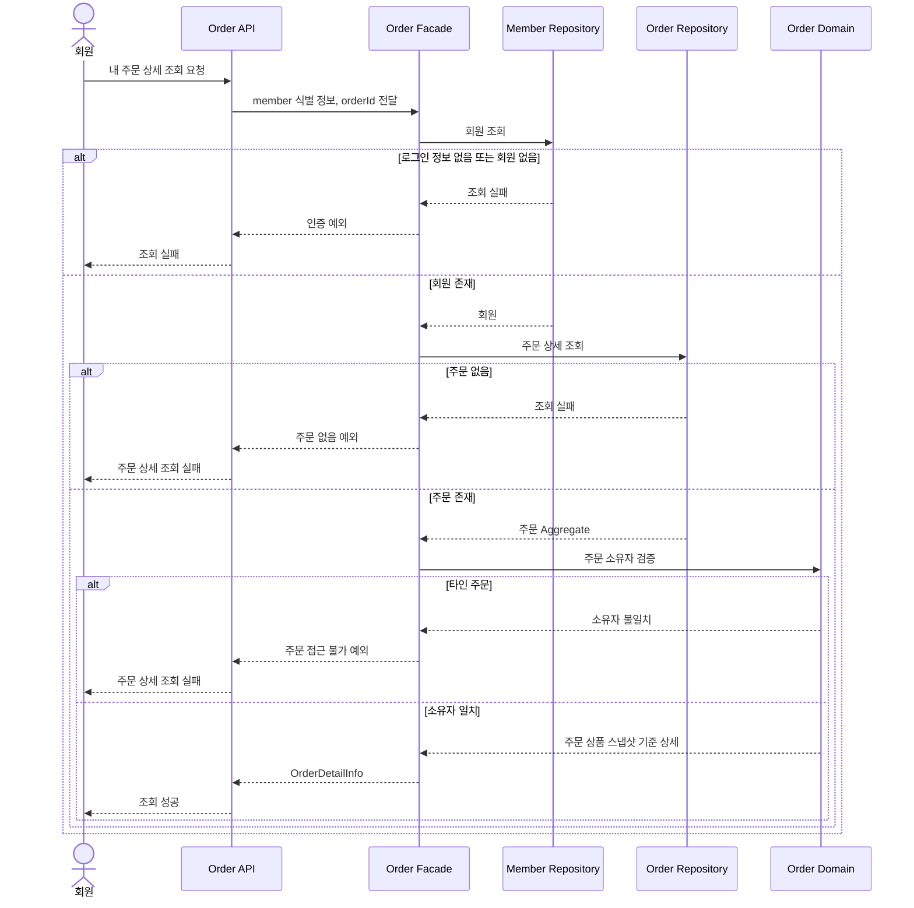
```mermaid
sequenceDiagram
    actor MemberUser as 회원
    participant API as Order API
    participant Facade as Order Facade
    participant MemberRepo as Member Repository
    participant OrderRepo as Order Repository
    participant Order as Order Domain

    MemberUser->>API: 내 주문 상세 조회 요청
    API->>Facade: member 식별 정보, orderId 전달
    Facade->>MemberRepo: 회원 조회
    alt 로그인 정보 없음 또는 회원 없음
        MemberRepo-->>Facade: 조회 실패
        Facade-->>API: 인증 예외
        API-->>MemberUser: 조회 실패
    else 회원 존재
        MemberRepo-->>Facade: 회원
        Facade->>OrderRepo: 주문 상세 조회
        alt 주문 없음
            OrderRepo-->>Facade: 조회 실패
            Facade-->>API: 주문 없음 예외
            API-->>MemberUser: 주문 상세 조회 실패
        else 주문 존재
            OrderRepo-->>Facade: 주문 Aggregate
            Facade->>Order: 주문 소유자 검증
            alt 타인 주문
                Order-->>Facade: 소유자 불일치
                Facade-->>API: 주문 접근 불가 예외
                API-->>MemberUser: 주문 상세 조회 실패
            else 소유자 일치
                Order-->>Facade: 주문 상품 스냅샷 기준 상세
                Facade-->>API: OrderDetailInfo
                API-->>MemberUser: 조회 성공
            end
        end
    end
```

### F-Payment-1. 주문을 결제한다

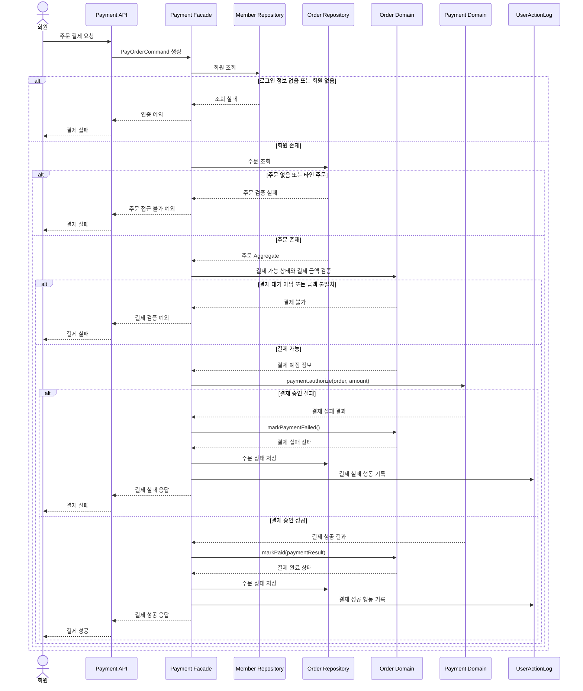
```mermaid
sequenceDiagram
    actor MemberUser as 회원
    participant API as Payment API
    participant Facade as Payment Facade
    participant MemberRepo as Member Repository
    participant OrderRepo as Order Repository
    participant Order as Order Domain
    participant Payment as Payment Domain
    participant Log as UserActionLog

    MemberUser->>API: 주문 결제 요청
    API->>Facade: PayOrderCommand 생성
    Facade->>MemberRepo: 회원 조회
    alt 로그인 정보 없음 또는 회원 없음
        MemberRepo-->>Facade: 조회 실패
        Facade-->>API: 인증 예외
        API-->>MemberUser: 결제 실패
    else 회원 존재
        Facade->>OrderRepo: 주문 조회
        alt 주문 없음 또는 타인 주문
            OrderRepo-->>Facade: 주문 검증 실패
            Facade-->>API: 주문 접근 불가 예외
            API-->>MemberUser: 결제 실패
        else 주문 존재
            OrderRepo-->>Facade: 주문 Aggregate
            Facade->>Order: 결제 가능 상태와 결제 금액 검증
            alt 결제 대기 아님 또는 금액 불일치
                Order-->>Facade: 결제 불가
                Facade-->>API: 결제 검증 예외
                API-->>MemberUser: 결제 실패
            else 결제 가능
                Order-->>Facade: 결제 예정 정보
                Facade->>Payment: payment.authorize(order, amount)
                alt 결제 승인 실패
                    Payment-->>Facade: 결제 실패 결과
                    Facade->>Order: markPaymentFailed()
                    Order-->>Facade: 결제 실패 상태
                    Facade->>OrderRepo: 주문 상태 저장
                    Facade->>Log: 결제 실패 행동 기록
                    Facade-->>API: 결제 실패 응답
                    API-->>MemberUser: 결제 실패
                else 결제 승인 성공
                    Payment-->>Facade: 결제 성공 결과
                    Facade->>Order: markPaid(paymentResult)
                    Order-->>Facade: 결제 완료 상태
                    Facade->>OrderRepo: 주문 상태 저장
                    Facade->>Log: 결제 성공 행동 기록
                    Facade-->>API: 결제 성공 응답
                    API-->>MemberUser: 결제 성공
                end
            end
        end
    end
```

## 5. 관리자 브랜드/상품 관리

### F-Brand-2. 브랜드 목록을 조회한다

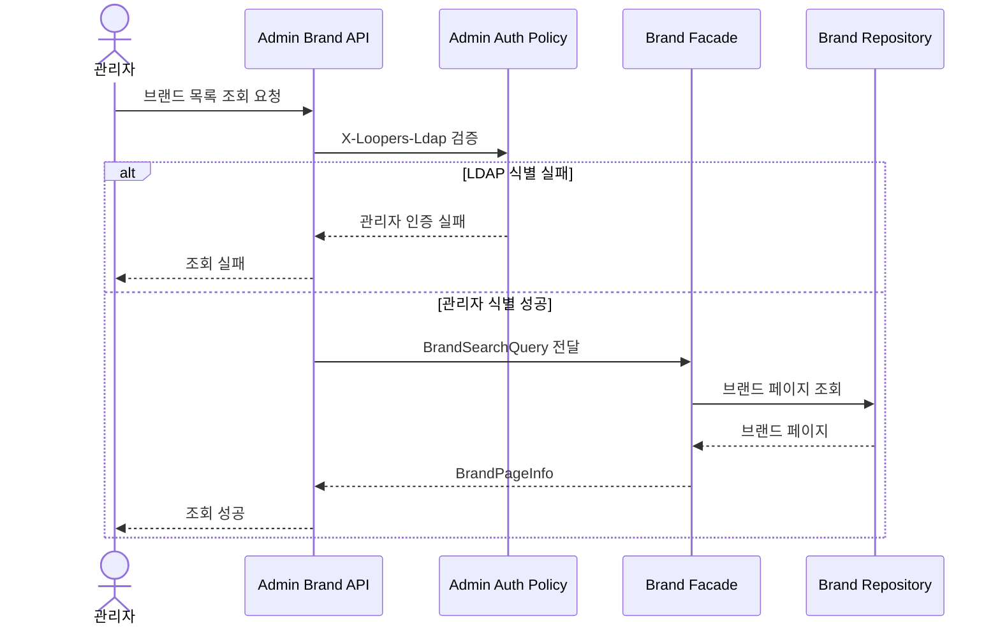
```mermaid
sequenceDiagram
    actor Admin as 관리자
    participant API as Admin Brand API
    participant Auth as Admin Auth Policy
    participant Facade as Brand Facade
    participant Repo as Brand Repository

    Admin->>API: 브랜드 목록 조회 요청
    API->>Auth: X-Loopers-Ldap 검증
    alt LDAP 식별 실패
        Auth-->>API: 관리자 인증 실패
        API-->>Admin: 조회 실패
    else 관리자 식별 성공
        API->>Facade: BrandSearchQuery 전달
        Facade->>Repo: 브랜드 페이지 조회
        Repo-->>Facade: 브랜드 페이지
        Facade-->>API: BrandPageInfo
        API-->>Admin: 조회 성공
    end
```

### F-Brand-3. 브랜드 상세를 조회한다

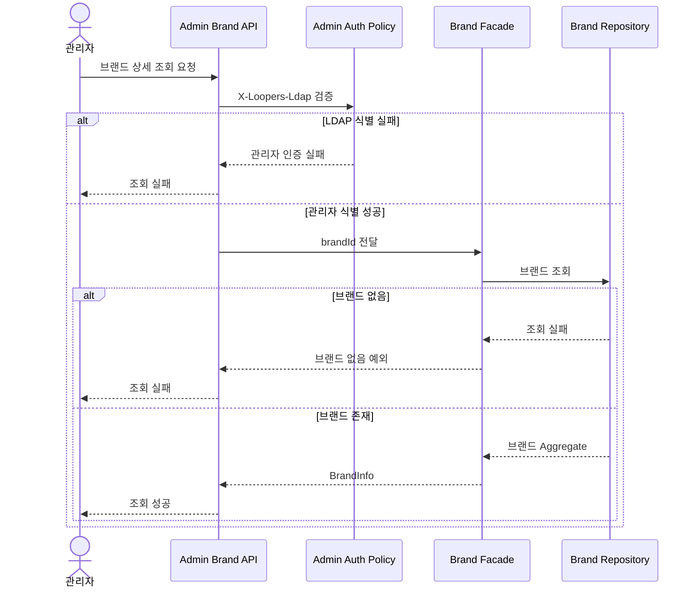
```mermaid
sequenceDiagram
    actor Admin as 관리자
    participant API as Admin Brand API
    participant Auth as Admin Auth Policy
    participant Facade as Brand Facade
    participant Repo as Brand Repository

    Admin->>API: 브랜드 상세 조회 요청
    API->>Auth: X-Loopers-Ldap 검증
    alt LDAP 식별 실패
        Auth-->>API: 관리자 인증 실패
        API-->>Admin: 조회 실패
    else 관리자 식별 성공
        API->>Facade: brandId 전달
        Facade->>Repo: 브랜드 조회
        alt 브랜드 없음
            Repo-->>Facade: 조회 실패
            Facade-->>API: 브랜드 없음 예외
            API-->>Admin: 조회 실패
        else 브랜드 존재
            Repo-->>Facade: 브랜드 Aggregate
            Facade-->>API: BrandInfo
            API-->>Admin: 조회 성공
        end
    end
```

### F-Brand-4. 브랜드를 등록한다

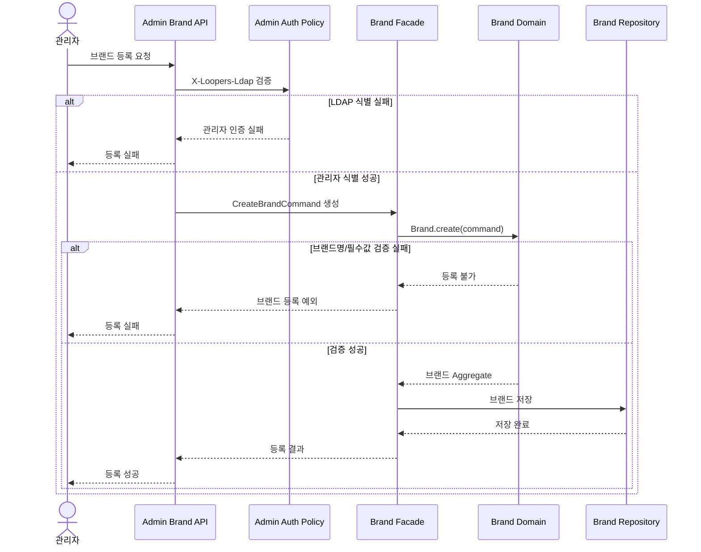
```mermaid
sequenceDiagram
    actor Admin as 관리자
    participant API as Admin Brand API
    participant Auth as Admin Auth Policy
    participant Facade as Brand Facade
    participant Brand as Brand Domain
    participant Repo as Brand Repository

    Admin->>API: 브랜드 등록 요청
    API->>Auth: X-Loopers-Ldap 검증
    alt LDAP 식별 실패
        Auth-->>API: 관리자 인증 실패
        API-->>Admin: 등록 실패
    else 관리자 식별 성공
        API->>Facade: CreateBrandCommand 생성
        Facade->>Brand: Brand.create(command)
        alt 브랜드명/필수값 검증 실패
            Brand-->>Facade: 등록 불가
            Facade-->>API: 브랜드 등록 예외
            API-->>Admin: 등록 실패
        else 검증 성공
            Brand-->>Facade: 브랜드 Aggregate
            Facade->>Repo: 브랜드 저장
            Repo-->>Facade: 저장 완료
            Facade-->>API: 등록 결과
            API-->>Admin: 등록 성공
        end
    end
```

### F-Brand-5. 브랜드 정보를 수정한다

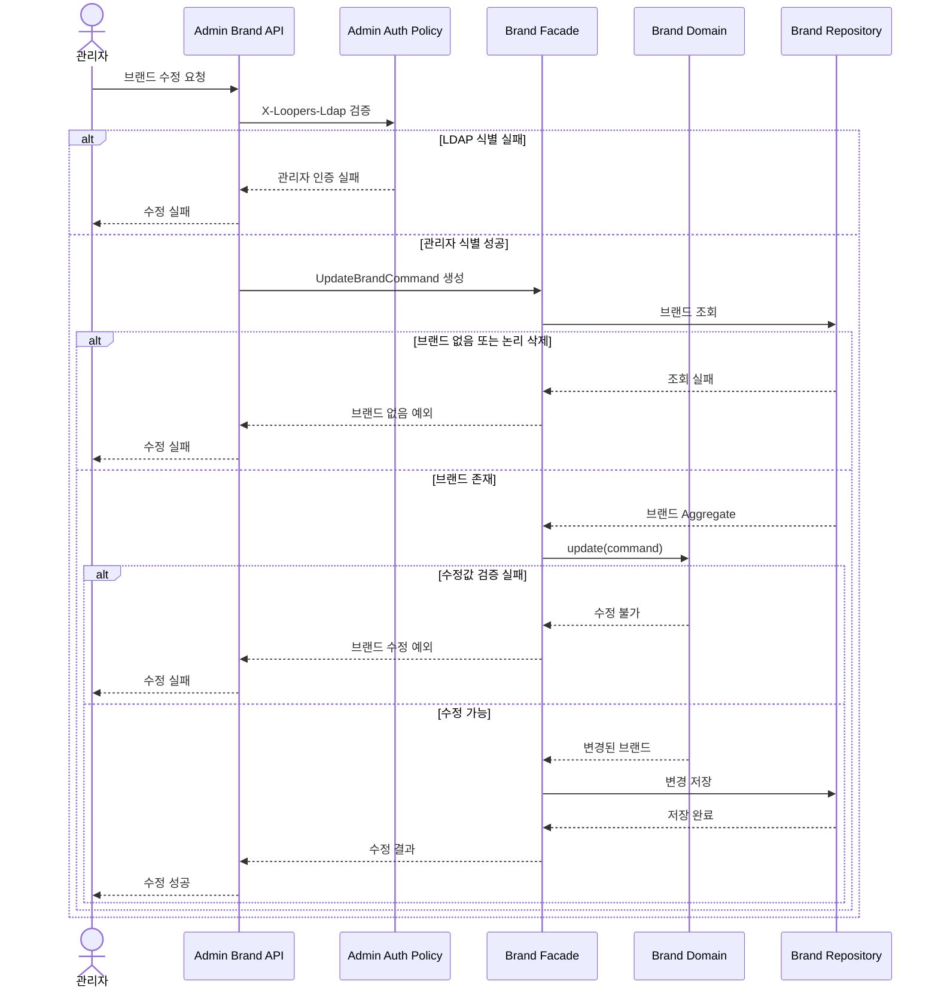
```mermaid
sequenceDiagram
    actor Admin as 관리자
    participant API as Admin Brand API
    participant Auth as Admin Auth Policy
    participant Facade as Brand Facade
    participant Brand as Brand Domain
    participant Repo as Brand Repository

    Admin->>API: 브랜드 수정 요청
    API->>Auth: X-Loopers-Ldap 검증
    alt LDAP 식별 실패
        Auth-->>API: 관리자 인증 실패
        API-->>Admin: 수정 실패
    else 관리자 식별 성공
        API->>Facade: UpdateBrandCommand 생성
        Facade->>Repo: 브랜드 조회
        alt 브랜드 없음 또는 논리 삭제
            Repo-->>Facade: 조회 실패
            Facade-->>API: 브랜드 없음 예외
            API-->>Admin: 수정 실패
        else 브랜드 존재
            Repo-->>Facade: 브랜드 Aggregate
            Facade->>Brand: update(command)
            alt 수정값 검증 실패
                Brand-->>Facade: 수정 불가
                Facade-->>API: 브랜드 수정 예외
                API-->>Admin: 수정 실패
            else 수정 가능
                Brand-->>Facade: 변경된 브랜드
                Facade->>Repo: 변경 저장
                Repo-->>Facade: 저장 완료
                Facade-->>API: 수정 결과
                API-->>Admin: 수정 성공
            end
        end
    end
```

### F-Brand-6. 브랜드를 삭제한다

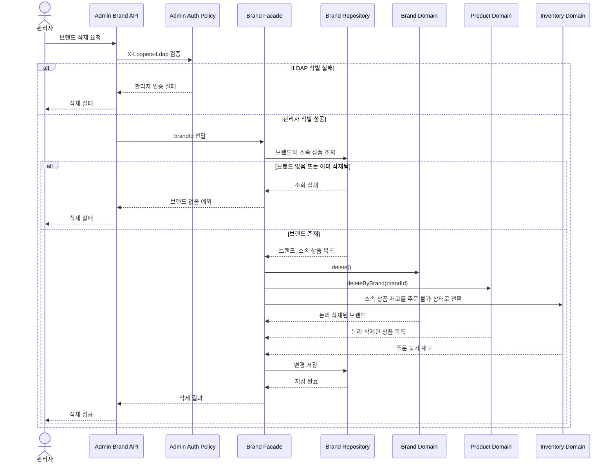
```mermaid
sequenceDiagram
    actor Admin as 관리자
    participant API as Admin Brand API
    participant Auth as Admin Auth Policy
    participant Facade as Brand Facade
    participant BrandRepo as Brand Repository
    participant Brand as Brand Domain
    participant Product as Product Domain
    participant Inventory as Inventory Domain

    Admin->>API: 브랜드 삭제 요청
    API->>Auth: X-Loopers-Ldap 검증
    alt LDAP 식별 실패
        Auth-->>API: 관리자 인증 실패
        API-->>Admin: 삭제 실패
    else 관리자 식별 성공
        API->>Facade: brandId 전달
        Facade->>BrandRepo: 브랜드와 소속 상품 조회
        alt 브랜드 없음 또는 이미 삭제됨
            BrandRepo-->>Facade: 조회 실패
            Facade-->>API: 브랜드 없음 예외
            API-->>Admin: 삭제 실패
        else 브랜드 존재
            BrandRepo-->>Facade: 브랜드, 소속 상품 목록
            Facade->>Brand: delete()
            Facade->>Product: deleteByBrand(brandId)
            Facade->>Inventory: 소속 상품 재고를 주문 불가 상태로 전환
            Brand-->>Facade: 논리 삭제된 브랜드
            Product-->>Facade: 논리 삭제된 상품 목록
            Inventory-->>Facade: 주문 불가 재고
            Facade->>BrandRepo: 변경 저장
            BrandRepo-->>Facade: 저장 완료
            Facade-->>API: 삭제 결과
            API-->>Admin: 삭제 성공
        end
    end
```

### F-Product-3. 상품 목록을 조회한다

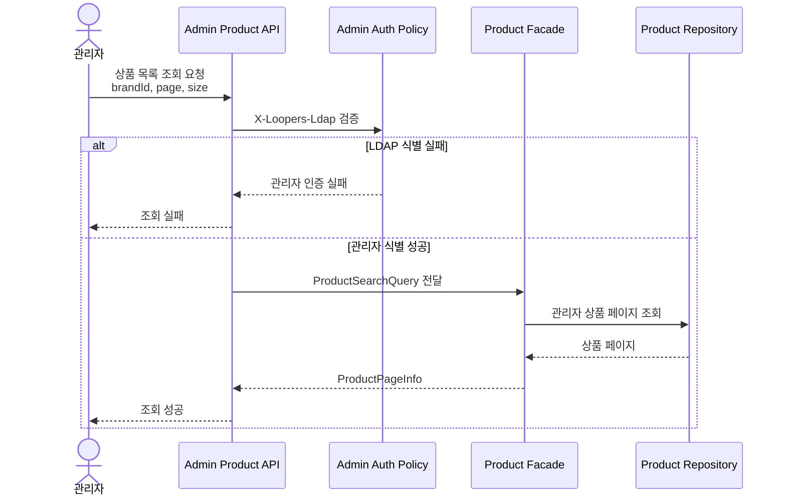
```mermaid
sequenceDiagram
    actor Admin as 관리자
    participant API as Admin Product API
    participant Auth as Admin Auth Policy
    participant Facade as Product Facade
    participant Repo as Product Repository

    Admin->>API: 상품 목록 조회 요청<br/>brandId, page, size
    API->>Auth: X-Loopers-Ldap 검증
    alt LDAP 식별 실패
        Auth-->>API: 관리자 인증 실패
        API-->>Admin: 조회 실패
    else 관리자 식별 성공
        API->>Facade: ProductSearchQuery 전달
        Facade->>Repo: 관리자 상품 페이지 조회
        Repo-->>Facade: 상품 페이지
        Facade-->>API: ProductPageInfo
        API-->>Admin: 조회 성공
    end
```

### F-Product-4. 상품 상세를 조회한다

```mermaid
sequenceDiagram
    actor Admin as 관리자
    participant API as Admin Product API
    participant Auth as Admin Auth Policy
    participant Facade as Product Facade
    participant Repo as Product Repository

    Admin->>API: 상품 상세 조회 요청
    API->>Auth: X-Loopers-Ldap 검증
    alt LDAP 식별 실패
        Auth-->>API: 관리자 인증 실패
        API-->>Admin: 조회 실패
    else 관리자 식별 성공
        API->>Facade: productId 전달
        Facade->>Repo: 상품 조회
        alt 상품 없음
            Repo-->>Facade: 조회 실패
            Facade-->>API: 상품 없음 예외
            API-->>Admin: 조회 실패
        else 상품 존재
            Repo-->>Facade: 상품 Aggregate
            Facade-->>API: ProductInfo
            API-->>Admin: 조회 성공
        end
    end
```

### F-Product-5. 상품을 등록한다

```mermaid
sequenceDiagram
    actor Admin as 관리자
    participant API as Admin Product API
    participant Auth as Admin Auth Policy
    participant Facade as Product Facade
    participant BrandRepo as Brand Repository
    participant Product as Product Domain
    participant Inventory as Inventory Domain
    participant ProductRepo as Product Repository

    Admin->>API: 상품 등록 요청
    API->>Auth: X-Loopers-Ldap 검증
    alt LDAP 식별 실패
        Auth-->>API: 관리자 인증 실패
        API-->>Admin: 등록 실패
    else 관리자 식별 성공
        API->>Facade: CreateProductCommand 생성
        Facade->>BrandRepo: 브랜드 조회
        alt 브랜드 없음 또는 논리 삭제
            BrandRepo-->>Facade: 조회 실패
            Facade-->>API: 브랜드 없음 예외
            API-->>Admin: 등록 실패
        else 브랜드 존재
            BrandRepo-->>Facade: 브랜드
            Facade->>Product: Product.create(command, brand)
            alt 상품명/가격/판매상태 검증 실패
                Product-->>Facade: 상품 생성 불가
                Facade-->>API: 상품 등록 예외
                API-->>Admin: 등록 실패
            else 상품 생성 가능
                Product-->>Facade: 상품 Aggregate
                Facade->>Inventory: 상품 재고 초기화
                Inventory-->>Facade: 재고 Aggregate
                Facade->>ProductRepo: 상품과 재고 저장
                ProductRepo-->>Facade: 저장 완료
                Facade-->>API: 등록 결과
                API-->>Admin: 등록 성공
            end
        end
    end
```

### F-Product-6. 상품 정보를 수정한다

```mermaid
sequenceDiagram
    actor Admin as 관리자
    participant API as Admin Product API
    participant Auth as Admin Auth Policy
    participant Facade as Product Facade
    participant Product as Product Domain
    participant Repo as Product Repository

    Admin->>API: 상품 수정 요청
    API->>Auth: X-Loopers-Ldap 검증
    alt LDAP 식별 실패
        Auth-->>API: 관리자 인증 실패
        API-->>Admin: 수정 실패
    else 관리자 식별 성공
        API->>Facade: UpdateProductCommand 생성
        Facade->>Repo: 상품 조회
        alt 상품 없음 또는 논리 삭제
            Repo-->>Facade: 조회 실패
            Facade-->>API: 상품 없음 예외
            API-->>Admin: 수정 실패
        else 상품 존재
            Repo-->>Facade: 상품 Aggregate
            Facade->>Product: update(command)
            alt 브랜드 변경 요청 또는 가격/상태 검증 실패
                Product-->>Facade: 상품 수정 불가
                Facade-->>API: 상품 수정 예외
                API-->>Admin: 수정 실패
            else 수정 가능
                Product-->>Facade: 변경된 상품
                Facade->>Repo: 변경 저장
                Repo-->>Facade: 저장 완료
                Facade-->>API: 수정 결과
                API-->>Admin: 수정 성공
            end
        end
    end
```

### F-Product-7. 상품을 삭제한다

```mermaid
sequenceDiagram
    actor Admin as 관리자
    participant API as Admin Product API
    participant Auth as Admin Auth Policy
    participant Facade as Product Facade
    participant Product as Product Domain
    participant Inventory as Inventory Domain
    participant Repo as Product Repository

    Admin->>API: 상품 삭제 요청
    API->>Auth: X-Loopers-Ldap 검증
    alt LDAP 식별 실패
        Auth-->>API: 관리자 인증 실패
        API-->>Admin: 삭제 실패
    else 관리자 식별 성공
        API->>Facade: productId 전달
        Facade->>Repo: 상품과 재고 조회
        alt 상품 없음 또는 이미 삭제됨
            Repo-->>Facade: 조회 실패
            Facade-->>API: 상품 없음 예외
            API-->>Admin: 삭제 실패
        else 상품 존재
            Repo-->>Facade: 상품, 재고
            Facade->>Product: delete()
            Facade->>Inventory: 주문 불가 상태로 전환
            Product-->>Facade: 논리 삭제된 상품
            Inventory-->>Facade: 주문 불가 재고
            Facade->>Repo: 변경 저장
            Repo-->>Facade: 저장 완료
            Facade-->>API: 삭제 결과
            API-->>Admin: 삭제 성공
        end
    end
```

## 6. 관리자 주문 조회

### F-Order-4. 주문 목록을 조회한다

```mermaid
sequenceDiagram
    actor Admin as 관리자
    participant API as Admin Order API
    participant Auth as Admin Auth Policy
    participant Facade as Order Facade
    participant Repo as Order Repository

    Admin->>API: 주문 목록 조회 요청
    API->>Auth: X-Loopers-Ldap 검증
    alt LDAP 식별 실패
        Auth-->>API: 관리자 인증 실패
        API-->>Admin: 조회 실패
    else 관리자 식별 성공
        API->>Facade: OrderSearchQuery 전달
        Facade->>Repo: 전체 주문 페이지 조회
        Repo-->>Facade: 주문 페이지
        Facade-->>API: OrderPageInfo
        API-->>Admin: 조회 성공
    end
```

### F-Order-5. 주문 상세를 조회한다

```mermaid
sequenceDiagram
    actor Admin as 관리자
    participant API as Admin Order API
    participant Auth as Admin Auth Policy
    participant Facade as Order Facade
    participant Repo as Order Repository
    participant Order as Order Domain

    Admin->>API: 주문 상세 조회 요청
    API->>Auth: X-Loopers-Ldap 검증
    alt LDAP 식별 실패
        Auth-->>API: 관리자 인증 실패
        API-->>Admin: 조회 실패
    else 관리자 식별 성공
        API->>Facade: orderId 전달
        Facade->>Repo: 주문 상세 조회
        alt 주문 없음
            Repo-->>Facade: 조회 실패
            Facade-->>API: 주문 없음 예외
            API-->>Admin: 조회 실패
        else 주문 존재
            Repo-->>Facade: 주문 Aggregate
            Facade->>Order: 주문 상품 스냅샷 기준 상세 구성
            Order-->>Facade: 주문 상세
            Facade-->>API: OrderDetailInfo
            API-->>Admin: 조회 성공
        end
    end
```

## 7. 확인 필요 항목

- 결제 실패 시 이미 차감된 재고와 사용 처리된 쿠폰을 즉시 복구할지, 만료/취소 배치 또는 보상 트랜잭션으로 처리할지 정책 확정이 필요하다.
- 주문 재고 차감은 동시 주문 초과 판매 방지를 위해 낙관적 락, 비관적 락, 원자적 update 중 구현 방식을 확정해야 한다.
- 쿠폰 발급/사용 정책은 발급 기간, 중복 발급, 만료, 최소 주문 금액, 상품/브랜드 제한 조건을 확정해야 한다.
- `UserActionLog` 는 동기 저장, 도메인 이벤트 발행, Kafka 연계 중 저장소와 이벤트 스키마 확정이 필요하다.
