# 02. Sequence Diagrams — 시퀀스 다이어그램

전체 시나리오를 다룬다.

---

## 시나리오 1. 상품 목록 조회

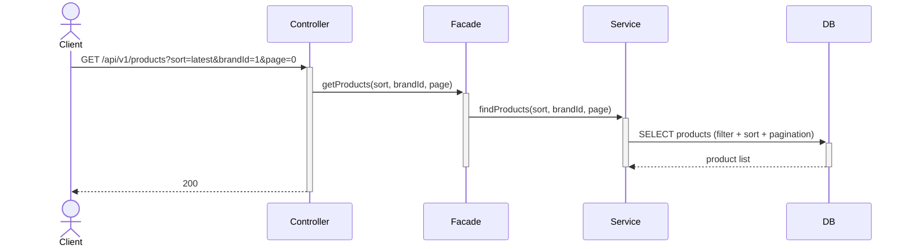
```mermaid
sequenceDiagram
    actor Client
    participant Controller
    participant Facade
    participant Service
    participant DB

    Client->>+Controller: GET /api/v1/products?sort=latest&brandId=1&page=0
    Controller->>+Facade: getProducts(sort, brandId, page)
    Facade->>+Service: findProducts(sort, brandId, page)
    Service->>+DB: SELECT products (filter + sort + pagination)
    DB-->>-Service: product list
    deactivate Service
    deactivate Facade
    Controller-->>-Client: 200
```

---

## 시나리오 2. 상품 상세 조회

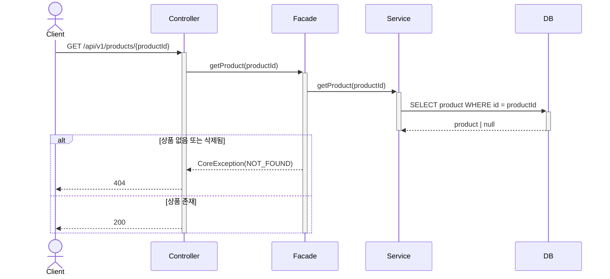
```mermaid
sequenceDiagram
    actor Client
    participant Controller
    participant Facade
    participant Service
    participant DB

    Client->>+Controller: GET /api/v1/products/{productId}
    Controller->>+Facade: getProduct(productId)
    Facade->>+Service: getProduct(productId)
    Service->>+DB: SELECT product WHERE id = productId
    DB-->>-Service: product | null
    deactivate Service

    alt 상품 없음 또는 삭제됨
        Facade-->>Controller: CoreException(NOT_FOUND)
        Controller-->>Client: 404
    else 상품 존재
        Controller-->>Client: 200
    end
    deactivate Facade
    deactivate Controller
```

---

## 시나리오 3. 브랜드 정보 조회

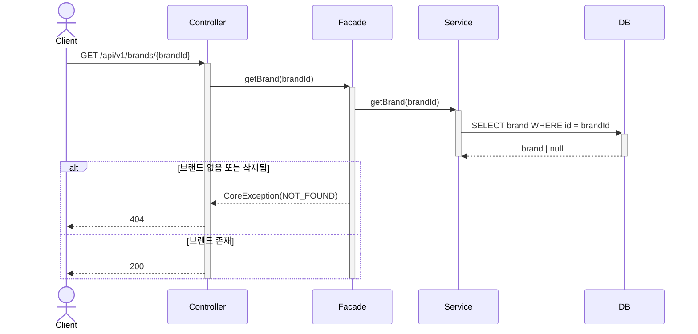
```mermaid
sequenceDiagram
    actor Client
    participant Controller
    participant Facade
    participant Service
    participant DB

    Client->>+Controller: GET /api/v1/brands/{brandId}
    Controller->>+Facade: getBrand(brandId)
    Facade->>+Service: getBrand(brandId)
    Service->>+DB: SELECT brand WHERE id = brandId
    DB-->>-Service: brand | null
    deactivate Service

    alt 브랜드 없음 또는 삭제됨
        Facade-->>Controller: CoreException(NOT_FOUND)
        Controller-->>Client: 404
    else 브랜드 존재
        Controller-->>Client: 200
    end
    deactivate Facade
    deactivate Controller
```

---

## 시나리오 4. 좋아요

### 4-1. 좋아요 등록

상품 존재 확인 후 중복 확인 순으로 검증한다. 존재하지 않는 상품에 대한 중복 여부를 묻는 것은 의미 없으므로 순서가 중요하다.

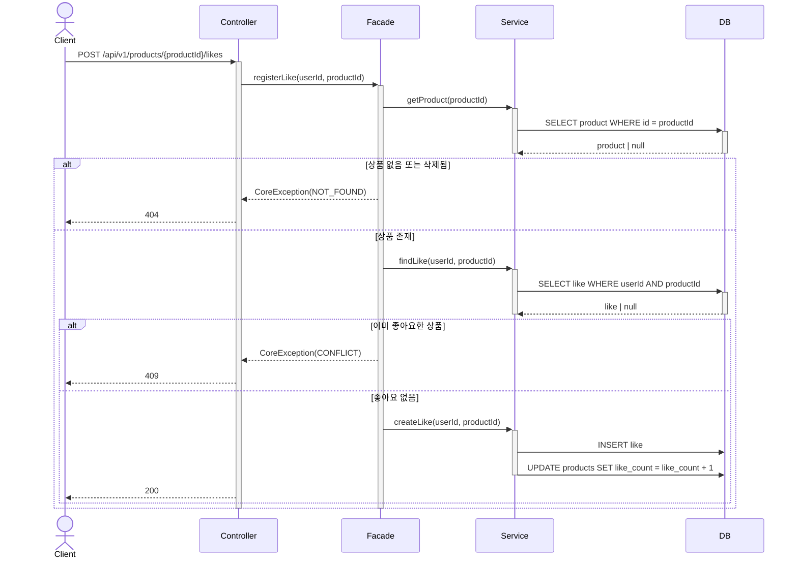
```mermaid
sequenceDiagram
    actor Client
    participant Controller
    participant Facade
    participant Service
    participant DB

    Client->>+Controller: POST /api/v1/products/{productId}/likes
    Controller->>+Facade: registerLike(userId, productId)

    Facade->>+Service: getProduct(productId)
    Service->>+DB: SELECT product WHERE id = productId
    DB-->>-Service: product | null
    deactivate Service

    alt 상품 없음 또는 삭제됨
        Facade-->>Controller: CoreException(NOT_FOUND)
        Controller-->>Client: 404
    else 상품 존재
        Facade->>+Service: findLike(userId, productId)
        Service->>+DB: SELECT like WHERE userId AND productId
        DB-->>-Service: like | null
        deactivate Service

        alt 이미 좋아요한 상품
            Facade-->>Controller: CoreException(CONFLICT)
            Controller-->>Client: 409
        else 좋아요 없음
            Facade->>+Service: createLike(userId, productId)
            Service->>DB: INSERT like
            Service->>DB: UPDATE products SET like_count = like_count + 1
            deactivate Service
            Controller-->>Client: 200
        end
    end
    deactivate Facade
    deactivate Controller
```

### 4-2. 좋아요 취소

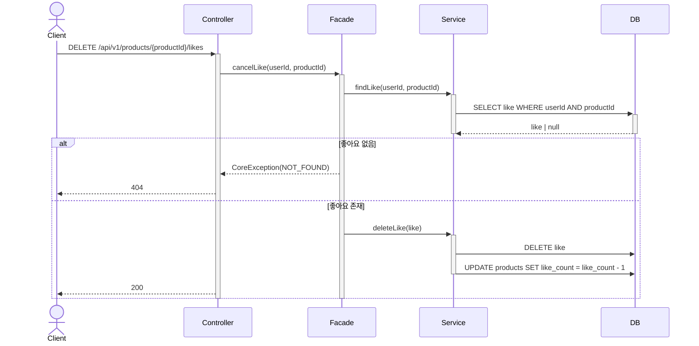
```mermaid
sequenceDiagram
    actor Client
    participant Controller
    participant Facade
    participant Service
    participant DB

    Client->>+Controller: DELETE /api/v1/products/{productId}/likes
    Controller->>+Facade: cancelLike(userId, productId)

    Facade->>+Service: findLike(userId, productId)
    Service->>+DB: SELECT like WHERE userId AND productId
    DB-->>-Service: like | null
    deactivate Service

    alt 좋아요 없음
        Facade-->>Controller: CoreException(NOT_FOUND)
        Controller-->>Client: 404
    else 좋아요 존재
        Facade->>+Service: deleteLike(like)
        Service->>DB: DELETE like
        Service->>DB: UPDATE products SET like_count = like_count - 1
        deactivate Service
        Controller-->>Client: 200
    end
    deactivate Facade
    deactivate Controller
```

### 4-3. 내 좋아요 목록 조회

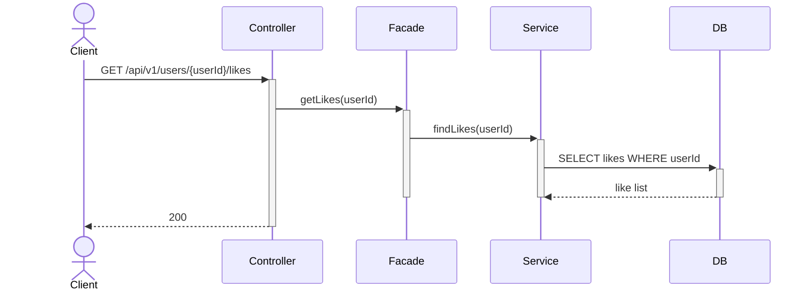
```mermaid
sequenceDiagram
    actor Client
    participant Controller
    participant Facade
    participant Service
    participant DB

    Client->>+Controller: GET /api/v1/users/{userId}/likes
    Controller->>+Facade: getLikes(userId)
    Facade->>+Service: findLikes(userId)
    Service->>+DB: SELECT likes WHERE userId
    DB-->>-Service: like list
    deactivate Service
    deactivate Facade
    Controller-->>-Client: 200
```

---

## 시나리오 5. 주문 요청

상품 존재 확인과 재고 확인·차감을 두 루프로 분리한다. 먼저 전체 항목의 존재 여부를 검증한 뒤, 비관적 락을 획득하고 재고를 차감한다. 한 루프에서 처리하면 일부 항목만 차감된 채로 실패할 수 있어 전체 검증 후 일괄 차감하는 방식을 택한다.

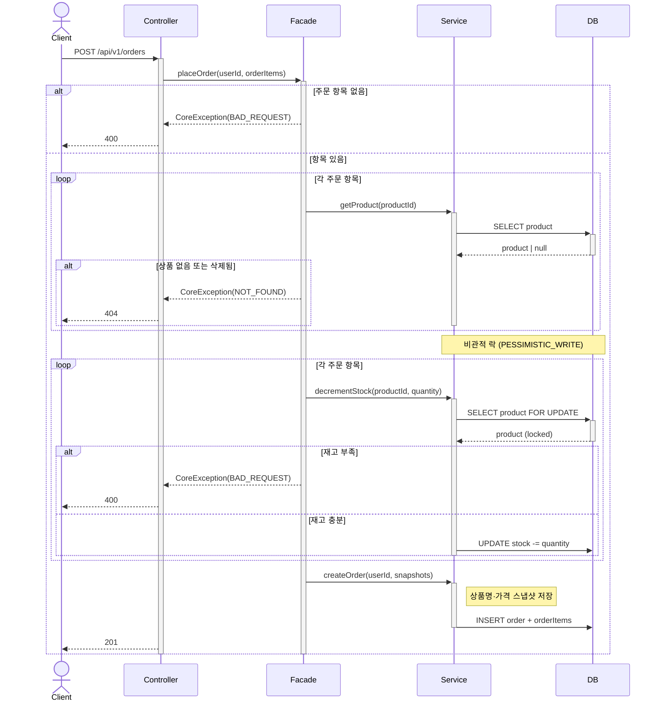
```mermaid
sequenceDiagram
    actor Client
    participant Controller
    participant Facade
    participant Service
    participant DB

    Client->>+Controller: POST /api/v1/orders
    Controller->>+Facade: placeOrder(userId, orderItems)

    alt 주문 항목 없음
        Facade-->>Controller: CoreException(BAD_REQUEST)
        Controller-->>Client: 400
    else 항목 있음
        loop 각 주문 항목
            Facade->>+Service: getProduct(productId)
            Service->>+DB: SELECT product
            DB-->>-Service: product | null
            alt 상품 없음 또는 삭제됨
                Facade-->>Controller: CoreException(NOT_FOUND)
                Controller-->>Client: 404
            end
            deactivate Service
        end

        Note over Service,DB: 비관적 락 (PESSIMISTIC_WRITE)
        loop 각 주문 항목
            Facade->>+Service: decrementStock(productId, quantity)
            Service->>+DB: SELECT product FOR UPDATE
            DB-->>-Service: product (locked)
            alt 재고 부족
                Facade-->>Controller: CoreException(BAD_REQUEST)
                Controller-->>Client: 400
            else 재고 충분
                Service->>DB: UPDATE stock -= quantity
            end
            deactivate Service
        end

        Facade->>+Service: createOrder(userId, snapshots)
        Note right of Service: 상품명·가격 스냅샷 저장
        Service->>DB: INSERT order + orderItems
        deactivate Service
        Controller-->>Client: 201
    end
    deactivate Facade
    deactivate Controller
```

---

## 시나리오 6. 주문 내역 조회

### 6-1. 주문 목록 조회

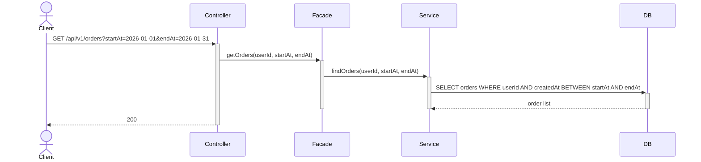
```mermaid
sequenceDiagram
    actor Client
    participant Controller
    participant Facade
    participant Service
    participant DB

    Client->>+Controller: GET /api/v1/orders?startAt=2026-01-01&endAt=2026-01-31
    Controller->>+Facade: getOrders(userId, startAt, endAt)
    Facade->>+Service: findOrders(userId, startAt, endAt)
    Service->>+DB: SELECT orders WHERE userId AND createdAt BETWEEN startAt AND endAt
    DB-->>-Service: order list
    deactivate Service
    deactivate Facade
    Controller-->>-Client: 200
```

### 6-2. 주문 상세 조회

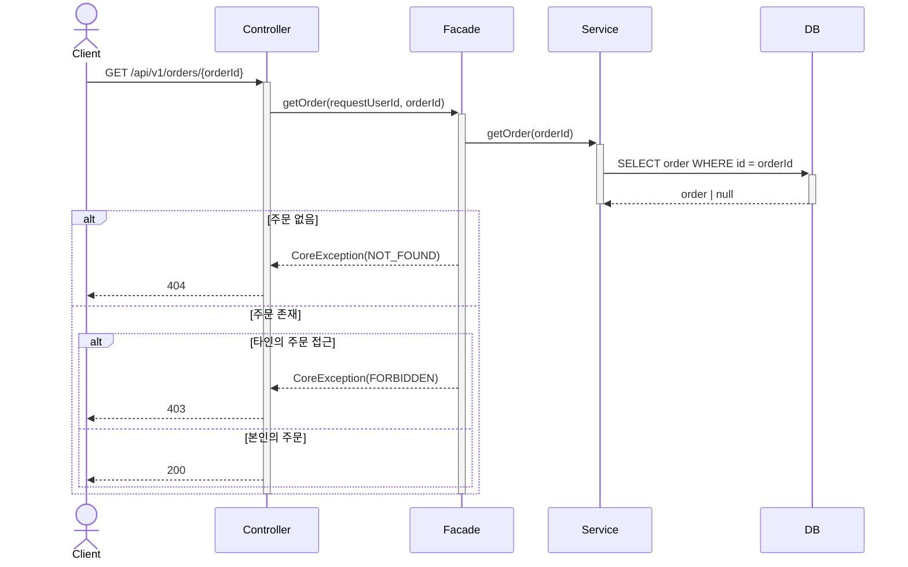
```mermaid
sequenceDiagram
    actor Client
    participant Controller
    participant Facade
    participant Service
    participant DB

    Client->>+Controller: GET /api/v1/orders/{orderId}
    Controller->>+Facade: getOrder(requestUserId, orderId)
    Facade->>+Service: getOrder(orderId)
    Service->>+DB: SELECT order WHERE id = orderId
    DB-->>-Service: order | null
    deactivate Service

    alt 주문 없음
        Facade-->>Controller: CoreException(NOT_FOUND)
        Controller-->>Client: 404
    else 주문 존재
        alt 타인의 주문 접근
            Facade-->>Controller: CoreException(FORBIDDEN)
            Controller-->>Client: 403
        else 본인의 주문
            Controller-->>Client: 200
        end
    end
    deactivate Facade
    deactivate Controller
```

---

## 시나리오 7. 브랜드 관리 (어드민)

### 7-1. 브랜드 등록

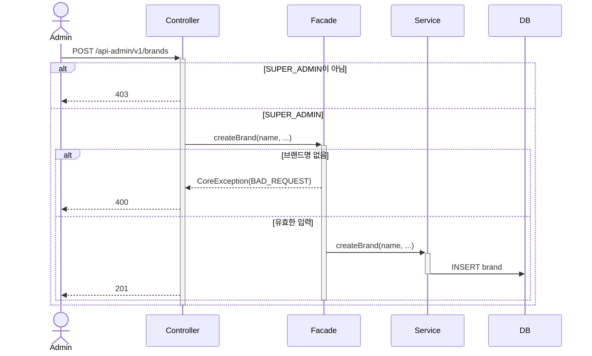
```mermaid
sequenceDiagram
    actor Admin
    participant Controller
    participant Facade
    participant Service
    participant DB

    Admin->>+Controller: POST /api-admin/v1/brands

    alt SUPER_ADMIN이 아님
        Controller-->>Admin: 403
    else SUPER_ADMIN
        Controller->>+Facade: createBrand(name, ...)

        alt 브랜드명 없음
            Facade-->>Controller: CoreException(BAD_REQUEST)
            Controller-->>Admin: 400
        else 유효한 입력
            Facade->>+Service: createBrand(name, ...)
            Service->>DB: INSERT brand
            deactivate Service
            Controller-->>Admin: 201
        end
        deactivate Facade
    end
    deactivate Controller
```

### 7-2. 브랜드 목록 조회

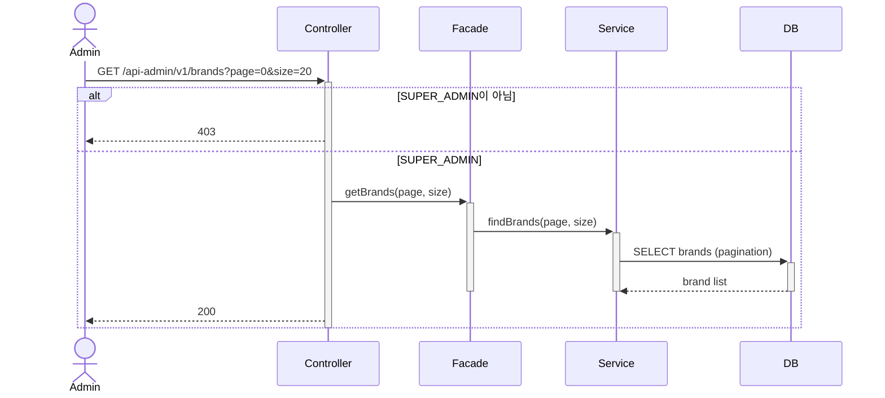
```mermaid
sequenceDiagram
    actor Admin
    participant Controller
    participant Facade
    participant Service
    participant DB

    Admin->>+Controller: GET /api-admin/v1/brands?page=0&size=20

    alt SUPER_ADMIN이 아님
        Controller-->>Admin: 403
    else SUPER_ADMIN
        Controller->>+Facade: getBrands(page, size)
        Facade->>+Service: findBrands(page, size)
        Service->>+DB: SELECT brands (pagination)
        DB-->>-Service: brand list
        deactivate Service
        deactivate Facade
        Controller-->>Admin: 200
    end
    deactivate Controller
```

### 7-3. 브랜드 상세 조회

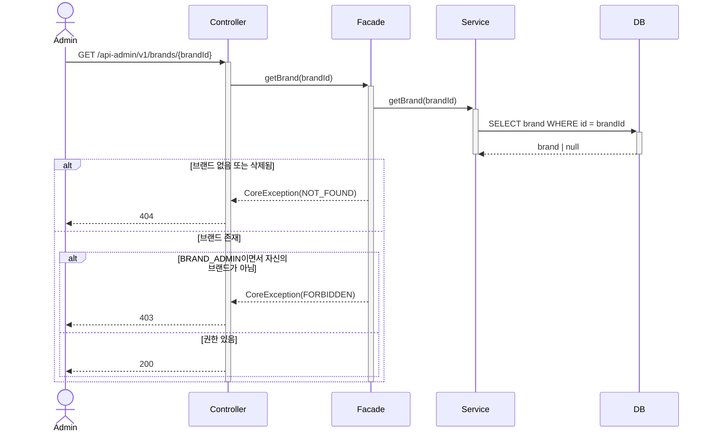
```mermaid
sequenceDiagram
    actor Admin
    participant Controller
    participant Facade
    participant Service
    participant DB

    Admin->>+Controller: GET /api-admin/v1/brands/{brandId}
    Controller->>+Facade: getBrand(brandId)
    Facade->>+Service: getBrand(brandId)
    Service->>+DB: SELECT brand WHERE id = brandId
    DB-->>-Service: brand | null
    deactivate Service

    alt 브랜드 없음 또는 삭제됨
        Facade-->>Controller: CoreException(NOT_FOUND)
        Controller-->>Admin: 404
    else 브랜드 존재
        alt BRAND_ADMIN이면서 자신의 브랜드가 아님
            Facade-->>Controller: CoreException(FORBIDDEN)
            Controller-->>Admin: 403
        else 권한 있음
            Controller-->>Admin: 200
        end
    end
    deactivate Facade
    deactivate Controller
```

### 7-4. 브랜드 수정

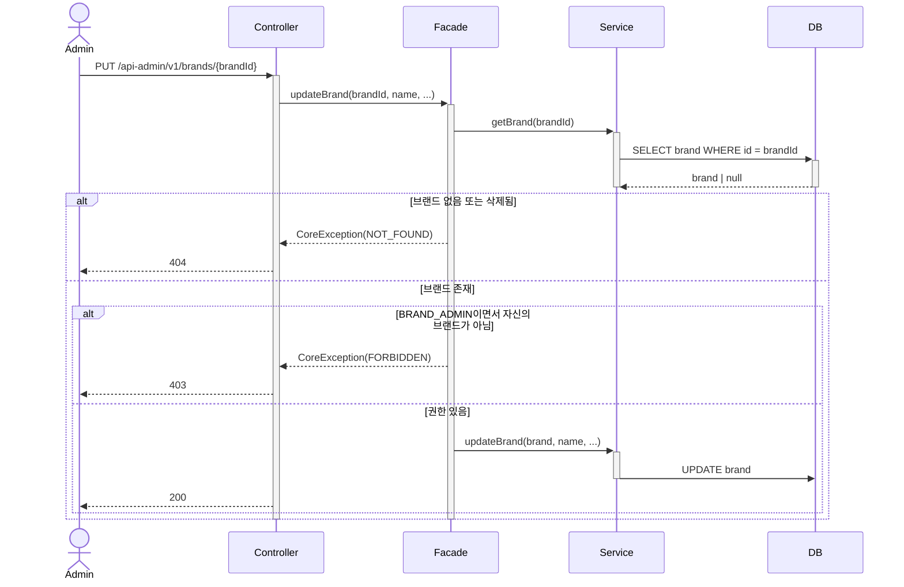
```mermaid
sequenceDiagram
    actor Admin
    participant Controller
    participant Facade
    participant Service
    participant DB

    Admin->>+Controller: PUT /api-admin/v1/brands/{brandId}
    Controller->>+Facade: updateBrand(brandId, name, ...)
    Facade->>+Service: getBrand(brandId)
    Service->>+DB: SELECT brand WHERE id = brandId
    DB-->>-Service: brand | null
    deactivate Service

    alt 브랜드 없음 또는 삭제됨
        Facade-->>Controller: CoreException(NOT_FOUND)
        Controller-->>Admin: 404
    else 브랜드 존재
        alt BRAND_ADMIN이면서 자신의 브랜드가 아님
            Facade-->>Controller: CoreException(FORBIDDEN)
            Controller-->>Admin: 403
        else 권한 있음
            Facade->>+Service: updateBrand(brand, name, ...)
            Service->>DB: UPDATE brand
            deactivate Service
            Controller-->>Admin: 200
        end
    end
    deactivate Facade
    deactivate Controller
```

### 7-5. 브랜드 삭제

소속 상품 삭제와 브랜드 삭제를 하나의 트랜잭션 안에서 처리한다. 상품만 삭제되고 브랜드가 남거나 그 반대가 되는 중간 상태를 방지하기 위함이다.

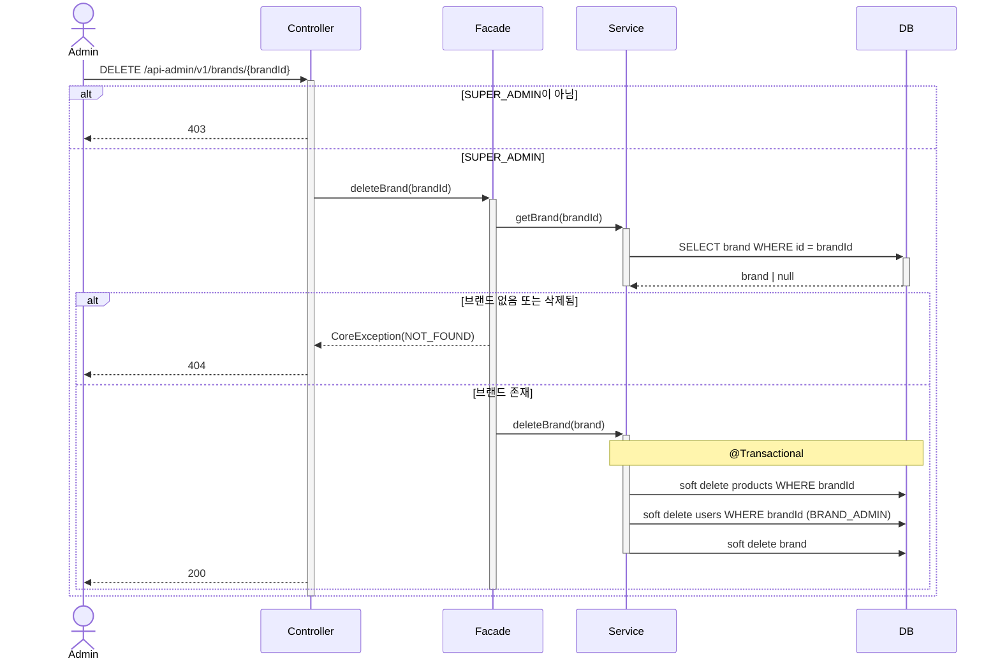
```mermaid
sequenceDiagram
    actor Admin
    participant Controller
    participant Facade
    participant Service
    participant DB

    Admin->>+Controller: DELETE /api-admin/v1/brands/{brandId}

    alt SUPER_ADMIN이 아님
        Controller-->>Admin: 403
    else SUPER_ADMIN
        Controller->>+Facade: deleteBrand(brandId)

        Facade->>+Service: getBrand(brandId)
        Service->>+DB: SELECT brand WHERE id = brandId
        DB-->>-Service: brand | null
        deactivate Service

        alt 브랜드 없음 또는 삭제됨
            Facade-->>Controller: CoreException(NOT_FOUND)
            Controller-->>Admin: 404
        else 브랜드 존재
            Facade->>+Service: deleteBrand(brand)
            Note over Service,DB: @Transactional
            Service->>DB: soft delete products WHERE brandId
            Service->>DB: soft delete users WHERE brandId (BRAND_ADMIN)
            Service->>DB: soft delete brand
            deactivate Service
            Controller-->>Admin: 200
        end
        deactivate Facade
    end
    deactivate Controller
```

---

## 시나리오 8. 상품 관리 (어드민)

### 8-1. 상품 등록

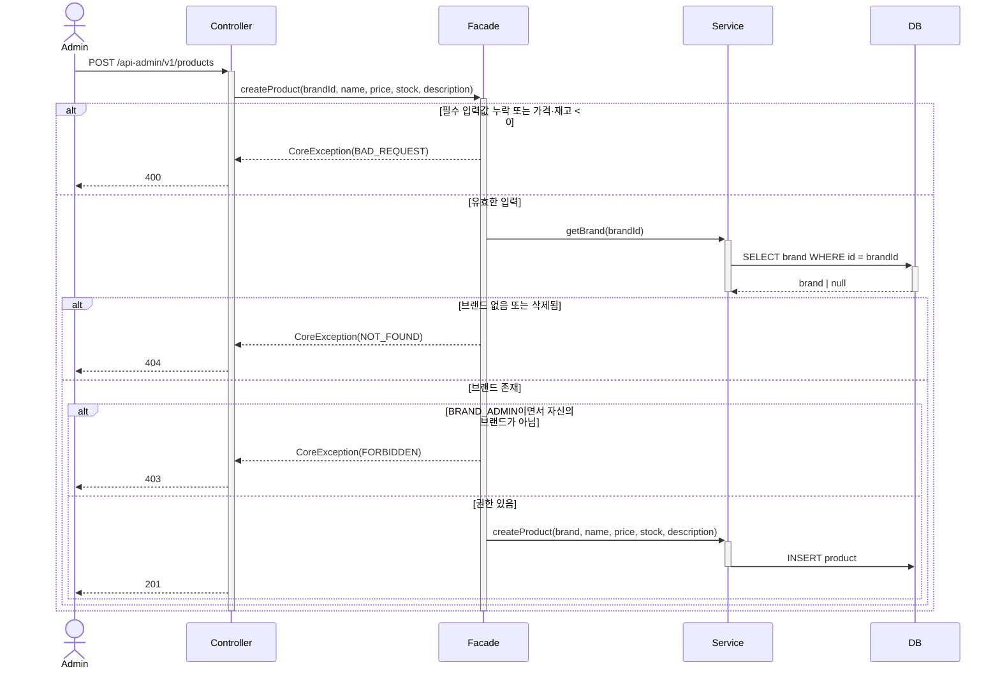
```mermaid
sequenceDiagram
    actor Admin
    participant Controller
    participant Facade
    participant Service
    participant DB

    Admin->>+Controller: POST /api-admin/v1/products
    Controller->>+Facade: createProduct(brandId, name, price, stock, description)

    alt 필수 입력값 누락 또는 가격·재고 < 0
        Facade-->>Controller: CoreException(BAD_REQUEST)
        Controller-->>Admin: 400
    else 유효한 입력
        Facade->>+Service: getBrand(brandId)
        Service->>+DB: SELECT brand WHERE id = brandId
        DB-->>-Service: brand | null
        deactivate Service

        alt 브랜드 없음 또는 삭제됨
            Facade-->>Controller: CoreException(NOT_FOUND)
            Controller-->>Admin: 404
        else 브랜드 존재
            alt BRAND_ADMIN이면서 자신의 브랜드가 아님
                Facade-->>Controller: CoreException(FORBIDDEN)
                Controller-->>Admin: 403
            else 권한 있음
                Facade->>+Service: createProduct(brand, name, price, stock, description)
                Service->>DB: INSERT product
                deactivate Service
                Controller-->>Admin: 201
            end
        end
    end
    deactivate Facade
    deactivate Controller
```

### 8-2. 상품 목록 조회

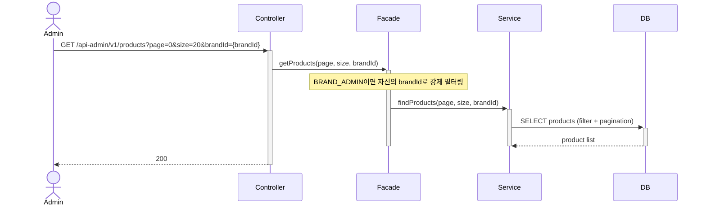
```mermaid
sequenceDiagram
    actor Admin
    participant Controller
    participant Facade
    participant Service
    participant DB

    Admin->>+Controller: GET /api-admin/v1/products?page=0&size=20&brandId={brandId}
    Controller->>+Facade: getProducts(page, size, brandId)
    Note over Facade: BRAND_ADMIN이면 자신의 brandId로 강제 필터링
    Facade->>+Service: findProducts(page, size, brandId)
    Service->>+DB: SELECT products (filter + pagination)
    DB-->>-Service: product list
    deactivate Service
    deactivate Facade
    Controller-->>-Admin: 200
```

### 8-3. 상품 상세 조회

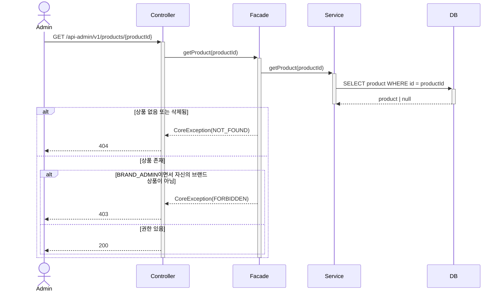
```mermaid
sequenceDiagram
    actor Admin
    participant Controller
    participant Facade
    participant Service
    participant DB

    Admin->>+Controller: GET /api-admin/v1/products/{productId}
    Controller->>+Facade: getProduct(productId)
    Facade->>+Service: getProduct(productId)
    Service->>+DB: SELECT product WHERE id = productId
    DB-->>-Service: product | null
    deactivate Service

    alt 상품 없음 또는 삭제됨
        Facade-->>Controller: CoreException(NOT_FOUND)
        Controller-->>Admin: 404
    else 상품 존재
        alt BRAND_ADMIN이면서 자신의 브랜드 상품이 아님
            Facade-->>Controller: CoreException(FORBIDDEN)
            Controller-->>Admin: 403
        else 권한 있음
            Controller-->>Admin: 200
        end
    end
    deactivate Facade
    deactivate Controller
```

### 8-4. 상품 수정

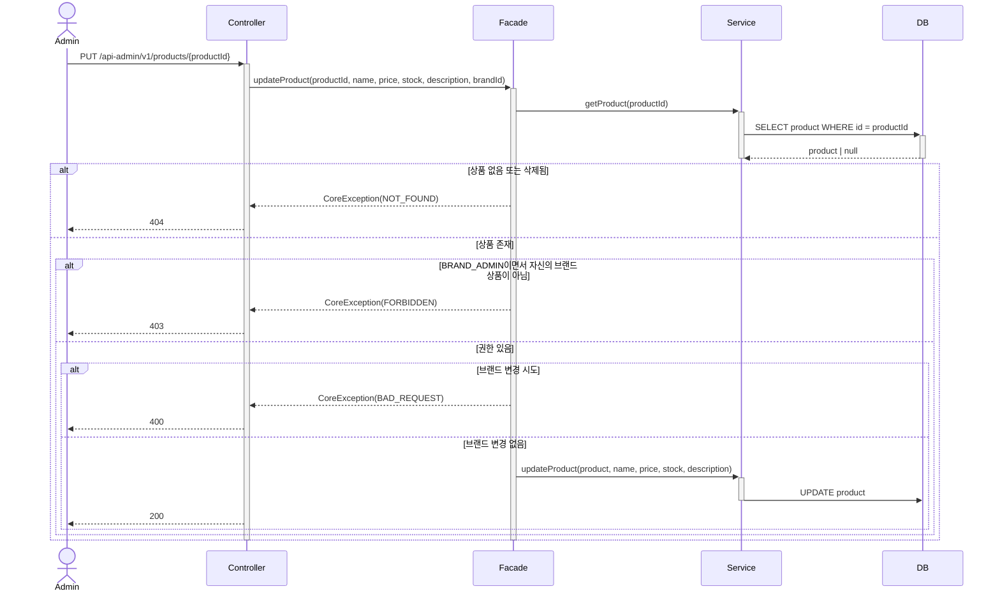
```mermaid
sequenceDiagram
    actor Admin
    participant Controller
    participant Facade
    participant Service
    participant DB

    Admin->>+Controller: PUT /api-admin/v1/products/{productId}
    Controller->>+Facade: updateProduct(productId, name, price, stock, description, brandId)
    Facade->>+Service: getProduct(productId)
    Service->>+DB: SELECT product WHERE id = productId
    DB-->>-Service: product | null
    deactivate Service

    alt 상품 없음 또는 삭제됨
        Facade-->>Controller: CoreException(NOT_FOUND)
        Controller-->>Admin: 404
    else 상품 존재
        alt BRAND_ADMIN이면서 자신의 브랜드 상품이 아님
            Facade-->>Controller: CoreException(FORBIDDEN)
            Controller-->>Admin: 403
        else 권한 있음
            alt 브랜드 변경 시도
                Facade-->>Controller: CoreException(BAD_REQUEST)
                Controller-->>Admin: 400
            else 브랜드 변경 없음
                Facade->>+Service: updateProduct(product, name, price, stock, description)
                Service->>DB: UPDATE product
                deactivate Service
                Controller-->>Admin: 200
            end
        end
    end
    deactivate Facade
    deactivate Controller
```

### 8-5. 상품 삭제

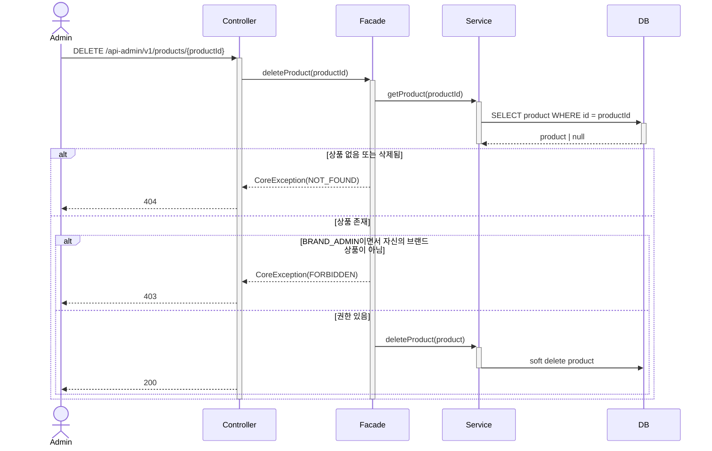
```mermaid
sequenceDiagram
    actor Admin
    participant Controller
    participant Facade
    participant Service
    participant DB

    Admin->>+Controller: DELETE /api-admin/v1/products/{productId}
    Controller->>+Facade: deleteProduct(productId)
    Facade->>+Service: getProduct(productId)
    Service->>+DB: SELECT product WHERE id = productId
    DB-->>-Service: product | null
    deactivate Service

    alt 상품 없음 또는 삭제됨
        Facade-->>Controller: CoreException(NOT_FOUND)
        Controller-->>Admin: 404
    else 상품 존재
        alt BRAND_ADMIN이면서 자신의 브랜드 상품이 아님
            Facade-->>Controller: CoreException(FORBIDDEN)
            Controller-->>Admin: 403
        else 권한 있음
            Facade->>+Service: deleteProduct(product)
            Service->>DB: soft delete product
            deactivate Service
            Controller-->>Admin: 200
        end
    end
    deactivate Facade
    deactivate Controller
```

---

## 시나리오 9. 전체 주문 조회 (어드민)

### 9-1. 전체 주문 목록 조회

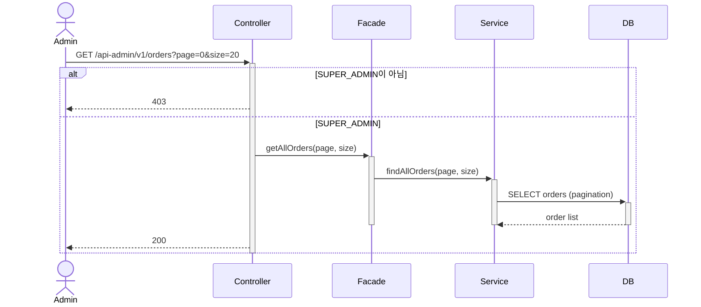
```mermaid
sequenceDiagram
    actor Admin
    participant Controller
    participant Facade
    participant Service
    participant DB

    Admin->>+Controller: GET /api-admin/v1/orders?page=0&size=20

    alt SUPER_ADMIN이 아님
        Controller-->>Admin: 403
    else SUPER_ADMIN
        Controller->>+Facade: getAllOrders(page, size)
        Facade->>+Service: findAllOrders(page, size)
        Service->>+DB: SELECT orders (pagination)
        DB-->>-Service: order list
        deactivate Service
        deactivate Facade
        Controller-->>Admin: 200
    end
    deactivate Controller
```

### 9-2. 주문 상세 조회

```mermaid
sequenceDiagram
    actor Admin
    participant Controller
    participant Facade
    participant Service
    participant DB

    Admin->>+Controller: GET /api-admin/v1/orders/{orderId}

    alt SUPER_ADMIN이 아님
        Controller-->>Admin: 403
    else SUPER_ADMIN
        Controller->>+Facade: getOrder(orderId)
        Facade->>+Service: getOrder(orderId)
        Service->>+DB: SELECT order WHERE id = orderId
        DB-->>-Service: order | null
        deactivate Service

        alt 주문 없음
            Facade-->>Controller: CoreException(NOT_FOUND)
            Controller-->>Admin: 404
        else 주문 존재
            Controller-->>Admin: 200
        end
        deactivate Facade
    end
    deactivate Controller
```
