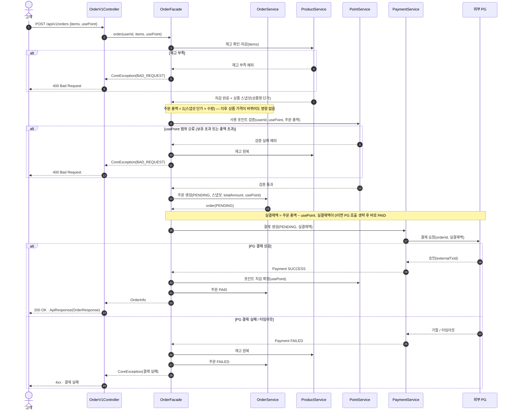
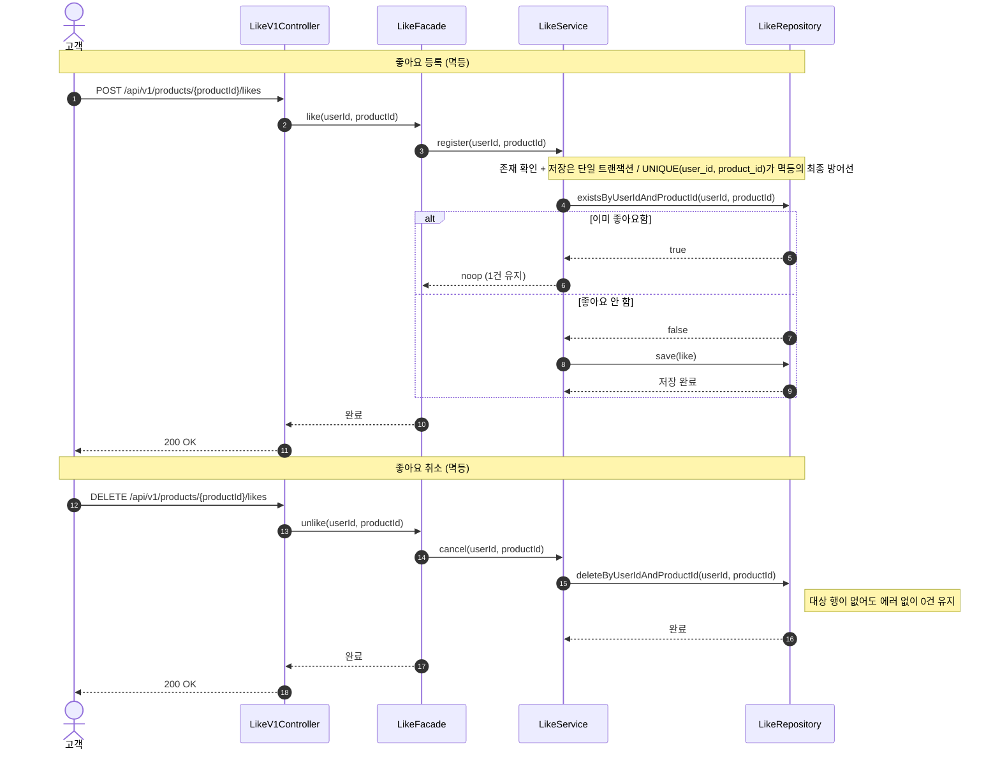
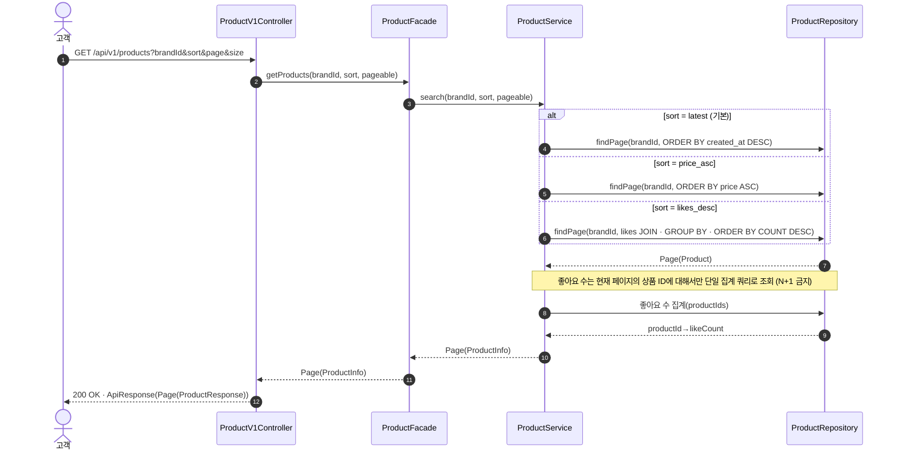
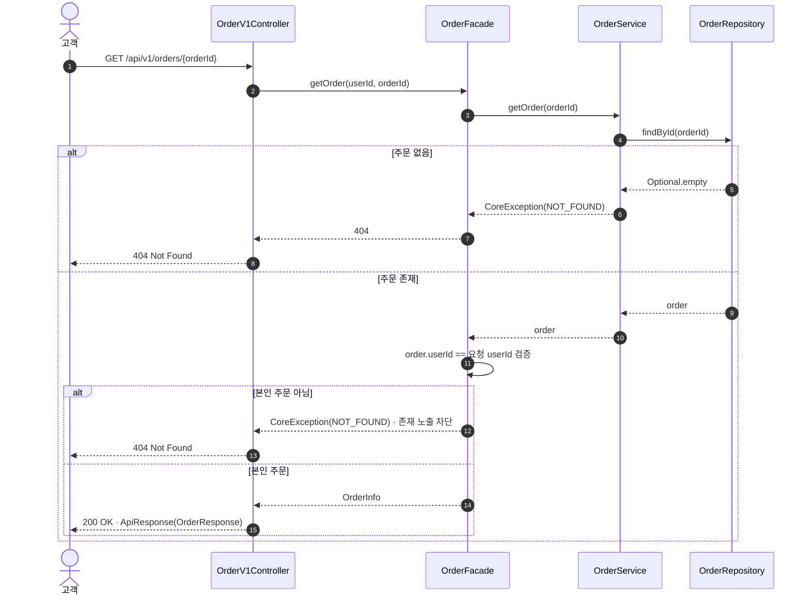
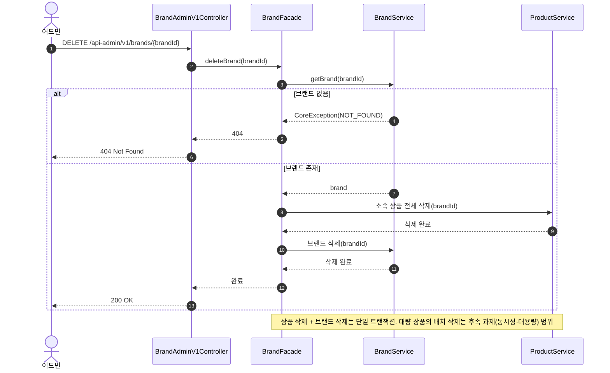

# 02. 시퀀스 다이어그램

> Mermaid `sequenceDiagram` 기반. 책임 객체(Controller / Facade / DomainService / Repository / 외부 시스템)가 드러나도록 작성.
> 계층: `interfaces` → `application`(Facade) → `domain`(Service) → `infrastructure`(Repository).

## 다이어그램 1. 주문 생성 + 결제

> 재고 차감 → 주문 생성 → 외부 PG 결제(실결제액). 포인트는 결제 금액을 깎는 할인 수단. 실패(재고 부족·포인트 범위 오류·PG 실패) 흐름까지 표현.

- 트랜잭션 경계: 재고·주문·포인트 갱신은 로컬 DB 트랜잭션, 외부 PG 호출은 트랜잭션 밖에서 수행한다. PG 결과를 받은 뒤 성공이면 포인트 차감·주문 확정을, 실패면 재고 원복을 처리한다.

---

## 다이어그램 2. 상품 좋아요 등록 / 취소 (멱등)

> POST·DELETE 양쪽 모두 멱등 보장. 이미 좋아요 / 좋아요 안 한 상태의 처리 분기를 표현.

---

## 다이어그램 3. 상품 목록 조회 (정렬·필터·페이징)

> 정렬 기준별 쿼리 분기, `likes_desc`는 좋아요 집계 기준.

---

## 다이어그램 4. 주문 단건 조회 (본인 권한 체크)

> 본인 주문만 조회 가능. 타인 주문은 존재를 노출하지 않기 위해 404.

---

## 다이어그램 5. 브랜드 삭제 (어드민) — 소속 상품 cascade 삭제

> 어드민 인증 헤더로 식별. 브랜드 삭제 시 소속 상품도 함께 삭제된다.

## ✅ 과제 체크리스트 (이 문서 관점)

- [x] 시퀀스 다이어그램이 최소 2개 이상인가? (총 5개)
- [x] 시퀀스 다이어그램에서 책임 객체가 드러나는가?
- [x] 실패/예외 흐름이 표현되어 있는가? (재고 부족·포인트 부족·PG 실패·권한)
