# 02. 시퀀스 다이어그램

## 목적

각 API에서 다음을 검증한다:
- 호출 책임이 어느 레이어(Controller → Facade → Service → Repository)에 있는가
- 인증 흐름(사용자 헤더 인증 / LDAP 어드민 인증)이 어느 시점에 처리되는가
- 트랜잭션 경계가 어디에서 열리고 닫히는가
- 실패 시 어떤 보상 동작이 필요한가

---

## 1. 회원가입

**왜 필요한가**: 중복 ID 검증과 비밀번호 규칙 검증 책임이 어느 레이어에 위치하는지, 인증 없이 진입 가능한 흐름을 확인하기 위해 작성.

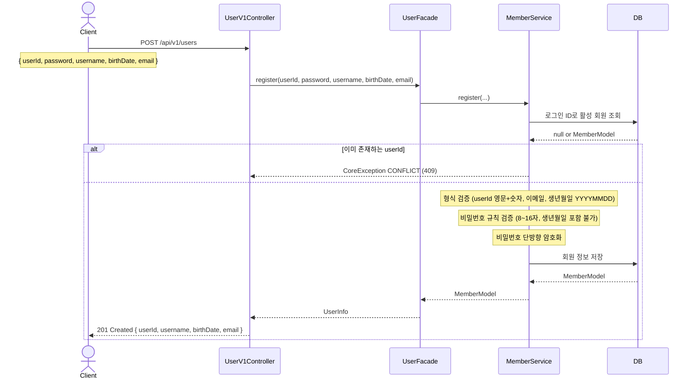

> **읽는 포인트**: 형식 검증과 비밀번호 규칙 검증은 Service 레이어에서 수행한다. 중복 userId 확인은 INSERT 전에 SELECT로 선행 검증하며, 충돌 발생 시 CoreException으로 처리한다.

---

## 2. 내 정보 조회 / 비밀번호 변경

**왜 필요한가**: 헤더 기반 인증이 어떤 레이어에서 처리되고, 인증된 사용자 정보가 다음 단계로 어떻게 전달되는지 확인하기 위해 작성.

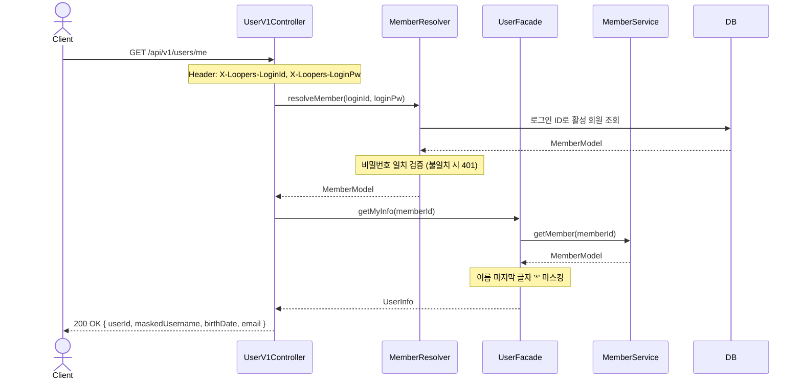

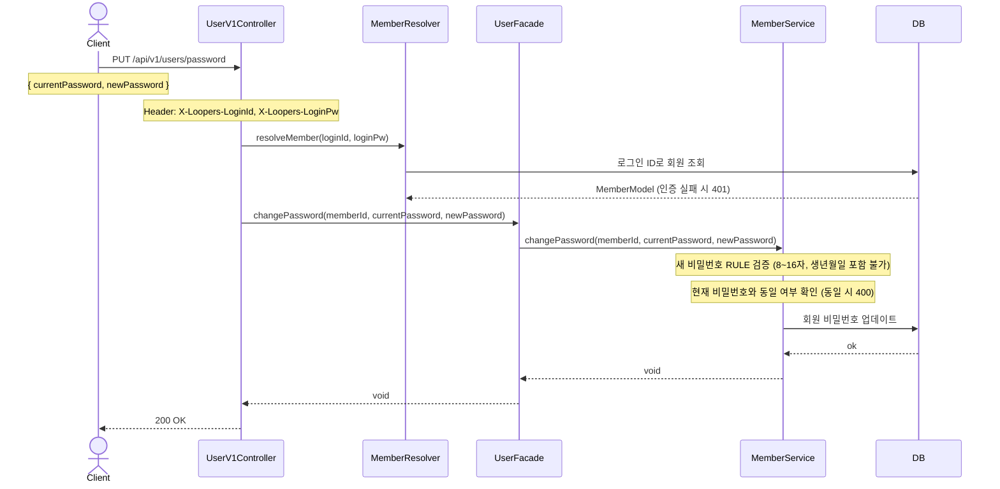

> **읽는 포인트**: `MemberResolver`는 모든 인증 필요 API에서 재사용된다. Controller는 인증 결과로 받은 `MemberModel`의 id를 Facade에 전달한다. 비밀번호 규칙 검증 책임은 Service에 위치한다.

---

## 3. 상품 목록 조회

**왜 필요한가**: 필터(brandId)·정렬(sort)·페이지네이션이 어느 레이어에서 처리되는지, 좋아요 수 집계 방식과 브랜드 조합 책임을 명확히 하기 위해 작성.

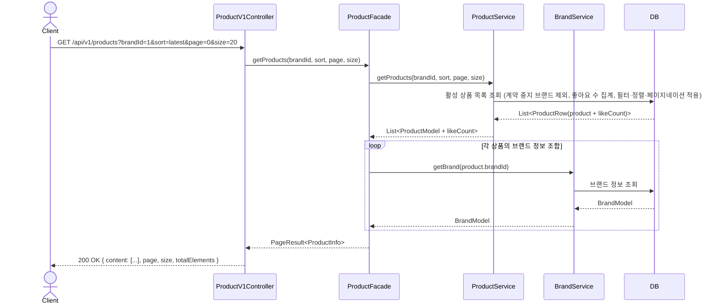

> **읽는 포인트**: 좋아요 수는 LEFT JOIN + COUNT로 집계한다. 계약 중지된 브랜드(`suspended_at IS NOT NULL`)의 상품은 쿼리 단계에서 제외한다. 브랜드 조합은 Facade에서 처리해 Product 도메인이 Brand를 직접 의존하지 않도록 한다. N+1 문제가 발생할 수 있으므로 브랜드 조회를 IN 조건 일괄 조회로 최적화하는 것을 검토한다.

---

## 4. 상품 좋아요 등록 / 취소

**왜 필요한가**: 멱등 처리 로직이 어느 레이어에서 분기하는지, soft delete 방식으로 취소를 표현하는 구조를 검증하기 위해 작성.

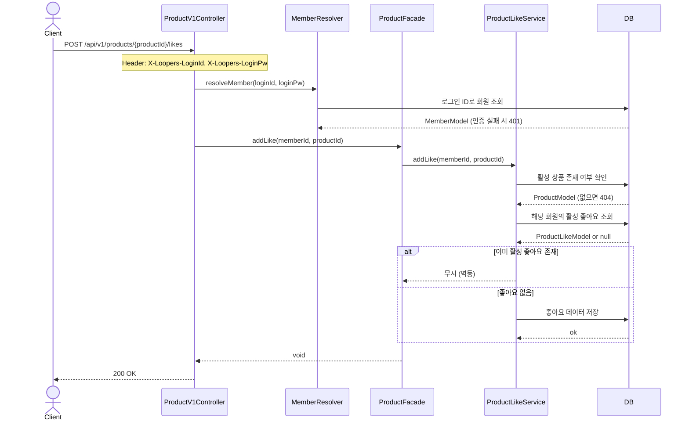

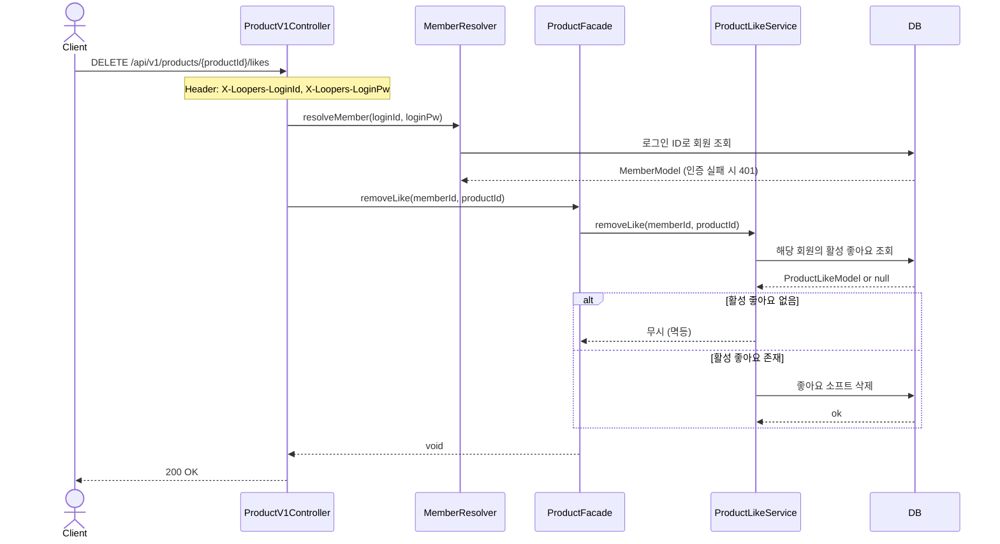

> **읽는 포인트**: 멱등 분기는 Service에서 DB 조회 결과로 처리한다. 좋아요 취소는 하드 삭제가 아닌 soft delete로 표현하며, `deleted_at IS NULL`인 경우만 활성 좋아요로 간주한다.

---

## 5. 내가 좋아요한 상품 목록

**왜 필요한가**: 본인 데이터 접근 제어(403)가 어느 시점에 처리되는지, 좋아요-상품 JOIN 조회 책임을 확인하기 위해 작성.

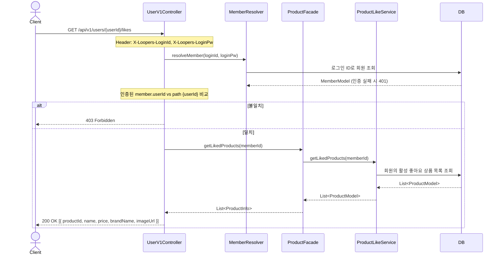

---

## 6. 주문 생성

**왜 필요한가**: 재고 차감과 주문 생성이 단일 트랜잭션으로 묶이는 경계를 확인하고, 재고 부족 실패 시 롤백 범위를 검증하기 위해 작성.

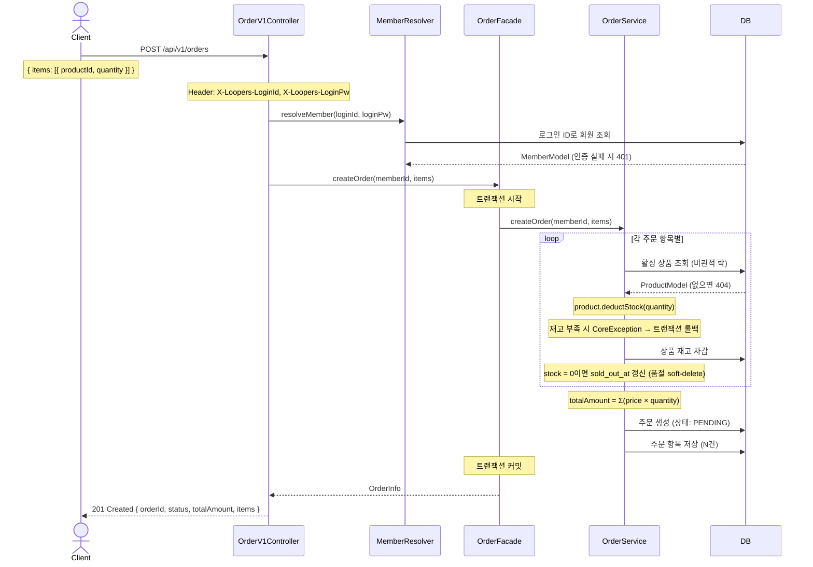

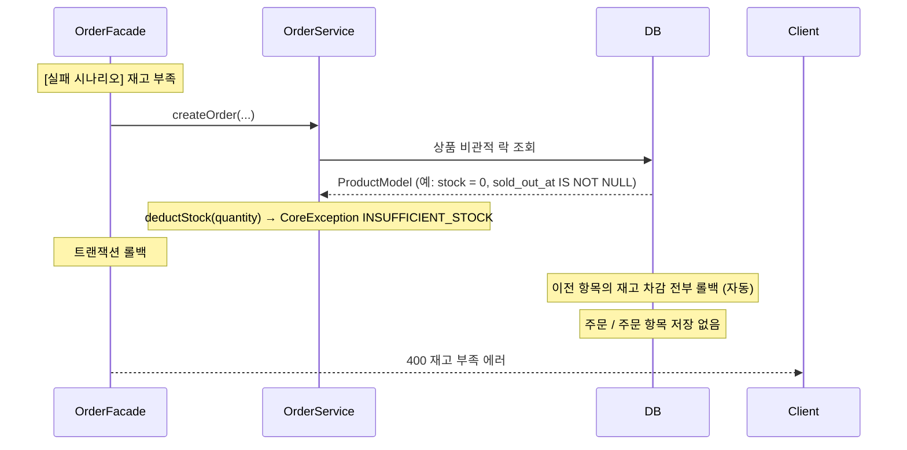

> **읽는 포인트**: 재고 차감과 주문 생성이 **단일 트랜잭션** 내에 묶인다. `FOR UPDATE`를 통한 비관적 락으로 동시 주문의 재고 경합을 방지한다. 재고 차감 후 `stock = 0`이면 `sold_out_at`을 갱신해 품절 상태를 soft-delete 방식으로 표현한다. 어느 항목에서든 재고 부족이 발생하면 이전 차감 결과까지 포함해 전체 롤백된다.

---

## 7. 어드민 - 브랜드 삭제 (상품 cascade)

**왜 필요한가**: 브랜드 삭제 시 상품 cascade soft delete가 단일 트랜잭션으로 처리되는지, LDAP 인증 흐름이 어느 레이어에서 처리되는지 확인하기 위해 작성.

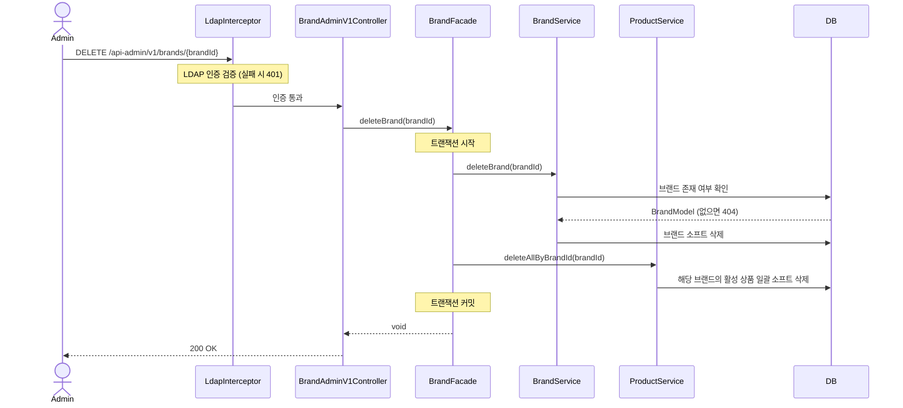

> **읽는 포인트**: LDAP 인증은 Spring Interceptor 레벨에서 처리되어 Controller에 도달하기 전에 완료된다. 브랜드 soft delete와 상품 bulk soft delete는 단일 트랜잭션으로 묶여 부분 삭제가 발생하지 않는다.

---

## 8. 어드민 - 브랜드 계약 중지 / 재개

**왜 필요한가**: 계약 중지가 영구 삭제(`deleted_at`)와 다른 흐름인지, 상품에 cascade가 발생하지 않음을 확인하기 위해 작성.

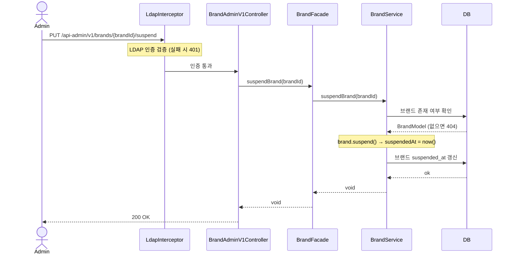

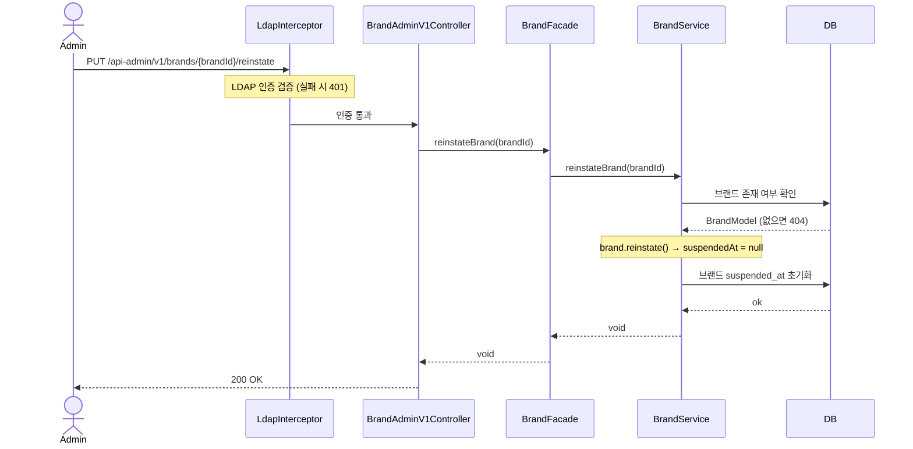

> **읽는 포인트**: 계약 중지는 `suspended_at`만 갱신하며 상품에 cascade가 발생하지 않는다. 공개 API 조회 시 브랜드 `suspended_at IS NULL` 조건으로 계약 중지 브랜드와 그 소속 상품이 자동으로 제외된다. 영구 삭제(`deleted_at`)와 달리 가역적이며, 재개 즉시 별도 상품 처리 없이 노출된다.

---

## 다이어그램 요약

| 다이어그램 | 핵심 검증 포인트 |
|-----------|----------------|
| 회원가입 | 중복 ID 검증 / 비밀번호 규칙 검증 위치 (Service) |
| 내 정보 / 비밀번호 변경 | MemberResolver 재사용 / 인증 흐름 |
| 상품 목록 조회 | 필터+정렬+페이지네이션 / 좋아요 수 JOIN 집계 / 계약 중지 브랜드 제외 / Brand 조합 위치 (Facade) |
| 좋아요 등록/취소 | 멱등 처리 위치 (Service) / soft delete 활용 |
| 내가 좋아요한 목록 | 본인 확인 403 분기 위치 (Controller) |
| 주문 생성 | 재고 차감 + sold_out_at 갱신 단일 트랜잭션 / FOR UPDATE 비관적 락 |
| 어드민 브랜드 삭제 | LDAP 인증 위치 (Interceptor) / cascade soft delete 트랜잭션 |
| 어드민 브랜드 계약 중지/재개 | suspended_at soft-delete / 상품 cascade 없음 / 가역성 확인 |
