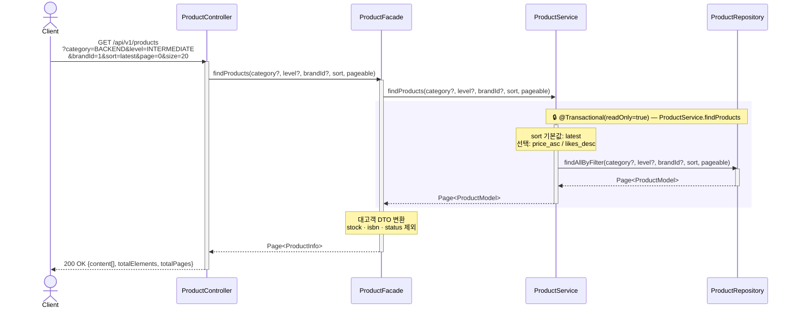
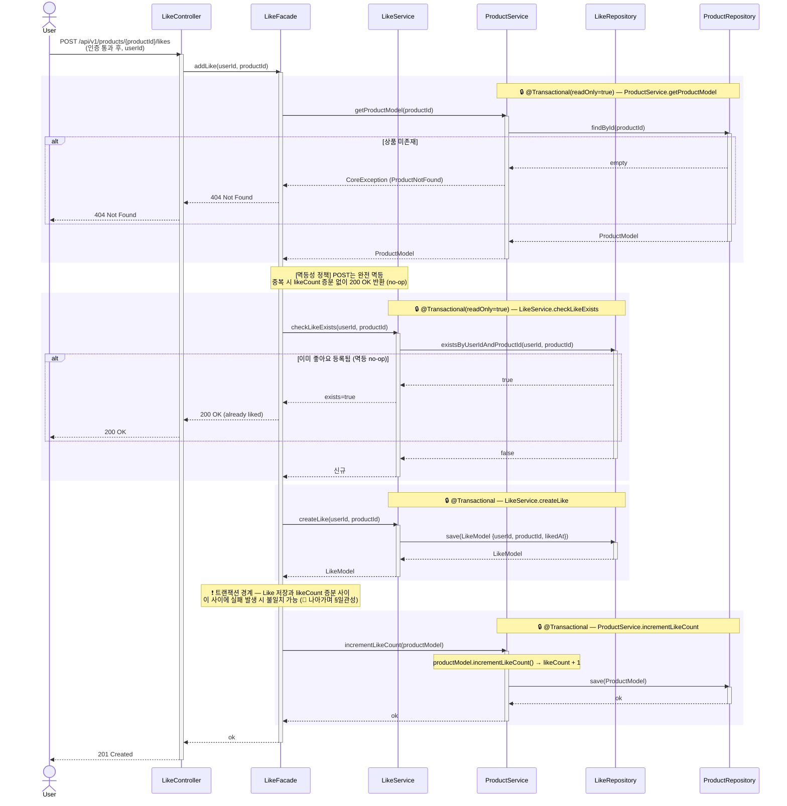
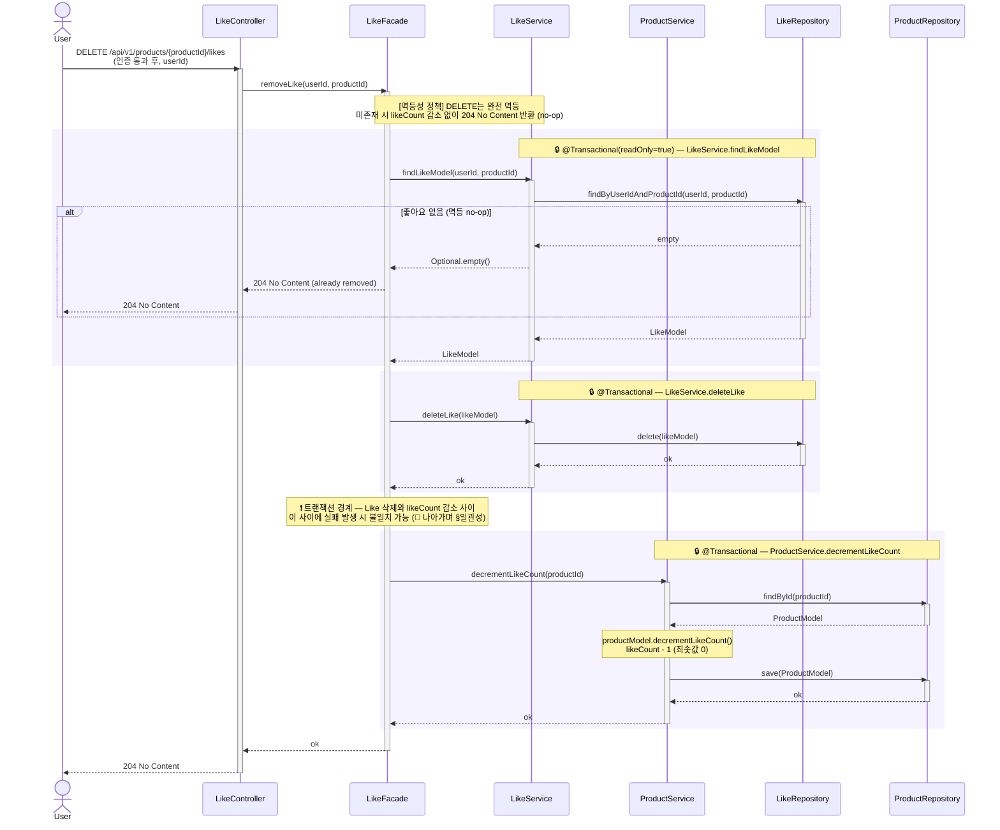
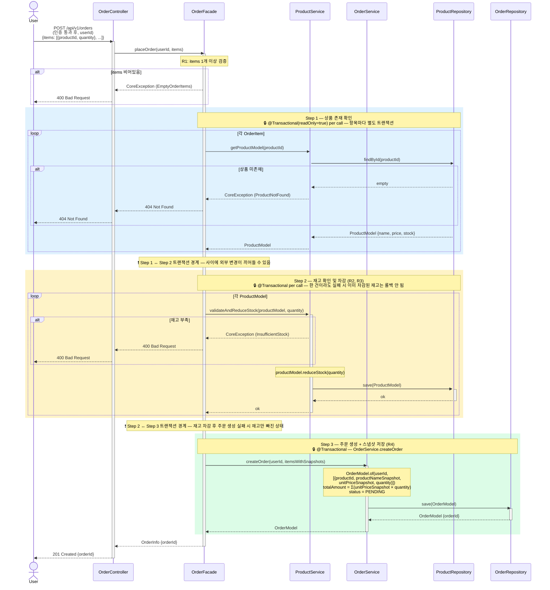
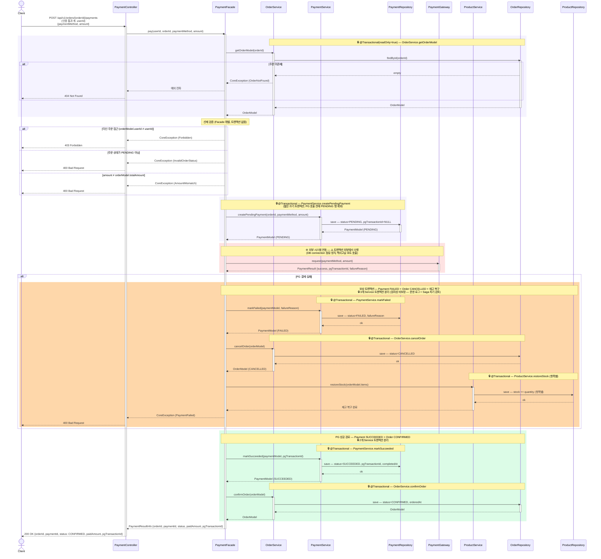

# Loopers 이커머스 — 시퀀스 다이어그램

> **이 문서는 다른 팀원에게 설명이 필요한 복잡한 흐름만 다룬다.**  
> 단순 CRUD·단건 조회·어드민 운영 API는 의도적으로 제외했다.  
> 핵심은 **멱등 동작, 재고 차감, 외부 시스템 연동, 보상 트랜잭션** 5가지 흐름이다.

---

## 트랜잭션 경계 정책

```
interfaces (Controller)
   ↓ 호출
application (Facade)        ← 트랜잭션 없음. Service 조율만 담당
   ↓ 조율
domain (Service)            ← @Transactional. DB 변경의 원자성 보장 단위
   ↓ 사용
domain (Repository interface) ← 인터페이스
   ↑ 구현
infrastructure (RepositoryImpl) ← JPA 구현체
```

- **Facade**: 트랜잭션 없음. 여러 Service를 순서대로 호출
- **Service**: `@Transactional` 적용 — 단일 Service 메서드 내 DB 변경은 원자적
- **외부 시스템 호출(PG)**: 트랜잭션 외부에서 수행. 응답 수신 후 별도 짧은 트랜잭션으로 상태 업데이트

> 트랜잭션 경계를 Service 단위에 둔 이유: 외부 I/O(PG 호출)를 트랜잭션에 포함시키면 long-running transaction이 발생해 DB connection pool이 고갈된다.  
> 다만 Facade에 트랜잭션이 없으므로 **여러 Service 호출 간 원자성은 자체적으로 보장되지 않는다** — 이 한계는 `📡 나아가며`에서 다룬다.

---

## 다이어그램 표기 약속

**생략 대상** — 모든 시퀀스에 반복되는 보일러플레이트는 다이어그램에서 제거한다:

| 생략 항목                                                        | 이유                                                            |
|------------------------------------------------------------------|-----------------------------------------------------------------|
| `AuthFilter` 흐름 (`findByLoginId` → 비밀번호 검증 → `401` 분기) | 모든 인증 API에 동일. "(인증 통과 후, userId)" 노트로 대체      |
| `Controller` 단순 위임                                           | 위임 자체에 로직이 없을 때 — 단 응답 변환 책임이 있을 때는 유지 |

**유지 대상** — 책임 표현에 필요한 요소:

| 유지 항목                                           | 이유                                   |
|-----------------------------------------------------|----------------------------------------|
| `Controller → Facade → Service → Repository` 레이어 | 책임 분배 명확화                       |
| 응답 흐름 (`Service → Facade → Controller → User`)  | 정보 변환 책임 (Model → Info DTO) 표현 |
| 도메인 분기 (멱등 no-op, 재고 부족, PG 실패 등)     | 핵심 비즈니스 로직                     |

**색상 범례** — `rect` 박스 색상의 의미:

| 색상                          | 의미                                     | 사용 위치                   |
|-------------------------------|------------------------------------------|-----------------------------|
| 🔒 보라 (`rgb 245, 243, 255`) | Service 트랜잭션 (`@Transactional` 단위) | 모든 시퀀스                 |
| 🌐 빨강 (`rgb 254, 226, 226`) | 외부 시스템 호출 — **트랜잭션 외부**     | 결제 (PG 호출)              |
| 🔥 주황 (`rgb 254, 215, 170`) | 보상 트랜잭션 (실패 복구)                | 결제 (PG 실패 시 재고 복구) |
| 파랑 (`rgb 224, 242, 254`)    | 주문 Step 1 — 상품 확인                  | 주문 생성                   |
| 노랑 (`rgb 254, 243, 199`)    | 주문 Step 2 — 재고 차감                  | 주문 생성                   |
| 초록 (`rgb 220, 252, 231`)    | 주문 Step 3 / 결제 성공 — 상태 확정      | 주문 생성, 결제             |

**❗ 트랜잭션 경계 Note** — Service 호출 사이에 표시되는 위험 구간. Facade에 트랜잭션이 없어 두 Service 호출 간 원자성이 보장되지 않는 지점.

---

## 시퀀스 목록 (5개 핵심 흐름)

| #   | 시퀀스                  | 왜 복잡한가 (강조 포인트)                                 |
|-----|-------------------------|-----------------------------------------------------------|
| 1   | 상품 목록 조회          | 필터·정렬·페이징 — 인덱스 설계가 성능을 결정              |
| 2   | 좋아요 등록 (완전 멱등) | 중복 시 `likeCount` 증분 없는 no-op — 상태 표현 도메인    |
| 3   | 좋아요 취소 (완전 멱등) | 미존재 시 no-op — REST PUT 시맨틱                         |
| 4   | 주문 생성               | 다중 항목 재고 차감 + 스냅샷 + 한 건 실패 시 전체 실패    |
| 5   | 결제 요청               | 외부 PG 연동 + 보상 트랜잭션(재고 복구) + Order 상태 전이 |

---

## 1. 상품 목록 조회

`GET /api/v1/products` — 인증 불필요, 필터·정렬·페이징

### 강조 포인트

- **필터 조합**: `category` × `level` × `brandId` — 복합 인덱스 `(category, level, status)` 활용
- **정렬**: `latest`(기본 `createdAt DESC`) / `price_asc` / `likes_desc`
- **`likes_desc` 정렬은 비정규화 `like_count` 컬럼 인덱스**가 필수 — COUNT 집계 회피
- **대고객 노출 제한**: `stock`·`isbn`·`status` 컬럼은 응답에서 제외 (Facade DTO 변환 책임)



---

## 2. 좋아요 등록 (완전 멱등)

`POST /api/v1/products/{productId}/likes` — 유저 인증

### 강조 포인트

- **완전 멱등 정책**: 좋아요는 상태 표현(Binary State Toggle) → REST PUT 시맨틱
  - 신규 등록 → `201 Created` + `likeCount + 1`
  - **중복 시 → `200 OK` + likeCount 증분 없음 (no-op)** — 모바일 재시도/네트워크 재전송 강건성
- **트랜잭션 경계**: Facade는 트랜잭션 없음. `LikeService.createLike`, `ProductService.incrementLikeCount` 각각 별도 Service 트랜잭션
- **잠재 리스크**: 두 Service 호출 사이에 실패 발생 시 Like는 저장됐는데 `likeCount`는 증가 안 한 불일치 가능 — `📡 나아가며` §일관성에서 다룸
- **DB 안전망**: 복합 PK `(user_id, product_id)`가 동시 INSERT race condition을 차단



---

## 3. 좋아요 취소 (완전 멱등)

`DELETE /api/v1/products/{productId}/likes` — 유저 인증

### 강조 포인트

- **완전 멱등 정책**: 자원 최종 상태(좋아요 없음)가 동일하면 동일 응답
  - 좋아요 있음 → `204 No Content` + `likeCount - 1`
  - **좋아요 없음 → `204 No Content` + likeCount 감소 없음 (no-op)** — DELETE 멱등성 보장
- **최솟값 0 보호**: `likeCount`가 0 미만으로 떨어지지 않도록 도메인 모델이 보장 (`productModel.decrementLikeCount()`)
- **트랜잭션 경계**: 등록과 동일하게 두 Service에 분리됨



---

## 4. 주문 생성

`POST /api/v1/orders` — 유저 인증

### 강조 포인트

- **3단계 조율** (`OrderFacade`가 순차 진행):
  1. **Step 1 — 상품 존재 확인**: 모든 항목의 상품을 먼저 조회 (한 건이라도 없으면 전체 실패)
  2. **Step 2 — 재고 확인 및 차감**: `productModel.reduceStock(quantity)` — 한 건이라도 부족하면 전체 실패
  3. **Step 3 — 주문 생성 + 스냅샷 저장**: `productNameSnapshot`, `unitPriceSnapshot` 영구 보존
- **재고 동시성**: 동시 주문 시 재고 음수 방지 — 현재는 `UPDATE products SET stock = stock - ? WHERE id = ? AND stock >= ?` 원자적 SQL. 분산 환경에서는 `📡 나아가며` §동시 주문 참조
- **트랜잭션 경계 한계**: Facade에 트랜잭션 없으므로 Step 2 도중 실패 시 일부 상품만 재고 차감된 상태로 끝날 수 있음 — Step별 Service 트랜잭션은 원자적이지만 Step 간은 아님



---

## 5. 결제 요청

`POST /api/v1/orders/{orderId}/payments` — 유저 인증

### 강조 포인트

- **외부 시스템(PG) 연동**: PG 호출은 `@Transactional` 외부에서 수행
  - DB 트랜잭션 안에서 외부 I/O를 하면 connection이 길게 잡혀 connection pool 고갈
  - PG 응답 수신 후 별도 짧은 트랜잭션으로 상태 업데이트
- **주문 상태 전이**:
  - 결제 성공 → `OrderStatus.CONFIRMED`
  - 결제 실패 → `OrderStatus.CANCELLED` + **재고 복구(보상 트랜잭션)**
- **보상 트랜잭션**: 결제 실패 시 차감했던 재고를 복구. 현재는 동일 요청 컨텍스트 내 처리 — 분산 환경에서는 Saga 패턴 검토 (`📡 나아가며` §일관성)
- **선제 검증**: PG 호출 전에 본인 주문/PENDING 상태/금액 일치 모두 확인 → 외부 호출 실패율을 낮춤
- **현재 미해결**:
  - PG 응답 타임아웃·네트워크 단절 시 처리 미정의 (성공/실패 이분법만)
  - 결제 멱등 키(`Idempotency-Key`) 없음 → 클라이언트 재시도 시 중복 결제 위험



> **명명·구조 정합성 (결정 2 안 B):**
> - `PaymentService`는 **영속화만** 책임 (`createPendingPayment`/`markSucceeded`/`markFailed`). PG와 직접 통신하지 않음
> - `PaymentGateway`는 헥사고날 **포트**. `PaymentFacade`가 트랜잭션 외부에서 직접 호출. PG 종류 교체는 어댑터 교체로만 처리
> - `ProductService.restoreStock`은 **PaymentFacade가 직접 호출** (OrderService 경유 ❌). Facade가 결제 실패 보상 순서를 조율
> - Payment 라이프사이클: `PENDING` → (`SUCCEEDED` | `FAILED`) **단방향**. 재시도는 새 행 생성 — 추후 결정

---

## 📡 나아가며 — 현재 미해결 & 차기 대응

> 모든 기능을 개발한 후 실제 서비스에서 마주칠 **동시성·멱등성·일관성·느린 조회·동시 주문** 이슈를 정리한다.  
> 본 MVP는 핵심 동작만 검증하고, 아래 항목은 운영 데이터 수집 후 단계적으로 도입한다.

### A. 동시성 — 재고 음수 방지

**문제 상황**: 동시 주문 N건이 동일 상품을 동시에 차감 시도하면 재고가 음수가 될 수 있다.

| 단계   | 현재 설계                                                                           | 차기 대응                                                               |
|--------|-------------------------------------------------------------------------------------|-------------------------------------------------------------------------|
| MVP    | 원자적 UPDATE — `UPDATE products SET stock = stock - ? WHERE id = ? AND stock >= ?` | —                                                                       |
| 운영   | —                                                                                   | `SELECT ... FOR UPDATE` 비관적 락 또는 Redis 분산락 도입 검토           |
| 고부하 | —                                                                                   | 재고 예약(Reservation) 패턴 — 주문 시 예약, 결제 성공 시 확정 (2-Phase) |

### B. 멱등성 — 중복 요청 방지

**문제 상황**: 모바일 재시도·네트워크 재전송으로 동일 요청이 여러 번 도착.

| 자원      | 현재 설계                                                        | 차기 대응                                             |
|-----------|------------------------------------------------------------------|-------------------------------------------------------|
| 좋아요    | **완전 멱등** — 자원 최종 상태 동일 시 동일 응답 (200/204 no-op) | —                                                     |
| 주문 생성 | 멱등성 없음 — 동일 요청 2회 시 주문 2건 생성                     | 클라이언트 `Idempotency-Key` 헤더 도입 검토           |
| **결제**  | 멱등성 없음 — 동일 결제 2회 시 PG 중복 호출 위험                 | **`Idempotency-Key` 또는 PG 거래번호 중복 차단 필수** |

### C. 일관성 — 트랜잭션 경계와 Saga

**문제 상황**: Facade에 트랜잭션이 없어 여러 Service 호출 간 원자성이 보장되지 않음.

| 흐름             | 현재 한계                                                                    | 차기 대응                                                                            |
|------------------|------------------------------------------------------------------------------|--------------------------------------------------------------------------------------|
| 좋아요 등록/취소 | `Like` 저장과 `likeCount` 증감이 별도 Service 트랜잭션 → 중간 실패 시 불일치 | DB 이벤트(`@TransactionalEventListener`) 또는 도메인 이벤트로 후처리 보장            |
| 주문 생성        | Step 1·2·3이 별도 트랜잭션 → Step 2 도중 실패 시 일부 상품만 재고 차감       | 주문 생성을 단일 Service 트랜잭션으로 통합 또는 Saga                                 |
| **결제**         | PG 호출 후 보상 트랜잭션 실패 시 재고/주문 상태 불일치                       | **Saga 패턴 + Outbox 이벤트** — `PaymentFailed` 이벤트 발행 후 재고 복구 비동기 처리 |

### D. 느린 조회 — 인덱스 설계

**문제 상황**: 카테고리·난이도 필터 + 좋아요 많은 순 정렬은 인덱스 없이는 전체 스캔 수준.

| 쿼리 패턴                          | 인덱스                                          |
|------------------------------------|-------------------------------------------------|
| 카테고리 + 난이도 + 활성 상태 필터 | `idx_products_filter (category, level, status)` |
| 좋아요 많은 순 정렬                | `idx_products_like_count (like_count DESC)`     |
| 브랜드별 상품 목록                 | `idx_products_brand_id (brand_id)`              |
| 주문 날짜 범위 조회                | `idx_orders_user_date (user_id, ordered_at)`    |
| 좋아요 중복 체크                   | (복합 PK) `(user_id, product_id)`               |

향후 검토: `likeCount` 정확도 트레이드오프 — 캐시(Redis)로 빼고 비동기 동기화

### E. 동시 주문 — 동일 상품 동시 차감

**문제 상황**: 인기 상품 동시 주문 시 재고 race condition.

| 단계             | 전략                                                              |
|------------------|-------------------------------------------------------------------|
| MVP              | 원자적 UPDATE (A 참조) — 단일 인스턴스 환경에서 충분              |
| 운영 (단일 DB)   | `SELECT ... FOR UPDATE` 또는 낙관적 락(`@Version`)                |
| 운영 (분산 환경) | Redis `SETNX` 기반 상품별 분산락, 또는 재고 예약 패턴             |
| 트래픽 폭증      | 주문 큐 도입 — Kafka/SQS로 비동기 처리, 동시성을 컨슈머 수로 제어 |
