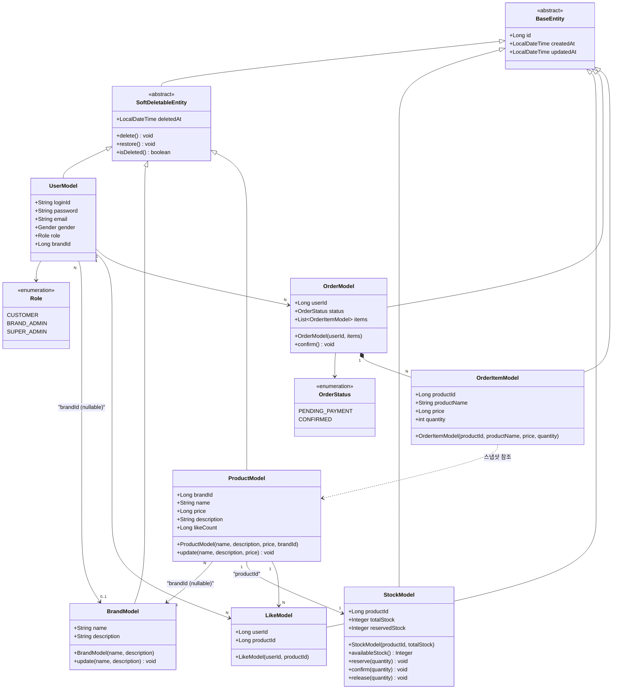

# 03. Class Diagram — 도메인 클래스 다이어그램

도메인 Model(Entity) 중심으로 그린다. Service·Facade·Repository는 포함하지 않는다.

---

---

## 설계 결정 사항

### OrderItemModel — 스냅샷 패턴
`productName`과 `price`는 주문 시점의 값을 복사해서 저장한다. `productId`는 참조용으로만 남기고, 이후 상품 정보가 변경되어도 주문 기록은 영향을 받지 않는다.

### ProductModel — 브랜드 변경 불가
`update()`는 `name`, `description`, `price`만 수정하며 `brandId`는 파라미터에 포함하지 않는다. 브랜드 변경 시도는 Facade에서 사전 차단한다.
`brandId`는 nullable이다. 브랜드 없이 상품을 등록할 수 있으며, 브랜드가 없는 경우 `brandId`는 null이다.

### StockModel — 독립 도메인
재고를 `ProductModel`에서 분리해 독립 애그리게이트로 관리한다. `availableStock() = totalStock - reservedStock`으로 실제 주문 가능 수량을 계산한다. 결제 진입 시 `reserve()`로 선점하고, 결제 완료 시 `confirm()`으로 확정 차감한다. 음수 방지는 각 메서드 내부에서 도메인 레벨로 처리한다.

### LikeModel — 복합 유니크 제약
`userId + productId` 조합에 유니크 제약을 걸어 DB 레벨에서도 중복 좋아요를 방지한다.

### ProductModel — likeCount 역정규화
`likes_desc` 정렬을 집계 쿼리로 처리하면 페이지마다 `GROUP BY` + `COUNT` 조합이 발생해 성능 보장이 어렵다. `ProductModel`에 `likeCount` 필드를 역정규화하고, 좋아요 등록·취소 시 `like_count = like_count ± 1` 형태의 DB 원자 UPDATE로 처리한다. 이렇게 하면 `ORDER BY like_count DESC` 단순 인덱스 정렬이 가능하다.

### UserModel — role + brandId
`role`은 `CUSTOMER`, `BRAND_ADMIN`, `SUPER_ADMIN` 세 가지 값을 갖는다. `brandId`는 `BRAND_ADMIN`일 때만 값이 존재하며, 나머지 역할에서는 null이다.

### OrderModel — 주문 총액은 집계 쿼리
주문 항목 수는 수십 개 수준이므로 `SUM(price * quantity)` 집계 부담이 크지 않다. 총액은 추후 결제 도메인 추가 시 계산 방식이 달라질 수 있어 지금 역정규화하지 않는다.

### LikeModel — 좋아요 취소 시 하드 딜리트
좋아요 취소 시 레코드를 실제로 삭제한다. `userId + productId` 유니크 제약과 충돌 없이 재좋아요가 가능하고 구현이 단순하다. 요구사항에 좋아요 이력 조회가 없으므로 이력 손실은 무방하다.
