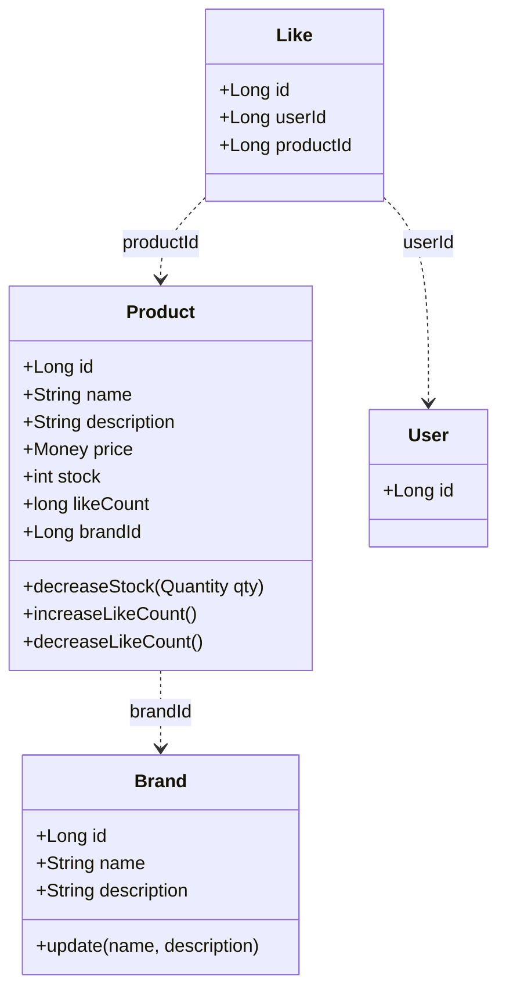
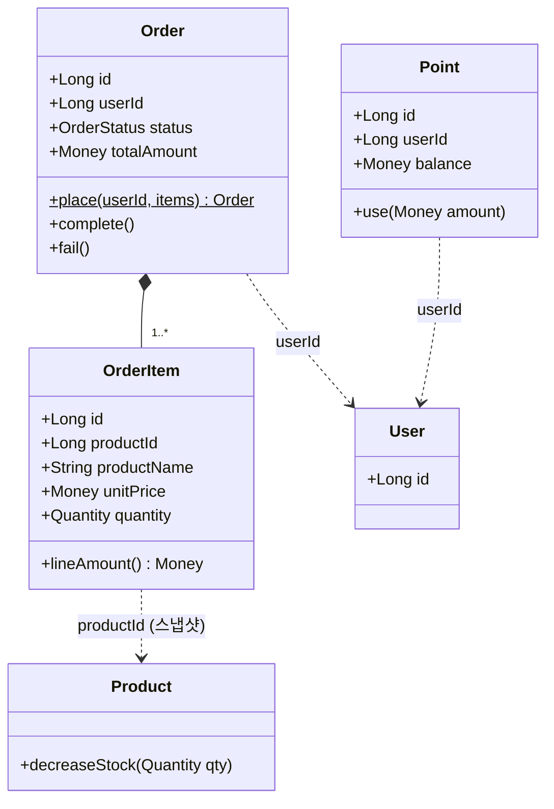
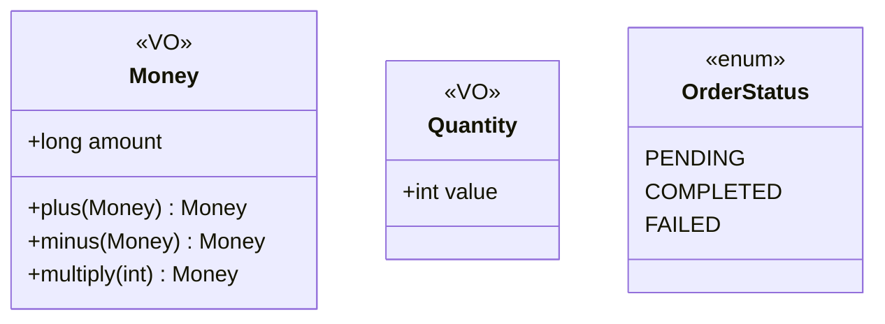

# 03. 클래스 다이어그램 (도메인 모델)

> 근거: `01-requirements.md` §4·§5, `02-sequence-diagrams.md`. 기존 코드 컨벤션(`com.loopers.domain.*`)에 맞춰 신규 도메인(Brand·Like·Order·Point)을 설계한다.

## 1. 설계 원칙

- **계층**: `interfaces`(Controller/Dto) → `application`(Facade/Info) → `domain`(Entity·Service·Repository 인터페이스·VO) → `infrastructure`(RepositoryImpl/JpaRepository). 기존 user·product 구조를 그대로 따른다.
- **공통 베이스**: 모든 엔티티는 `BaseEntity` 상속 → `id`, `createdAt`, `updatedAt`, `deletedAt`(소프트 삭제), `guard()` 검증 훅을 얻는다. `delete()`/`restore()`는 멱등하게 동작한다.
- **연관 방식**:
  - **애그리거트 간**은 객체 참조가 아니라 **Long id(FK)** 로 참조한다(현재 코드에 JPA 연관 없음 + ERD와 일치). 다이어그램에서 점선(`..>`).
  - **애그리거트 내부**(Order ↔ OrderItem)만 객체로 묶는다(컴포지션, 생명주기 공유). 다이어그램에서 실선 마름모(`*--`).
- **네이밍**: 신규 엔티티는 무접미사 + VO 활용(User 스타일). 기존 `ProductModel`은 코드상 아웃라이어로 남고, 표기는 목표 모델 기준 `Product`를 쓴다.
- **값 객체(VO)**: 불변식이 있는 값은 record VO로 만들어 검증을 생성 시점에 모은다(Money ≥ 0, Quantity ≥ 1).

> User는 week1(volume-1) 산출물이라 재설계하지 않으며, 참조용으로 `id`만 표기한다.

---

## 2. 카탈로그·좋아요 도메인

**왜 이 다이어그램인가** — 상품 탐색(목록·상세)과 좋아요(멱등 토글), 그리고 "좋아요 수"를 어디에 두는지를 드러내기 위해서다.

**읽는 포인트**
- 좋아요 수는 Product의 비정규화 필드 `likeCount`로 둔다(결정). `likes_desc` 정렬과 상세 노출이 빨라지는 대신, 좋아요 등록/취소 때 `increaseLikeCount`/`decreaseLikeCount`로 같이 갱신해야 한다. §5에서 좋아요 수는 오차를 허용하므로 약간의 드리프트는 받아들인다.
- 재고는 Product가 책임진다. `decreaseStock(qty)`가 재고 ≥ 수량을 검증한 뒤 차감하고, 부족하면 거부한다. 별도 Stock 엔티티는 두지 않는다(현행 유지).
- Like의 멱등 키는 `(userId, productId)`이고, 유니크 제약으로 0/1을 보장한다. 토글은 `BaseEntity`의 멱등 `delete()`/`restore()`를 쓴다. 취소는 소프트 삭제, 재등록은 복원이다. 쌍당 행은 하나만 있고 `deletedAt`만 바뀐다.
- 교차 참조는 모두 id(점선)다. Like는 User나 Product 객체를 들지 않는다(약결합).

---

## 3. 주문·결제 도메인

**왜 이 다이어그램인가** — 주문이 스냅샷을 어떻게 담고, 재고·포인트 차감 책임이 어디 있으며, 애그리거트 경계가 어디인지를 드러내기 위해서다.

**읽는 포인트**
- Order가 애그리거트 루트, OrderItem이 그 내부 구성요소다(컴포지션, 실선 마름모). OrderItem은 Order를 통해서만 생성·접근된다.
- 스냅샷은 OrderItem이 들고 있다. 주문 시점의 `productName`·`unitPrice`를 복사해 두므로, 이후 상품이 바뀌어도 주문 내역은 그대로다(§5 스냅샷).
- 차감 책임은 도메인별로 나뉜다. 재고는 `Product.decreaseStock`, 포인트는 `Point.use`가 맡고, 각자 자기 불변식(재고 ≥ 0, 잔액 ≥ 결제액)을 지킨다. 순서 조율(재고 → 포인트 → 외부 결제)은 OrderFacade가 한 트랜잭션으로 한다.
- 포인트는 별도 엔티티다(결정). `userId`를 키로 두고 `use()`만 제공한다(충전 제외). User 도메인은 손대지 않는다(§6).

---

## 4. 값 객체 & 열거형

- **Money**: 0 이상 불변. `Product.price`, `OrderItem.unitPrice`, `Order.totalAmount`, `Point.balance`에 공통 사용한다. 생성 시 음수를 거부하고, 연산은 새 Money를 반환한다(불변).
- **Quantity**: 1 이상. `OrderItem.quantity` 및 `decreaseStock` 인자에 사용한다.
- **OrderStatus**: 현재 단일 트랜잭션 흐름에선 성공 시 `COMPLETED`로 확정되고 실패는 롤백(미저장)된다. `PENDING`/`FAILED`는 외부 결제(후속·비동기)가 붙을 때 의미를 가진다. 취소/환불 상태는 범위 밖이다.

---

## 5. 책임 분배 (Facade 오케스트레이션)

도메인 간 협력은 Facade가 조율한다. 단일 도메인 로직은 각 Service/Entity에 둔다.

| Facade | 협력 도메인 | 핵심 책임 |
| --- | --- | --- |
| ProductFacade | ProductService, LikeService | (고객) 목록(필터·정렬·페이징), 상세에 좋아요 수 + (로그인 시) 내 좋아요 여부 결합. (어드민) 상품 등록·수정(브랜드 변경 불가)·삭제. 조회 결합과 어드민 쓰기를 한 Facade가 겸한다(대안: `AdminProductFacade` 분리 — §6.2) |
| LikeFacade | ProductService, LikeService | 상품 존재 확인 → Like 멱등 토글 → `Product.likeCount` 동기 갱신 (한 트랜잭션). 내 좋아요 목록 조회 |
| OrderFacade | ProductService, PointService, OrderService | (고객) 재고 차감 → 포인트 차감 → 주문 확정·스냅샷 저장 (한 트랜잭션, 실패 시 롤백). 외부 결제는 후속. (어드민) 전체 주문 목록·상세 조회 — 고객은 본인 주문만, 어드민은 전 주문 |
| BrandFacade | BrandService, ProductService | 브랜드 조회/관리; 삭제 시 소속 상품 동반 소프트 삭제 |

**Repository (도메인 인터페이스)**
- `LikeRepository`: `existsByUserIdAndProductId`, `findByUserId`, `deleteByUserIdAndProductId`(또는 소프트 삭제 갱신)
- `OrderRepository`: `save`, `findByUserIdAndPeriod`, `find`
- `PointRepository`: `findByUserId`
- `BrandRepository`: `save`, `find`, `findAll`, `delete`
- `ProductRepository`: 기존(`save`/`find`/`findAll`/`delete`)에 목록 필터·정렬 조회 추가

---

## 6. 어드민 경계 (식별·컨트롤러·노출 구분)

> 요구사항 §4.4가 "고객 노출 vs 어드민 전용" 결정을 클래스 단계로 미뤘다. 여기서 확정한다. 어드민은 "존재·권한·핵심 제약만" 다루므로 얕게 잡는다.

### 6.1 식별 — 가드
- 어드민은 `X-Loopers-Ldap: loopers.admin` 고정 헤더값으로 식별한다. 어드민 도메인 엔티티는 없다(§01 가정 → ERD에 `admin` 테이블 없음).
- 헤더 검증은 컨트롤러마다 흩지 않고, 어드민 prefix(`/api-admin/v1/**`)에 걸리는 단일 진입 가드가 처리한다.
  - 선택 A(권장): `HandlerInterceptor`로 prefix 전체를 가드 — 개별 컨트롤러가 권한을 신경 쓰지 않는다.
  - 선택 B: week1의 `@LoginUser` ArgumentResolver처럼 `@AdminOnly` 애너테이션 — 메서드 단위로 명시적이나 부착 누락 위험.
  - 어느 쪽이든 헤더값 불일치 시 거부한다. week1 `LoginUserArgumentResolver`(X-Loopers-LoginId/Pw)와 같은 결의 진입 가드다.

### 6.2 컨트롤러 — prefix 분리
- 같은 도메인을 고객/어드민 컨트롤러가 나눠 가진다. `domain`·`application` 계층은 공유하고 `interfaces`(컨트롤러)에서만 갈린다.
  - 고객(`/api/v1`): 상품·브랜드 **조회**, 좋아요, 내 주문.
  - 어드민(`/api-admin/v1`): 브랜드·상품 **쓰기(등록·수정·삭제)** + 전체 주문 조회.
- 쓰기는 어드민 컨트롤러에만 둔다. (현 스캐폴드 `ProductV1Controller`의 POST/PUT/DELETE가 `/api/v1`에 있는데, 구현 시 어드민 컨트롤러로 옮긴다)

### 6.3 노출 필드 구분
엔티티는 하나지만 응답 DTO에서 노출 범위를 나눈다.

| 필드 | 고객 `/api/v1` | 어드민 `/api-admin/v1` |
| --- | --- | --- |
| Brand.name / description | O | O |
| Product.name / description / price / brandId | O | O |
| Product.likeCount | O | O |
| 상세 — 내 좋아요 여부 | 로그인 시 O | — |
| Product.stock | 품절 여부만 | 정확 수량 |
| created_at / updated_at / deleted_at | X | O |

- 결정: 정확한 재고 수치는 운영 정보라 어드민 전용으로 두고, 고객에게는 "구매 가능 / 품절"만 노출한다. 대안 — 잔여 수량을 그대로 노출(품절 임박 마케팅)할 수 있으나 이번 범위에선 감춘다.
- 감사 컬럼(생성·수정·삭제 시각)은 어드민 응답에만 싣는다.

---

## 7. 잠재 리스크 (선택지)

- likeCount 동기 갱신의 정합·동시성: 좋아요 토글과 카운트 갱신이 분리되면 드리프트·경쟁이 생긴다.
  - 선택 A: 같은 트랜잭션 안에서 갱신(단순, 동시성 방어는 ERD/구현의 락·원자 갱신)
  - 선택 B: 이벤트/배치 재집계(정확, 복잡)
  - → §5에서 오차를 허용하므로 A로 충분.
- Like 삭제 방식: 소프트 삭제+복원(BaseEntity 의도와 일치, 행 누적)이냐 하드 삭제(테이블 단순, BaseEntity 소프트 삭제 미사용)냐. 여기서는 소프트 삭제+복원을 채택하고 하드 삭제는 대안으로 둔다.
- Order ↔ OrderItem 매핑: `@OneToMany`(cascade)로 묶을지, OrderItem에 `orderId` FK만 둘지는 영속성 선택이다 → `04-erd.md`.
- Point 동시 차감: 한 유저가 동시에 주문하면 잔액이 경쟁한다. 락·원자 차감은 동시성 단계로 미룬다(범위 밖, ERD/구현).
- 기존 코드 정렬: 현재 `ProductModel`(Model 접미사, primitive)에는 `brandId`·`likeCount`·`Money`가 없다. 구현 때 Product를 확장해야 한다. 다이어그램은 목표 모델 기준이다.
