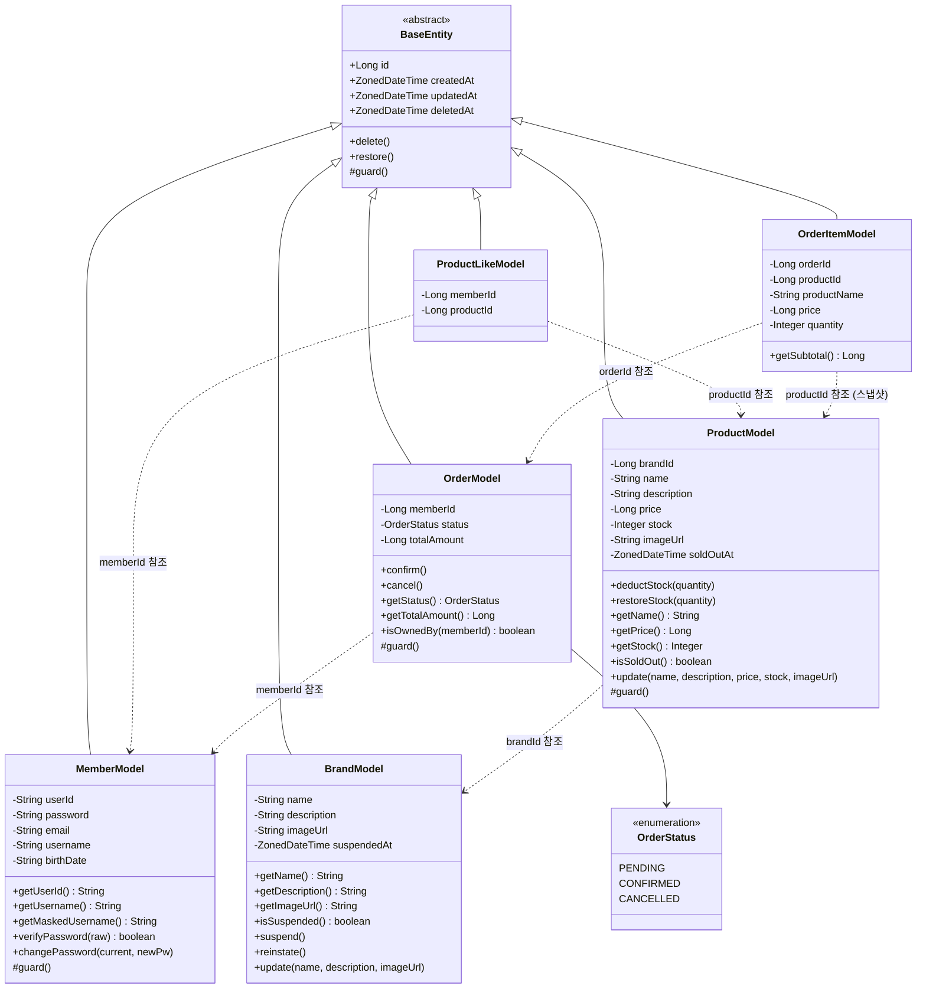
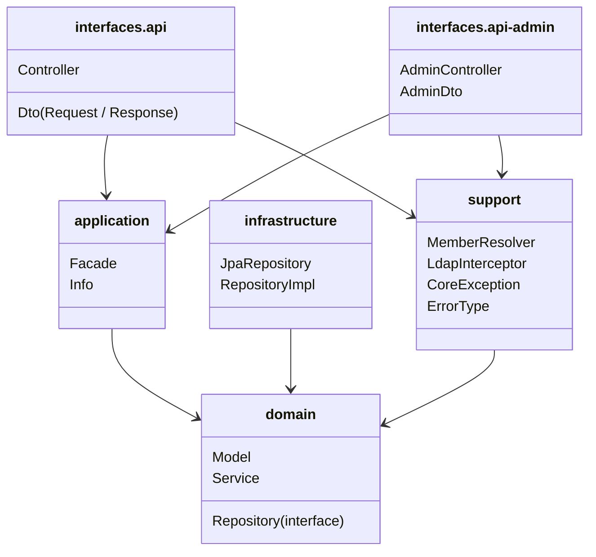

# 03. 클래스 다이어그램 (도메인 설계)

## 목적

클래스 다이어그램으로 검증하려는 것:
- 각 도메인 객체의 책임 경계가 명확한가
- 의존 방향이 바깥(인터페이스/인프라)에서 안쪽(도메인)으로 흐르는가
- 도메인 간 결합도가 낮게 유지되는가 (직접 객체 참조 대신 ID 참조)

---

## 전체 도메인 클래스 다이어그램

---

## 도메인별 책임 설명

### Member (회원)
- `verifyPassword(raw)`: 입력된 평문 비밀번호를 해시 후 저장값과 비교. 일치 여부를 boolean으로 반환.
- `getMaskedUsername()`: 이름 마지막 글자를 `*`로 대체해 반환. 마스킹 로직을 도메인에 캡슐화.
- `changePassword(current, newPw)`: 현재 비밀번호 검증, 새 비밀번호 RULE 검증, 동일 비밀번호 방지를 내부에서 처리.
- `guard()`: userId가 영문+숫자로만 구성되어 있는지, birthDate가 YYYYMMDD 형식인지 검증.

### Brand (브랜드)
- 브랜드 정보를 관리하는 독립 도메인.
- Product는 `brandId`만 보유하며 Brand 객체를 직접 참조하지 않는다.
- Facade 레이어에서 Product + Brand를 조합해 응답 객체를 생성한다.
- `isSuspended()`: `suspendedAt != null`이면 true 반환. 계약 중지 상태 여부를 도메인이 스스로 판단.
- `suspend()`: `suspendedAt`을 현재 시각으로 설정. `deleted_at`(영구 삭제)과 달리 가역적이다.
- `reinstate()`: `suspendedAt`을 null로 초기화해 계약 재개. 별도 상품 cascade 없이 즉시 노출된다.

### Product (상품)
- `deductStock(quantity)`: 차감 후 재고가 음수가 되면 `CoreException` 발생. 차감 후 `stock == 0`이면 `soldOutAt`을 현재 시각으로 설정한다 (soft-delete 방식).
- `restoreStock(quantity)`: 주문 취소 시 재고를 원복. 복구 후 `stock > 0`이면 `soldOutAt`을 null로 초기화한다.
- `isSoldOut()`: `soldOutAt != null`이면 true 반환. `stock` 값 직접 비교 대신 soft-delete 컬럼으로 품절 상태를 판별한다.
- `brandId`만 보유하며, 브랜드명은 Facade 조합 시점에 채워진다.
- 재고 동시성 보호: Repository 레이어에서 `SELECT FOR UPDATE` 적용.

### ProductLike (상품 좋아요)
- `memberId`와 `productId`의 조합으로 활성 좋아요 중복 방지.
- Soft delete 방식: `deletedAt IS NULL`인 경우만 활성 좋아요로 간주.
- 멱등 동작: 등록 시 활성 좋아요 존재 → INSERT 생략, 취소 시 활성 좋아요 없음 → DELETE 생략.

### Order / OrderItem (주문)
- `Order`는 주문의 상태와 금액 정보를 관리. 현재 결제 미구현으로 생성 시 `PENDING`.
- `OrderItem`은 주문 시점의 상품명·단가를 스냅샷으로 저장. 이후 상품 정보가 변경되어도 주문 내역은 보존.
- `isOwnedBy(memberId)`: 본인 주문 여부를 확인해 403 처리에 활용.
- `totalAmount = Σ(price × quantity)` — Order 생성 시점에 계산되어 저장.
- `confirm()`: 추후 결제 개발 시 PENDING → CONFIRMED 전환에 사용.
- `cancel()`: PENDING → CANCELLED 전환; Service에서 재고 복구와 함께 호출.

> **결제(Payment)는 이번 설계 범위 외**: 추후 개발 시 PaymentModel, PaymentStatus, PointAccountModel 등을 추가하고 OrderModel에 `paymentAmount`, `pointUsed`를 확장한다.

---

## 레이어 구조 (패키지 의존 방향)

> **읽는 포인트**: `domain`은 다른 어떤 레이어도 의존하지 않는다. Repository 인터페이스는 `domain`에 위치하고 구현체는 `infrastructure`에 위치한다. 어드민과 사용자 API는 동일한 Facade/Service/Repository를 공유하되, 인증 방식과 응답 DTO만 다르다.

---

## 잠재 리스크

| 리스크 | 설명 | 선택지 |
|--------|------|--------|
| 재고 동시성 | 다수 주문 동시 진입 시 stock 음수 가능성 | A) Pessimistic Lock (`PESSIMISTIC_WRITE`) — 구현 단순, 처리량 낮음 / B) Optimistic Lock (`@Version`) — 처리량 높으나 재시도 로직 필요 |
| sold_out_at 동시 갱신 | deductStock 후 soldOutAt 설정 사이에 다른 스레드가 진입하면 품절 상태 불일치 발생 가능 | Pessimistic Lock 범위 내에서 stock 차감과 soldOutAt 갱신을 동일 트랜잭션으로 처리 |
| OrderItem 스냅샷 누락 | Product FK만 저장하면 가격 변경 후 과거 주문 금액이 달라짐 | `price`, `productName` 스냅샷 컬럼 필수 저장 |
| 결제 전 재고 점유 | PENDING 상태가 장기 유지되면 실 구매 불가 재고 발생 | 결제 개발 시 주문 만료 TTL 또는 자동 취소 정책 함께 설계 필요 |
