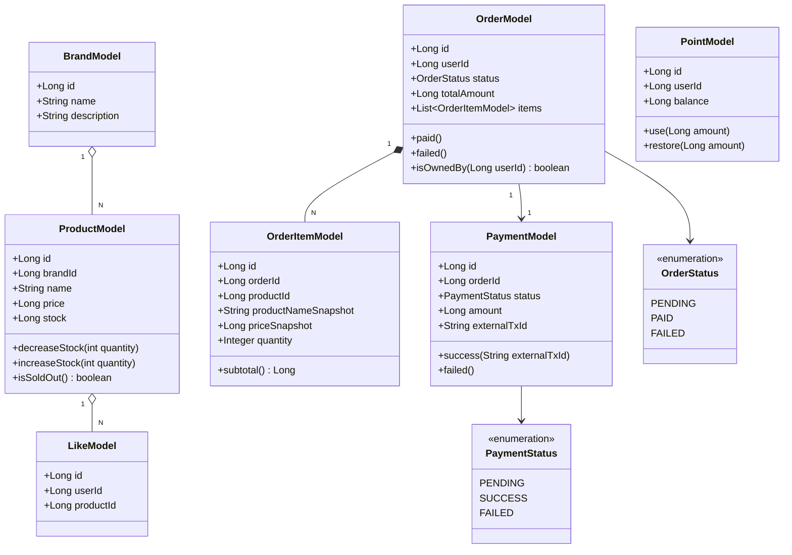

# 03. 클래스 다이어그램 / 도메인 객체 설계

> 도메인 객체와 관계를 표현. 프로젝트 패키지 계층(`interfaces / application / domain / infrastructure`)에 매핑.
> 모든 모델은 `BaseEntity`(id, createdAt, updatedAt, deletedAt)를 상속한다.

## 1. 패키지 / 계층 매핑

| 도메인 | interfaces.api | application | domain | infrastructure |
| --- | --- | --- | --- | --- |
| brand | `BrandV1Controller`, `BrandAdminV1Controller` | `BrandFacade` | `BrandModel`, `BrandService`, `BrandRepository` | `BrandJpaRepository`, `BrandRepositoryImpl` |
| product | `ProductV1Controller`, `ProductAdminV1Controller` | `ProductFacade` | `ProductModel`, `ProductService`, `ProductRepository` | `ProductJpaRepository`, `ProductRepositoryImpl` |
| like | `LikeV1Controller` | `LikeFacade` | `LikeModel`, `LikeService`, `LikeRepository` | `LikeJpaRepository`, `LikeRepositoryImpl` |
| order | `OrderV1Controller`, `OrderAdminV1Controller` | `OrderFacade` | `OrderModel`, `OrderItemModel`, `OrderStatus`, `OrderService`, `OrderRepository` | `OrderJpaRepository`, `OrderRepositoryImpl` |
| payment | — (주문 흐름 내부) | (`OrderFacade`가 조율) | `PaymentModel`, `PaymentStatus`, `PaymentService`, `PaymentRepository`, `PgClient`(port) | `PaymentJpaRepository`, `PaymentRepositoryImpl`, `PgClientImpl`(adapter) |
| point | — (주문 흐름 내부) | (`OrderFacade`가 조율) | `PointModel`, `PointService`, `PointRepository` | `PointJpaRepository`, `PointRepositoryImpl` |

> 어드민 기능은 별도 컨트롤러(`*AdminV1Controller`)로 분리하되 동일한 `domain` 서비스를 재사용한다.

## 2. 도메인 클래스 다이어그램

## 3. 도메인 책임 정리

### BrandModel / BrandService
- 책임: `BrandModel`은 브랜드 정보(이름·설명)를 보유. `BrandService`는 브랜드 조회와 어드민 CRUD, 브랜드 삭제 시 소속 상품 일괄 삭제를 조율.
- 협력 객체: `ProductService` (브랜드 삭제 시 상품 삭제)

### ProductModel / ProductService
- 책임: `ProductModel`이 상품 정보와 재고를 보유하며 **재고 차감·복원의 주체**다 — `decreaseStock`이 재고 부족을 검증하고 예외를 던진다. `ProductService`는 목록·상세 조회, 정렬·필터, 어드민 CRUD를 담당.
- 협력 객체: `BrandService`(상품 등록 시 브랜드 존재 검증), `LikeRepository`(좋아요 수 집계)

### LikeModel / LikeService
- 책임: `LikeModel`은 좋아요 1건 = `(userId, productId)` 쌍. **멱등성은 `LikeService`가 보장** — 등록 시 존재를 확인해 미존재일 때만 저장하고, 취소 시 존재 여부와 무관하게 삭제한다.
- unique 제약: `(user_id, product_id)` — 애플리케이션 검증의 최종 방어선

### OrderModel / OrderItemModel / OrderService
- 책임: `OrderModel`은 상태 전이(`PENDING → PAID/FAILED`)와 총액을 보유하고, 본인 소유 검증(`isOwnedBy`)을 제공. `OrderItemModel`은 주문 시점 상품 스냅샷(상품명·단가)을 보유.
- 스냅샷 저장 책임: 주문 생성 시 `OrderService`가 상품 정보를 `OrderItemModel`로 복사한다.
- 상태 전이 규칙: 생성 시 `PENDING`, 결제 성공 시 `paid()`, 결제 실패 시 `failed()`.

### PaymentModel / PaymentService
- 책임: `PaymentModel`은 결제 1건의 상태·금액·외부 트랜잭션 ID를 보유. `PaymentService`는 결제 생성과 외부 PG 호출 위임, 결과 반영을 담당.
- **외부 시스템 호출은 `PgClient`(domain port)를 통해서만 수행**하며, 실제 어댑터(`PgClientImpl`)는 infrastructure에 위치한다.

### PointModel / PointService
- 책임: `PointModel`이 유저 포인트 잔액을 보유·검증한다 — `use()`는 잔액 부족을 검증한 뒤 차감하고, `restore()`는 보상 시 복원한다.

### OrderFacade (application)
- 책임: **유스케이스 조율과 트랜잭션 경계.** 재고 차감 → 포인트 차감 → 결제 순서로 도메인 서비스를 호출하고, 어느 단계든 실패하면 **보상 트랜잭션**(재고·포인트 복원, 주문 `FAILED`)을 수행한다.
- 트랜잭션 고려: 외부 PG 호출은 DB 트랜잭션에 포함하지 않는다. 로컬 차감은 트랜잭션으로 묶고, PG 결과에 따라 별도 트랜잭션으로 확정/보상한다.

## 4. 외부 시스템 / 어댑터

- `PgClient` — `domain.payment`의 port 인터페이스 (`requestPayment(orderId, amount)`, `cancelPayment(externalTxId)`)
- `PgClientImpl` — `infrastructure.payment`의 adapter. 외부 PG와 실제 HTTP 연동을 담당.
- port/adapter 분리로 도메인은 외부 PG 구현에 의존하지 않으며, 테스트 시 `PgClient`를 대역으로 대체할 수 있다.

## ✅ 과제 체크리스트 (이 문서 관점)

- [x] 클래스 구조가 도메인 설계를 잘 표현하고 있는가?
- [x] 책임이 명확하게 분리되어 있는가?
