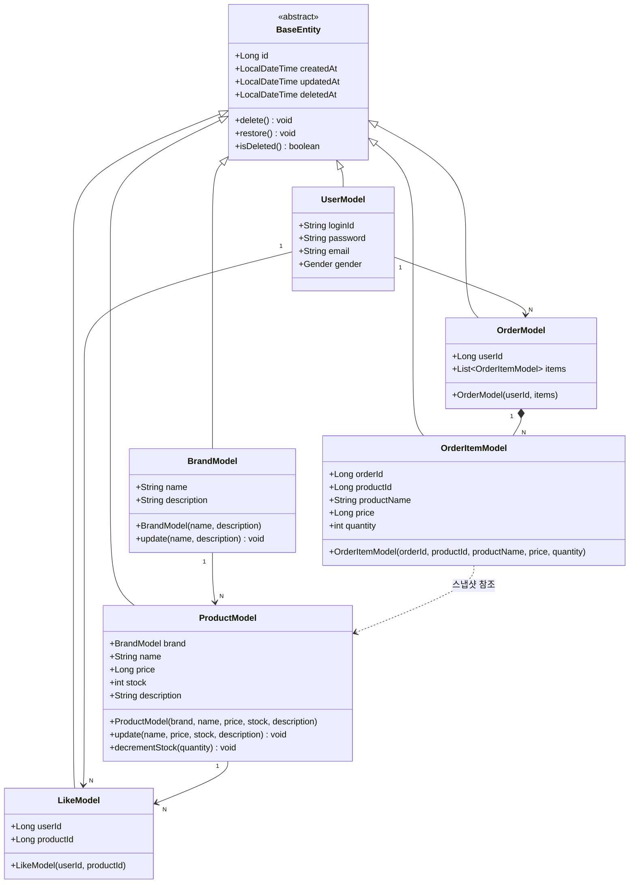

# 03. Class Diagram — 도메인 클래스 다이어그램

도메인 Model(Entity) 중심으로 그린다. Service·Facade·Repository는 포함하지 않는다.

---

---

## 설계 결정 사항

### OrderItemModel — 스냅샷 패턴
`productName`과 `price`는 주문 시점의 값을 복사해서 저장한다. `productId`는 참조용으로만 남기고, 이후 상품 정보가 변경되어도 주문 기록은 영향을 받지 않는다.

### ProductModel — 브랜드 변경 불가
`update()`는 `name`, `price`, `stock`, `description`만 수정하며 `brand`는 파라미터에 포함하지 않는다. 브랜드 변경 시도는 Facade에서 사전 차단한다.

### ProductModel — decrementStock()
재고가 요청 수량보다 적으면 `CoreException(BAD_REQUEST)`을 던진다. 이 검증은 비관적 락 획득 이후 호출되어 동시성 문제를 방지한다.

### LikeModel — 복합 유니크 제약
`userId + productId` 조합에 유니크 제약을 걸어 DB 레벨에서도 중복 좋아요를 방지한다.

### [미결] 좋아요 수(likeCount) 저장 방식
상품 목록·상세에 좋아요 수 표시, `likes_desc` 정렬 지원이 필요하다. 두 가지 선택지가 있다.
- **집계 쿼리**: `LikeModel`을 COUNT로 집계. 구현이 단순하지만 정렬 시 성능 부담
- **역정규화 필드**: `ProductModel`에 `likeCount` 필드 추가. 정렬 성능은 좋지만 좋아요 등록·취소마다 업데이트가 필요하고 동시성 처리가 복잡해짐
