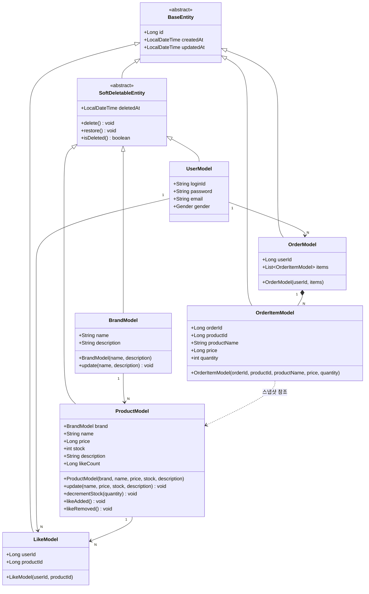

# 03. Class Diagram — 도메인 클래스 다이어그램

도메인 Model(Entity) 중심으로 그린다. Service·Facade·Repository는 포함하지 않는다.

---

---

## 설계 결정 사항

### OrderItemModel — 스냅샷 패턴
`productName`과 `price`는 주문 시점의 값을 복사해서 저장한다. `productId`는 참조용으로만 남기고, 이후 상품 정보가 변경되어도 주문 기록은 영향을 받지 않는다.

### ProductModel — 브랜드 변경 불가
`update()`는 `name`, `price`, `stock`, `description`만 수정하며 `brand`는 파라미터에 포함하지 않는다. 브랜드 변경 시도는 Facade에서 사전 차단한다.

### ProductModel — decrementStock()
재고가 요청 수량보다 적으면 `CoreException(BAD_REQUEST)`을 던진다. 이 검증은 비관적 락 획득 이후 호출되어 동시성 문제를 방지한다.

### LikeModel — 복합 유니크 제약
`userId + productId` 조합에 유니크 제약을 걸어 DB 레벨에서도 중복 좋아요를 방지한다.

### ProductModel — likeCount 역정규화
`likes_desc` 정렬을 집계 쿼리로 처리하면 페이지마다 `GROUP BY` + `COUNT` 조합이 발생해 성능 보장이 어렵다. `ProductModel`에 `likeCount` 필드를 역정규화하고, 좋아요 등록·취소 시 `like_count = like_count ± 1` 형태의 DB 원자 UPDATE로 처리한다. 이렇게 하면 동시성 문제 없이 `ORDER BY like_count DESC` 단순 인덱스 정렬이 가능하다. 메서드명은 구현 방식이 아닌 도메인 이벤트를 기준으로 `likeAdded()` / `likeRemoved()`로 명명한다.

### OrderModel — 주문 총액은 집계 쿼리
주문 항목 수는 수십 개 수준이므로 `SUM(price * quantity)` 집계 부담이 크지 않다. 총액은 추후 결제 도메인 추가 시 계산 방식이 달라질 수 있어 지금 역정규화하지 않는다.

### LikeModel — 좋아요 취소 시 하드 딜리트
좋아요 취소 시 레코드를 실제로 삭제한다. `userId + productId` 유니크 제약과 충돌 없이 재좋아요가 가능하고 구현이 단순하다. 요구사항에 좋아요 이력 조회가 없으므로 이력 손실은 무방하다. likeCount 연동도 `DELETE like` + `likeRemoved()` 한 쌍으로 처리된다.

---

## 결정 간 연관성

### likeCount 역정규화 ↔ LikeModel 하드 딜리트
하드 딜리트로 결정했으므로 `DELETE like` + `likeRemoved()` 한 쌍으로 처리된다. likeCount 정합성 관리가 단순하다.

### likeCount 역정규화 ↔ decrementStock 비관적 락
둘 다 `ProductModel`의 같은 row를 업데이트한다. 주문(`SELECT ... FOR UPDATE`)과 좋아요(`UPDATE like_count = like_count ± 1`)가 같은 상품에 동시에 발생하면 likeCount UPDATE가 락 해제를 기다려야 한다. 기능상 문제는 없지만 주문이 많은 상품일수록 좋아요 응답도 같이 느려질 수 있다.

