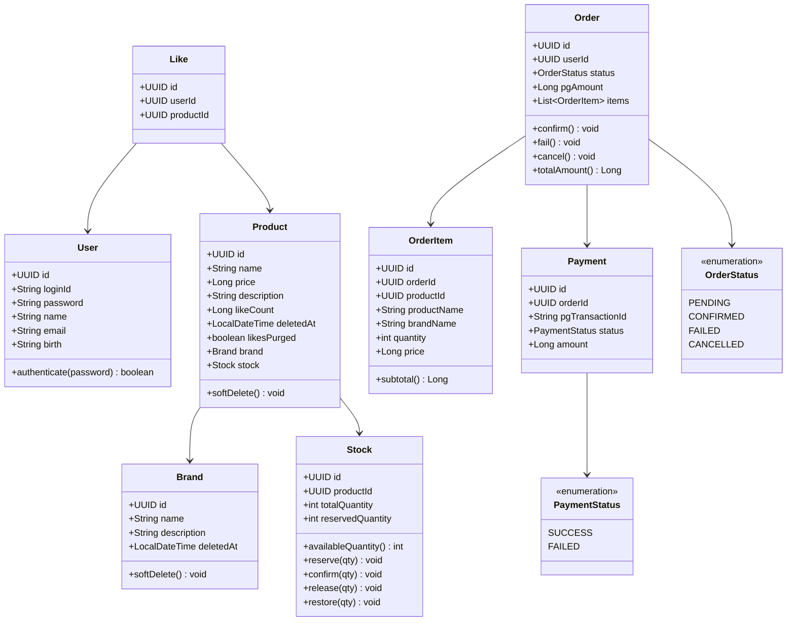

# 클래스 다이어그램

## 목적
도메인 간 의존 방향과 각 도메인의 책임 경계를 검증한다.
각 도메인이 자신의 상태 변경 로직을 직접 들고 있는지, 외부 도메인에 직접 의존하지 않는지 확인한다.

## 다이어그램

## 도메인별 책임 설명

### User
- 인증 (`authenticate`) 로직을 직접 보유
- 포인트 기능 제거로 잔액/이력 관련 책임 없음

### Brand
- 독립 엔티티. 상품이 Brand를 참조하는 방향
- 브랜드 정보 변경이 상품에 영향을 주지 않도록 분리
- `deletedAt`으로 소프트 딜리트. 삭제 시 소속 상품도 함께 소프트 딜리트 (cascade)

### Product / Stock
- 옵션 개념 없음. Product는 Stock과 **1:1 관계**(상품당 재고 1건)
- 재고 상태 변경(`reserve`, `confirm`, `release`, `restore`)은 Stock이 단독으로 책임
- `availableQuantity() = totalQuantity - reservedQuantity`
- Stock은 `productId`를 참조 (상품 단위 재고)
- Product는 `deletedAt`으로 소프트 딜리트(복구 가능). 재고는 상품을 통해 조회되므로 별도 삭제 플래그 불필요 — 상품 삭제 시 자동 숨김, 복구 시 자동 복구
- `likesPurged`: 삭제된 상품의 좋아요(고용량, 복구 제외)를 비동기 배치가 청크 삭제했는지 마킹

### Like
- `userId + productId` 복합키로 중복 방지
- 등록(`POST`)/취소(`DELETE`)가 분리된 멱등 동작을 LikeFacade가 처리

### Order / OrderItem
- Order가 상태 전이 메서드(`confirm`, `fail`, `cancel`)를 직접 보유
- Order는 1개 이상의 OrderItem을 가짐 (복수 상품 주문)
- 포인트 제거로 금액은 `pgAmount` 하나만 보유. `totalAmount()`는 주문 라인 합계 = pgAmount
- OrderItem은 주문 시점의 상품명, 브랜드명, 단가, 수량을 스냅샷으로 저장 (옵션 없음)
- 상품이 소프트 딜리트되어도 OrderItem 스냅샷은 보존되어 과거 주문 조회에 영향 없음

### Payment
- PG 트랜잭션 ID와 결제 상태를 보관
- Order와 1:1 관계 (재시도 없음)

## 의존 방향 원칙
- 상위 도메인(Order, Payment)이 하위 도메인(Stock)을 참조하는 방향
- 각 Service는 Facade에서만 호출, Service 간 직접 참조 금지
  → 추후 이벤트 기반으로 전환 시 영향 범위를 Facade 한 곳으로 제한하기 위함
- 관리자 기능(Brand/Product CRUD)은 동일 도메인 Service를 재사용하며, LDAP 인증은 인터페이스 계층(Interceptor)에서 게이트로 처리하고 도메인은 인증을 알지 못함
