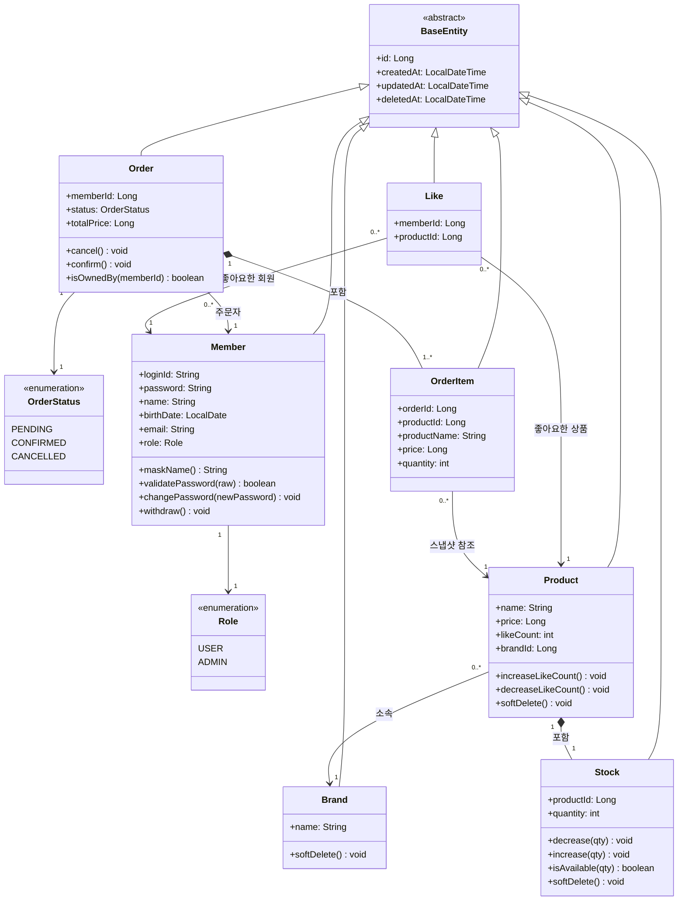

# 03. 클래스 다이어그램

> 작성일: 2026-05-21
> 아키텍처: Controller → ApplicationService → Domain → Repository
> 설계 방식: DDD Lite — 도메인 객체가 비즈니스 로직 보유

---

## CD-01. 도메인 엔티티

### 왜 이 다이어그램이 필요한가?
도메인 객체의 책임과 관계를 확인합니다.
- 비즈니스 로직이 Service가 아닌 도메인 객체에 있는지
- BaseEntity 상속으로 공통 필드가 중복 없이 관리되는지
- 엔티티 간 관계의 종류(합성/연관)와 다중성이 올바른지를 확인합니다.

### 관계 종류 설명

| 표기 | 종류 | 의미 | 예시 |
|------|------|------|------|
| `*--` | 합성 (Composition) | 부모 없으면 자식도 존재 불가 | Order 삭제 시 OrderItem도 함께 |
| `-->` | 연관 (Association) | 참조하지만 독립적으로 존재 | Product 삭제돼도 Member는 유지 |
| `<|--` | 상속 (Generalization) | 부모 클래스를 확장 | BaseEntity 공통 필드 상속 |

### 읽는 포인트
1. `stock.decrease()`, `order.cancel()` 처럼 도메인 객체가 자기 상태를 직접 변경합니다. Service에서 직접 필드를 수정하지 않습니다.
2. Order와 OrderItem은 합성 관계입니다. OrderItem은 Order 없이 존재할 수 없고, Order가 취소돼도 레코드는 남지만 논리적으로 Order에 종속됩니다.
3. Product와 Stock도 합성 관계(1:1)입니다. Stock은 Product 등록 시 함께 생성되고, Product 삭제 시 함께 Soft Delete됩니다.
4. Like는 Hard Delete입니다. BaseEntity를 상속하지만 `softDelete()` 메서드가 없습니다. 좋아요 취소 시 레코드 자체를 삭제합니다.
5. OrderItem의 `productName`, `price`는 주문 시점의 값을 복사해 저장합니다. Product가 수정/삭제되어도 주문 이력은 보존됩니다.
6. `brandId`, `productId`, `memberId` 등은 실제 FK 제약이 아닌 참조용 ID입니다. 관계는 애플리케이션 레벨에서 관리합니다.

### 잠재 리스크
- `Like.deletedAt`이 BaseEntity 상속으로 존재하지만 사용하지 않음 → 혼란 방지를 위해 코드 주석 또는 Hard Delete 정책 명시 필요
- `OrderItem.productId`는 조회용이 아닌 이력 보존용 — 삭제된 상품도 조회 가능해야 하므로 `@SQLRestriction` 필터 적용 제외 필요
- 좋아요 동시 중복 요청 시 `existsByMemberIdAndProductId` 체크를 둘 다 통과할 수 있음 → DB Unique 제약(member_id + product_id)으로 하나만 저장, 멱등 처리로 200 반환해 재시도 안전하게 처리
