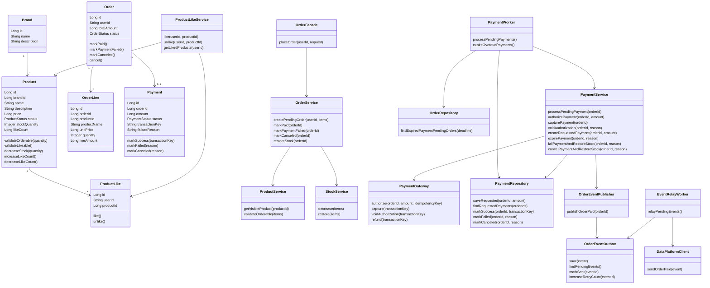

# 2주차 클래스 설계

## 읽는 포인트

- 도메인 모델은 비즈니스 규칙과 상태 전이에 집중하고, 여러 도메인의 조합은 application 계층에서 담당한다.
- `OrderFacade`와 `PaymentService`는 주문 생성, 결제 요청, outbox 저장의 경계를 확인하기 위한 핵심 클래스다.
- 실제 구현 전에는 클래스 이름보다 책임 배치와 의존 방향이 적절한지 먼저 검토한다.

## 설계 의도

이 클래스 설계는 도메인 책임과 의존 방향을 확인하기 위해 작성한다. 핵심 규칙은 도메인 모델과 도메인 서비스에 두고, 여러 도메인의 조합과 외부 시스템 호출은 application 계층에서 조정한다.

## 클래스 다이어그램



## 주요 책임

### Product

- 상품명, 가격, 판매 상태, 재고 수량, 좋아요 수를 가진다.
- 주문 가능 여부를 판단한다.
- 좋아요 등록 가능 여부를 판단한다.
- 주문 시 재고를 차감한다.
- 좋아요 등록/취소 시 `likeCount`를 변경한다.

### Brand

- 상품의 브랜드 정보를 표현한다.
- 상품과 1:N 관계를 가진다.

### ProductLike

- 사용자와 상품의 좋아요 관계를 표현한다.
- `userId + productId` 기준 유일성을 가진다.
- 좋아요 등록/취소 멱등성의 기준 데이터다.

### ProductLikeService

- 좋아요 등록/취소와 `Product.likeCount` 증감을 같은 DB 트랜잭션에서 처리한다.
- 좋아요 등록은 판매 가능한 상품에만 허용한다.
- 판매 중지/품절 상품에는 새 좋아요를 등록하지 않는다.
- 좋아요 취소는 상품 상태와 무관하게 허용한다.
- 내 좋아요 목록은 `product_like` 이력을 기준으로 조회하고, 판매 중지/품절 상품도 포함한다.
- 신규 좋아요 등록 시에만 `likeCount`를 증가시킨다.
- 실제 좋아요 이력이 삭제된 경우에만 `likeCount`를 감소시킨다.
- `product_like`를 정합성 기준 데이터로 두고, `likeCount`는 조회용 카운터로 관리한다.

### Order

- 주문의 생명주기와 상태 전이를 관리한다.
- 주문 생성 직후 `PAYMENT_PENDING` 상태가 된다.
- 결제 성공 시 `PAID`, 실패 시 `PAYMENT_FAILED`, 취소 시 `CANCELED`로 전이한다.

### OrderLine

- 주문 당시 상품 스냅샷을 보관한다.
- 상품명과 단가를 저장해 상품 정보 변경이 과거 주문에 영향을 주지 않도록 한다.

### Payment

- 결제 요청과 결과를 기록한다.
- 외부 결제 시스템의 거래 키와 실패 사유를 보관한다.
- `TIMEOUT`은 별도 컬럼이 아니라 소스 레벨에서 판정하는 실패 사유 값이다.
- 외부 결제 요청 전 `REQUESTED` 상태로 먼저 생성되어 worker 처리 권한을 선점한다.
- `orderId` 기준 유일성을 통해 같은 주문의 결제 요청이 중복 처리되지 않게 한다.

### PaymentWorker

- `PAYMENT_PENDING` 주문의 결제 요청을 내부 비동기로 처리한다.
- 주문 생성 시각 기준 결제 대기 시간 1분 초과 여부를 소스 레벨에서 판정한다.
- `PAYMENT_PENDING` 주문과 `REQUESTED` 결제를 스캔해 응답 지연 또는 worker 중단 후에도 만료 처리를 수행한다.
- 1분을 넘긴 주문을 `PAYMENT_FAILED`와 실패 사유 값 `TIMEOUT`으로 전이한다.

### PaymentService

- 외부 결제 요청 전에 `Payment(REQUESTED)` 저장을 먼저 시도한다.
- `payment.orderId` 유니크 제약으로 저장에 성공한 worker만 외부 결제 요청을 수행한다.
- 외부 결제 요청에는 `orderId` 기반 idempotency key를 전달한다.
- 외부 PG는 `auth/capture/void` 계약을 지원한다고 가정한다.
- 주문 생성 시각 기준 1분을 넘긴 대기/요청 건은 `TIMEOUT`으로 만료 처리한다.
- 이미 성공/실패/취소로 확정된 결제는 다시 만료 처리하지 않는다.
- 결제 실패/취소/타임아웃 시 결제 결과 기록, 주문 상태 전이, 재고 복구를 하나의 DB 트랜잭션으로 처리한다.
- 결제 성공 시 외부 데이터 플랫폼을 직접 호출하지 않고 `OrderEventPublisher`에 주문 완료 이벤트 저장을 요청한다.

### OrderEventPublisher

- 주문 완료 이벤트를 outbox에 저장하는 진입점이다.
- 주문 `PAID` 상태 전이와 이벤트 저장이 같은 DB 트랜잭션 경계에 들어오도록 조정한다.
- 외부 데이터 플랫폼에는 직접 전송하지 않는다.

### OrderEventOutbox

- 외부 데이터 플랫폼으로 보낼 주문 이벤트를 저장한다.
- 아직 전송되지 않은 이벤트를 조회할 수 있게 한다.
- 전송 성공 시 상태를 갱신하고, 실패 시 재시도 횟수를 증가시킨다.

### EventRelayWorker

- outbox에 남아 있는 주문 이벤트를 조회한다.
- `DataPlatformClient`를 통해 외부 데이터 플랫폼에 이벤트를 전송한다.
- 전송 결과에 따라 outbox 상태를 갱신한다.

### DataPlatformClient

- 외부 데이터 플랫폼 전송 API 호출을 담당한다.
- `PaymentService`가 아니라 `EventRelayWorker`에서 사용한다.

## 의존 방향

- `interfaces`는 HTTP 요청/응답 변환만 담당한다.
- `application`은 여러 도메인 서비스를 조합한다.
- `domain`은 비즈니스 규칙을 가진다.
- `infrastructure`는 Repository와 외부 시스템 구현을 담당한다.
- 도메인 모델은 외부 결제 시스템이나 HTTP 계층을 직접 알지 않는다.
- `PaymentService`는 `DataPlatformClient`를 직접 알지 않고, `OrderEventPublisher`를 통해 outbox 저장만 요청한다.

## 상태 정의 초안

```text
ProductStatus
- ON_SALE
- SOLD_OUT
- STOPPED

OrderStatus
- PAYMENT_PENDING
- PAID
- PAYMENT_FAILED
- CANCELED

PaymentStatus
- REQUESTED
- SUCCESS
- FAILED
- CANCELED
```

## 리스크와 선택지

- 주문 도메인이 재고까지 직접 알면 응집도는 높아질 수 있지만 도메인 간 결합이 커진다.
- `OrderFacade`가 재고와 결제를 조정하면 책임 경계는 명확하지만 애플리케이션 서비스가 커질 수 있다.
- 결제 결과를 내부 비동기로 처리하면 장애 격리는 좋아지지만 상태 조회, 1분 대기 만료, 중복 실행 방지 설계가 필요하다.
