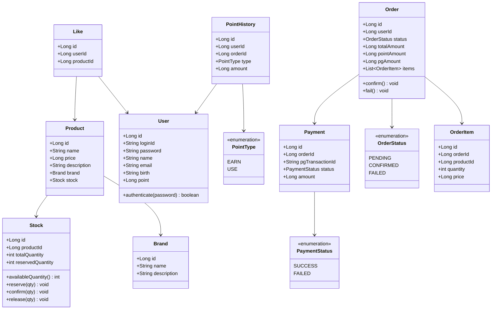

# 클래스 다이어그램

## 목적
도메인 간 의존 방향과 각 도메인의 책임 경계를 검증한다.
각 도메인이 자신의 상태 변경 로직을 직접 들고 있는지, 외부 도메인에 직접 의존하지 않는지 확인한다.

## 다이어그램

## 도메인별 책임 설명

### User
- 인증 (`authenticate`) 로직을 직접 보유
- `point` 잔액 컬럼 보유 → atomic UPDATE로 동시성 보장
- 포인트 이력은 `PointHistory`에 위임

### Brand
- 독립 엔티티. 상품이 Brand를 참조하는 방향
- 브랜드 정보 변경이 상품에 영향을 주지 않도록 분리

### Product / Stock
- Stock은 Product와 1:1 관계
- 재고 상태 변경(`reserve`, `confirm`, `release`)은 Stock이 단독으로 책임
- `availableQuantity() = totalQuantity - reservedQuantity`

### Like
- `userId + productId` 복합키로 중복 방지
- 토글 동작은 LikeFacade가 조회 후 분기

### Order / OrderItem
- Order가 상태 전이 메서드(`confirm`, `fail`)를 직접 보유
- OrderItem은 주문 시점의 가격을 스냅샷으로 저장 (상품 가격 변경에 영향 없음)

### Payment
- PG 트랜잭션 ID와 결제 상태를 보관
- Order와 1:1 관계 (재시도 없음)

### PointHistory
- append-only 이력 테이블
- `type = USE` → 차감, `type = EARN` → 적립

## 의존 방향 원칙
- 상위 도메인(Order, Payment)이 하위 도메인(Stock, Point)을 참조하는 방향
- 각 Service는 Facade에서만 호출, Service 간 직접 참조 금지
  → 추후 이벤트 기반으로 전환 시 영향 범위를 Facade 한 곳으로 제한하기 위함
