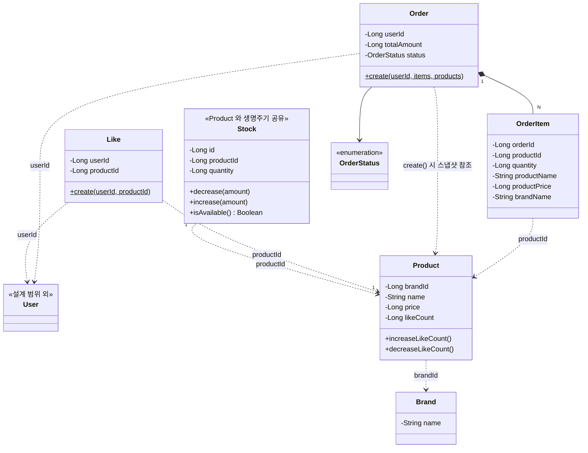

# 03. 클래스 다이어그램

## 1. 작성 원칙

### 1.1 다이어그램의 기조

1. **필드는 책임을 드러내는 데 필요한 것만** — 식별 정보 · 협력 관계의 ID · *책임의 대상이 되는 핵심 상태* (가격, 재고 수량, 좋아요 수 등). `description`, `createdAt` 같은 부속 정보는 그리지 않는다.
2. **메서드는 책임이 드러나는 것만** — 시퀀스에서 *메시지로 등장했던* 메서드만. `update()`, `guard()`, getter/setter, BaseEntity 의 공통 메서드는 관행적 처리라 책임을 말해주지 않으므로 그리지 않는다.
3. **잃은 정보는 본문이 보충한다** — 다이어그램은 가볍게, 책임의 결은 3장의 책임 표가 푼다.

### 1.2 설계 원칙

- **엔티티 / VO 분리 기준 — ID 와 생명 주기**. 독립 생명 주기를 가지면 엔티티, 다른 객체에 종속이면 VO.
- **연관 관계 — 단방향 기본**. 경계 너머 관계는 ID 참조로 표현하고, 객체 참조 + 양방향 컬렉션은 두지 않는다.
- **비즈니스 책임은 도메인 객체에 포함** — Service 에 로직이 집중되지 않도록 엔티티 · VO 메서드로 배치한다.

### 1.3 보강 원칙

**VO 분리 판단 기준** — ① 도메인 관점(독립 의미 단위인가) ② 실용적 관점(분리할 실익이 있는가 — 메서드를 가지는가, 책임의 결이 다른가). ①만 충족이면 보류, ①+② 모두 충족이면 분리.

**도메인 서비스 ≠ `@Service`** — Repository 의존이 있으면 *애플리케이션 서비스*. 본 프로젝트의 `{Entity}Service` 는 Repository 를 사용하므로 애플리케이션 서비스, Facade 는 크로스 도메인 오케스트레이터다. 도메인 레이어에는 엔티티와 VO 만 둔다.

**검증 책임 분리** — Controller(데이터 유효성) → Application(not-found · 유효하지 않은 조회) → Domain(비즈니스 불변식). 엔티티 · VO 의 `init{}` / `guard()` 는 Domain 검증 자리다.

---

## 2. 도메인 모델 — 책임과 협력 구조

---

## 3. 도메인별 책임

다이어그램이 못 담는 *책임의 결* 을 푸는 자리.

| 도메인 | 한 줄 책임 | 핵심 협력 | 비고 |
|---|---|---|---|
| **Brand** | 상품을 묶는 분류 단위. 자기 정보의 주인 | 없음 (Product 가 Brand 를 알지, Brand 는 Product 를 모른다) | 메서드 없음 — 자기 정보 갱신은 관행적 처리라 그림에 표현 안 함 |
| **Product** | 탐색·주문의 대상. *자기 인기 수치* 의 주인 | `Brand` 를 알고 있음 | 좋아요 수 갱신을 외부 카운터가 아닌 상품 자신이 |
| **Stock** | 상품의 재고. *0 미만 금지* 불변식의 주인. 차감을 거부할 권한 | `Product` 를 ID 로 알고 있음 (1:1) | 변경 주기·쓰기 경합을 Product 와 분리하기 위해 별도 엔티티 |
| **Like** | 회원-상품 관계. *한 회원-한 상품 1개* 불변식의 주인 | `User` · `Product` 를 알고 있음 | `create()` 정적 팩토리로 멱등 의도를 도메인에 표면화 — 구현은 DB 유니크 제약과 협력 |
| **Order** | 회원의 구매 확정. 스냅샷 · 총액 · 올-오어-낫싱 경계의 주인 | `User` 를 알고 있음. `OrderItem` 을 소유 | `create()` 정적 팩토리에서 항목 검증 · 스냅샷 복사 · 총액 계산이 한 곳에 |
| **OrderItem** | 주문 시점 정보의 보존자 | `Order` 에 소유됨. `Product` 를 ID 로 알지만 *원본 변경과 격리* | 메서드 없음 — 한 번 만들어지면 변하지 않음 |

**협력의 방향성을 한 줄로** — *알아야 하는 쪽이 ID 를 들고 있다*. Product 는 Brand 를 알아야 하므로 `brandId` 를 들고, 반대는 아니다. Stock 은 Product 를 알아야 하므로 `productId` 를 들고, 반대는 아니다. Like 는 User · Product 양쪽을 알아야 하므로 두 ID 를 들고, 반대는 아니다. Order 는 User 를 알아야 하므로 `userId` 를 들고, 반대는 아니다. *알 필요가 없는 쪽이 컬렉션을 들고 있지 않는다* — 이게 단방향 원칙이 실제로 의미하는 것.

---

## 4. 핵심 설계 결정

다이어그램의 *모양 자체* 를 결정한 비자명한 선택들. 각 결정은 *왜 그렇게 했고* · *다른 길은 무엇이었는지* 를 함께 기록한다.

### 4.1 Stock 을 별도 엔티티로 분리

Stock 은 Product 와 lifecycle 을 공유한다 — 함께 태어나고 함께 사라진다. 그래도 *같은 행에 두지 않는다*. **변경 주기가 다르기 때문**.

- 상품 정보 (이름·가격·설명) 는 저빈도로 바뀌고 조회 트래픽이 크다 — 캐싱 대상.
- 재고는 고빈도로 바뀐다 — 차감·입고가 분/초 단위.

같은 행에 두면 재고 변경마다 상품 캐시 무효화가 따라오고, 어드민의 상품 수정과 재고 차감이 같은 row 의 X-lock 을 두고 경합한다. 별도 엔티티로 분리해 *다른 행* 에 두면 두 경로가 서로 영향을 안 준다.

Stock 이 *자기 책임을 가진 entity* 이므로 정체성도 Product 에 의탁하지 않고 독립적으로 가진다 — 그래야 *재고 이력* 이나 *멀티 창고* 같은 확장에서 식별 모델이 흔들리지 않는다. Product 는 Stock 을 모르고, Stock 이 Product 를 ID 로 안다 — 단방향 원칙

### 4.2 Product 가 좋아요 수를 직접 소유

`Product.increaseLikeCount()` / `decreaseLikeCount()` 가 책임의 표현. 시퀀스 §4.2 도메인 협력의 *"상품은 자기 좋아요 수의 주인"* 합의를 정적 구조로 옮긴 결과. `likeCount` 필드가 다이어그램에 명시적으로 나타나는 이유 — 이 상태의 주인이 누구인지가 다이어그램만 봐도 보여야 하기 때문.

- **대안** — 좋아요 수를 매번 집계 쿼리로 산출. 정합성 고민은 사라지지만 인기순 정렬 비용 ↑. 시퀀스 §4.2 구현 결정에서 이미 비채택.

### 4.3 스냅샷을 OrderItem 의 평탄한 필드로

`OrderItem` 은 주문 시점의 상품명·가격·브랜드명을 평탄한 필드로 들고 있다. 별도 `ProductSnapshot` VO 로 묶지 않는다.

- **이유** — 보강 원칙 (VO 분리 판단 기준) 의 ② 실용적 실익이 없다. 스냅샷 묶음을 *변환* 하거나 *비교* 하거나 *독립적으로 사용* 할 일이 없다 — 그저 OrderItem 안에서 보존된 채 읽힐 뿐. 메서드가 없는 *보존된 값* 이라 평탄한 필드로 두어도 응집이 깨지지 않는다. ①(도메인 의미)만 충족하므로 보류.
- **대안** — `ProductSnapshot` VO 로 묶기. 유비쿼터스 언어의 "스냅샷" 이 타입 이름으로 등재되는 장점이 있으나, 현재 범위에서 형식만의 분리에 그친다. 추후 스냅샷에 메서드(예: `displayString()`) 가 붙거나 *주문 외의 컨텍스트* 에서 재사용된다면 분리 검토.

### 4.4 경계 너머 관계는 모두 ID 참조 단방향으로

`Product → Brand`, `Stock → Product`, `Like → User`, `Like → Product`, `Order → User`, `OrderItem → Product` — 전부 `xxxId: Long`. 객체 참조 + 양방향 컬렉션은 두지 않는다.

- **이유** — 협력의 *방향* 이 코드에서도 분명해진다. `Brand` 가 `products: List<Product>` 를 들고 있으면 "브랜드 통해 상품 접근" 이 가능해지고, *상품의 변경이 브랜드를 거쳐* 일어나는 코드가 생긴다. 책임의 흐름이 흐려진다.
- **대가** — 양쪽을 한 번에 보려면 Facade/Service 에서 두 번 조회해 조립해야 한다. 단방향이 강제하는 이 *조립 단계* 가 오히려 *어디서 합치는가* 를 분명히 한다.
- **예외 — 합성 관계** — `Order ↔ OrderItem` 은 ID 참조가 아닌 객체 소유 관계. 같은 라이프사이클로 묶이는 *합성(composition)* 이며, 소유하는 쪽이 *피소유 객체의 디테일을 모르게 위임* 한다는 점에서 단방향 원칙은 그대로 유지 — Order 가 OrderItem 을 소유할 뿐 반대는 아니다. Stock 도 Product 와 같은 라이프사이클이지만 변경 주기 분리를 위해 ID 참조 단방향을 택했다 (§4.1).

---

## 5. 책임 배치 점검 — 한 객체에 책임이 몰렸는가

설계 원칙의 *"한 객체에 책임이 몰리지 않았는가"* 자가 점검.

| 도메인 | 가진 책임 | 무게 | 비고 |
|---|---|---|---|
| Brand | 자기 정보 보관 | 가벼움 | 의도된 가벼움 |
| Product | 자기 정보 · 좋아요 수 갱신 | 가벼움 | 재고는 모름 — Stock 이 자기 책임으로 분리 |
| **Stock** | 재고 차감 · 증가 · 판매 가능 판정 | 가벼움 | 재고 불변식(0 미만 금지)의 주인 |
| Like | 회원-상품 관계 보존 | 가벼움 | 멱등 보장은 DB 위임 |
| Order | 생성 · 스냅샷 복사 · 총액 계산 · 항목 묶음 검증 | 중간 | 정적 팩토리에 응축 |
| OrderItem | 스냅샷 보존 | 가벼움 | 한 번 만들어지면 변하지 않음 |

**관찰**

- **Product 의 무게는 가벼움** — 자기 정보 + 좋아요 수. 재고는 Stock 이 자기 책임으로 가져갔으므로 Product 인터페이스에서 사라졌다. Product 는 이제 재고를 모른다.
- **Order 가 정적 팩토리에서 많은 일을 한다** — 스냅샷 복사 · 총액 계산 · 항목 검증. 이건 *주문 생성의 본질* 이고 다른 객체로 위임할 자연스러운 자리가 없다
- **빈 메서드의 객체들** — 모두 의도된 가벼움이다. Brand 는 정보 보관, Like 는 관계 보존, OrderItem 은 불변 스냅샷. *책임이 없는 게 아니라, 책임이 "존재 그 자체"에 있다*.
