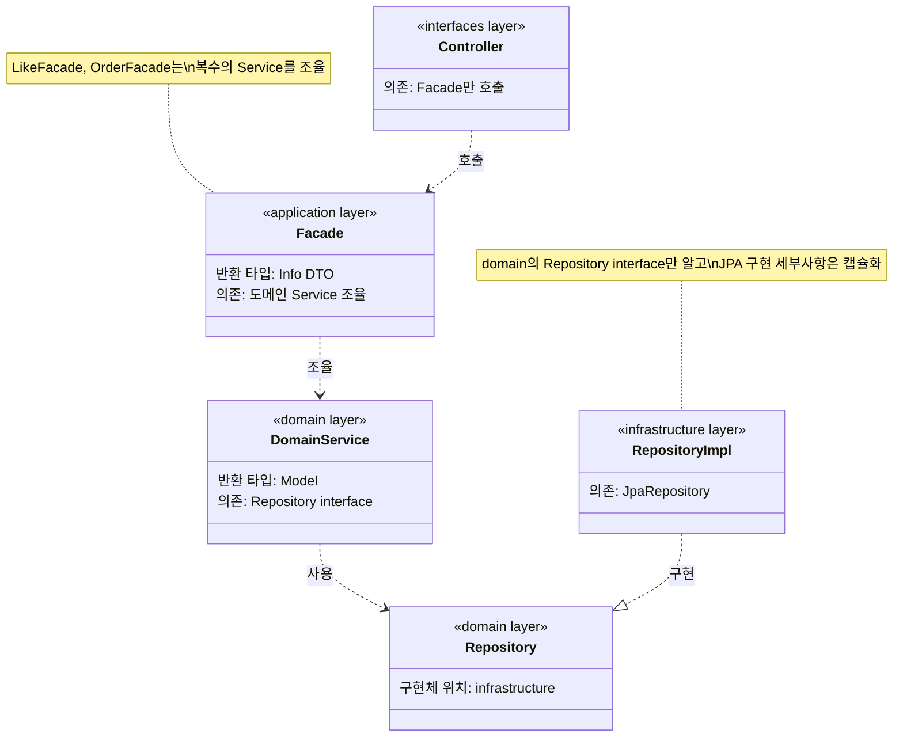
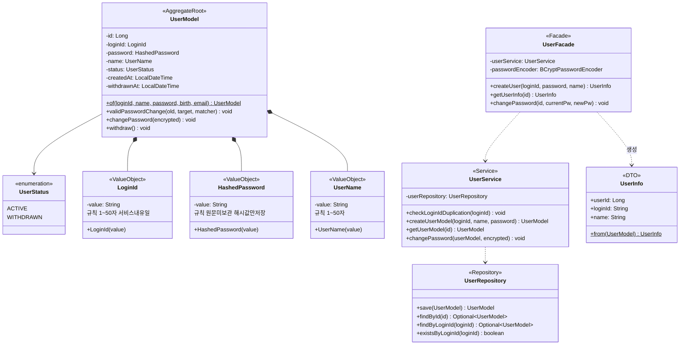
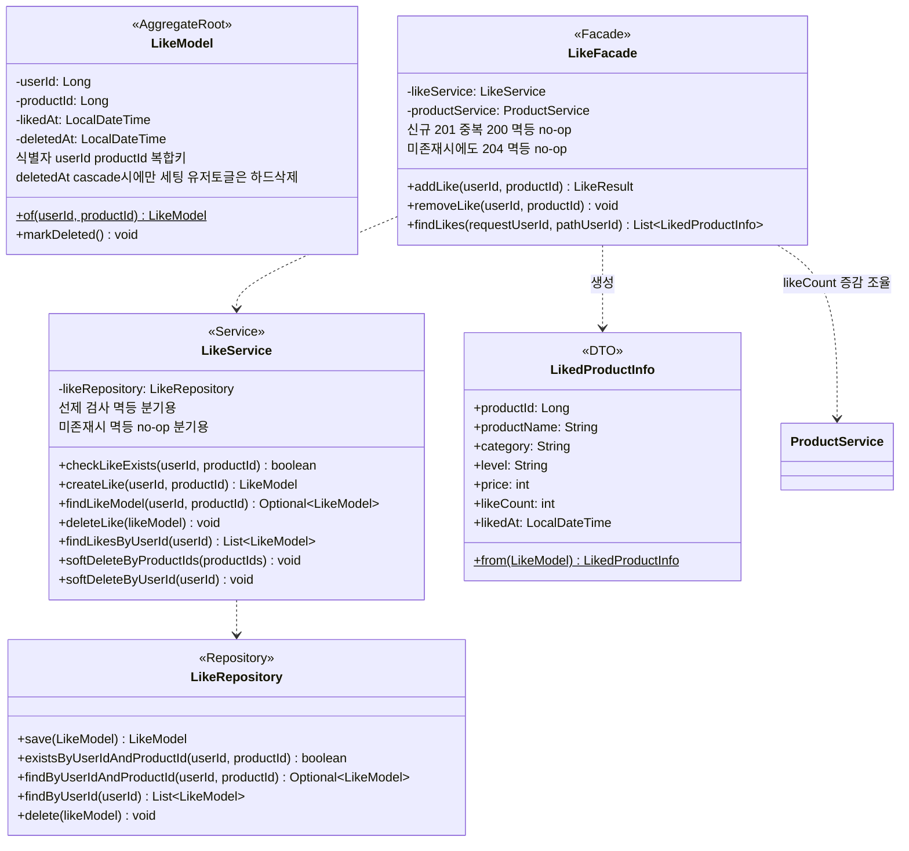
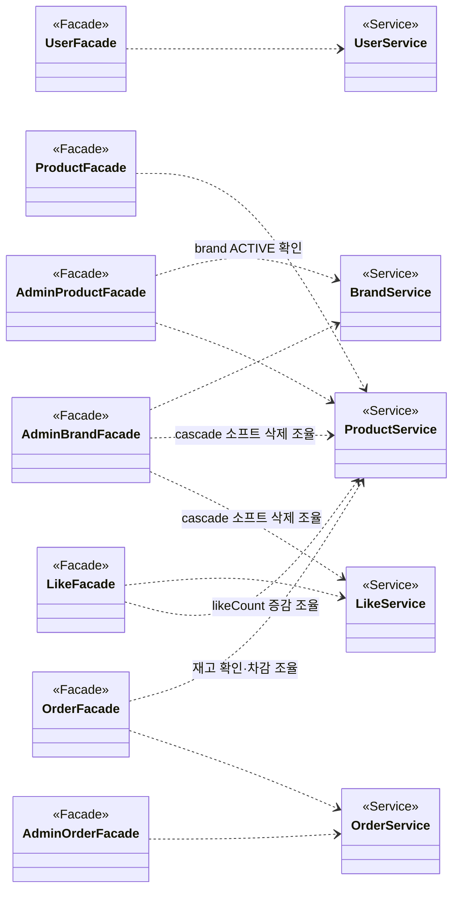
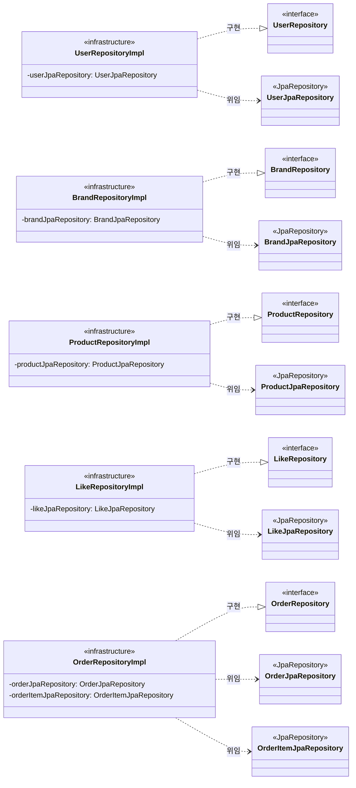

# Loopers 이커머스 — 클래스 다이어그램

> **이 문서는 클래스 다이어그램이다. ERD(데이터베이스 스키마)가 아니다.**  
> 객체의 책임, 관계, 레이어 구조를 나타낸다. DB 컬럼·FK가 아닌 객체 참조·메서드 중심으로 설계했다.

## 읽는 법

| 관계 기호 | 의미                                               |                          |
|-----------|----------------------------------------------------|--------------------------|
| `*--`     | 컴포지션 — 생명주기 공유 (부모 없으면 자식도 없음) |                          |
| `o--`     | 어그리게이션 — 느슨한 포함                         |                          |
| `-->`     | 연관 — 객체 참조 보유                              |                          |
| `..>`     | 의존 — 메서드 호출·파라미터로만 사용               |                          |
| `..       | >`                                                 | 구현 — 인터페이스 실체화 |

| 스테레오타입        | 의미                                            |
|---------------------|-------------------------------------------------|
| `<<AggregateRoot>>` | 집합체 루트 — 외부 접근의 유일한 진입점         |
| `<<Entity>>`        | 엔티티 — 식별자가 있는 객체, 애그리거트 내부    |
| `<<ValueObject>>`   | 값 객체 — 불변, 동등성은 값으로 판단            |
| `<<enumeration>>`   | 열거형                                          |
| `<<Service>>`       | 도메인 서비스                                   |
| `<<Repository>>`    | 레포지토리 인터페이스 (domain 레이어)           |
| `<<Facade>>`        | 퍼사드 — 여러 Service 조율 (application 레이어) |
| `<<DTO>>`           | 레이어 간 데이터 전달 객체                      |

---

## 1. 전체 레이어 의존 구조

레이어 의존 방향은 `ArchitectureTest.java`가 강제한다.  
`interfaces → application → domain ← infrastructure`



---

## 2. User 컨텍스트

담당: 가입·인증. `LoginId`·`HashedPassword`·`UserName`이 핵심 값 객체.



---

## 3. Brand·Product 컨텍스트 — 두 개의 독립 Aggregate

담당: IT 기술서 등록·관리.  
`Brand`와 `Product`는 **독립된 애그리거트**다. `Product`는 `brandId(Long)`로 Brand를 ID 참조한다.

**분리 근거:**
- `Product.reduceStock()`, `Product.incrementLikeCount()`는 Brand를 전혀 필요로 하지 않는다
- 트랜잭션 경계가 다르다 — Order·Like 흐름은 Product만 변경, Brand는 무관
- cascade 삭제는 도메인 규칙이 아닌 **Facade(application) 레이어**가 조율한다

`TechCategory`·`Level`은 전 직군 채택된 핵심 필터 (H1 62%, H2 79.1%).

```mermaid
classDiagram
    direction TB

    class BrandModel {
        <<AggregateRoot>>
        -id: Long
        -name: BrandName
        -status: BrandStatus
        -deletedAt: LocalDateTime
        +of(name)$ BrandModel
        +update(name) void
        +isActive() boolean
        +softDelete() void
    }

    class BrandName {
        <<ValueObject>>
        -value: String
    }

    class BrandStatus {
        <<enumeration>>
        ACTIVE
        DELETED
    }

    class ProductModel {
        <<AggregateRoot>>
        -id: Long
        -brandId: Long
        brandId는 BrandModel의 ID참조 객체참조아님
        -isbn: ISBN
        -name: ProductName
        -author: String
        -category: TechCategory
        -level: Level
        -price: Price
        -stock: Stock
        -likeCount: LikeCount
        -status: ProductStatus
        -deletedAt: LocalDateTime
        +of(brandId, isbn, name, author, category, level, price, stock)$ ProductModel
        +update(name, author, category, level, price, stock) void
        +reduceStock(quantity) void
        +incrementLikeCount() void
        +decrementLikeCount() void
        +isActive() boolean
        +softDelete() void
    }

    class ISBN {
        <<ValueObject>>
        -value: String
        규칙 13자리 서비스내유일
    }

    class ProductName {
        <<ValueObject>>
        -value: String
    }

    class Price {
        <<ValueObject>>
        -value: int
        규칙 0이상
        공유 Order컨텍스트에서도사용
    }

    class Stock {
        <<ValueObject>>
        -value: int
        규칙 0이상
        차감책임 Order컨텍스트
    }

    class LikeCount {
        <<ValueObject>>
        -value: int
        규칙 0이상
        증감책임 Like컨텍스트
    }

    class TechCategory {
        <<enumeration>>
        BACKEND
        FRONTEND
        DEVOPS
        AI_ML
        DATABASE
        SECURITY
        NETWORK
        ETC
    }

    class Level {
        <<enumeration>>
        BEGINNER
        INTERMEDIATE
        ADVANCED
    }

    class ProductStatus {
        <<enumeration>>
        ACTIVE
        DELETED
    }

    class BrandService {
        <<Service>>
        -brandRepository: BrandRepository
        +createBrandModel(name) BrandModel
        +getBrandModel(id) BrandModel
        +getBrands(pageable) Page~BrandModel~
        +updateBrand(brandModel, name) BrandModel
        +softDeleteBrand(brandModel) void
    }

    class ProductService {
        <<Service>>
        -productRepository: ProductRepository
        +createProduct(brandId, isbn, name, author, category, level, price, stock) ProductModel
        +getProductModel(id) ProductModel
        +findProducts(category, level, brandId, sort, pageable) Page~ProductModel~
        +checkIsbnDuplication(isbn) void
        +updateProduct(id, name, author, category, level, price, stock) ProductModel
        +deleteProduct(id) void
        +softDeleteAllByBrandId(brandId) void
        +validateAndReduceStock(productModel, qty) void
        +incrementLikeCount(productModel) void
        +decrementLikeCount(productId) void
    }

    class BrandRepository {
        <<Repository>>
        <<interface>>
        +save(BrandModel) BrandModel
        +findById(id) Optional~BrandModel~
        +findAll(pageable) Page~BrandModel~
        +delete(brandModel) void
    }

    class ProductRepository {
        <<Repository>>
        <<interface>>
        +save(ProductModel) ProductModel
        +findById(id) Optional~ProductModel~
        +findAllByFilter(category, level, brandId, sort, pageable) Page~ProductModel~
        +existsByIsbn(isbn) boolean
        +softDeleteAllByBrandId(brandId) void
        +delete(productModel) void
    }

    class ProductFacade {
        <<Facade>>
        -productService: ProductService
        +getProduct(id) ProductInfo
        +findProducts(category, level, brandId, sort, pageable) Page~ProductInfo~
    }

    class AdminBrandFacade {
        <<Facade>>
        -brandService: BrandService
        -productService: ProductService
        -likeService: LikeService
        +getBrands(pageable) Page~BrandInfo~
        +getBrand(brandId) BrandInfo
        +createBrand(name) BrandInfo
        +updateBrand(brandId, name) BrandInfo
        +deleteBrand(brandId) void
        cascade: softDeleteAllByBrandId → softDeleteByProductIds → softDeleteBrand
    }

    class AdminProductFacade {
        <<Facade>>
        -brandService: BrandService
        -productService: ProductService
        +createProduct(brandId, isbn, name, author, category, level, price, stock) AdminProductInfo
        +getProduct(productId) AdminProductInfo
        +findProducts(brandId, pageable) Page~AdminProductInfo~
        +updateProduct(productId, name, author, category, level, price, stock) AdminProductInfo
        +deleteProduct(productId) void
    }

    class BrandInfo {
        <<DTO>>
        +brandId: Long
        +name: String
        +status: String
        +from(BrandModel)$ BrandInfo
    }

    class ProductInfo {
        <<DTO>>
        대고객 노출 필드만 포함 재고 ISBN status 제외
        +productId: Long
        +name: String
        +author: String
        +category: String
        +level: String
        +price: int
        +likeCount: int
        +brandId: Long
        +brandName: String
        +from(ProductModel)$ ProductInfo
    }

    class AdminProductInfo {
        <<DTO>>
        어드민 전용 전체 필드 포함
        +productId: Long
        +isbn: String
        +stock: int
        +status: String
        +from(ProductModel)$ AdminProductInfo
    }

    BrandModel *-- BrandName
    BrandModel --> BrandStatus

    ProductModel *-- ISBN
    ProductModel *-- ProductName
    ProductModel *-- Price
    ProductModel *-- Stock
    ProductModel *-- LikeCount
    ProductModel --> TechCategory
    ProductModel --> Level
    ProductModel --> ProductStatus

    BrandService ..> BrandRepository
    ProductService ..> ProductRepository

    ProductFacade ..> ProductService
    AdminBrandFacade ..> BrandService
    AdminBrandFacade ..> ProductService
    AdminProductFacade ..> BrandService
    AdminProductFacade ..> ProductService
```



---

## 4. Like 컨텍스트

담당: 관심 상품 표시. `(userId, productId)` 복합키가 Like의 식별자.  
Like 등록·취소 시 `Product.likeCount` 변경 — `LikeFacade`가 `LikeService`와 `ProductService` 두 Service를 조율한다.

**멱등성 정책 (완전 멱등):**
- `POST` (등록): 신규 시 `201 Created`, 중복 시 `200 OK` (likeCount 증분 없이 no-op)
- `DELETE` (취소): 삭제 성공 시 `204 No Content`, 미존재 시 `204 No Content` (likeCount 감소 없이 no-op)
- 좋아요는 상태 표현(Binary State Toggle) → REST PUT 시맨틱. 자원 최종 상태가 동일하면 동일 응답.



---

## 5. Order 컨텍스트

담당: 구매 확정. `Order`가 애그리거트 루트, `OrderItem`이 내부 엔티티.  
스냅샷(`productNameSnapshot`, `unitPriceSnapshot`)으로 주문 시점 정보를 불변 보존한다.  
`OrderFacade`가 `ProductService`(재고 차감) → `OrderService`(주문 생성) 순서로 조율.

```mermaid
classDiagram
    direction TB

    class OrderModel {
        <<AggregateRoot>>
        -id: Long
        -userId: Long
        -status: OrderStatus
        -totalAmount: Price
        -orderedAt: LocalDateTime
        -items: List~OrderItemModel~
        +of(userId, items)$ OrderModel
        +isOwnedBy(userId) boolean
        규칙 items 1개 이상
    }

    class OrderItemModel {
        <<Entity>>
        -orderId: Long
        -productId: Long
        -productNameSnapshot: String
        -unitPriceSnapshot: Price
        -quantity: Quantity
        +totalPrice() Price
        파생값 unitPriceSnapshot x quantity
    }

    class OrderStatus {
        <<enumeration>>
        PENDING
        CONFIRMED
        CANCELLED
    }

    class Quantity {
        <<ValueObject>>
        -value: int
        규칙 1이상
    }

    class Price {
        <<ValueObject>>
        -value: int
        규칙 0이상
        공유 Brand·Product컨텍스트에서도사용
    }

    class OrderService {
        <<Service>>
        -orderRepository: OrderRepository
        +createOrder(userId, itemsWithSnapshots) OrderModel
        +getOrderModel(orderId) OrderModel
        +findOrders(userId, startAt, endAt) List~OrderModel~
        +findAllOrders(pageable) Page~OrderModel~
    }

    class OrderRepository {
        <<Repository>>
        <<interface>>
        +save(OrderModel) OrderModel
        +findById(orderId) Optional~OrderModel~
        +findByUserIdAndOrderedAtBetween(userId, start, end) List~OrderModel~
        +findAll(pageable) Page~OrderModel~
    }

    class OrderFacade {
        <<Facade>>
        -productService: ProductService
        -orderService: OrderService
        조율순서 ProductService재고차감후OrderService주문생성
        +placeOrder(userId, items) OrderInfo
        +findOrders(userId, startAt, endAt) List~OrderSummaryInfo~
        +getOrder(userId, orderId) OrderDetailInfo
    }

    class AdminOrderFacade {
        <<Facade>>
        -orderService: OrderService
        +findAllOrders(pageable) Page~AdminOrderSummaryInfo~
        +getOrder(orderId) AdminOrderDetailInfo
    }

    class OrderInfo {
        <<DTO>>
        +orderId: Long
        +from(OrderModel)$ OrderInfo
    }

    class OrderSummaryInfo {
        <<DTO>>
        +orderId: Long
        +totalAmount: int
        +status: String
        +orderedAt: LocalDateTime
        +itemCount: int
        +from(OrderModel)$ OrderSummaryInfo
    }

    class OrderDetailInfo {
        <<DTO>>
        +orderId: Long
        +totalAmount: int
        +status: String
        +orderedAt: LocalDateTime
        +items: List~OrderItemInfo~
        +from(OrderModel)$ OrderDetailInfo
    }

    class AdminOrderSummaryInfo {
        <<DTO>>
        +orderId: Long
        +userId: Long
        +totalAmount: int
        +status: String
        +orderedAt: LocalDateTime
        +itemCount: int
        +from(OrderModel)$ AdminOrderSummaryInfo
    }

    class AdminOrderDetailInfo {
        <<DTO>>
        +orderId: Long
        +userId: Long
        +totalAmount: int
        +status: String
        +orderedAt: LocalDateTime
        +items: List~OrderItemInfo~
        +from(OrderModel)$ AdminOrderDetailInfo
    }

    OrderModel "1" *-- "1..*" OrderItemModel : items
    OrderModel --> OrderStatus
    OrderModel *-- Price : totalAmount
    OrderItemModel *-- Price : unitPriceSnapshot
    OrderItemModel *-- Quantity

    OrderService ..> OrderRepository
    OrderFacade ..> ProductService : 재고 확인·차감
    OrderFacade ..> OrderService
    AdminOrderFacade ..> OrderService
```



---

## 6. Application Layer — Facade 의존 관계 전체

Facade가 어떤 도메인 Service를 조율하는지 한눈에 파악한다.  
`LikeFacade`, `OrderFacade`, `AdminBrandFacade`, `AdminProductFacade`는 **복수의 Service를 조율**한다.



---

## 7. Infrastructure Layer — Repository 구현 관계

도메인의 `Repository` 인터페이스를 infrastructure 레이어의 `RepositoryImpl`이 구현한다.  
`RepositoryImpl`은 Spring Data JPA 레포지토리에 위임한다. 도메인 Service는 JPA를 직접 알지 못한다.



---

## 설계 요점

| 항목                   | 결정 내용                                                                                                                                                                                                             |
|------------------------|-----------------------------------------------------------------------------------------------------------------------------------------------------------------------------------------------------------------------|
| 크로스 애그리거트 참조 | ID(Long)로만 참조. `Product.brandId`, `OrderItem.productId`, `LikeModel.userId·productId` 모두 값 참조. 직접 객체 참조 금지                                                                                           |
| Brand·Product 분리     | 두 개의 독립 Aggregate. `Product.reduceStock()`·`incrementLikeCount()`는 Brand 불필요. cascade 삭제는 `AdminBrandFacade`가 Facade 레이어에서 조율                                                                     |
| `Price` 공유           | Brand·Product 컨텍스트와 Order 컨텍스트가 공유하는 값 객체                                                                                                                                                            |
| `likeCount` 변경 책임  | Like 컨텍스트 소유. `LikeFacade`가 `LikeService` + `ProductService` 두 Service를 조율                                                                                                                                 |
| `stock` 차감 책임      | `ProductModel`이 보유하나 차감 호출은 `OrderFacade`가 `ProductService`를 통해 수행                                                                                                                                    |
| 스냅샷                 | `OrderItemModel`이 `productNameSnapshot` · `unitPriceSnapshot`을 직접 보유. 이후 `ProductModel` 변경 무관                                                                                                             |
| 소프트 삭제 정책       | Brand·Product: `DELETED` + `deletedAt` 소프트 삭제 후 주기적 하드 삭제. User: `WITHDRAWN` + `withdrawnAt` + 즉시 PII 익명화. Like: 유저 토글은 하드 삭제·cascade는 소프트 삭제. Order·OrderItem: 삭제 불가(영구 보존) |

---

## 8. 소프트 삭제 및 데이터 생명주기 정책

이커머스 특성상 삭제 데이터는 주문 이력·정산·감사 목적으로 일정 기간 유지가 필요하다.
엔티티 성격에 따라 삭제 방식과 보존 주기를 구분한다.

| 엔티티                          | 삭제 방식                                           | 추가 필드                          | 주기적 처리                                   | 근거                       |
|---------------------------------|-----------------------------------------------------|------------------------------------|-----------------------------------------------|----------------------------|
| `BrandModel`                    | 소프트 삭제                                         | `status=DELETED` + `deletedAt`     | 연결된 Order 없을 때 하드 삭제                | 과거 주문 브랜드 출처 추적 |
| `ProductModel`                  | 소프트 삭제                                         | `status=DELETED` + `deletedAt`     | 연결된 Order 없을 때 하드 삭제                | 주문 스냅샷 참조 무결성    |
| `UserModel`                     | 소프트 삭제 (탈퇴)                                  | `status=WITHDRAWN` + `withdrawnAt` | 즉시 PII 익명화, `userId`는 Order 참조용 보존 | 개인정보보호법 준수        |
| `LikeModel`                     | 유저 토글: **하드 삭제** / cascade: **소프트 삭제** | cascade 시 `deletedAt` 세팅        | 유저 탈퇴·상품 삭제 시 일괄 처리              | 집계 정합성 유지           |
| `OrderModel` / `OrderItemModel` | **삭제 불가**                                       | —                                  | 영구 보존                                     | 회계·법적 증거 자료        |

### cascade 삭제 흐름 (소프트)

```
AdminBrandFacade.deleteBrand(brandId)
  → ProductService.softDeleteAllByBrandId(brandId)   ← Product DELETED + deletedAt
  → LikeService.softDeleteByProductIds(productIds)   ← LikeModel deletedAt 세팅
  → BrandService.softDeleteBrand(brandModel)          ← Brand DELETED + deletedAt
```

### 유저 탈퇴 흐름 (확장 포인트 — MVP 미구현)

> MVP 범위(회원가입·내정보조회·비밀번호변경)에는 탈퇴 API가 없다. 향후 구현 시 아래 흐름을 따른다.

```
UserFacade.withdraw(userId)          ← 확장 포인트 (현재 UserFacade에 미선언)
  → LikeService.softDeleteByUserId(userId)            ← LikeModel deletedAt 세팅
  → UserService.withdraw(userModel)                   ← WITHDRAWN + withdrawnAt + PII 익명화
```

> Order는 탈퇴 후에도 삭제하지 않는다. `userId`를 보존하되 개인 식별 정보는 User 테이블에서 익명화한다.
