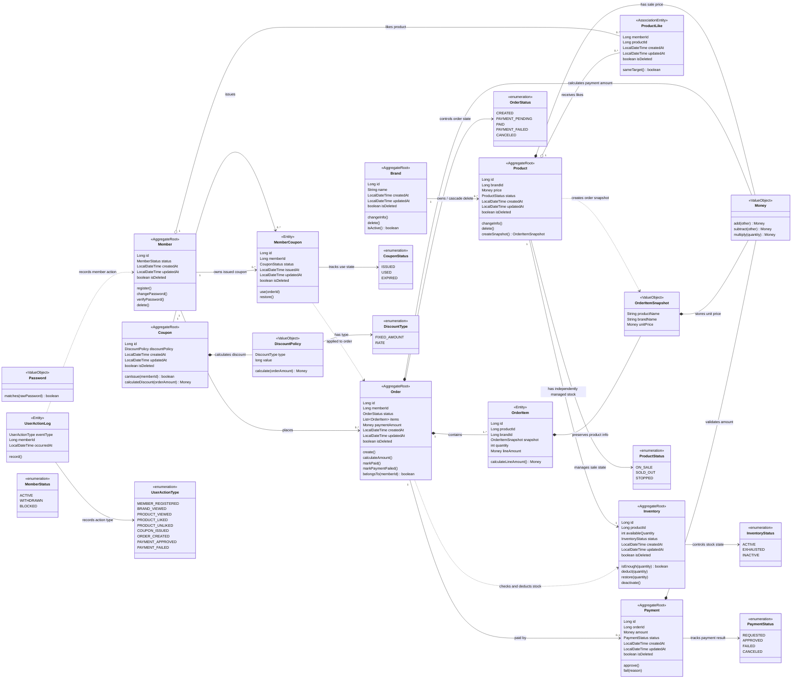

# 03. 클래스 다이어그램

## 3. 애그리거트 및 값 객체

| 구분 | 타입 | 설명 |
| --- | --- | --- |
| Aggregate Root | `Member` | 회원가입, 내 정보 조회, 비밀번호 변경의 기준 객체 |
| Aggregate Root | `Brand` | 브랜드 조회/등록/수정/논리 삭제의 기준 객체 |
| Aggregate Root | `Product` | 상품 조회/등록/수정/논리 삭제와 주문 상품 스냅샷 생성의 기준 객체 |
| Aggregate Root | `Inventory` | 상품별 주문 가능 수량을 독립 생명주기로 관리하며 재고 확인, 차감, 복구를 보장하는 기준 객체 |
| Association Entity | `ProductLike` | 회원과 상품의 좋아요 관계. `memberId` + `productId` 조합으로 유일하다. |
| Aggregate Root | `Coupon` | 쿠폰 발급 가능 여부와 할인 정책 |
| Entity | `MemberCoupon` | 회원에게 발급된 쿠폰과 사용 상태 |
| Aggregate Root | `Order` | 주문 생성, 주문 목록/상세 조회, 결제 상태 전이의 기준 객체 |
| Entity | `OrderItem` | 주문에 포함된 개별 상품 라인 |
| Value Object | `OrderItemSnapshot` | 주문 당시 상품명, 브랜드명, 단가 등 주문 상품 이력 보존 정보 |
| Aggregate Root | `Payment` | 주문 결제 요청과 성공/실패 상태 |
| Entity | `UserActionLog` | 사용자 행동 기록 |
| Value Object | `Money` | 금액 계산 단위 |

## 4. 핵심 설계 결정

- `Order` 는 주문 상품을 `OrderItem` 으로 보유한다.
- `OrderItem` 은 `OrderItemSnapshot` 을 통해 주문 당시 상품명, 브랜드명, 단가를 고정 저장한다.
- `Inventory` 는 상품과 1:1로 연결되지만 독립된 생명주기를 가진 Aggregate Root 로 관리한다.
- `Inventory` 는 주문 생성 시 재고 확인, 차감, 복구 규칙을 담당하며 재고가 음수가 되지 않도록 보장한다.
- `Brand` 와 `Product` 삭제는 논리 삭제로 처리한다.
- 브랜드 삭제 시 해당 브랜드의 상품도 함께 논리 삭제하고, 관련 재고는 주문 불가 상태로 전환한다.
- `ProductLike` 는 회원과 상품 조합의 유일성을 보장한다.
- `Payment` 는 주문 결제 금액 검증 후 성공/실패 상태를 반영한다.
- 주요 유저 행동은 `UserActionLog` 로 기록 가능해야 한다.

## 5. 확인 필요 항목

- 쿠폰 할인 정책의 구체 타입과 중복 발급 허용 여부
- 결제 실패 시 재고/쿠폰 복구 시점
- 주문 재고 차감 동시성 제어 방식
- 행동 기록 저장소와 이벤트 발행 방식
