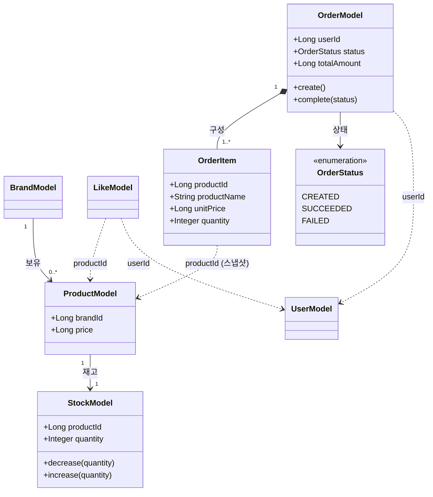

# 03. 클래스 다이어그램

```mermaid
classDiagram
    class UserModel
    class BrandModel
    class LikeModel

    class ProductModel {
        +Long brandId
        +Long price
    }

    class StockModel {
        +Long productId
        +Integer quantity
        +decrease(quantity)
        +increase(quantity)
    }

    class OrderModel {
        +Long userId
        +OrderStatus status
        +Long totalAmount
        +create()
        +complete(status)
    }

    class OrderItem {
        +Long productId
        +String productName
        +Long unitPrice
        +Integer quantity
    }

    class OrderStatus {
        <<enumeration>>
        CREATED
        SUCCEEDED
        FAILED
    }

    BrandModel "1" --> "0..*" ProductModel : 보유
    ProductModel "1" --> "1" StockModel : 재고
    OrderModel "1" *-- "1..*" OrderItem : 구성
    OrderModel --> OrderStatus : 상태
    LikeModel ..> ProductModel : productId
    LikeModel ..> UserModel : userId
    OrderModel ..> UserModel : userId
    OrderItem ..> ProductModel : productId (스냅샷)
```
