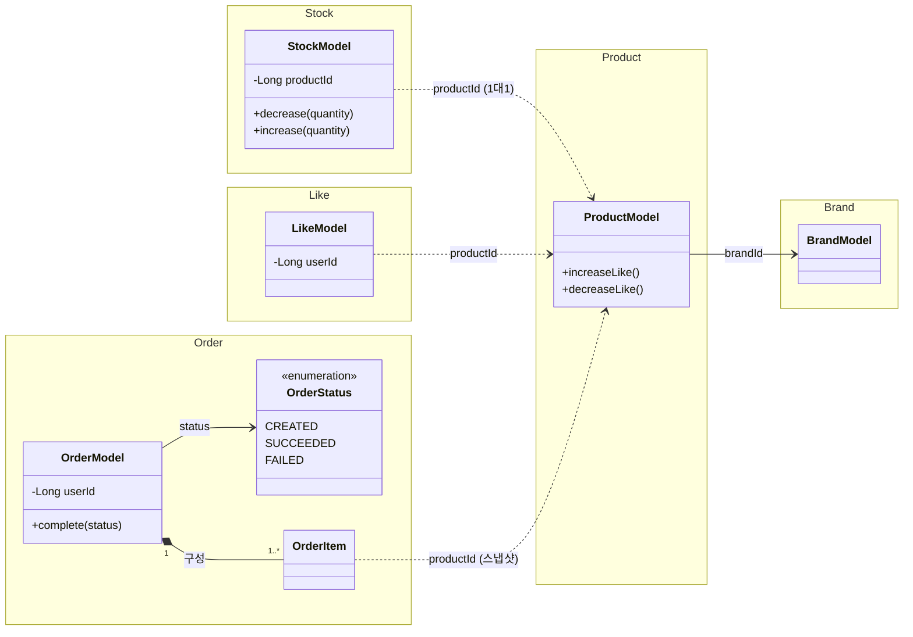

# 03. 클래스 다이어그램

> **스코프**: 도메인 모델 구조도 (Aggregate 경계 = namespace, association·composition). 오케스트레이션(Facade)·호출 흐름은 02 시퀀스, 세부 필드는 코드 참조.
> User는 별도 컨텍스트 (본 다이어그램 범위 밖). `userId`는 외부 참조 ID.
> Stock은 Product와 1:1이나 **독립 애그리거트**(D13) — `productId`로 참조하며 다른 애그리거트처럼 ID 의존(`..>`)으로 표현한다. 같은 트랜잭션 협력은 Facade 합성(D7)이 담당.

**표기 범례** (필요 시 문서 하단에 추가)
- `*--` : composition (Aggregate 내부 구성, 부모 없이 존재 X)
- `-->` : association (소유는 아니지만 직접 참조)
- `..>` : dependency (ID 기반 약결합 참조)
- `"1" / "1..*" / "0..*"` : multiplicity
