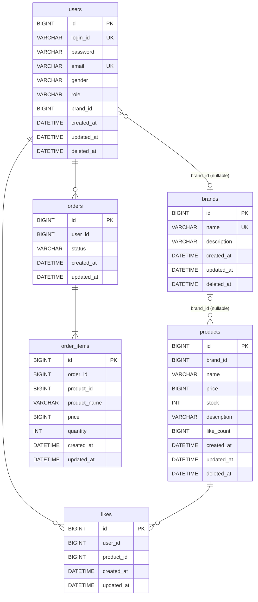

# 04. ERD — 전체 테이블 구조 및 관계 정리

---

---

## 설계 결정 사항

### users — role + brand_id

어드민 역할을 `role` 컬럼으로 구분한다 (`CUSTOMER` / `BRAND_ADMIN` / `SUPER_ADMIN`). `brand_id`는 `BRAND_ADMIN`일 때만 값이 존재하며 자신이 담당하는 브랜드를 가리킨다. DB 레벨 FK를 걸지 않는 기존 정책을 따르며, 존재 여부는 애플리케이션에서 검증한다.

### BaseEntity / SoftDeletableEntity 분리
`BaseEntity`는 `id`, `created_at`, `updated_at`만 담당한다. 소프트 딜리트가 필요한 엔티티만 `SoftDeletableEntity`(extends BaseEntity)를 상속해 `deleted_at`, `delete()`, `restore()`를 갖는다.

| 상속 | 테이블 |
|------|--------|
| SoftDeletableEntity | users, brands, products |
| BaseEntity | likes, orders, order_items |

`orders`와 `order_items`는 삭제 시나리오가 없고, 추후 주문 취소가 생기더라도 `deleted_at`이 아닌 `status` 필드로 상태를 표현하는 게 적합하다.

### likes — deleted_at 없음
하드 딜리트로 결정했으므로 `deleted_at` 컬럼을 두지 않는다. `BaseEntity`의 `id`, `created_at`, `updated_at`만 상속한다.

### FK 미사용
모든 테이블 간 관계는 DB 레벨 FK 없이 애플리케이션 레벨에서 검증한다. 시퀀스 다이어그램에 명시된 대로 각 유스케이스에서 참조 대상의 존재 여부를 사전 확인한다. ERD의 관계선은 논리적 참조를 나타낼 뿐 물리적 제약이 아니다.

### order_items — product_id 논리 참조
`product_id`는 스냅샷 참조용으로만 보관한다. 주문 이후 상품이 삭제되어도 주문 기록이 유지되어야 하므로 FK 제약을 걸지 않는다.

### products — like_count
초기값 0으로 생성되며 좋아요 등록·취소 시 `like_count = like_count ± 1` 형태의 DB 원자 UPDATE로 갱신된다.

---

## 제약 조건

| 테이블 | 종류 | 대상 컬럼 | 비고 |
|--------|------|-----------|------|
| users | UK | login_id | — |
| users | UK | email | — |
| users | CHECK | role, brand_id | role = 'BRAND_ADMIN'일 때만 brand_id 존재 |
| brands | UK | name | — |
| likes | UK | (user_id, product_id) | — |

---

## 인덱스 전략

| 테이블 | 인덱스명 | 컬럼 | 목적 |
|--------|----------|------|------|
| users | idx_users_brand_id | brand_id | BRAND_ADMIN의 브랜드 귀속 조회 |
| products | idx_products_brand_deleted | (brand_id, deleted_at) | 브랜드 필터 |
| products | idx_products_deleted_likes | (deleted_at, like_count, created_at) | likes_desc 정렬 (동순위 시 최신순 2차 정렬) |
| products | idx_products_deleted_price | (deleted_at, price) | price_asc 정렬 |
| products | idx_products_deleted_created | (deleted_at, created_at) | latest 정렬 |
| likes | uk_likes_user_product | (user_id, product_id) | 중복 체크 (UK가 인덱스 겸용) |
| likes | idx_likes_user_id | user_id | 내 좋아요 목록 조회 |
| orders | idx_orders_user_created | (user_id, created_at) | 날짜 범위 주문 목록 조회 |
| order_items | idx_order_items_order_id | order_id | 주문 항목 조회 |
