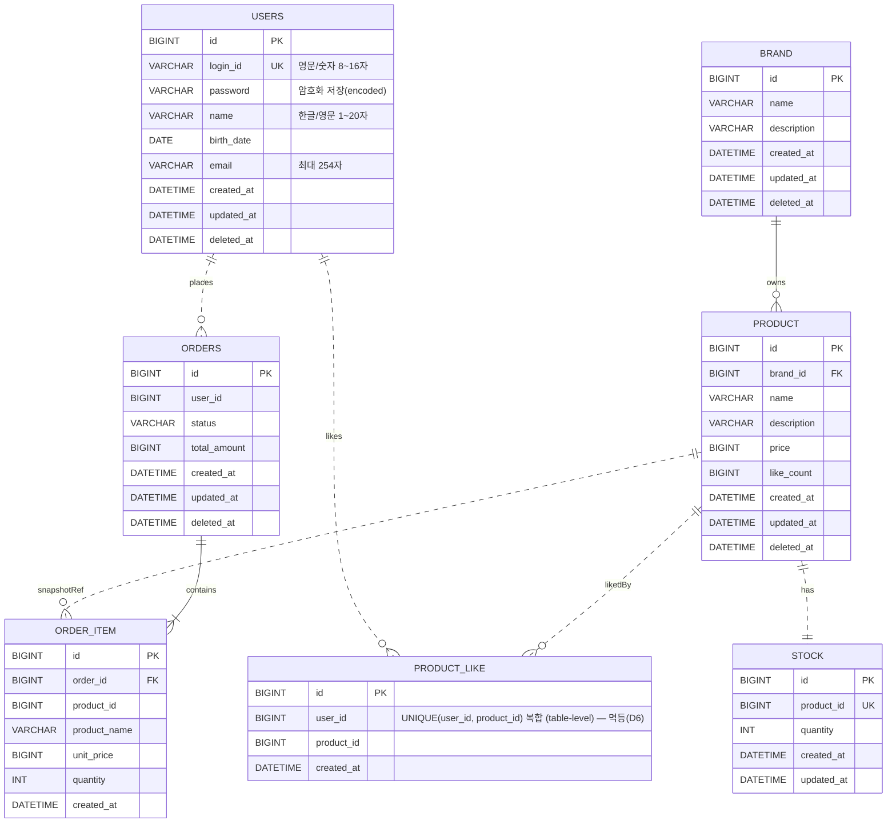

# 04. ERD

> **스코프**: 영속화 스키마. 컨텍스트 경계는 03 클래스 다이어그램 참조.
> **표기 규칙**: 실선 `||--`은 JPA 연관 매핑 유지(논리 FK — *물리 FK 제약은 D12에 따라 미설정*), 점선 `||..`은 매핑 없는 ID 기반 논리 참조(크로스 애그리거트/외부/스냅샷).

- Stock은 동시성 제어가 필수이고 변경 패턴이 Product(read-heavy)와 크게 달라 **독립 애그리거트**로 분리(D13) — `product_id`로 1:1 참조하며 물리 FK는 두지 않는다(D12, 크로스 애그리거트는 ID 참조). 주문·재고 변경은 Facade 합성(D7)으로 *같은 트랜잭션*에서 Product·Stock을 함께 다룬다. like_count는 약한 일관성으로 충분해 Product 컬럼으로 유지.
- **STOCK에 `deleted_at`이 없는 것은 의도된 설계다**(D14). 독립은 트랜잭션·동시성 축에 한정되고 라이프사이클은 Product에 종속하므로, 상품이 삭제되면 재고는 접근 경로가 사라져 자연 비활성된다. 삭제 진실은 Product 한 곳에 두고(SSOT), 재고 행은 보존돼 복원 시 수량이 그대로 유지된다. soft delete를 쓰는 다른 테이블(BRAND·PRODUCT·ORDERS)과 달리 STOCK·PRODUCT_LIKE·ORDER_ITEM은 `deleted_at`을 두지 않는다.
- **`PRODUCT_LIKE`는 `(user_id, product_id)` 복합 UNIQUE 제약**(table-level)으로 멱등을 보장한다(D6) — 같은 유저가 같은 상품에 좋아요는 최대 1개. 이 제약이 좋아요 등록/취소 멱등과 동시 등록 레이스(한쪽만 성공)의 최종 방어선이다. 컬럼별 `UK` 마커는 각 컬럼이 *단독* unique(예: 상품당 좋아요 1개)인 것처럼 DDL 생성기를 오도할 수 있어 쓰지 않고, **테이블 레벨 복합 제약**임을 이 설명과 `user_id` 컬럼 코멘트로 명시한다. 따라서 `(u1,p1)`·`(u1,p2)`·`(u2,p1)`은 모두 허용되고 `(u1,p1)` 중복만 거부된다(검증 케이스).
