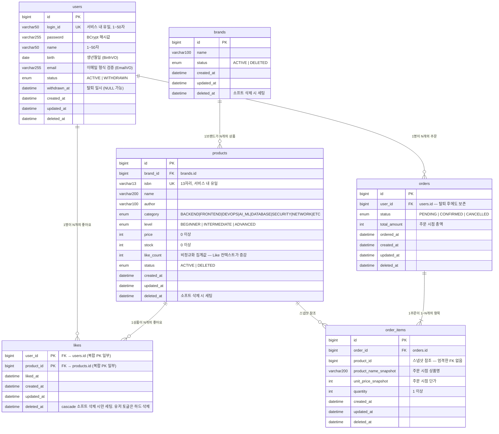

# Loopers 이커머스 — ERD

> **이 문서는 ERD(데이터베이스 스키마)다. 클래스 다이어그램(`03-class-diagram.md`)이 아니다.**  
> 테이블·컬럼·PK·FK·인덱스 중심으로 작성했다. 객체 책임·레이어 구조는 클래스 다이어그램을 참조한다.

---

## 읽는 법

| 기호 | 의미 |
|------|------|
| `PK` | Primary Key |
| `FK` | Foreign Key |
| `UK` | Unique Key |
| `\|\|--o{` | 1 : N (왼쪽 1, 오른쪽 0~N) |
| `\|\|--\|\|` | 1 : 1 |
| `}o--o{` | N : M |

> `id`, `created_at`, `updated_at`, `deleted_at` 는 모든 테이블에 포함된다 (`@MappedSuperclass BaseEntity` 상속).  
> 소프트 삭제: `deleted_at IS NULL` = 활성, `NOT NULL` = 삭제. 일반 조회는 항상 `WHERE deleted_at IS NULL` 조건을 포함한다.

---

## 전체 관계도

---

## 테이블별 상세 명세

### users

| 컬럼 | 타입 | 제약 | 설명 |
|------|------|------|------|
| `id` | BIGINT | PK, AUTO_INCREMENT | |
| `login_id` | VARCHAR(50) | UNIQUE, NOT NULL | 인증 식별자 |
| `password` | VARCHAR(255) | NOT NULL | BCrypt 해시값 |
| `name` | VARCHAR(50) | NOT NULL | 표시 이름 |
| `birth` | DATE | NOT NULL | 생년월일 — `BirthVO`로 검증. 비밀번호에 생년월일 포함 금지 규칙에 사용 |
| `email` | VARCHAR(255) | NOT NULL | 이메일 — `EmailVO` 정규식 검증 |
| `status` | ENUM | NOT NULL, DEFAULT 'ACTIVE' | ACTIVE \| WITHDRAWN |
| `withdrawn_at` | DATETIME | NULL | 탈퇴 처리 일시 |
| `created_at` | DATETIME | NOT NULL | BaseEntity |
| `updated_at` | DATETIME | NOT NULL | BaseEntity |
| `deleted_at` | DATETIME | NULL | BaseEntity (탈퇴 시 `delete()` 호출) |

> `withdrawn_at`과 `deleted_at`이 중복처럼 보이지만 역할이 다르다.  
> `deleted_at` — BaseEntity 공통 소프트 삭제 필드, 조회 필터 기준.  
> `withdrawn_at` — 탈퇴 이력 추적용. CS·감사 목적으로 별도 보존.

**인덱스:**
| 인덱스 | 컬럼 | 용도 |
|--------|------|------|
| `uk_users_login_id` | `login_id` | 인증 조회, 중복 체크 |

---

### brands

| 컬럼 | 타입 | 제약 | 설명 |
|------|------|------|------|
| `id` | BIGINT | PK, AUTO_INCREMENT | |
| `name` | VARCHAR(100) | NOT NULL | |
| `status` | ENUM | NOT NULL, DEFAULT 'ACTIVE' | ACTIVE \| DELETED |
| `created_at` | DATETIME | NOT NULL | BaseEntity |
| `updated_at` | DATETIME | NOT NULL | BaseEntity |
| `deleted_at` | DATETIME | NULL | BaseEntity — 소프트 삭제 시 세팅 |

---

### products

| 컬럼 | 타입 | 제약 | 설명 |
|------|------|------|------|
| `id` | BIGINT | PK, AUTO_INCREMENT | |
| `brand_id` | BIGINT | NOT NULL, FK → brands.id | 소속 브랜드 |
| `isbn` | VARCHAR(13) | UNIQUE, NOT NULL | 국제 표준 도서 번호 |
| `name` | VARCHAR(200) | NOT NULL | |
| `author` | VARCHAR(100) | NOT NULL | |
| `category` | ENUM | NOT NULL | 기술 카테고리 |
| `level` | ENUM | NOT NULL | 난이도 |
| `price` | INT | NOT NULL | 0 이상 |
| `stock` | INT | NOT NULL, DEFAULT 0 | 0 이상 |
| `like_count` | INT | NOT NULL, DEFAULT 0 | 비정규화 집계값. Like 컨텍스트가 원자적 증감 |
| `status` | ENUM | NOT NULL, DEFAULT 'ACTIVE' | ACTIVE \| DELETED |
| `created_at` | DATETIME | NOT NULL | BaseEntity |
| `updated_at` | DATETIME | NOT NULL | BaseEntity |
| `deleted_at` | DATETIME | NULL | BaseEntity — 소프트 삭제 시 세팅 |

**인덱스:**
| 인덱스 | 컬럼 | 용도 |
|--------|------|------|
| `uk_products_isbn` | `isbn` | ISBN 중복 체크 |
| `idx_products_brand_id` | `brand_id` | 브랜드별 상품 목록 |
| `idx_products_filter` | `category`, `level`, `status` | 카테고리·난이도 복합 필터 (H1·H2) |
| `idx_products_like_count` | `like_count DESC` | `likes_desc` 정렬 |

---

### likes

| 컬럼 | 타입 | 제약 | 설명 |
|------|------|------|------|
| `user_id` | BIGINT | PK (복합), FK → users.id | |
| `product_id` | BIGINT | PK (복합), FK → products.id | |
| `liked_at` | DATETIME | NOT NULL | 최초 좋아요 등록 일시 |
| `created_at` | DATETIME | NOT NULL | BaseEntity |
| `updated_at` | DATETIME | NOT NULL | BaseEntity |
| `deleted_at` | DATETIME | NULL | cascade 소프트 삭제 시만 세팅. 유저 직접 취소는 행 하드 삭제 |

**복합 PK:** `(user_id, product_id)` — 같은 유저가 같은 상품에 중복 좋아요 방지 (R1 스키마 보장)

**인덱스:**
| 인덱스 | 컬럼 | 용도 |
|--------|------|------|
| (복합 PK) | `user_id`, `product_id` | 중복 체크, 단건 조회 |
| `idx_likes_user_id` | `user_id` | 내 좋아요 목록 조회 |

---

### orders

| 컬럼 | 타입 | 제약 | 설명 |
|------|------|------|------|
| `id` | BIGINT | PK, AUTO_INCREMENT | |
| `user_id` | BIGINT | NOT NULL, FK → users.id | 탈퇴 후에도 이력 보존 |
| `status` | ENUM | NOT NULL, DEFAULT 'PENDING' | PENDING \| CONFIRMED \| CANCELLED |
| `total_amount` | INT | NOT NULL | 주문 시점 총액 |
| `ordered_at` | DATETIME | NOT NULL | 주문 확정 일시 |
| `created_at` | DATETIME | NOT NULL | BaseEntity |
| `updated_at` | DATETIME | NOT NULL | BaseEntity |
| `deleted_at` | DATETIME | NULL | BaseEntity (주문은 실질적으로 삭제 불가 — 항상 NULL) |

**인덱스:**
| 인덱스 | 컬럼 | 용도 |
|--------|------|------|
| `idx_orders_user_date` | `user_id`, `ordered_at` | 날짜 범위 주문 조회 (`startAt ~ endAt`) |

---

### order_items

| 컬럼 | 타입 | 제약 | 설명 |
|------|------|------|------|
| `id` | BIGINT | PK, AUTO_INCREMENT | |
| `order_id` | BIGINT | NOT NULL, FK → orders.id | 소속 주문 |
| `product_id` | BIGINT | NOT NULL | 스냅샷 참조 — 엄격한 FK 없음. 상품 삭제 후에도 스냅샷 유지 |
| `product_name_snapshot` | VARCHAR(200) | NOT NULL | 주문 시점 상품명 |
| `unit_price_snapshot` | INT | NOT NULL | 주문 시점 단가 |
| `quantity` | INT | NOT NULL | 1 이상 |
| `created_at` | DATETIME | NOT NULL | BaseEntity |
| `updated_at` | DATETIME | NOT NULL | BaseEntity |
| `deleted_at` | DATETIME | NULL | BaseEntity (주문 항목도 실질적으로 삭제 불가) |

**인덱스:**
| 인덱스 | 컬럼 | 용도 |
|--------|------|------|
| `idx_order_items_order_id` | `order_id` | 주문 상세 조회 (N+1 방지) |

---

## 설계 결정 및 주의사항

| 항목 | 결정 | 근거 |
|------|------|------|
| `BaseEntity` 공통 필드 | 전 테이블에 `id`, `created_at`, `updated_at`, `deleted_at` | JPA `@MappedSuperclass` 상속. 소프트 삭제·이력 추적 표준화 |
| `users.birth` / `users.email` | `BirthVO`, `EmailVO`로 검증 후 각 컬럼에 저장 | `birth` — 비밀번호에 생년월일 포함 금지 규칙 검증에 활용. `email` — 표준 정규식 검증 |
| `users.withdrawn_at` vs `deleted_at` | 둘 다 보유 | `deleted_at` = 조회 필터 기준 (BaseEntity 표준). `withdrawn_at` = 탈퇴 이력 감사용 별도 보존 |
| `like_count` 비정규화 | `products.like_count` 컬럼으로 직접 관리 | `likes_desc` 정렬 시 매번 COUNT 집계 쿼리 회피 |
| `order_items.product_id` FK 없음 | 참조 무결성 강제 안 함 | 상품 소프트 삭제 후에도 스냅샷 영구 보존 필요 |
| `orders` / `order_items` 삭제 불가 | `deleted_at` 항상 NULL | 회계·법적 증거 영구 보존. BaseEntity 필드는 있으나 `delete()` 호출 금지 |
| `likes` 삭제 방식 구분 | 유저 토글: 행 하드 삭제 / cascade: `deleted_at` 소프트 삭제 | 토글은 빈번한 연산 — 하드 삭제가 단순. cascade는 복구 가능성 고려 |
