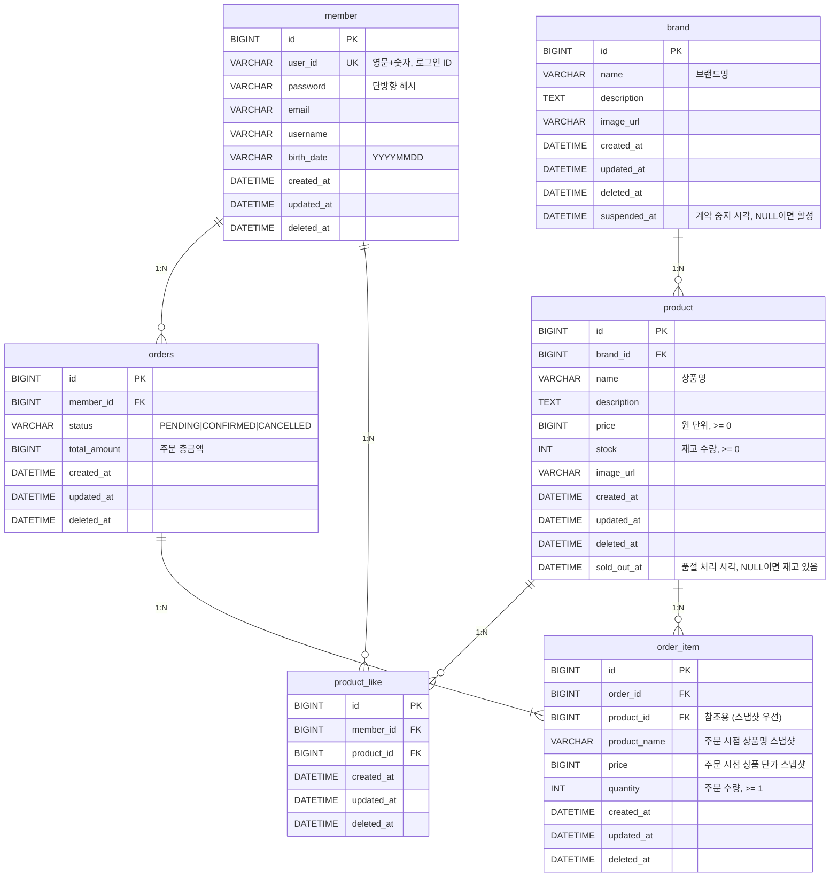

# 04. ERD (Entity Relationship Diagram)

## 목적

ERD로 검증하려는 것:
- 영속성 구조가 비즈니스 규칙을 올바르게 반영하는가
- 관계의 주인이 어느 테이블인가 (FK 위치)
- 인덱스 전략이 주요 조회 패턴에 적합한가

> **결제(payment)와 포인트(point_account / point_history) 테이블은 추후 개발 예정으로 이번 ERD에서 제외한다.**

---

## ERD

---

## 테이블 설계 상세

### member
| 컬럼 | 타입 | 제약 | 비고 |
|------|------|------|------|
| id | BIGINT | PK, AUTO_INCREMENT | |
| user_id | VARCHAR(50) | UNIQUE, NOT NULL | 영문+숫자만 허용 |
| password | VARCHAR(255) | NOT NULL | 단방향 해시 저장 |
| email | VARCHAR(255) | NOT NULL | 형식 검증 |
| username | VARCHAR(100) | NOT NULL | |
| birth_date | VARCHAR(8) | NOT NULL | YYYYMMDD |

**인덱스**: `idx_member_user_id` (user_id) — 로그인 조회 최적화

---

### brand
| 컬럼 | 타입 | 제약 | 비고 |
|------|------|------|------|
| id | BIGINT | PK, AUTO_INCREMENT | |
| name | VARCHAR(100) | NOT NULL | |
| description | TEXT | | 어드민에게만 노출 |
| image_url | VARCHAR(500) | | |
| suspended_at | DATETIME | NULL 허용 | NULL이면 활성; NOT NULL이면 계약 중지 상태 |

> `deleted_at`(영구 삭제)과 `suspended_at`(계약 중지)은 독립적이다. 계약 중지는 가역적이며, 중지 중인 브랜드의 상품은 공개 API에서 조회 불가.

---

### product
| 컬럼 | 타입 | 제약 | 비고 |
|------|------|------|------|
| id | BIGINT | PK, AUTO_INCREMENT | |
| brand_id | BIGINT | FK → brand.id, NOT NULL | |
| name | VARCHAR(200) | NOT NULL | |
| description | TEXT | | |
| price | BIGINT | NOT NULL, >= 0 | |
| stock | INT | NOT NULL, >= 0 | |
| image_url | VARCHAR(500) | | |
| sold_out_at | DATETIME | NULL 허용 | NULL이면 재고 있음; NOT NULL이면 품절 상태 |

> `sold_out_at`은 `stock`이 0이 되는 시점에 자동으로 설정되고, 재고 복구 시 NULL로 초기화된다. `isSoldOut()` 판별은 `sold_out_at IS NOT NULL`로 처리한다.

**인덱스**:
- `idx_product_brand_id` (brand_id) — 브랜드별 상품 조회 / 브랜드 삭제 시 cascade 처리
- `idx_product_deleted_at_created_at` (deleted_at, created_at) — 목록 조회 최신순 정렬
- `idx_product_sold_out_at` (sold_out_at) — 품절 상태 필터링 조회 최적화

---

### product_like
| 컬럼 | 타입 | 제약 | 비고 |
|------|------|------|------|
| id | BIGINT | PK, AUTO_INCREMENT | |
| member_id | BIGINT | FK → member.id, NOT NULL | |
| product_id | BIGINT | FK → product.id, NOT NULL | |

**유니크 제약 전략**:
> MySQL에서 NULL은 UNIQUE 인덱스에서 별도 취급된다.
> `(member_id, product_id)`에 UNIQUE를 걸면 soft delete 후 재등록 시 중복 오류가 발생한다.
> 따라서 Application 레벨에서 `deleted_at IS NULL` 조건으로 활성 좋아요를 확인해 멱등 처리하고, DB UNIQUE는 적용하지 않는다.

**인덱스**: `idx_product_like_member_product` (member_id, product_id) — 좋아요 여부 / 내 좋아요 목록 조회

---

### orders
| 컬럼 | 타입 | 제약 | 비고 |
|------|------|------|------|
| id | BIGINT | PK, AUTO_INCREMENT | |
| member_id | BIGINT | FK → member.id, NOT NULL | |
| status | VARCHAR(20) | NOT NULL | PENDING / CONFIRMED / CANCELLED |
| total_amount | BIGINT | NOT NULL, >= 0 | 주문 총금액 |

**인덱스**:
- `idx_orders_member_id` (member_id) — 회원별 주문 이력 조회
- `idx_orders_member_id_created_at` (member_id, created_at) — 날짜 필터(startAt, endAt) 조회 최적화

> **결제 연동 시 추가 예정**: `point_used`, `payment_amount` 컬럼 및 payment 테이블 관계.

---

### order_item
| 컬럼 | 타입 | 제약 | 비고 |
|------|------|------|------|
| id | BIGINT | PK, AUTO_INCREMENT | |
| order_id | BIGINT | FK → orders.id, NOT NULL | |
| product_id | BIGINT | FK → product.id, NOT NULL | 참조용 |
| product_name | VARCHAR(200) | NOT NULL | 주문 시점 스냅샷 |
| price | BIGINT | NOT NULL | 주문 시점 단가 스냅샷 |
| quantity | INT | NOT NULL, >= 1 | |

**인덱스**: `idx_order_item_order_id` (order_id) — 주문 상세 조회

---

## 관계 요약

| 관계 | 카디널리티 | FK 위치 |
|------|-----------|---------|
| member ↔ orders | 1:N | orders.member_id |
| member ↔ product_like | 1:N | product_like.member_id |
| brand ↔ product | 1:N | product.brand_id |
| product ↔ product_like | 1:N | product_like.product_id |
| product ↔ order_item | 1:N | order_item.product_id |
| orders ↔ order_item | 1:N | order_item.order_id |

---

## 잠재 리스크

| 리스크 | 설명 | 선택지 |
|--------|------|--------|
| product.stock 동시성 | 동시 주문 시 stock 차감 경쟁 | A) `SELECT FOR UPDATE` — 단순, 락 경합 발생 / B) `UPDATE product SET stock = stock - ? WHERE id = ? AND stock >= ?` — 락 없이 원자적 처리, 영향 행 수(0)로 재고 부족 판별 |
| sold_out_at 동시 갱신 | stock 차감과 sold_out_at 설정이 분리되면 race condition 가능 | stock 차감 → sold_out_at 갱신을 동일 트랜잭션 내 단일 UPDATE로 처리 |
| product_like UNIQUE 미적용 | DB UNIQUE 없이 Application 멱등 처리만으로 동시 요청 시 중복 INSERT 가능 | 동시성이 문제되는 경우 `(member_id, product_id)` + partial index 또는 INSERT IGNORE 패턴 검토 |
| orders.total_amount 정합성 | OrderItem 합산 없이 직접 입력 시 불일치 위험 | Order 생성 시 Service에서 `Σ(price × quantity)` 계산 후 저장, Client 전달값 사용 금지 |
| 결제 전 재고 점유 장기화 | PENDING 주문이 취소되지 않으면 재고가 영구 점유됨 | 결제 개발 시 주문 만료(TTL) / 스케줄러 기반 자동 취소 정책 함께 설계 필요 |
