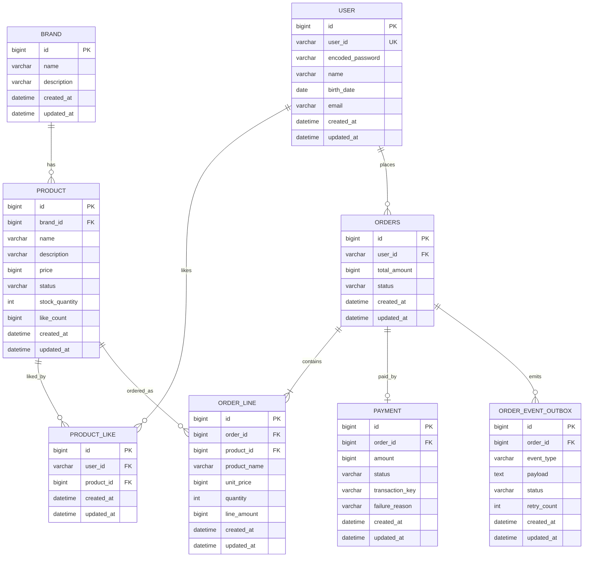

# 2주차 ERD

## 읽는 포인트

- 이 ERD는 저장 구조뿐 아니라 어떤 데이터를 정합성 기준으로 삼을지 확인하기 위한 문서다.
- 주문 항목은 상품 스냅샷을 저장하고, 결제와 주문 상태는 분리해 상태 불일치에 대응한다.
- outbox는 외부 데이터 플랫폼 전송 실패가 주문 성공 자체를 깨지 않도록 분리하는 장치다.

## 설계 의도

이 ERD는 상품, 브랜드, 좋아요, 주문, 결제, 재고의 영속성 구조와 관계를 확인하기 위해 작성한다. 주문과 결제는 상태를 분리하고, 주문 항목은 상품 스냅샷을 저장해 과거 주문 정합성을 유지한다.

## ERD

## 테이블별 설명

### brand

브랜드 기본 정보를 저장한다. 상품은 하나의 브랜드에 속한다.

### product

상품의 판매 정보와 재고, 좋아요 수를 저장한다. `like_count`는 조회 성능을 위한 카운터이며, 정합성 기준 데이터는 `product_like`다. 재고를 별도 테이블로 분리할 수도 있지만, 현재 설계 초안에서는 단일 상품 재고만 필요하다고 보고 상품 테이블에 둔다.

### product_like

사용자의 상품 좋아요 관계를 저장한다. 좋아요 수 정합성과 내 좋아요 목록 조회의 기준 데이터이며, `user_id + product_id`에 unique 제약을 둔다.

### orders

주문의 대표 상태와 총액을 저장한다. `order`는 SQL 예약어와 충돌할 수 있어 테이블명은 `orders`를 사용한다.

### order_line

주문 항목을 저장한다. 주문 당시 상품명과 단가를 함께 저장해 상품 정보가 변경되어도 주문 내역이 변하지 않게 한다.

### payment

결제 요청과 결과를 저장한다. 외부 결제 시스템 거래 키와 실패 사유를 보관한다. 외부 결제 요청 전 `REQUESTED` 상태로 먼저 생성되어 worker 처리 권한을 선점한다. `failure_reason`은 범용 실패 사유이며, 타임아웃 전용 컬럼은 두지 않는다.

### order_event_outbox

외부 데이터 플랫폼 전송 이벤트를 저장한다. 주문 상태 변경과 이벤트 저장을 같은 트랜잭션에 묶고, 실제 외부 전송은 `EventRelayWorker`가 재시도한다.

## 주요 제약

- `product.stock_quantity >= 0`
- `product.like_count >= 0`
- `product.price > 0`
- `product_like(user_id, product_id)` unique
- `order_line.quantity > 0`
- `order_line.line_amount = unit_price * quantity`
- `payment.order_id` unique
- 같은 `order_id`에 대한 결제 row는 한 건만 생성한다.

## 데이터 정합성 전략

재고:

- 주문 생성 시 상품 재고를 차감한다.
- 동시성 제어는 비관적 락으로 처리한다.
- 재고 차감 시 상품 행을 잠그고, 부족 여부를 확인한 뒤 차감한다.

좋아요:

- 좋아요 수는 강한 정합성으로 관리한다.
- `product_like`를 정합성 기준 데이터로 두고 `product.like_count`는 조회용 카운터로 둔다.
- 좋아요 등록은 판매 가능한 상품에만 허용한다.
- 판매 중지/품절 상품에는 새 좋아요를 등록하지 않는다.
- 좋아요 취소는 상품 상태와 무관하게 허용한다.
- 내 좋아요 목록은 `product_like` 이력을 기준으로 조회하고, 예전에 좋아요한 판매 중지/품절 상품도 포함한다.
- 내 좋아요 목록 응답에는 현재 상품 상태를 포함한다.
- 좋아요 등록/취소와 `product.like_count` 증감은 같은 DB 트랜잭션에서 처리한다.
- 신규 좋아요 등록 시에만 `product.like_count`를 1 증가시킨다.
- 실제 좋아요 이력이 삭제된 경우에만 `product.like_count`를 1 감소시킨다.
- 카운터 증감은 DB 원자적 업데이트로 처리하고, 감소 시 `like_count > 0` 조건으로 음수를 방지한다.
- 운영 복구가 필요하면 `product_like` 기준으로 `product.like_count`를 재집계한다.

주문/결제:

- 주문 생성 완료 시 `PAYMENT_PENDING` 상태로 저장한다.
- 주문 생성 API는 `orderId`와 `PAYMENT_PENDING`을 먼저 응답한다.
- 결제 요청은 서버 내부 비동기 흐름에서 처리한다.
- 결제 worker는 외부 결제 요청 전에 `payment(order_id, status=REQUESTED)` row를 먼저 생성한다.
- `payment.order_id` unique 제약으로 `payment` row 생성에 성공한 worker만 외부 결제 요청을 수행한다.
- 외부 결제 요청에는 `orderId` 기반 idempotency key를 사용한다.
- `PAYMENT_PENDING` 대기 시간은 주문 생성 시점 기준 최대 1분이다.
- 1분 초과 여부는 주문 생성 시각과 주문/결제 상태를 기준으로 소스 레벨에서 판정한다.
- `PAYMENT_PENDING` 주문과 `REQUESTED` 결제를 스캔해 외부 결제 응답 지연이나 worker 중단 후에도 만료 대상을 찾는다.
- 1분을 초과한 `PAYMENT_PENDING` 주문은 `PAYMENT_FAILED`로 전이하고 실패 사유 값은 `TIMEOUT`으로 처리한다.
- 이미 `PAID`, `PAYMENT_FAILED`, `CANCELED`로 확정된 주문은 만료 스캔에서 재처리하지 않는다.
- 결제 성공 시 `PAID`, 실패 시 `PAYMENT_FAILED`, 취소 시 `CANCELED`로 변경한다.
- 결제 실패/취소/타임아웃 시 차감한 재고를 즉시 복구한다.
- 결제 실패/취소/타임아웃 처리 시 결제 결과 기록, 주문 상태 전이, 재고 복구는 하나의 DB 트랜잭션으로 처리한다.
- 결제 처리와 재고 복구는 중복 실행되어도 결과가 한 번만 반영되도록 상태 기반으로 처리한다.
- 사용자는 주문 상태 조회 API로 결제 결과를 확인한다.

외부 시스템:

- 주문 결제 성공 이벤트는 `OrderEventPublisher`가 outbox에 먼저 저장한다.
- 주문 `PAID` 상태 전이와 outbox 저장은 같은 DB 트랜잭션으로 처리한다.
- `PaymentService`는 `DataPlatformClient`를 직접 호출하지 않는다.
- 외부 데이터 플랫폼 전송은 `EventRelayWorker`가 수행하는 재시도 가능한 별도 흐름으로 둔다.
- 전송 성공 시 outbox 상태를 갱신하고, 전송 실패 시 재시도 대상으로 남긴다.

## 리스크와 보완책

- 상품 테이블에 재고를 직접 두면 단순하지만 창고별 재고나 옵션별 재고 확장에는 약하다.
- 좋아요 수 카운터는 조회 성능에 유리하지만 인기 상품에서는 카운터 row 경합이 생길 수 있다.
- 좋아요 이력과 카운터가 어긋나는 경우 `product_like` 기준 재집계가 필요하다.
- outbox를 사용하면 외부 연동 안정성은 좋아지지만 운영 테이블과 재시도 모니터링이 추가로 필요하다.
