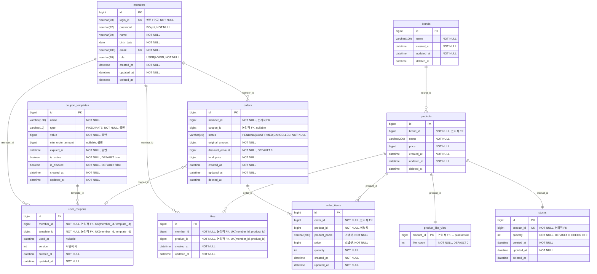

# 04. ERD

> 작성일: 2026-05-21
> DB: MySQL
> 컬럼 네이밍: snake_case
> FK 제약조건: 없음 (애플리케이션 레벨에서 관계 관리)
> Soft Delete: `deleted_at` 컬럼으로 처리 (Like 제외)

---

## ERD 다이어그램



---

## 제약조건 및 인덱스

### Unique 제약

| 테이블 | 컬럼 | 이유 |
|--------|------|------|
| members | login_id (활성 계정만) | 중복 로그인 ID 방지, 탈퇴 후 재가입 허용 |
| members | email (활성 계정만) | 중복 이메일 방지, 탈퇴 후 재가입 허용 |
| stocks | product_id | Product : Stock = 1:1 |
| likes | (member_id, product_id) | 동일 상품 중복 좋아요 방지 |

> `members.login_id`, `members.email` Unique 제약은 모두 활성 계정(`deleted_at IS NULL`)에만 적용합니다.
> MySQL은 Filtered Index(`WHERE` 조건부)를 지원하지 않으므로 Generated Column으로 구현합니다.
>
> ```sql
> ALTER TABLE members
>   ADD COLUMN login_id_unique_key VARCHAR(20)
>   GENERATED ALWAYS AS (IF(deleted_at IS NULL, login_id, NULL)) VIRTUAL;
> CREATE UNIQUE INDEX uk_members_login_id_active ON members(login_id_unique_key);
>
> ALTER TABLE members
>   ADD COLUMN email_unique_key VARCHAR(255)
>   GENERATED ALWAYS AS (IF(deleted_at IS NULL, email, NULL)) VIRTUAL;
> CREATE UNIQUE INDEX uk_members_email_active ON members(email_unique_key);
> ```
>
> 삭제된 레코드는 `NULL`이 되고, MySQL Unique 제약은 `NULL`을 중복으로 보지 않습니다.

### 인덱스

| 테이블 | 컬럼 | 이유 |
|--------|------|------|
| products | brand_id | 브랜드별 상품 목록 조회 + 좋아요 순 정렬 필터 |
| products | (brand_id, created_at DESC) | 브랜드별 최신순 정렬 |
| products | (brand_id, price ASC) | 브랜드별 가격순 정렬 |
| product_like_view | (like_count DESC, product_id) | 전체 좋아요 순 정렬 |
| likes | (member_id, created_at DESC) | 내 좋아요 목록 시간순 조회 |
| orders | (member_id, created_at DESC) | 내 주문 목록 날짜 범위 필터 |
| order_items | (order_id, product_id) | 주문 상세 조회 |
| members | deleted_at | @SQLRestriction 자동 조건 (`deleted_at IS NULL`) |
| brands | deleted_at | @SQLRestriction 자동 조건 |
| products | deleted_at | @SQLRestriction 자동 조건 |
| stocks | deleted_at | @SQLRestriction 자동 조건 |
| orders | deleted_at | @SQLRestriction 자동 조건 |

> 인덱스 전략 선정 근거 및 EXPLAIN 전후 성능 비교 → `05-perf-results.md` 참고

---

## 설계 결정 사항

### FK 제약조건을 사용하지 않는 이유
DB FK 제약은 INSERT/UPDATE/DELETE 시 참조 무결성 검사로 인한 성능 저하가 발생합니다.
대신 애플리케이션 레벨에서 존재 여부를 검증하고 관계를 관리합니다.

### Soft Delete 정책

| 테이블 | 정책 | 이유 |
|--------|------|------|
| members | Soft Delete | 탈퇴 후 로그인 ID 재가입 가능, 주문 이력 보존 |
| brands | Soft Delete | 브랜드 삭제 시 연결 상품 연쇄 처리 |
| products | Soft Delete | 삭제 후 주문 내역에서 상품명 조회 가능 |
| stocks | Soft Delete | 상품 삭제 시 재고 이력 보존 |
| orders | Soft Delete | 취소 주문 이력 보존 |
| likes | Hard Delete | 좋아요 취소 시 레코드 불필요, 재입점 시 초기화 |
| order_items | 삭제 없음 | 주문 당시 스냅샷 영구 보존 |

### 스냅샷 컬럼 (order_items)
`product_name`, `price`는 주문 시점의 값을 복사 저장합니다.
`total_price`는 주문 생성 시 `sum(order_item.price * order_item.quantity)`로 계산하며, Product 현재 가격이 아닌 **OrderItem 스냅샷 기준**입니다.
`product_id`는 이력 추적용으로만 사용하며 `@SQLRestriction` 필터를 적용하지 않습니다.

### 좋아요 수 분리 테이블 (product_like_view)
`product_like_view`는 Like 테이블 COUNT 쿼리 없이 좋아요 수 정렬 성능을 높이기 위한 분리 테이블입니다.
`products` 테이블에 `like_count`를 직접 두는 반정규화 대신 별도 테이블로 분리한 이유는 락 경합 격리입니다.
`products`는 상품 목록/상세 등 모든 API가 읽는 핫 테이블이므로, 좋아요 등록/취소 시 UPDATE가 섞이면 동시 사용자 증가에 따라 락 경합이 심화됩니다.
`product_like_view`는 좋아요 연산만 접근하므로 락 범위가 격리됩니다.
좋아요 등록/취소 시 단일 트랜잭션으로 `product_like_view.like_count`를 동기화합니다.

---

## 잠재 리스크
- `members.login_id`, `members.email` Unique 제약은 활성 계정에만 적용 → 탈퇴 후 동일 로그인 ID / 이메일 재가입 가능 (Generated Column으로 구현)
- `product_like_view.like_count` 동시 요청 시 순간적 오차 가능 → 정렬 참고용 수치이므로 소폭 오차는 허용
- `product_like_view`는 products와 1:1이므로 상품 등록 시 함께 INSERT, 상품 삭제 시 함께 삭제 필요 (애플리케이션 레벨에서 관리)
- `order_items`에 `deleted_at` 없음 → 삭제 불가, 영구 이력 보존이 목적
- FK 제약 미사용으로 고아 레코드 발생 시 DB 레벨 탐지 불가 → 애플리케이션 레벨에서 참조 존재 여부 검증 필수 (예: 주문 생성 시 member, product 존재 확인)
