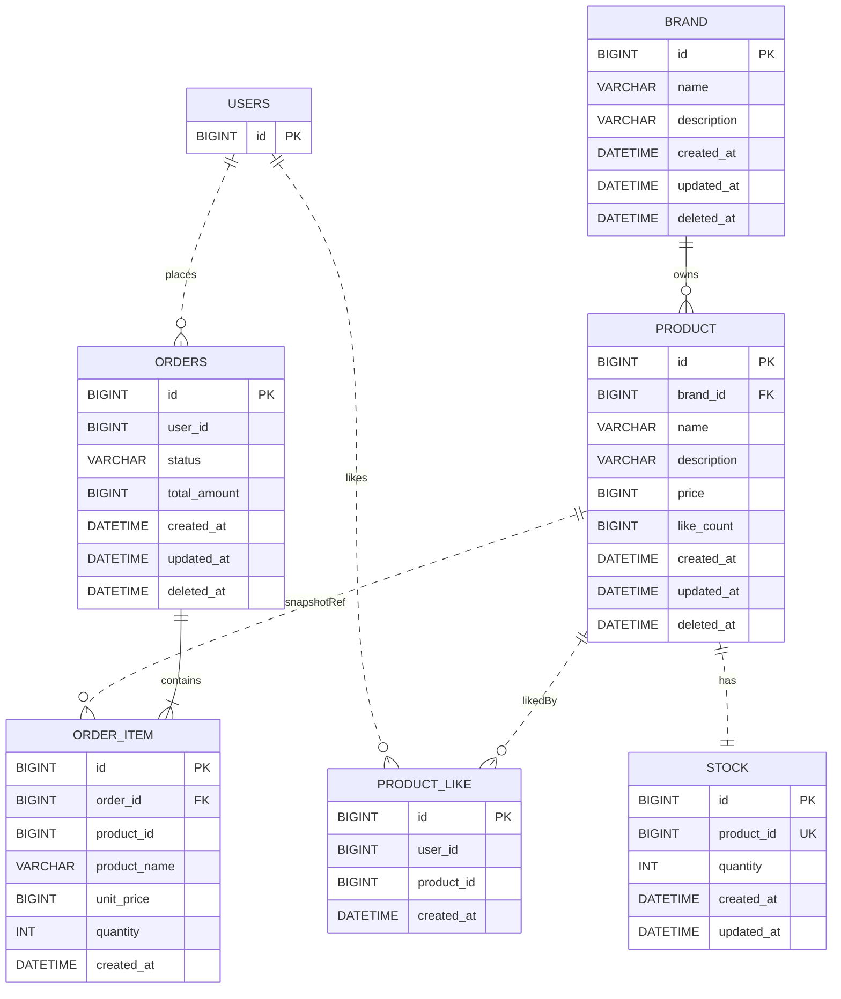

# 04. ERD

> **스코프**: 영속화 스키마. 컨텍스트 경계는 03 클래스 다이어그램 참조.
> **표기 규칙**: 실선 `||--`은 JPA 연관 매핑 유지(논리 FK — *물리 FK 제약은 D12에 따라 미설정*), 점선 `||..`은 매핑 없는 ID 기반 논리 참조(크로스 애그리거트/외부/스냅샷).

- Stock은 동시성 제어가 필수이고 변경 패턴이 Product(read-heavy)와 크게 달라 **독립 애그리거트**로 분리(D13) — `product_id`로 1:1 참조하며 물리 FK는 두지 않는다(D12, 크로스 애그리거트는 ID 참조). 주문·재고 변경은 Facade 합성(D7)으로 *같은 트랜잭션*에서 Product·Stock을 함께 다룬다. like_count는 약한 일관성으로 충분해 Product 컬럼으로 유지.
