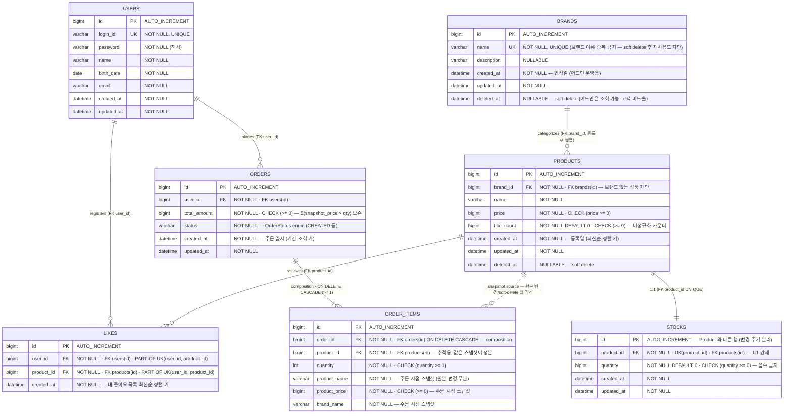

# 04. ERD

## 1. ERD 다이어그램



---

## 2. 정합성 보장 항목별 정리

DB 가 책임지는 정합성을 **다섯 가지 무결성 축**으로 분해한다. 각 항목은 *어떤 도메인 규칙* 이 *어떤 제약* 으로 옮겨졌고, *DB 로 옮길 수 없는 잔여는 어디서 막는지* 까지 명시한다.

### 3.1 개체 무결성 (Entity Integrity)

모든 테이블이 단일 `id BIGINT AUTO_INCREMENT` PK 를 가진다. 자연키(예: `Brand.name`) 대신 대리키를 두는 이유 —

- **불변성** : 자연키는 변할 수 있다(브랜드 이름 변경). 외래키가 자연키를 가리키면 변경 시 연쇄 갱신 비용이 든다.
- **soft delete 호환** : 자연키가 `name` 이라면 "이름이 같은 새 브랜드 vs 삭제된 브랜드" 구분이 모호해진다. 대리키는 정체성을 자연 속성에서 분리해 이 모호함을 없앤다.

### 3.2 도메인 무결성 (Domain Integrity)

값의 *유효 범위* 를 DB 에 박아 둔다. 응용 계층 버그가 있어도 *말이 안 되는 값* 이 저장되는 것은 막는다.

| 컬럼 | 제약 | 근거 (요구사항) |
|---|---|---|
| `products.price` | `NOT NULL CHECK (price >= 0)` | "상품의 가격은 0보다 작을 수 없다" |
| `products.like_count` | `NOT NULL DEFAULT 0 CHECK (>= 0)` | 비정규화 카운터의 일관성 (시퀀스 §4.2 구현결정) |
| `stocks.quantity` | `NOT NULL CHECK (quantity >= 0)` | "재고는 0보다 작아질 수 없다" — 재고 음수 금지 불변식 |
| `order_items.quantity` | `NOT NULL CHECK (quantity >= 1)` | UC-O01 E4 — 수량 1개 미만 거부 |
| `order_items.product_price` | `NOT NULL CHECK (>= 0)` | 스냅샷 값도 음수 금지 |
| `orders.total_amount` | `NOT NULL CHECK (>= 0)` | 총액의 의미상 음수 불가 |
| `orders.status` | `NOT NULL` | 상태 누락 금지 |
| 모든 `*_at` | `NOT NULL` (deleted_at 제외) | 감사·정렬 키 누락 방지 |

> **DB CHECK 만으로는 부족한 것** — *주문 항목 최소 1 개*("주문에는 최소 하나 이상의 상품이 포함되어야 한다") 는 단일 테이블 CHECK 로 표현 불가하므로 `Order.create()` 정적 팩토리(도메인 계층)에서 막는다 — 「03. 클래스」 §3 Order 책임.

### 3.3 참조 무결성 (Referential Integrity)

*존재하지 않는 것을 가리키는 행* 이 만들어지지 않게 한다. soft delete 와의 조합에서 미묘한 결정이 필요했다.

| FK | 대상 | 삭제 정책 | 결정 근거 |
|---|---|---|---|
| `products.brand_id` | `brands.id` | **`RESTRICT`** + 응용에서 cascade soft delete | "브랜드 없는 상품은 존재할 수 없다" — DB FK 가 *존재성* 을 보장. 브랜드 삭제는 시퀀스 §4.1 구현결정대로 *단일 TX 안에서 상품 soft delete → 브랜드 soft delete* 순서로 진행 (둘 다 row 는 살아 있으므로 FK 위반 없음) |
| `stocks.product_id` | `products.id` | `CASCADE`(고려) — 현 범위는 soft delete 만 사용 | 1:1 합성. 만약 상품을 hard delete 한다면 재고도 함께. 현재 soft delete 만 사용하므로 *발화되지 않는 안전망* |
| `likes.user_id` | `users.id` | `RESTRICT` | 회원 탈퇴는 본 범위 밖 |
| `likes.product_id` | `products.id` | `RESTRICT` (상품은 soft delete) | 상품이 soft delete 되어도 row 는 남으므로 FK 유지. 좋아요 목록 조회 시 `products.deleted_at IS NULL` 필터로 자연 제외 (시퀀스 §4.1 본문) |
| `orders.user_id` | `users.id` | `RESTRICT` | 주문 내역은 보존 |
| `order_items.order_id` | `orders.id` | **`CASCADE`** | composition — 같은 라이프사이클 (현 범위에서 주문은 삭제되지 않지만 의미 보존을 위해 명시) |
| `order_items.product_id` | `products.id` | `RESTRICT` (상품은 soft delete) | **스냅샷이 정본** — 원본이 바뀌거나 soft delete 되어도 `product_name`/`product_price`/`brand_name` 은 그대로. FK 는 *추적·역참조* 용일 뿐 *데이터의 진실성* 은 스냅샷 컬럼이 책임 |

> **soft delete 와 FK 의 공존** — 모든 "삭제" 가 row 보존(soft) 이므로 FK 가 깨질 일이 없다. "고객에게 보이지 않음" 은 *FK 위반* 이 아니라 *조회 필터* 의 일. 「02. 시퀀스」 §4.1 의 "*좋아요는 조회 시 필터링, 주문은 스냅샷으로 격리*" 가 이 결정의 한 줄 정리.

### 3.4 유일성 무결성 (Uniqueness)

*도메인의 1 개 제약* 을 DB 에 위임한다. 응용 계층 분기로 막으면 동시 요청에서 새는 구멍이 생기지만, DB UK 는 트랜잭션 격리 수준과 무관하게 견고하다.

| 제약 | 위치 | 도메인 규칙 |
|---|---|---|
| `UNIQUE (brands.name)` | brands | "브랜드 이름은 중복될 수 없다" (요구사항 §4.1 핵심 규칙) — soft delete 된 이름의 재사용도 차단해, "같은 이름의 새 브랜드 vs 살아있던 동명 브랜드" 의 식별 혼란을 원천 방지 |
| `UNIQUE (stocks.product_id)` | stocks | 1:1 관계의 DB 표현. 한 상품에 두 개의 재고 행이 존재하면 *어떤 행이 진실인가* 라는 모순이 발생 — UK 가 모순 발생 자체를 막는다 |
| **`UNIQUE (likes.user_id, likes.product_id)`** | likes | **"한 회원-한 상품 1 개"** 불변식의 DB 위임. 「02. 시퀀스」 §4.2 구현결정 — *"멱등성은 DB 유니크 제약에 위임"*. 따닥 클릭으로 동시에 2 개의 INSERT 가 들어와도 1 개는 UK 위반으로 실패 → 응용은 *변동 없는 성공* 으로 흡수. 좋아요는 **hard delete** — soft delete 하면 같은 (user_id, product_id) 의 새 row 가 막혀 토글이 깨진다 |

### 3.5 동시성 정합성 (Concurrency Integrity)

*동시에 들어온 요청* 이 데이터를 모순된 상태로 두지 않게 하는 결정. ERD 자체가 아니라 *제약 + 갱신 패턴* 의 조합으로 구현된다.

#### 재고 차감 — 원자적 UPDATE + CHECK

```sql
UPDATE stocks
   SET quantity = quantity - :amount, updated_at = NOW()
 WHERE product_id = :pid
   AND quantity >= :amount;
-- 영향 행 수 0 → 재고 부족 (혹은 상품 없음) → 응용에서 주문 전체 롤백
```

- `CHECK (quantity >= 0)` 와 `WHERE quantity >= :amount` 의 조합으로 **마지막 재고 경합에서도 음수 발생 불가**.
- 「02. 시퀀스」 §4.3 구현결정의 *"원자적 차감 채택"* 을 ERD 가 가능하게 한 셈 — `stocks` 가 별도 행으로 분리되어 *상품 정보 갱신과 재고 차감이 다른 row 의 락* 을 잡는다 (클래스 다이어그램 §4.1 의 핵심 결정).

#### 좋아요 수 정합성 — 같은 TX 안의 카운터 갱신

```sql
-- TX 시작
INSERT INTO likes(user_id, product_id, ...) VALUES (...);  -- UK 충돌 시: 변동 없는 성공
UPDATE products SET like_count = like_count + 1 WHERE id = :pid;  -- 새로 등록된 경우에만
-- TX 커밋
```

- `likes.UK` 가 멱등을 보장 → 카운터 중복 증가 방지.
- 카운터는 **같은 TX 안에서 갱신** 되어 *좋아요 행 수와 `like_count` 가 어긋날 수 없다*.
- 비정규화 카운터의 위험(드리프트) 을 DB UK + TX 가 막는다.

#### 주문 — 단일 TX · 올-오어-낫싱

- 다항목 주문이 *하나라도 실패* 하면 TX 전체 롤백 → 이미 차감된 재고는 자동 복구.
- `orders` 와 `order_items` 가 같은 TX 안에서 함께 저장되므로 *주문은 있는데 항목은 없다* / *항목은 있는데 주문은 없다* 같은 상태가 발생 불가.
- `total_amount` 가 컬럼으로 보존되는 이유도 정합성 — 동적으로 계산하면 *언제든* 항목 합과 어긋날 위험이 있다. 한 TX 안에서 계산된 값을 저장하면 그 시점의 진실이 *영원히 일치*.

### 3.6 스냅샷 정합성 — 시간에 의존한 진실의 분리

주문 시점의 "그 때 그 상품" 을 *지금* 의 상품과 어떻게 분리할 것인가의 문제.

- `order_items.product_name`, `product_price`, `brand_name` — **모두 NOT NULL 평탄 컬럼**.
- 상품을 soft delete 해도, 가격이 바뀌어도, 브랜드 이름이 바뀌어도 — 이 세 컬럼은 *영향받지 않는다*. 진실의 정본이 스냅샷에 있으니까.
- `order_items.product_id` 는 *추적용 FK* 일 뿐, 표시에 쓰이는 값은 스냅샷 컬럼이다. 이 분리가 「01. 요구사항」 §3 유비쿼터스 언어의 *"스냅샷"* 정의를 DB 차원에서 실현.

> **왜 평탄 컬럼인가** — 「03. 클래스」 §4.3 의 결정. 별도 `product_snapshot` 테이블로 빼면 *2 개 행이 어긋날 위험* 이 생긴다. 한 행에 평탄하게 두면 *원자적 한 row 가 곧 진실* 이라 어긋날 자리가 없다.

---

## 4. 인덱스 — 정합성을 *유지하면서* 빠른 조회를 가능하게

정합성과 직접 관계는 적지만, *조회의 일관성* (정렬 안정성 · 페이지네이션 결정성) 을 위한 인덱스도 함께 둔다.

| 인덱스 | 테이블 | 용도 |
|---|---|---|
| `idx_products_brand_deleted` (brand_id, deleted_at) | products | 브랜드 필터 + soft delete 제외 (UC-P01) |
| `idx_products_like_count_desc` (like_count DESC, id DESC) | products | 인기순 정렬 — *like_count 동률* 시 id 로 결정적 정렬 |
| `idx_products_price` (price, id) | products | 가격 낮은 순 |
| `idx_products_created_at` (created_at DESC, id DESC) | products | 최신순(기본) |
| `idx_likes_user_created` (user_id, created_at DESC) | likes | 내 좋아요 목록 최신순 (UC-L03) |
| `idx_orders_user_created` (user_id, created_at) | orders | 기간 조회 (UC-O02) |
| `idx_orders_created` (created_at DESC, id DESC) | orders | 어드민 전체 목록 페이지네이션 |

> **결정적 정렬 보조 키 (`, id DESC`)** — 정렬 키 동률 시 페이지가 뒤섞이지 않게 하는 *조회 정합성*. 같은 조건으로 두 번 조회했을 때 *결과 순서가 달라지지 않는다* 는 사용자 신뢰의 토대.

---

## 5. DB 로 옮길 수 없는 정합성 — 어디서 막는가

DB 제약으로는 표현하기 어려운 도메인 규칙이 남는다. 각각을 *어느 계층* 에서 막는지 명시한다.

| 규칙 | 출처 | 막는 위치 |
|---|---|---|
| **상품의 소속 브랜드는 등록 후 변경 불가** | 요구사항 §4.2 핵심 규칙 / UC-P06 E4 | 도메인 — `Product` 에 `brandId` setter 부재. 응용 계층은 수정 요청에서 brand_id 키 자체를 무시 |
| **주문에는 최소 1 개 이상의 상품** | 요구사항 §4.4 핵심 규칙 | 도메인 — `Order.create(items)` 정적 팩토리에서 검증 |
| **브랜드 삭제 시 소속 상품도 함께 삭제** | 요구사항 §4.1 핵심 규칙 / UC-B06 | 응용 — `BrandFacade` 가 단일 TX 안에서 `ProductService.softDeleteByBrand` → `BrandService.softDelete` 순서 보장 (「02. 시퀀스」 §4.1 구현결정) |
| **상품/브랜드 등록 시 활성(`deleted_at IS NULL`) 검증** | UC-P05 E2 | 응용 — 등록 트랜잭션에서 활성 여부 조회 후 진행 |
| **한 주문에 같은 상품 중복 처리** | DEC-07 (미결정) | 응용 — 입력 정규화 단계에서 합산 vs 거부 결정. DB 차원 UK 추가 여부는 결정 후 |
| **조회 권한** (다른 회원의 좋아요/주문 차단) | UC-L03 / UC-O03 | 응용 — `userId` 일치 검증. DB 는 *데이터가 거기 있는지* 만 책임지고 *누가 볼 수 있는지* 는 책임지지 않음 |

> **이중 방어선** — 정합성이 깨졌을 때의 비용이 큰 규칙(재고 음수 · 좋아요 중복 · 브랜드 없는 상품) 은 *도메인에서 한 번, DB 제약에서 한 번* 막는다. 도메인 코드가 빠뜨려도 DB 가 거부 → 데이터는 안전. 반대로 단순 권한 검증처럼 *깨져도 데이터 일관성에 영향이 없는* 규칙은 응용 계층에만 둔다.
