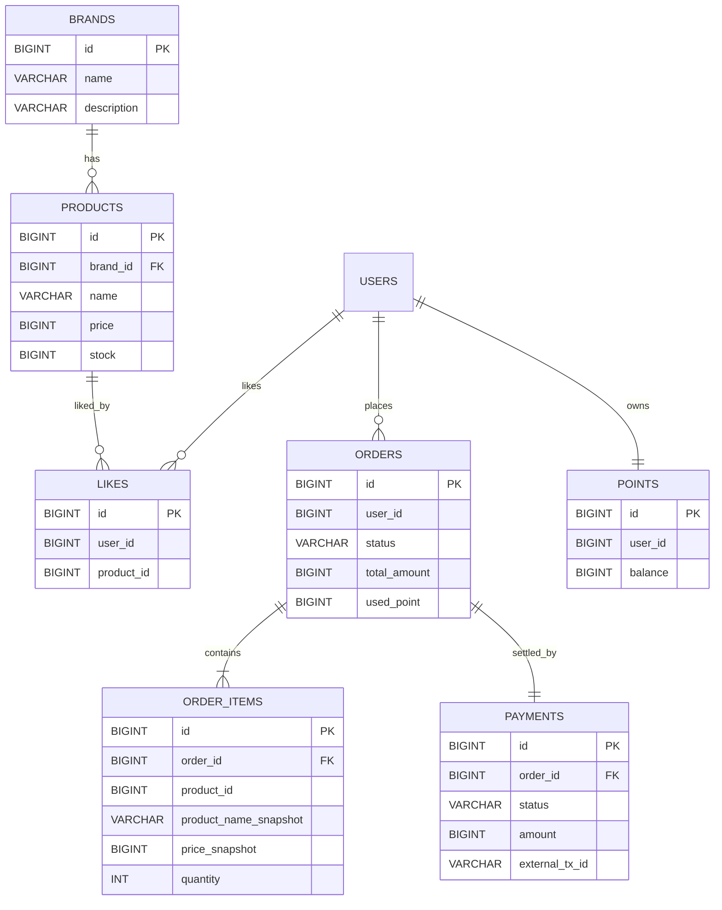

# 04. ERD

> 전체 테이블 구조 및 관계. 모든 엔티티는 `BaseEntity`(id, created_at, updated_at, deleted_at)를 상속한다고 가정.
> 테이블명은 1주차 `users`와 일관되게 복수형을 사용한다 — `like`/`order`는 SQL 예약어이므로 `likes`/`orders`로 둔다.

## 1. ERD

> ERD의 엔티티명은 물리 테이블명(복수형)과 일치시켰다. `LIKES`/`ORDERS`는 SQL 예약어 `LIKE`/`ORDER` 충돌을 피하려 복수형으로 두며, 1주차 `users` 컨벤션과도 일관된다.
> `USERS`(1주차 `volume-1` 도메인)는 본 설계 범위 밖이며, 각 테이블에서 `user_id`로 참조만 한다.

## 2. 테이블 상세

> 공통: 모든 테이블은 `BaseEntity` 컬럼 `created_at`, `updated_at`, `deleted_at`을 포함한다.

### brands
| 컬럼 | 타입 | 제약 | 비고 |
| --- | --- | --- | --- |
| id | BIGINT | PK | |
| name | VARCHAR | NOT NULL | |
| description | VARCHAR | NULL | 브랜드 소개 |

### products
- 인덱스: `idx_products_brand_id_created_at` — `brandId` 필터 + `latest` 정렬
- 인덱스: `idx_products_brand_id_price` — `brandId` 필터 + `price_asc` 정렬
- `likes_desc` 정렬은 `likes` 테이블과 조인·집계하므로 `idx_likes_product_id`를 활용한다.
- 좋아요 수는 별도 컬럼으로 두지 않고 `likes` 테이블 집계(COUNT)로 산출한다.

| 컬럼 | 타입 | 제약 | 비고 |
| --- | --- | --- | --- |
| id | BIGINT | PK | |
| brand_id | BIGINT | FK(brands.id), NOT NULL | |
| name | VARCHAR | NOT NULL | |
| price | BIGINT | NOT NULL | 단가(원) |
| stock | BIGINT | NOT NULL | 재고 수량, 0이면 품절 |

### likes
- `UNIQUE (user_id, product_id)` — 중복 좋아요 차단, 멱등 보장의 핵심
- 인덱스: `idx_likes_product_id` — 상품별 좋아요 수 집계 / `likes_desc` 정렬
- 좋아요 취소는 hard delete(행 삭제)로 처리한다 — soft delete는 unique 키와 충돌하므로 사용하지 않는다.

| 컬럼 | 타입 | 제약 | 비고 |
| --- | --- | --- | --- |
| id | BIGINT | PK | |
| user_id | BIGINT | NOT NULL, UNIQUE(user_id, product_id) | |
| product_id | BIGINT | NOT NULL, UNIQUE(user_id, product_id) | |

### orders
- 인덱스: `idx_orders_user_id_created_at` — 유저별 목록 조회 + 기간 필터
- `status`는 `OrderStatus` enum(`PENDING`/`PAID`/`FAILED`)을 문자열로 저장한다.
- 실결제액(외부 PG 결제 금액) = `total_amount` − `used_point`. 별도 컬럼 없이 `payments.amount`로 저장한다.

| 컬럼 | 타입 | 제약 | 비고 |
| --- | --- | --- | --- |
| id | BIGINT | PK | |
| user_id | BIGINT | NOT NULL | |
| status | VARCHAR | NOT NULL | PENDING / PAID / FAILED |
| total_amount | BIGINT | NOT NULL | 주문 총액 (할인 전) |
| used_point | BIGINT | NOT NULL DEFAULT 0 | 할인에 사용한 포인트 |

### order_items
- 스냅샷 컬럼(`product_name_snapshot`, `price_snapshot`) — 상품이 수정·삭제돼도 주문 내역은 당시 정보를 그대로 보존한다.
- `product_id`는 참조용 값이며 FK 제약을 걸지 않는다 (상품 삭제와 무관하게 주문 내역 유지).

| 컬럼 | 타입 | 제약 | 비고 |
| --- | --- | --- | --- |
| id | BIGINT | PK | |
| order_id | BIGINT | FK(orders.id), NOT NULL | |
| product_id | BIGINT | NOT NULL | 참조용(FK 아님) |
| product_name_snapshot | VARCHAR | NOT NULL | 주문 시점 상품명 |
| price_snapshot | BIGINT | NOT NULL | 주문 시점 단가 |
| quantity | INT | NOT NULL | 주문 수량 |

### payments
- `order_id`에 UNIQUE — 한 주문에 결제가 중복 생성되지 않도록 한다(주문-결제 1:1).
- `external_tx_id`에 UNIQUE — 외부 PG 트랜잭션 중복 방지 (결제 성공 전에는 NULL).

| 컬럼 | 타입 | 제약 | 비고 |
| --- | --- | --- | --- |
| id | BIGINT | PK | |
| order_id | BIGINT | FK(orders.id), UNIQUE, NOT NULL | 주문 1:1 |
| status | VARCHAR | NOT NULL | PENDING / SUCCESS / FAILED |
| amount | BIGINT | NOT NULL | 실결제액 (주문 총액 − used_point) |
| external_tx_id | VARCHAR | UNIQUE, NULL | PG 트랜잭션 ID |

### points
- `user_id`에 UNIQUE — 유저당 포인트 1건(1:1).

| 컬럼 | 타입 | 제약 | 비고 |
| --- | --- | --- | --- |
| id | BIGINT | PK | |
| user_id | BIGINT | NOT NULL, UNIQUE | |
| balance | BIGINT | NOT NULL DEFAULT 0 | 보유 포인트 |

## 3. 정합성 / 동시성 고려 (정책 수준)

- **좋아요**: `UNIQUE(user_id, product_id)`로 중복 등록을 차단. 멱등성은 애플리케이션(존재 확인)과 DB 제약(최종 방어)으로 이중 보장한다.
- **재고 차감**: 동시 주문 시 재고 정합성(초과 판매 방지)은 후속 주차의 동시성 제어(조건부 UPDATE 또는 락) 대상이다. 본 설계에서는 단일 흐름의 차감/복원 정책만 정의한다.
- **주문-결제 1:1**: `payments.order_id` UNIQUE로 한 주문에 결제가 중복 생성되지 않도록 보장한다.
- **결제 실패 처리**: PG 결제 실패 시 차감한 재고를 원복하고 `orders.status = FAILED`로 둔다. 포인트는 결제 성공 후 차감하므로 실패 시 복원 대상이 아니다.
- **외부 PG 중복 방지**: `payments.external_tx_id` UNIQUE로 동일 트랜잭션의 중복 반영을 차단한다.
- **Soft delete 조회**: 모든 목록·상세·집계 조회는 `deleted_at IS NULL` 조건을 포함한다. `deleted_at` 단독 인덱스는 선택도가 낮아 효과가 제한적이므로, 자주 쓰이는 복합 인덱스(`products`의 `(brand_id, created_at)` 등) 선두에 `deleted_at`을 포함하는 방식을 우선 검토한다.

## ✅ 과제 체크리스트 (이 문서 관점)

- [x] 상품 / 브랜드 / 좋아요 / 주문 도메인이 모두 포함되어 있는가?
- [x] ERD 설계 시 데이터 정합성을 고려하여 구성하였는가?
