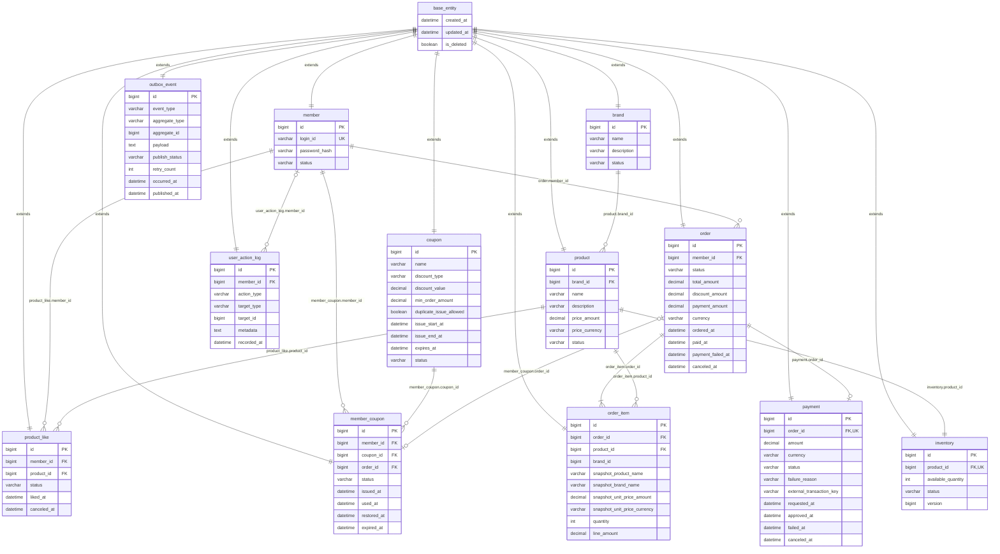

# 04. ERD

> 본 문서는 `.docs/design/01-requirements.md`, `.docs/design/02-sequence-diagrams.md`, `.docs/design/03-class-diagram.md` 를 기준으로 작성한다.
> ERD 는 Mermaid `erDiagram` 으로 표현하며, JPA 테이블 매핑을 고려해 단수형 테이블명과 단방향 참조 중심의 관계를 사용한다.

## 1. 설계 기준

- 테이블명은 JPA Entity 이름과 맞추기 쉽도록 단수형 스네이크 케이스 개념으로 작성한다. 예: `member`, `product`, `order_item`.
- JPA 매핑은 양방향 관계를 지양한다. FK 를 가진 테이블이 소유자이며, Entity 에서는 `@ManyToOne`, `@OneToOne` 단방향 또는 식별자 필드 기반 조회를 우선한다.
- `Member.orders`, `Brand.products`, `Order.items` 같은 컬렉션 양방향 매핑은 기본 설계에 포함하지 않는다. 목록/상세 조회는 Repository/QueryDSL 조회 모델로 구성한다.
- Aggregate Root, Entity, Association Entity, Infrastructure Event Entity 는 공통적으로 `BaseEntity` 를 상속한다.
- `BaseEntity` 는 JPA `@MappedSuperclass` 로 구현하며, `created_at`, `updated_at`, `is_deleted` 공통 컬럼을 제공한다.
- `Brand`, `Product` 는 논리 삭제를 기본 정책으로 둔다.
- `Inventory` 는 `Product` 와 1:1 관계이지만 독립 생명주기를 가지며, 재고 차감 동시성 제어를 위해 `version` 컬럼을 둔다.
- `OrderItem` 은 상품 원본 변경과 무관하게 주문 이력을 재현할 수 있도록 상품명, 브랜드명, 단가 스냅샷을 직접 저장한다.
- 상태 전이는 각 도메인의 `status` 컬럼과 의미 있는 도메인 메서드로 표현한다.
- `OutboxEvent` 는 이벤트 발행 신뢰성을 위한 기술 테이블이며 도메인 애그리거트는 아니다.

## 2. ERD

## 3. JPA 매핑 방향

| 관계 | FK 소유 테이블 | 권장 JPA 매핑 | 비고 |
| --- | --- | --- | --- |
| `BaseEntity` - 전체 Entity | 해당 없음 | `@MappedSuperclass` 상속 | `created_at`, `updated_at`, `is_deleted` 는 각 물리 테이블에 공통 컬럼으로 생성된다. |
| `Brand` - `Product` | `product.brand_id` | `Product -> Brand` 단방향 `@ManyToOne` 또는 `brandId` 필드 | `Brand.products` 컬렉션은 두지 않는다. |
| `Product` - `Inventory` | `inventory.product_id` | `Inventory -> Product` 단방향 `@OneToOne` 또는 `productId` 필드 | 재고는 독립 Aggregate 로 관리한다. |
| `Member` - `ProductLike` | `product_like.member_id` | `ProductLike -> Member` 단방향 또는 `memberId` 필드 | 좋아요 목록은 Repository 조회로 구성한다. |
| `Product` - `ProductLike` | `product_like.product_id` | `ProductLike -> Product` 단방향 또는 `productId` 필드 | 상품에 좋아요 컬렉션을 두지 않는다. |
| `Coupon` - `MemberCoupon` | `member_coupon.coupon_id` | `MemberCoupon -> Coupon` 단방향 또는 `couponId` 필드 | 발급 이력 조회는 인덱스 기반으로 수행한다. |
| `Member` - `Order` | `order.member_id` | `Order -> Member` 단방향 또는 `memberId` 필드 | 내 주문 목록은 `member_id` 로 조회한다. |
| `Order` - `OrderItem` | `order_item.order_id` | `OrderItem -> Order` 단방향 또는 `orderId` 필드 | `Order.items` 컬렉션 대신 상세 조회 전용 쿼리를 우선한다. |
| `Order` - `Payment` | `payment.order_id` | `Payment -> Order` 단방향 또는 `orderId` 필드 | 주문 상태와 결제 상태는 각각 명시적으로 전이한다. |

## 4. 주요 제약

| 테이블 | 제약 | 설명 |
| --- | --- | --- |
| `member` | `UK(login_id)` | 회원 로그인 식별자는 중복될 수 없다. |
| `product` | `FK(brand_id) -> brand(id)` | 상품은 등록된 브랜드에 소속된다. 상품 수정 시 브랜드 변경은 허용하지 않는다. |
| `inventory` | `UK(product_id)`, `FK(product_id) -> product(id)` | 상품과 재고는 1:1 관계다. |
| `inventory` | `CHECK(available_quantity >= 0)` | 재고는 음수가 될 수 없다. |
| `product_like` | `UK(member_id, product_id)` | 같은 회원은 같은 상품에 좋아요를 한 번만 가질 수 있다. 취소는 `status` 와 `canceled_at` 으로 멱등 처리한다. |
| `member_coupon` | `FK(member_id) -> member(id)`, `FK(coupon_id) -> coupon(id)` | 쿠폰 발급 이력을 회원과 쿠폰에 연결한다. |
| `member_coupon` | `FK(order_id) -> order(id)` | 쿠폰이 주문에 사용되면 주문과 연결한다. 미사용 쿠폰은 `order_id` 가 없다. |
| `order` | `FK(member_id) -> member(id)` | 주문은 회원 소유이며 타 회원이 조회할 수 없다. |
| `order_item` | `FK(order_id) -> order(id)`, `FK(product_id) -> product(id)` | 원 상품 추적용 FK 를 두되 주문 응답은 스냅샷 컬럼 기준으로 구성한다. |
| `order_item` | `CHECK(quantity > 0)` | 주문 수량은 1 이상이어야 한다. |
| `payment` | `UK(order_id)`, `FK(order_id) -> order(id)` | 현재 설계는 주문당 결제 1건을 기준으로 한다. |
| `user_action_log` | `member_id nullable` | 비회원 브랜드/상품 조회 행동을 기록할 수 있도록 회원 식별자는 nullable 로 둔다. |
| `outbox_event` | `aggregate_type + aggregate_id` | 특정 도메인 테이블에 FK 로 강결합하지 않고 이벤트 발행 대상을 식별한다. |
| 전체 Entity | `BaseEntity.is_deleted` 상속 | 논리 삭제가 필요한 조회는 상속 컬럼 `is_deleted` 를 기준으로 제외한다. |

## 5. 인덱스 후보

| 테이블 | 인덱스 후보 | 사용 흐름 |
| --- | --- | --- |
| `brand` | `idx_brand_status_deleted(status, is_deleted)` | 사용자/관리자 브랜드 목록 조회 |
| `product` | `idx_product_brand_status_deleted(brand_id, status, is_deleted)` | 브랜드별 판매 가능 상품 목록 조회 |
| `product` | `idx_product_created_at(created_at)` | 상품 최신순 정렬 |
| `inventory` | `idx_inventory_product_status(product_id, status)` | 주문 생성 시 재고 조회와 주문 가능 상태 확인 |
| `product_like` | `idx_product_like_member_status(member_id, status)` | 내가 좋아요 한 상품 목록 조회 |
| `product_like` | `idx_product_like_product_status(product_id, status)` | 상품별 좋아요 수 집계와 `likes_desc` 정렬 확장 |
| `coupon` | `idx_coupon_issue_period(issue_start_at, issue_end_at, status)` | 쿠폰 발급 가능 여부 확인 |
| `member_coupon` | `idx_member_coupon_member_status(member_id, status)` | 회원 보유 쿠폰 조회와 사용 가능 쿠폰 확인 |
| `member_coupon` | `idx_member_coupon_coupon_member(coupon_id, member_id)` | 중복 발급 제한 확인 |
| `order` | `idx_order_member_ordered_at(member_id, ordered_at)` | 내 주문 목록 조회 |
| `order` | `idx_order_status_ordered_at(status, ordered_at)` | 관리자 주문 목록 필터링 확장 |
| `order_item` | `idx_order_item_order(order_id)` | 주문 상세 조회 |
| `payment` | `idx_payment_status_created_at(status, created_at)` | 결제 실패/성공 이력 조회 확장 |
| `user_action_log` | `idx_user_action_log_member_recorded_at(member_id, recorded_at)` | 회원 행동 이력 조회 |
| `user_action_log` | `idx_user_action_log_action_recorded_at(action_type, recorded_at)` | 행동 유형별 통계 확장 |
| `outbox_event` | `idx_outbox_event_status_occurred_at(publish_status, occurred_at)` | 미발행 이벤트 조회와 재시도 |

## 6. 상태 전이

| 도메인 | 상태 컬럼 | 값 후보 | 주요 전이 |
| --- | --- | --- | --- |
| `Member` | `member.status` | `ACTIVE`, `WITHDRAWN`, `BLOCKED` | 회원가입 `ACTIVE`, 탈퇴 `WITHDRAWN`, 운영 차단 `BLOCKED` |
| `Brand` | `brand.status` | `ACTIVE`, `INACTIVE`, `DELETED` | 등록 `ACTIVE`, 운영 중지 `INACTIVE`, 논리 삭제 `DELETED` |
| `Product` | `product.status` | `ON_SALE`, `SOLD_OUT`, `STOPPED`, `DELETED` | 등록/판매 `ON_SALE`, 재고 소진 `SOLD_OUT`, 관리자 중지 `STOPPED`, 논리 삭제 `DELETED` |
| `Inventory` | `inventory.status` | `ACTIVE`, `EXHAUSTED`, `INACTIVE` | 재고 보유 `ACTIVE`, 수량 0 `EXHAUSTED`, 상품/브랜드 삭제 또는 판매 중지 `INACTIVE` |
| `ProductLike` | `product_like.status` | `LIKED`, `CANCELED` | 좋아요 등록 `LIKED`, 취소 `CANCELED` |
| `Coupon` | `coupon.status` | `ACTIVE`, `STOPPED`, `EXPIRED` | 발급 가능 `ACTIVE`, 운영 중지 `STOPPED`, 기간 만료 `EXPIRED` |
| `MemberCoupon` | `member_coupon.status` | `ISSUED`, `USED`, `RESTORED`, `EXPIRED` | 발급 `ISSUED`, 주문 사용 `USED`, 결제 실패 복구 `RESTORED`, 만료 `EXPIRED` |
| `Order` | `order.status` | `CREATED`, `PAYMENT_PENDING`, `PAID`, `PAYMENT_FAILED`, `CANCELED` | 주문 생성 `CREATED`, 결제 가능 `PAYMENT_PENDING`, 결제 성공 `PAID`, 결제 실패 `PAYMENT_FAILED`, 취소 `CANCELED` |
| `Payment` | `payment.status` | `REQUESTED`, `APPROVED`, `FAILED`, `CANCELED` | 결제 요청 `REQUESTED`, 승인 `APPROVED`, 승인 실패 `FAILED`, 취소 `CANCELED` |
| `OutboxEvent` | `outbox_event.publish_status` | `PENDING`, `PUBLISHED`, `FAILED` | 저장 `PENDING`, 발행 성공 `PUBLISHED`, 발행 실패 `FAILED` |

## 7. 확인 필요 항목

- `order` 는 단수형이지만 SQL 예약어 충돌 가능성이 있다. 실제 MySQL/JPA 구현 시 `@Table(name = "orders")`, `@Table(name = "order_table")`, 또는 quoting 적용 여부를 확정해야 한다.
- 쿠폰 정책은 최소 주문 금액 외에 상품/브랜드 제한, 최대 할인 금액, 발급 수량 제한이 필요한지 확정해야 한다.
- 결제 실패 시 `member_coupon` 과 `inventory` 를 즉시 복구할지, 보상 트랜잭션/배치로 복구할지 확정해야 한다.
- 주문당 결제 1건으로 충분한지, 결제 재시도 이력을 보존하기 위해 `payment` 를 주문당 N건으로 열어둘지 확정해야 한다.
- `order_item.product_id` 는 원 상품 추적을 위한 FK 로 두었지만, 주문 응답은 반드시 스냅샷 컬럼 기준으로 구성해야 한다.
